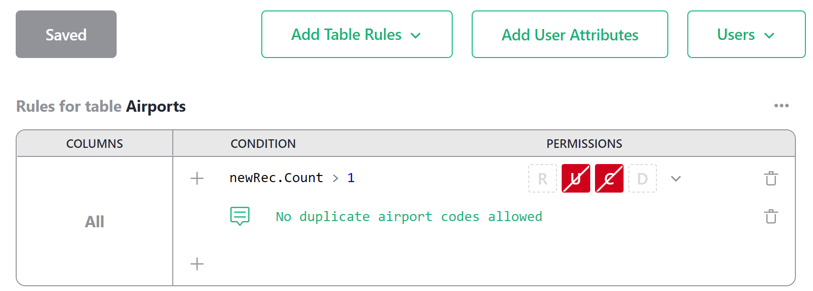

# Access Rules to Restrict Duplicate Records

Suppose we have a table listing airports, and we want to
forbid entry of a new record with the same airport code as an existing
one.  In the table, we can add a column named `Count` that counts how many
records have the same code as each other:

To understand this formula, visit our [formula cheat sheet](../formula-cheat-sheet.md#finding-duplicates) example for finding duplicates.

Now, we can add an access rule to forbid any record update or creation that would
result in a `Count` above one.  We can also include a memo to explain the problem:

!!! note "newRec" 
    This variable is available for record/row creation and updating, and contains the state of a row after a proposed change, allowing you to selectively allow or deny certain changes. See [checking new values](../access-rules.md/#checking-new-values) for details.

Now if we try to add a new row with an existing code, we get a helpful error:

See [Access rule conditions](../access-rules.md#access-rule-conditions) for details
on writing access rule conditions, and [Formulas](../formulas.md) to learn more about using formulas in columns.
