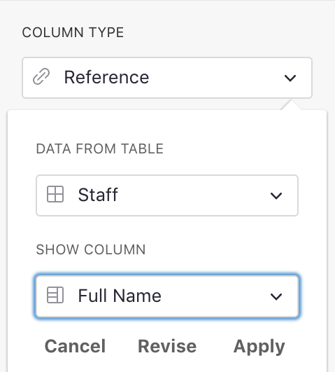
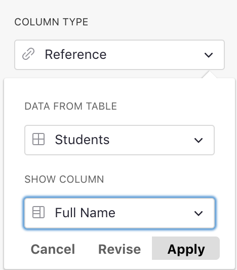
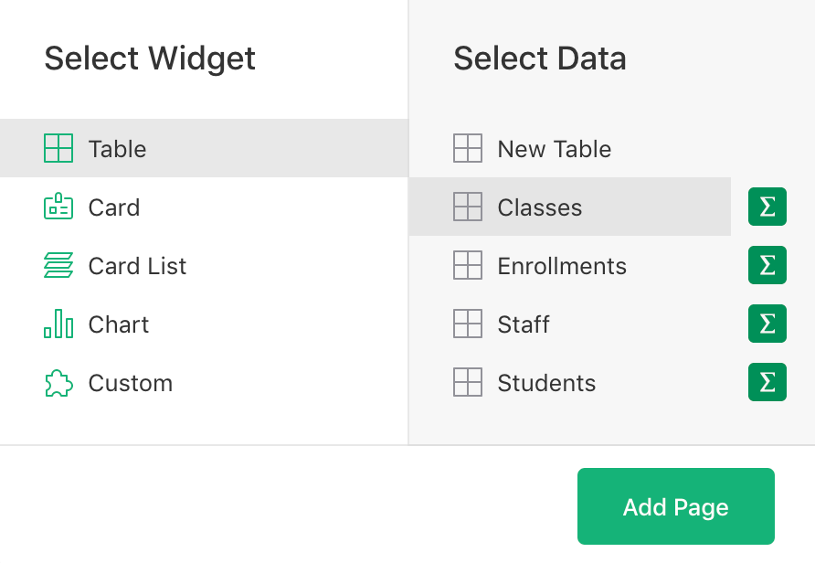
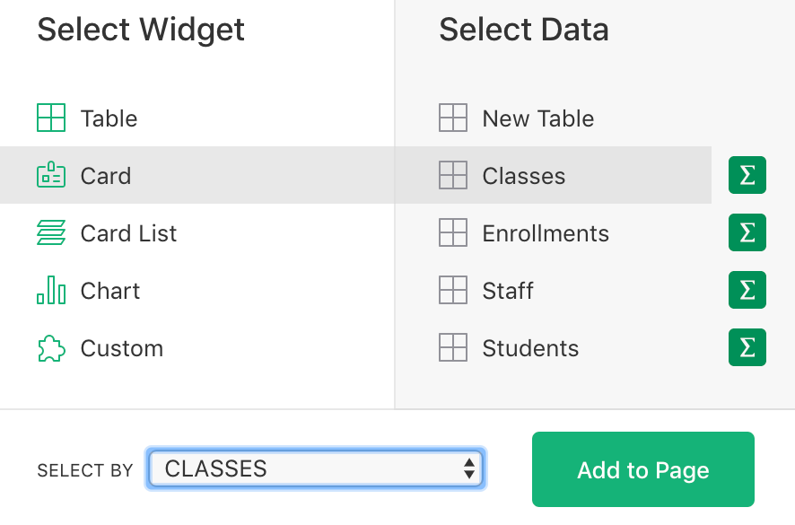
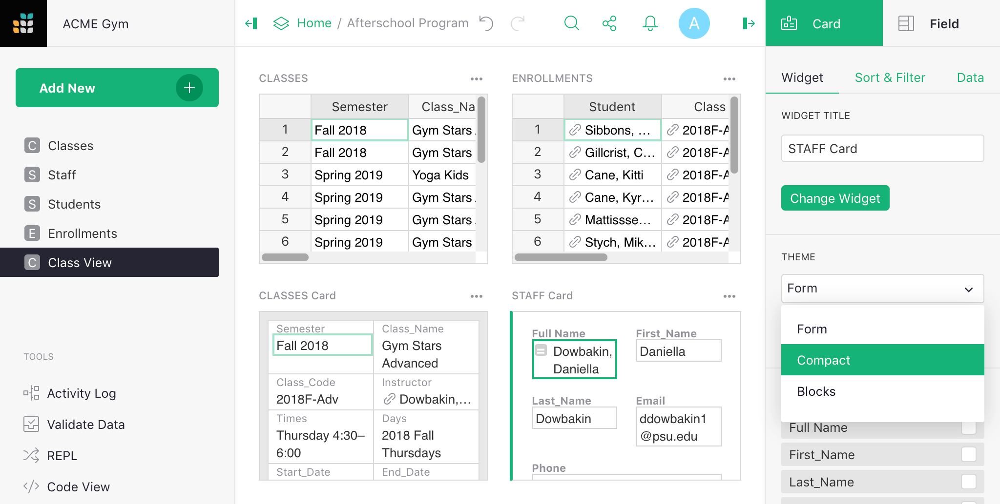
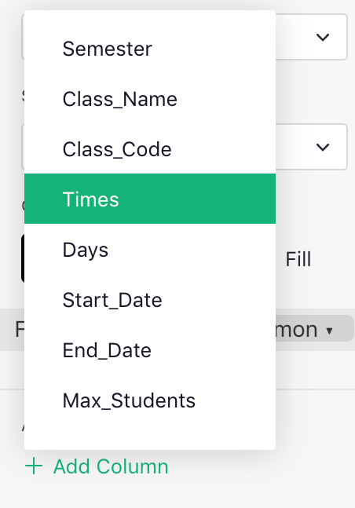
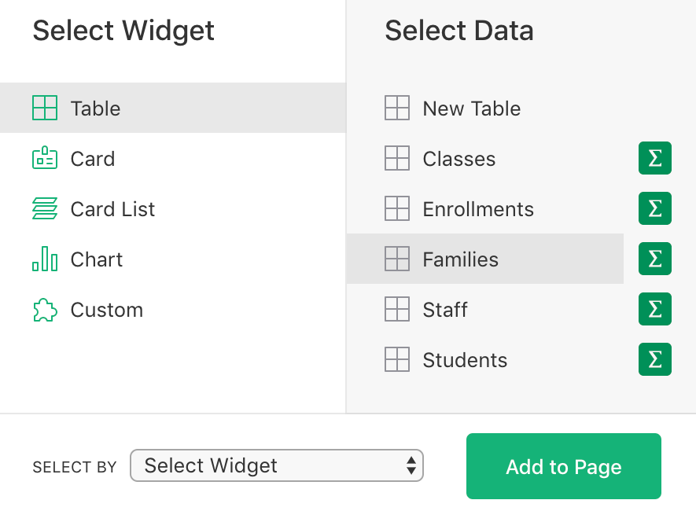
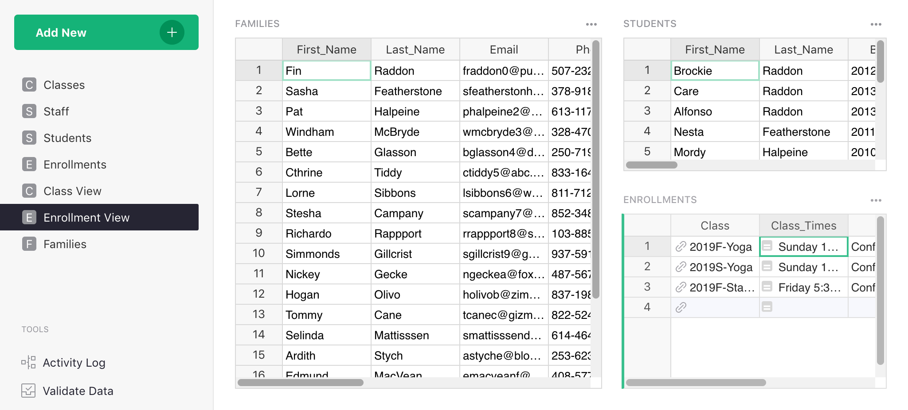
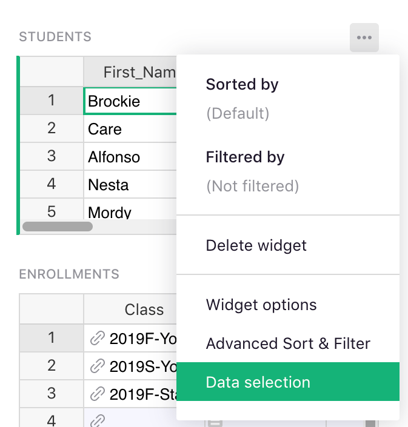
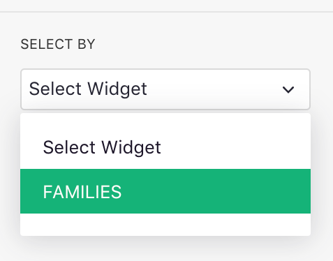

# Comment gérer les données commerciales {: data-toc-label='Intro' }

Grist brille lorsque vos données commerciales présentent une certaine complexité. Dans cet exemple, nous allons examiner une organisation qui propose des activités périscolaires pour les enfants.

N'hésitez pas à consulter le document [Inscription en classe](https://templates.getgrist.com/doc/afterschool-program), que vous trouverez sur notre page [Exemples et modèles](https://public.getgrist.com/p/templates).

Dans cet exercice, nous allons montrer comment planifier, concevoir et créer un tel document.

## Planification

Un peu de planification à l'avance vous aidera à obtenir une solution plus rapidement. Pensez aux types de données avec lesquels vous travaillez et aux types de flux de travail dont vous aurez besoin. Vous n'avez pas besoin d'anticiper tout dès le départ. Vous pouvez facilement ajouter de la complexité plus tard, comme vous le verrez ci-dessous.

Notre organisation propose plusieurs cours pour les enfants. Chaque cours a un instructeur et plusieurs étudiants. Les étudiants peuvent s'inscrire à plusieurs cours et peuvent revenir année après année. Pour chaque cours, nous souhaitons voir la liste des étudiants inscrits et s'il reste des places disponibles. Lorsque qu'un parent appelle, nous voulons un moyen pratique d'inscrire un nouvel étudiant ou de modifier ou annuler l'inscription d'un étudiant.

Si cela ressemble à la construction d'une application, c'est exactement ce que nous faisons. Cependant, comme vous le verrez, ce n'est pas plus difficile que de créer une feuille de calcul.

## Modélisation des données

Plus vous modélisez bien vos données commerciales, plus votre travail sera facile. D'une certaine manière, vous faites à la fois la conception de base de données et la construction d'une application personnalisée. Grist rend simplement cela plus facile.

Commençons par les cours et leurs instructeurs.

Nous avons besoin d'une liste de cours et d'instructeurs. Le même instructeur peut enseigner différents cours, donc les instructeurs et les cours vivront dans des tables différentes. Appelons-les "Cours" et "Personnel". Chaque cours a un seul instructeur, donc l'une des propriétés d'un cours sera l'instructeur de ce cours.

## Cours et Instructeurs

En partant de zéro, vous allez créer un nouveau document vide (voir [Créer un document](creating-doc.md)), renommer la table vide initiale "Table1" en "Cours", ajouter les colonnes nécessaires et saisir quelques cours. Pour suivre les étapes de ce tutoriel, vous pouvez plutôt importer [Classes.csv](./unlocalized-assets/afterschool-program/Classes.csv){: data-wm-adjusted=1 }
(ou simplement vous référer au document exemple "Programme périscolaire").

Pour la table Personnel, cliquez sur le bouton "Ajouter nouveau" et sélectionnez "Ajouter une table vide". Renommez-la en "Personnel", créez quelques colonnes et saisissez des données sur les instructeurs. Ou importez [Staff.csv](./unlocalized-assets/afterschool-program/Staff.csv) pour utiliser des données d'exemple et gagner quelques étapes.

Nous voulons que la colonne *Instructeur* dans la table `Cours` soit une référence à la table `Personnel`. Actuellement, la table `Personnel` n'a pas de colonne qui identifie de manière unique chaque enregistrement. Pour configurer des références, il est judicieux d'en ajouter une. Dans ce cas, nous allons ajouter une colonne "Nom Complet" à la table `Personnel`.

## Formules

Cliquez sur la page "Personnel" et ajoutez une colonne "Nom Complet" en utilisant le menu des colonnes ou le raccourci <code class="keys">*Alt* + **=**</code>, puis tapez "Nom Complet" dans l'en-tête de la nouvelle colonne.

**
{: .screenshot-half }

Créez une formule en saisissant une valeur dans n'importe quelle cellule de la nouvelle colonne, en commençant par le signe égal (“=”). Entrez la formule comme `$Last_Name + ", " + $First_Name`{: .formula }. Vous pouvez utiliser une syntaxe similaire à Excel pour le même effet : `CONCAT($Last_Name, ", ", $First_Name)`{: .formula }.

**
{: .screenshot-half }

  - Dans Grist, une formule s'applique toujours à chaque enregistrement de la table.
  - Grist prend en charge Python dans les formules, ainsi que la plupart des fonctions Excel, qui ont des noms en majuscules.

Comme les formules s'appliquent à chaque ligne, vous devriez voir la colonne *Nom Complet* remplie automatiquement.

## Références

Cliquez à nouveau sur la page "Cours" et ouvrez "Options de colonne" pour la colonne *Instructeur*. Nous allons la transformer en référence à `Personnel`.

Dans le panneau de droite, définissez le type de colonne sur "Référence" (en termes de base de données, cela est connu sous le nom de "clé étrangère"), et définissez la table référencée sur "Personnel". Pour le menu déroulant "AFFICHER LA COLONNE", sélectionnez "Nom Complet", qui est la nouvelle colonne que nous venons d'ajouter.

**
{: .screenshot-half }

Cliquez sur le bouton "Appliquer" pour finaliser ce changement de type de colonne (si la colonne est vide, il n'y a pas d'étape de confirmation).

Vous pouvez maintenant attribuer un instructeur à n'importe quel cours. Cliquez sur une cellule dans la colonne *Instructeur*. Vous pouvez appuyer sur <code class="keys">*Entrée*</code> et choisir parmi les instructeurs disponibles dans la table `Personnel`, ou commencer à taper pour utiliser l'auto-complétion.

**
{: .screenshot-half }

Ensuite, nous allons continuer avec les étudiants et leurs inscriptions.

## Étudiants

Chaque cours a un certain nombre d'étudiants. Nous aurons donc besoin d'une table d'étudiants. Encore une fois, ajoutez une nouvelle table vide, renommez-la en "Étudiants" et remplissez-la avec les noms des étudiants, les niveaux de classe, etc. Ou importez [Students.csv](./unlocalized-assets/afterschool-program/Students.csv) pour utiliser des données d'exemple et gagner quelques étapes.

Ajoutons ici une colonne de formule "Nom Complet", tout comme dans la table `Personnel`. Cela sera utile.

**
{: .screenshot-half }

## Relations plusieurs-à-plusieurs

Un étudiant peut suivre plus d'un cours. Rappelons également qu'il y a des cours passés et futurs, et qu'il est précieux de conserver ces données historiques. Donc, pour chaque étudiant, il peut y avoir plusieurs cours, et dans chaque cours, il y a plusieurs étudiants.

Une bonne façon de modéliser une telle relation est d'ajouter le concept d'une "inscription" et une nouvelle table `Inscriptions`. Une "inscription" représente un étudiant inscrit dans un cours. Elle a quelques propriétés utiles à elle : le statut de l'inscription (Confirmé, En attente ou Annulé), si l'étudiant a payé pour le cours, et peut-être plus.

Dans la conception de bases de données, cela est connu sous le nom de relation "plusieurs-à-plusieurs". La table supplémentaire est connue sous le nom de table de "jointure". Essentiellement, elle ajoute un enregistrement pour chaque connexion étudiant-cours, et transforme la relation "plusieurs-à-plusieurs" en deux relations "un-à-plusieurs".

Cette relation :

**
{: .screenshot-half }

deviendra ceci :

**
{: .screenshot-half }

Alors, ajoutons une nouvelle table, nommons-la "Inscriptions", et ajoutons les colonnes dont nous avons besoin. Ici aussi, pour suivre, vous pouvez importer des données d'exemple à partir de [Enrollments.csv](./unlocalized-assets/afterschool-program/Enrollments.csv).

Dans les Options de colonne pour la colonne *Étudiant*, définissez le type de colonne sur "Référence", définissez la table référencée sur `Étudiants`, et sélectionnez "Nom Complet" comme colonne à afficher.

**
{: .screenshot-half }

Pour la colonne *Cours*, définissez le type de colonne sur "Référence", la table référencée sur `Cours`, et sélectionnez "Code de Cours" comme colonne à afficher.

**
{: .screenshot-half }

Il est possible d'entrer des données d'inscription en ajoutant des enregistrements à cette table et en utilisant l'auto-complétion dans les colonnes *Étudiant* et *Cours*. Ci-dessous, nous allons mettre en place un moyen beaucoup plus pratique d'inscrire les étudiants.

## Vue des Cours

Un de nos objectifs dans la phase de planification était de voir une liste des étudiants inscrits pour chaque cours. Maintenant que les tables de données sont en place, nous pouvons créer une page qui le fait.

Cliquez sur "Ajouter Nouveau", puis "Ajouter Page" pour ouvrir le sélecteur de widget. Sélectionnez pour afficher une table de `Cours`, et cliquez sur "Ajouter Page".

**
{: .screenshot-half }

La nouvelle page affiche une liste de cours. Renommons cette page "Vue des Cours".

**
{: .screenshot-half }

Ensuite, ajoutez la table `Inscriptions` liée à la table des cours. Cliquez à nouveau sur "Ajouter Nouveau", puis "Ajouter Widget à la Page". Dans le sélecteur de widget, sélectionnez pour afficher une table de `Inscriptions`. Pour "SÉLECTIONNER PAR", choisissez "COURS", et cliquez sur "Ajouter à la Page".

**
{: .screenshot-half }

Nous avons deux tables côte à côte. Sélectionner un cours affiche toutes les inscriptions dans ce cours, chacune d'elles faisant référence à un étudiant particulier et incluant d'autres informations d'inscription.

Nous pouvons aller un peu plus loin pour rendre cette vue pratique pour nous. Ajoutons une carte de Cours à cette vue. Cliquez sur "Ajouter Nouveau" et "Ajouter Widget à la Page". Dans le sélecteur de widget, sélectionnez le widget "Carte" pour les données `Cours`. Pour "SÉLECTIONNER PAR", choisissez à nouveau "COURS", et cliquez sur "Ajouter à la Page".

**
{: .screenshot-half }

Nous pouvons également ajouter une carte pour l'instructeur qui dirige ce cours. Encore une fois, cliquez sur "Ajouter Nouveau" > "Ajouter Widget à la Page", et sélectionnez "Carte" pour les données `Personnel`. Pour "SÉLECTIONNER PAR", vous pouvez maintenant choisir "COURS • Instructeur".

**
{: .screenshot-half }

Vous pouvez changer l'apparence des nouvelles cartes. Cliquez sur le menu à trois points en haut à droite de la carte que vous souhaitez modifier, et choisissez "Options de Widget". Trouvez le menu déroulant "Thème" dans le panneau de droite, et sélectionnez "Compact".

Voici ce que nous avons maintenant dans la page Vue des Cours :

C'est le bon moment pour nettoyer cette page en masquant les colonnes et les champs qui sont dupliqués ou distrayants. Consultez [Configurer les listes de champs](page-widgets.md#configuring-field-lists) pour une méthode efficace de sélection des champs à afficher, et [Mises en page personnalisées](custom-layouts.md) pour réorganiser les widgets sur la page.

## Vue des Inscriptions

Notre autre objectif déclaré était de disposer d'un moyen pratique d'inscrire un étudiant et de voir ou d'ajuster les inscriptions d'un étudiant donné.

Ajoutons une page pour cela. Cliquez sur "Ajouter Nouveau" > "Ajouter Page", et sélectionnez une table de `Étudiants`. Nous renommerons la nouvelle page en "Vue des Inscriptions".

Lorsque nous sélectionnons un étudiant ici, nous aimerions voir toutes les inscriptions de cet étudiant. Donc, cliquez sur "Ajouter Nouveau" > "Ajouter Widget à la Page", et ajoutez une table de `Inscriptions`. Pour lier le nouveau widget au widget Étudiants dans la page, définissez le menu déroulant "SÉLECTIONNER PAR" sur "ÉTUDIANTS", et cliquez sur "Ajouter à la Page".

**
{: .screenshot-half }

Maintenant, vous pouvez cliquer sur le nom d'un étudiant à gauche et voir les cours auxquels cet étudiant est inscrit à droite. Vous pouvez inscrire l'étudiant sélectionné dans un cours en saisissant simplement un code de cours dans la ligne vide spéciale en bas de la liste des inscriptions. Comme d'habitude, la colonne de référence *Cours* propose l'auto-complétion.

Vous pouvez masquer la colonne "Étudiant" dans la table "INSCRIPTIONS", car elle affichera toujours l'étudiant sélectionné de toute façon.

Si vous souhaitez inclure plus d'informations sur les cours dans la table Inscriptions, sélectionnez les Options de colonne pour la colonne *Cours*, et cliquez sur "+ Ajouter une colonne" dans le panneau latéral.

**
{: .screenshot-half }

Tous les champs associés à un cours sont disponibles. Si vous examinez les colonnes que vous ajoutez de cette manière, vous verrez qu'elles sont simplement des formules de la forme `$Class.Times`{: .formula }.

## Ajout de Couches

Si vous travaillez avec des enfants, vous parlez à leurs parents. Vous devrez avoir les noms et les coordonnées des parents, que vous pouvez ajouter en tant que colonnes dans la table des étudiants.

Vous constaterez probablement que certains parents ont plusieurs enfants qui s'inscrivent ensemble à des cours. Reconnaître la relation parent-enfant dans votre base de données peut sembler une étape complexe, mais cela simplifiera probablement votre flux de travail quotidien.

Alors, ajoutons une table de plus : `Familles`. Nous inclurons le nom et les coordonnées des parents, et lierons chaque enfant à un enregistrement ici. Vous pouvez importer des données d'exemple à partir de [Families.csv](./unlocalized-assets/afterschool-program/Families.csv).

Notez que nous avons ajouté une colonne *Nom Complet* ici comme pour d'autres tables qui listent des personnes.

Dans la table des Étudiants, nous allons ajouter une colonne nommée "Famille", et en faire une Référence à `Familles`.

Les données d'exemple ont déjà des familles remplies, et la conversion en référence recherche le texte pour définir les références correctes. Si vous saisissiez de nouvelles données, vous pourriez lier les étudiants aux familles en utilisant l'auto-complétion comme avec d'autres colonnes de référence.

Changeons notre "Vue des Inscriptions" pour lister les familles en premier. De cette façon, lorsque qu'un parent appelle, vous pouvez choisir le bon enregistrement et voir tous leurs enfants et les inscriptions pour chaque enfant.

Dans la page "Vue des Inscriptions", cliquez sur "Ajouter Nouveau" > "Ajouter Widget à la Page". Sélectionnez pour afficher une table de `Familles`.

**
{: .screenshot-half }

Réorganisez les widgets pour avoir les Familles à gauche, et les Étudiants et Inscriptions à droite.

Maintenant, liez les étudiants aux Familles : cliquez sur le menu à trois points en haut à droite de la table ÉTUDIANTS, et choisissez "Sélection de données".

**
{: .screenshot-half }

Dans le panneau latéral, vous pouvez définir le widget "SÉLECTIONNER PAR" sur "FAMILLES".

**
{: .screenshot-half }

Enfin, vous pouvez ajouter des widgets de carte pour les détails de la famille sélectionnée et de l'étudiant sélectionné, et réorganiser les widgets sur la page pour créer une mise en page parfaite pour parler à un parent.

Vous sélectionnez un parent, voyez leurs enfants, puis sélectionnez un enfant pour voir ses inscriptions. Il est facile d'ajouter un enregistrement d'inscription pour un nouveau cours, ou de modifier un enregistrement (par exemple, le marquer comme "annulé"), d'ajouter un autre enfant ou d'ajouter une nouvelle famille.

## Document Exemple

Le document exemple "Programme périscolaire" comprend tout ce qui est décrit ci-dessus et un peu plus.

En particulier, il ajoute un champ *Nombre* aux Cours pour calculer le nombre d'étudiants inscrits, et un champ *Places Disponibles* pour montrer le nombre de places restantes, en comparant *Nombre* à *Max_Students* :

  - La formule pour *Nombre* est `len(Enrollments.lookupRecords(Class=$id, Status="Confirmed"))`{: .formula }.
  - La formule pour *Places Disponibles* est `max($Max_Students - $Count, 0) or "Complet"`{: .formula }.

**
{: .screenshot-half }

Cela rend la page Vue des Cours plus utile, où il est maintenant facile de voir d'un coup d'œil quels cours ont des places restantes.
