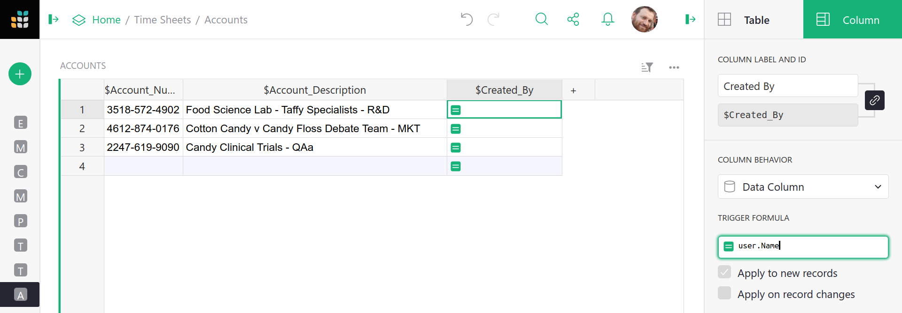
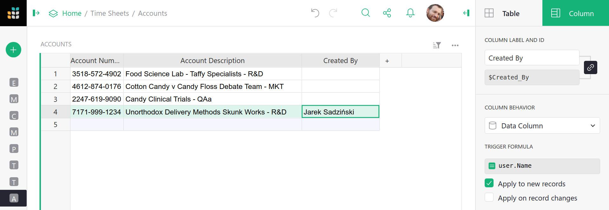

Colonnes d'auteur
===================

Parfois, il est utile d'avoir des colonnes qui enregistrent qui a créé des enregistrements individuels et qui les a mis à jour en dernier. Grist vous permet de créer facilement de telles colonnes. Il suit également automatiquement les modifications du document dans l'onglet Activité de l'Historique du document, mais il est néanmoins pratique d'avoir ces informations sous forme tabulaire disponibles pour les formules et les filtres, et les colonnes d'auteur vous permettent de le faire.

## Une colonne "Créé par"

Supposons que nous voulions remplir automatiquement une colonne avec le nom du créateur de chaque enregistrement au fur et à mesure qu'ils sont ajoutés. Comme première étape, ajoutez une colonne appelée (par exemple) `Créé par`. Dans les options de colonne dans le panneau latéral (voir [Colonnes](col-types.md) pour un rappel), cliquez sur l'action `Définir une formule de déclenchement`.

Définissez `user.Name`{: .formula} comme formule de la colonne. Il existe d'autres possibilités, telles que `user.Email`{: .formula}, un `user.UserID`{: .formula} unique, et ainsi de suite. Les informations utilisateur disponibles sont les mêmes que celles des [conditions de règles d'accès](access-rules.md#access-rule-conditions). Les informations temporelles sont également disponibles (voir [Colonnes de timestamp](timestamps.md)). Mais restons-en à `user.Name`{: .formula} pour l'instant.

Maintenant, pour définir la colonne chaque fois qu'un enregistrement est créé, assurez-vous que l'option `Appliquer aux nouveaux enregistrements` est cochée. Et c'est tout ! Maintenant, chaque fois qu'un enregistrement est créé, la colonne `Créé le` sera définie avec le nom de l'utilisateur qui le crée :

## Une colonne "Mis à jour par"

Si nous voulons une colonne qui enregistre qui a modifié un enregistrement en dernier (par opposition à son créateur), la procédure est similaire à celle d'une [colonne "Créé par"](authorship.md#a-created-by-column), mais au lieu de `Appliquer aux nouveaux enregistrements`, sélectionnez `Appliquer aux modifications des enregistrements`. Ensuite, sélectionnez `N'importe quel champ` (en supposant que vous voulez que toute modification d'un enregistrement soit considérée comme une mise à jour) et appuyez sur `OK`. Vous pouvez alternativement choisir quelles colonnes, lorsqu'elles sont mises à jour, déclencheront la formule.

Voici un exemple de la nouvelle colonne en action - lorsque `Cotton Candy v Candy Floss` est mis à jour, un nom d'utilisateur apparaît pour cet enregistrement :

!!! note ""
    **Il est toujours possible pour un utilisateur de modifier manuellement les cellules dans les colonnes `Créé par` et `Mis à jour par`. Si vous ne voulez pas que cela soit autorisé, utilisez les [permissions avancées](access-rules.md) pour l'interdire.**
