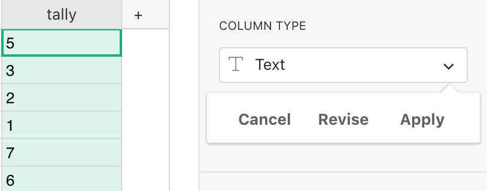
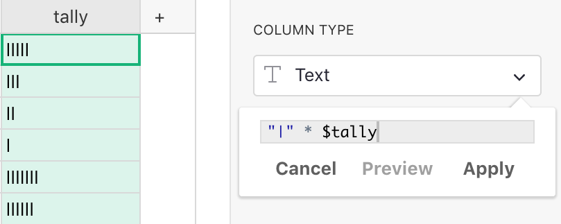

# Transformations de Colonne {: data-toc-label='' }

Grist offre deux façons de transformer toutes les valeurs d'une colonne. L'une consiste à changer le type de la colonne, et l'autre à appliquer une transformation basée sur une formule.

## Conversions de type

Lors de la conversion entre différents types de colonnes, Grist adopte un comportement par défaut raisonnable, mais rend ce comportement facile à réviser. Par exemple, supposons que vous ayez une colonne d'entiers. Pour convertir cette colonne en texte, ouvrez les options de la colonne comme décrit dans [Spécifier un type](col-types.md#specifying-a-type), et trouvez la section de type de colonne. Changez le type de colonne en texte dans le menu déroulant. Vous remarquerez qu'une boîte de dialogue "annuler/réviser/appliquer" s'ouvre à côté du menu déroulant.

**
{: .screenshot-half }

Pour changer la façon dont la conversion est effectuée, cliquez sur `Réviser`. Vous verrez une boîte de formule avec la méthode de conversion par défaut, `grist.Text.typeConvert($tally)`. Cela signifie "faire la conversion par défaut en texte pour la colonne `tally`". Vous pouvez remplacer cela par n'importe quelle formule de votre choix. Par exemple :

**
{: .screenshot-half }

Le code pour convertir en lignes unicode est laissé comme exercice au lecteur. Pour prévisualiser les résultats de la conversion, cliquez sur "prévisualiser". Lorsque vous êtes satisfait de la conversion, cliquez sur "appliquer". Pour abandonner la conversion, cliquez sur "annuler".

## Transformations basées sur des formules

Les tableurs sont des outils pratiques pour nettoyer les données en utilisant des [formules](formulas.md). Par exemple, imaginez que vous ayez des codes postaux qui ont perdu leurs zéros initiaux - vous pouvez facilement les reformater avec une formule rapide :

Nous pourrions maintenant [figer les résultats](formulas.md#freeze-a-formula-column) et supprimer les données originales si nous n'en avons plus besoin.

Si vous savez que vous allez jeter les données originales comme cela, Grist offre des transformations de colonne comme un moyen plus rapide de modifier systématiquement toutes les cellules d'une colonne.

Trouvez la section "Transformer" en bas du panneau latéral des options de colonne (voir [Colonnes](col-types.md) pour savoir comment ouvrir ce panneau).

Lorsque vous cliquez sur le bouton orange "éclair", Grist vous propose une formule, `return $zip` dans ce cas. Vous pouvez modifier cette formule pour apporter un changement à la colonne sélectionnée. Par exemple, `return $zip + 1` ajouterait un au code postal. Vous pouvez prévisualiser l'effet de votre formule, et lorsque vous êtes satisfait, appuyez sur "Appliquer". Dans notre cas, où nous voulons ajouter des zéros initiaux, nous devons d'abord changer notre type de colonne en `Texte` (en supposant qu'il soit actuellement `Entier` - s'il est `Numérique`, convertissez-le d'abord en `Entier` puis en `Texte` pour éviter les points décimaux). Une fois cela fait, nous pouvons utiliser notre formule pour ajouter des zéros initiaux :

Lorsque vous êtes satisfait, appuyez sur "Appliquer" pour remplacer les valeurs des cellules par leurs nouvelles versions. De même, la colonne `response` pourrait être transformée avec la formule en valeurs vrai/faux avec `$response[0] == 'y'`, puis définie comme une [colonne à bascule](col-types.md#toggle-columns).
