<iframe width="560" height="315" src="https://www.youtube.com/embed/kEKYcW3h4V8?rel=0" frameborder="0" allow="accelerometer; autoplay; encrypted-media; gyroscope; picture-in-picture" allowfullscreen></iframe>

Colonnes et types de données
===========================

## Ajouter et supprimer des colonnes

Chaque table Grist, lorsqu'elle est créée pour la première fois, a trois colonnes appelées A, B et C. Pour renommer une colonne, survolez l'en-tête de la colonne, cliquez sur le menu déroulant, puis sélectionnez "Renommer la colonne" (vous pouvez également cliquer deux fois sur l'en-tête de la colonne).

*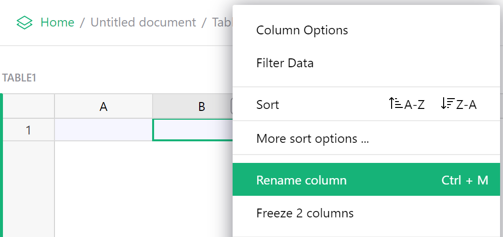*
{: .screenshot-half }

Pour supprimer une colonne, survolez l'en-tête de la colonne, cliquez sur le menu déroulant, puis sélectionnez "Supprimer la colonne".

**
{: .screenshot-half }

Pour ajouter une colonne, cliquez sur le symbole "+" dans la ligne d'en-tête pour ouvrir le menu "Ajouter une colonne".

La première option dans le menu, "Ajouter une colonne", ajoutera une nouvelle colonne de données vide à votre table.

Si vous savez quel type de colonne vous avez besoin, l'option suivante vous permet d'assigner un type à votre nouvelle colonne. Sélectionnez un type de colonne dans le menu déroulant.

**
{: .screenshot-half }

La troisième option, "Ajouter une colonne de formule", ajoutera une nouvelle colonne de formule avec la boîte d'entrée de formule immédiatement ouverte afin que vous puissiez commencer à entrer votre formule sans clics supplémentaires.

"Colonnes cachées" s'agrandit pour montrer une liste de colonnes cachées de cette vue qui peuvent être rapidement ajoutées à nouveau.

*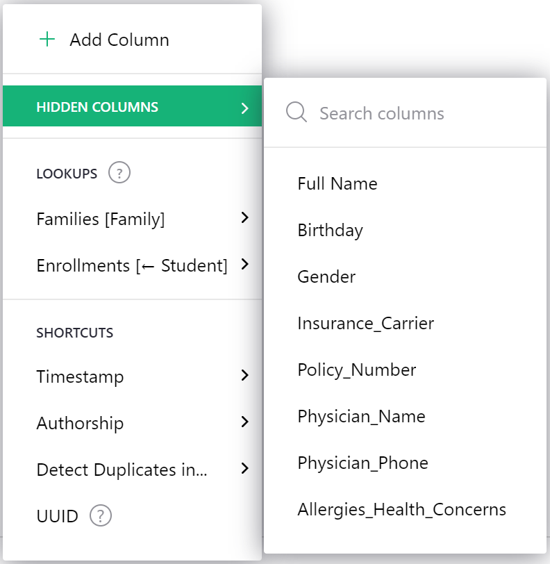*
{: .screenshot-half }

"Appariements" vous permet d'ajouter des colonnes de données provenant de tables liées. Vous pouvez utiliser des colonnes de référence pour relier des données dans différentes tables. En savoir plus sur [Références et Appariements](references-lookups.md).

*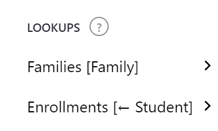*
{: .screenshot-half }

"Raccourcis" répertorie les fonctions de [formule d'initialisation](formulas.md#trigger-formulas) les plus fréquemment utilisées.

**
{: .screenshot-half }

En savoir plus sur chaque option de raccourci aux liens ci-dessous :

- [Horodatage](formula-cheat-sheet.md#examples-of-automatic-date-time-and-author-stamps)

- [Autorité](formula-cheat-sheet.md#examples-of-automatic-date-time-and-author-stamps)

- [Détecter les doublons dans...](formula-cheat-sheet.md#finding-duplicates)

- [UUID](access-rules.md#link-keys)

## Réorganiser les colonnes

Pour réorganiser une colonne, sélectionnez d'abord la colonne si elle n'est pas déjà sélectionnée, en cliquant sur l'en-tête de la colonne. Ensuite, cliquez et maintenez l'en-tête de la colonne. Après une seconde ou deux, vous pourrez faire glisser l'ensemble de la colonne vers son nouvel emplacement.

Une autre façon de réorganiser les colonnes est via les options de vue :

**
{: .screenshot-half }

Dans la section des colonnes visibles, les colonnes peuvent être déplacées librement pour les réorganiser. Vous pouvez également cacher des colonnes ici.

**
{: .screenshot-half }

## Renommer les colonnes

Vous pouvez renommer les colonnes de plusieurs manières. Une façon est de double-cliquer sur un en-tête de colonne. Ensuite, vous pouvez renommer la colonne ou ajouter une description de colonne.

*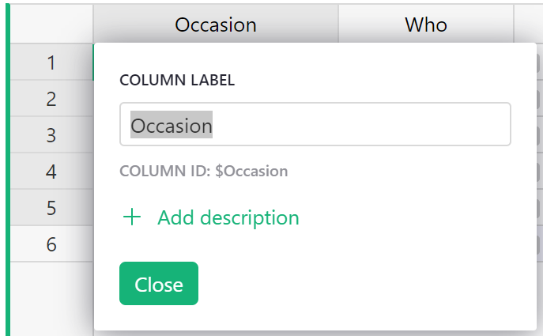*
{: .screenshot-half }

Vous pouvez également survoler l'en-tête de la colonne, cliquer sur le menu déroulant, puis sélectionner "Renommer la colonne". Cela ouvre la même fenêtre contextuelle que celle vue ci-dessus.

**
{: .screenshot-half }

Sélectionner "Options de colonne" dans le même menu déroulant ouvre le panneau de création. À partir de là, vous pouvez modifier l'étiquette de la colonne, affichée en haut ou ajouter une description.

*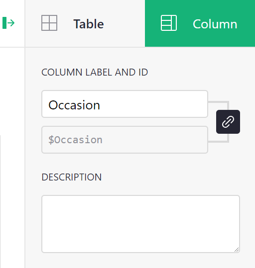*
{: .screenshot-half }

Un avantage de cette méthode est que vous pouvez également contrôler l'identifiant donné à la colonne dans les formules. Par défaut, cela est basé sur le nom du champ, avec tous les caractères que Python n'aime pas remplacés par "\_", et un numéro ajouté si nécessaire pour garder le nom unique dans votre table. Si vous n'aimez pas cet identifiant, vous pouvez le changer, bien qu'il doive toujours être compatible avec Python. Cliquez sur l'icône de lien pour rendre le champ ID modifiable, puis entrez le nouvel ID de colonne.

*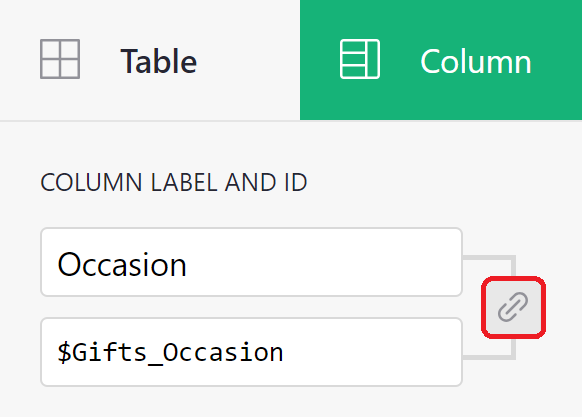*
{: .screenshot-half }

## Mise en forme des colonnes

Les styles d'en-tête et de cellule peuvent être modifiés sous l'onglet Colonne du panneau de création.

**
{: .screenshot-half }

Lorsque vous ouvrez le menu de style, vous avez la possibilité d'appliquer un formatage de texte ainsi que des couleurs de texte et de remplissage.

**

Si vous souhaitez plus d'options de couleur, cliquez sur la boîte de couleur de remplissage puis trouvez la teinte que vous souhaitez. Si vous avez une couleur spécifique que vous souhaitez utiliser, vous pouvez entrer le code hexadécimal, les valeurs RGB ou HSL.

**
{: .screenshot-half }

Le style de cellule peut également être modifié en fonction de règles conditionnelles. En savoir plus sur [Mise en forme conditionnelle](conditional-formatting.md).

## Spécifier un type

Les colonnes Grist ont des types, similaires à d'autres feuilles de calcul ou bases de données. Le type d'une colonne contrôle son apparence et l'aide que Grist vous offrira lors de l'édition des cellules.

Lorsque vous créez une nouvelle colonne, elle a initialement le type `Any`. Lorsque vous entrez dans la première cellule de la colonne, Grist essaie de restreindre ce type. Si vous entrez un nombre, la colonne sera changée en type `Numeric`, qui est aligné à droite par défaut. Si vous entrez quelque chose qui ne ressemble pas à un nombre, la colonne sera changée en type `Text`, qui est aligné à gauche par défaut.

Pour inspecter le type d'une colonne, survolez l'en-tête de la colonne, puis cliquez sur le menu déroulant, puis sélectionnez "Options de colonne". La section "Type de colonne" est ce que vous recherchez.

**

Vous voudrez souvent contrôler le type de colonne manuellement. Vous pouvez le changer dans la section "Type de colonne". Par exemple, ici nous définissons une colonne pleine de réponses "oui" et "non" comme étant de type `Toggle` :

**

Un avantage de faire cela est que Grist peut maintenant vous offrir des moyens de visualiser la colonne qui sont spécialisés pour les valeurs de type on/off. Chaque type de colonne a différentes options dans la section "Format de cellule" du panneau latéral :

**

Quel que soit le type de colonne, vous pouvez entrer **n'importe quelle valeur** dans les cellules. Si une valeur entrée est incompatible avec le type défini, la cellule sera mise en surbrillance avec une erreur (et les colonnes référencées par la valeur invalide afficheront également une erreur) :

## Types pris en charge

Grist prend en charge les types suivants :

 <!-- Pour le style css via css/extra.css -->

Type           | Description
-------------- | -----------
Texte          | (**Par défaut**) Toute chaîne de texte.
Numérique      | Nombres à virgule flottante.
Entier         | Entiers (nombres entiers).
Basculer       | Booléen (Vrai / Faux)
Date           | Date valide (sans composant horaire).
DateHeure      | Date + heure valide.
Choix         | Valeur unique d'une liste de valeurs valides prédéfinies.
Liste de choix  | Plusieurs valeurs d'une liste de valeurs valides prédéfinies.
Référence      | Une colonne de référence vers une autre table.
Liste de références | Une liste de références vers une autre table.
Pièce jointe   | Cellules où vous pouvez placer des fichiers ou des images.

## Colonnes de texte

Vous pouvez mettre n'importe quel texte que vous aimez dans ce type de colonne. Pour la mise en forme, vous pouvez contrôler l'alignement et le retour à la ligne, la couleur du texte et la couleur de fond.

Si la colonne est utilisée pour stocker des liens web, vous pouvez activer le formatage "HyperLink" pour rendre les liens plus jolis et inclure une icône de lien cliquable.

**
{: .screenshot-half }

### Hyperliens

Lorsque une colonne de texte utilise le formatage "HyperLink", les valeurs sont formatées comme suit :

- `https://getgrist.com` affichera <https://getgrist.com>.
- `Grist Labs https://getgrist.com` affichera [Grist Labs](https://getgrist.com) (liant à "https://getgrist.com" avec “Grist Labs” comme texte).
- `Email Help mailto:support@getgrist.com` affichera <a href="mailto:support@getgrist.com">Email Help</a>, un lien qui ouvrirait un programme de messagerie pour composer un email à support@getgrist.com.

En général, la valeur jusqu'au dernier espace est utilisée comme texte du lien, tandis que le dernier mot est utilisé comme destination du lien.

Le formatage des liens est particulièrement utile lorsque les liens sont générés à l'aide d'une formule telle que :  
`$Company + " " + $Website`{: .formula}

## Colonnes numériques

Ce type est pour les nombres, y compris les nombres à virgule flottante. En plus de contrôler l'alignement et la couleur, vous pouvez choisir le format de nombre, et le nombre minimum et maximum de chiffres à afficher après la virgule.

**
{: .screenshot-half }

Choisir l'option "Spinner" pour le FORMAT DE CELLULE affichera des flèches dans chaque cellule pour augmenter/diminuer le nombre.

Les options sous FORMAT DE NOMBRE incluent :

- `$` : Format pour les montants en devise, tels que les dollars ou les euros. Sélectionner le `$` ajoutera un préfixe de devise, des séparateurs de milliers, et par défaut à 2 chiffres après la virgule. Cela ouvrira également un sélecteur de devise pour les devises internationales.

  **
  {: .screenshot-half }
  
!!! note "Définir la devise par défaut"
    Vous pouvez définir le fuseau horaire, la locale et la devise par défaut d'un document dans [Paramètres du document](creating-doc.md#document-settings).
  
- `,` : Activer l'affichage des séparateurs de milliers.
- `%` : Afficher les nombres en pourcentages. Par exemple, "0.5" s'afficherait comme "50%".
- `Exp` : Afficher les nombres en notation exponentielle (ou scientifique). Par exemple, "1234" serait affiché comme "1.234E3".
- `(-)` : Afficher les nombres négatifs entre parenthèses, sans signe moins devant. Ceci est couramment utilisé en comptabilité, et généralement combiné avec les formats `$` ou `,`.

## Colonnes entières

Ce type est strictement pour les nombres entiers. Il a les mêmes options que le type numérique.

## Colonnes basculantes

Ce type est pour stocker des valeurs vrai/faux. Les valeurs peuvent être affichées sous forme de texte, de cases à cocher ou de commutateurs.

**
{: .screenshot-half }

Voir également l'exemple dans [Spécifier un type](col-types.md#specifying-a-type).

## Colonnes de date

Ce type est pour stocker des dates de calendrier (sans composant horaire). Plus de détails dans [Travailler avec des dates](dates.md). Vous pouvez choisir le format des dates, voir la [référence de formatage des dates](https://momentjs.com/docs/#/displaying/format/).

*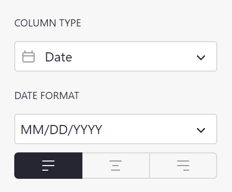*
{: .screenshot-half }

## Colonnes DateHeure

Ce type est pour stocker des dates de calendrier plus l'heure de la journée. Plus de détails dans [Travailler avec des dates](dates.md). Vous pouvez choisir le format des dates, voir la [référence de formatage des dates et heures](https://momentjs.com/docs/#/displaying/format/). Vous pouvez également spécifier le fuseau horaire à afficher.

**
{: .screenshot-half }

Si vous souhaitez définir un fuseau horaire par défaut pour votre document, vous pouvez le faire dans [Paramètres du document](creating-doc.md#document-settings).

## Colonnes de choix

Ce type est pour stocker une valeur parmi un ensemble de valeurs valides, où vous pouvez spécifier les valeurs disponibles.

**
{: .screenshot-half }

Il y a un exemple d'utilisation de ce type de colonne dans l'[exemple de CRM léger](lightweight-crm.md#setting-other-types).

Si vous commencez avec une colonne de texte peuplée, Grist prendra toutes les valeurs uniques de cette colonne comme choix valides.

Vous pouvez ajouter ou supprimer des choix en cliquant soit sur `Modifier` soit sur la boîte de choix. Pour ajouter un choix, tapez sa valeur dans le champ de texte en dessous des autres choix et appuyez sur `Entrée`. Pour supprimer un choix, cliquez sur l'icône de suppression à droite du choix ou sélectionnez le choix en cliquant dessus, puis appuyez sur `Retour arrière`/`Supprimer`. Pour appliquer/enregistrer vos modifications, vous pouvez soit cliquer sur le bouton `Enregistrer`, soit appuyer sur `Entrée`. Pour annuler vos modifications, vous pouvez soit cliquer sur le bouton `Annuler`, soit appuyer sur `Échap`.

Cliquer sur le menu déroulant de couleur à gauche d'un choix ouvrira un sélecteur de couleur pour personnaliser la couleur de remplissage et de texte d'un choix. Les modifications de couleurs sont reflétées dans les cellules et dans le reste de votre document une fois que vous avez enregistré vos modifications.

Les choix peuvent être réorganisés en cliquant et en les faisant glisser, ce qui détermine l'ordre dans lequel ils apparaissent lors de la saisie dans une cellule. Vous pouvez également renommer un choix en cliquant dessus et en tapant un nouveau nom. Renommer un choix renomme également toutes les valeurs utilisées dans votre document.

L'éditeur de configuration prend en charge de nombreux raccourcis clavier pratiques. Vous pouvez appuyer sur les touches `Flèche haut` et `Flèche bas` pour naviguer entre les choix sélectionnés ; maintenir la touche `Maj` pour sélectionner plusieurs choix adjacents tout en cliquant ou en utilisant les touches fléchées ; et maintenir la touche `Commande`/`Contrôle` pour sélectionner plusieurs choix tout en cliquant. Pour sélectionner tous les choix, vous pouvez appuyer sur `Commande`/`Contrôle` + `A`.

L'annulation et la rétablissement sont également pris en charge dans l'éditeur de configuration. Lorsque votre curseur est focalisé sur le champ de texte de l'éditeur, vous pouvez appuyer sur `Commande`/`Contrôle` + `Z` pour annuler votre dernière modification, et `Commande`/`Contrôle` + `Maj` + `Z` pour la rétablir.

L'éditeur de configuration prend également en charge le copier-coller. Pour copier, sélectionnez les choix que vous souhaitez copier et appuyez sur `Commande`/`Contrôle` + `C`. Pour coller, concentrez-vous sur le champ de texte et appuyez sur `Commande`/`Contrôle` + `V`. Les choix sont collés en bloc si le presse-papiers contient plusieurs lignes de texte. Les choix peuvent également être copiés à partir de l'éditeur de configuration d'une colonne et collés dans une autre, ce qui copiera à la fois les valeurs et leurs couleurs configurées.

Lors de la saisie dans une cellule de colonne de choix, vos choix configurés seront affichés dans un menu de saisie semi-automatique. Vous pouvez soit cliquer sur un choix, soit utiliser les touches fléchées et `Entrée` pour ajouter un choix à une cellule. Si votre saisie n'est pas l'un des choix valides, Grist affichera une option de menu pour l'ajouter facilement comme choix valide et dans la cellule en une seule étape.

*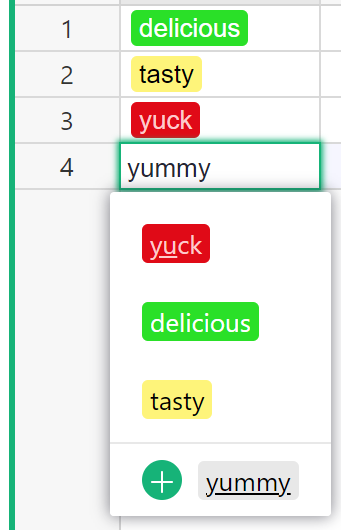*
{: .screenshot-half }

## Colonnes de liste de choix

Ce type est pour stocker plusieurs valeurs d'un ensemble de valeurs valides, où vous pouvez spécifier les valeurs disponibles.

**
{: .screenshot-half }

Si vous commencez avec une colonne de texte peuplée, Grist prendra toutes les valeurs uniques de cette colonne comme choix valides.

Les colonnes de liste de choix sont configurées de la même manière que les colonnes de [Choix](#choice-columns), et prennent en charge le même niveau de personnalisation et de raccourcis clavier. Elles diffèrent par le nombre de choix qu'elles permettent d'entrer dans chaque cellule. Alors que les colonnes de choix ne permettent qu'une seule valeur au maximum dans une cellule, les colonnes de liste de choix en permettent plusieurs.

Comme avec les colonnes de choix, lors de la saisie dans une cellule de colonne de liste de choix, les choix valides seront affichés dans un menu de saisie semi-automatique. Une fois que vous avez sélectionné une valeur, vous pouvez continuer à ajouter des choix à la même cellule.

**
{: .screenshot-half }

Les choix peuvent être réorganisés à l'intérieur de leurs cellules en cliquant et en les faisant glisser pendant que la cellule est en cours d'édition. Vous pouvez également utiliser les touches fléchées et la touche `Supprimer` pour naviguer et supprimer des choix, ou simplement cliquer sur l'icône de suppression lorsque vous survolez un choix.

!!! note "Filtrer les listes déroulantes des colonnes de choix et de liste de choix"
    Lors de la saisie de données dans une colonne de choix ou de liste de choix, vous verrez une liste déroulante de tous les choix disponibles. Parfois, il serait utile de filtrer la liste déroulante en fonction d'une condition, comme la valeur dans une autre cellule. Écrire des conditions pour filtrer les listes déroulantes de choix est similaire à [filtrer les listes déroulantes des colonnes de référence](col-refs.md#filtering-reference-choices-in-dropdown).

## Colonnes de référence

Ceci établit une référence croisée à une autre table. Vous pouvez spécifier la table à référencer, et une colonne au sein de cette table à afficher. Il y a beaucoup de choses que vous pouvez faire avec ce type de colonne, voir [Colonnes de référence](col-refs.md) pour plus de détails.

*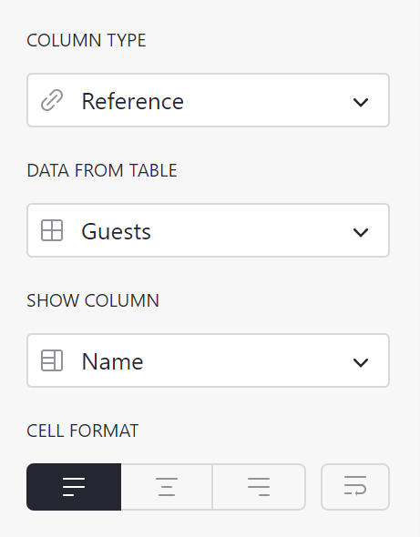*
{: .screenshot-half }

## Colonnes de liste de références

Comme les [Colonnes de référence](#reference-columns), mais peuvent stocker plusieurs références dans une seule cellule. Il y a beaucoup de choses que vous pouvez faire avec ce type de colonne, voir [Colonnes de référence](col-refs.md#creating-a-new-reference-list-column) pour plus de détails.

*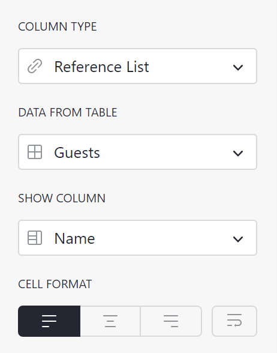*
{: .screenshot-half }

## Colonnes de pièces jointes

Ce type de colonne vous permet d'insérer des fichiers et des images entiers dans des cellules. Lorsque des images sont ajoutées dans des cellules, une miniature d'aperçu est affichée dans la cellule. La barre "Taille" permet de contrôler l'échelle de cette miniature.

**
{: .screenshot-half }

Lorsque vous créez une colonne de pièces jointes, les cellules de cette colonne auront une icône de trombone :

Lorsque vous cliquez sur une icône de trombone, vous pouvez sélectionner un fichier à joindre. Si c'est une image, vous verrez une miniature dans la cellule.

<!-- Source: https://en.wikipedia.org/wiki/File:Red_eyed_tree_frog_edit2.jpg -->

Si vous survolez l'image, vous verrez à nouveau une icône de trombone, que vous pouvez utiliser pour ajouter d'autres fichiers dans la même cellule. Vous verrez également une icône "œil ouvert", qui, lorsqu'elle est cliquée, affiche une vue agrandie de toutes les pièces jointes de la cellule, et vous donne un moyen de les renommer, de les télécharger ou de les supprimer.

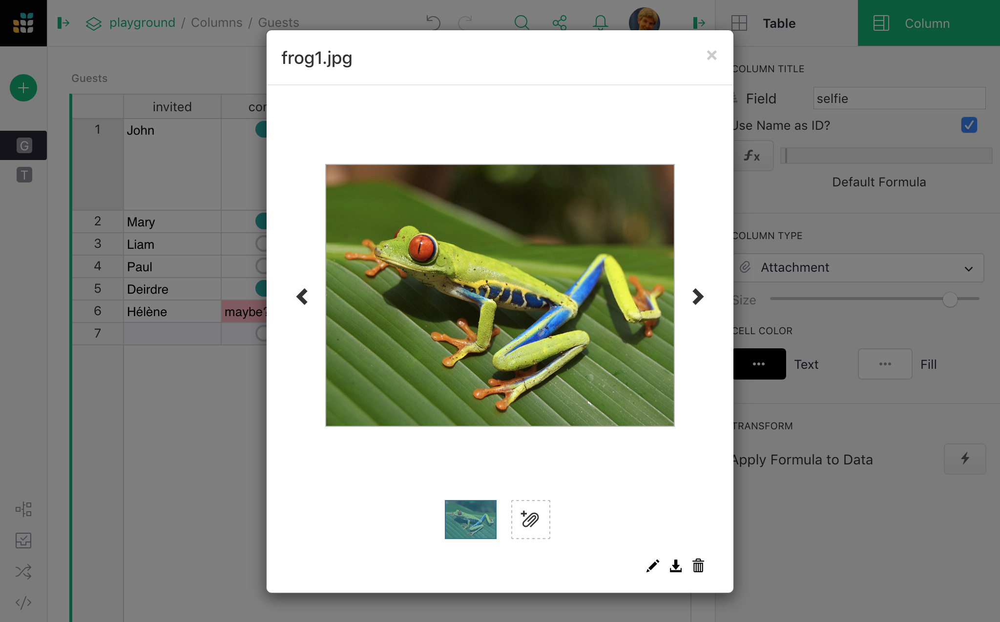