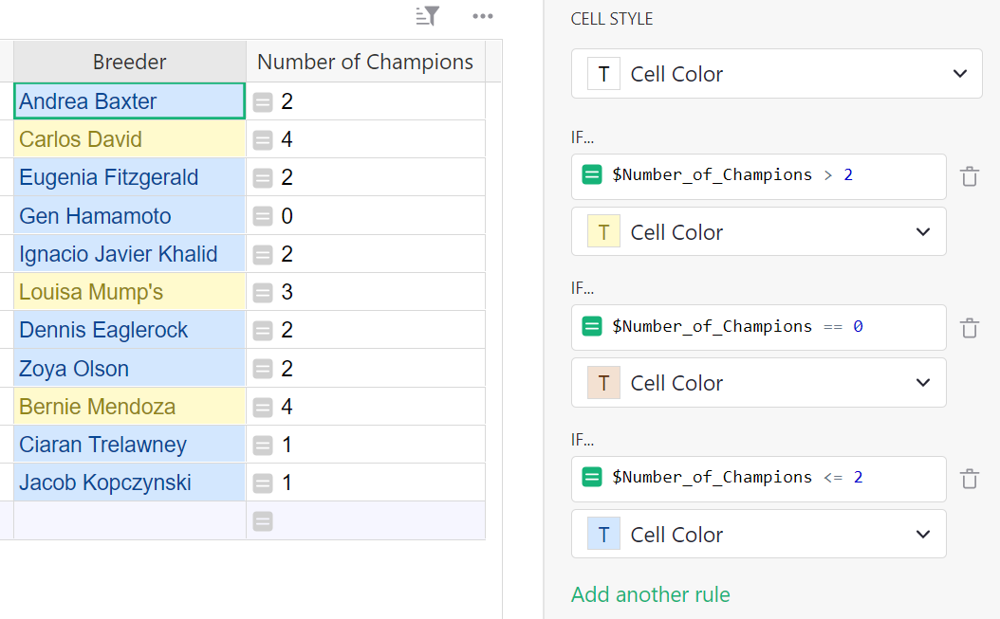

Mise en forme conditionnelle
======================

Le style des cellules peut être modifié en fonction de règles conditionnelles. Les règles conditionnelles sont écrites sous forme de formules. La mise en forme conditionnelle peut s'appliquer à une ligne entière ou aux cellules d'une colonne.

Pour ajouter une mise en forme conditionnelle à une colonne particulière, sélectionnez la colonne, allez dans la section `CELL STYLE` du [creator panel] (glossary.md#creator-panel) sous l'onglet `Column`, et cliquez sur `Add conditional style`.

* *
{ : .screenshot-half}

Dans cet exemple, nous disposons d'une liste d'éleveurs de chiens qui ont élevé des pur-sang champions. Appliquons une mise en forme conditionnelle à la colonne Éleveur en fonction du nombre de chiens champions. Nous souhaitons mettre en évidence en or les éleveurs ayant plus de deux champions.

Ici, la formule conditionnelle est `$Number_of_Champions > 2`{ : .formula}.

Nous aimerions également mettre en évidence les éleveurs ayant 1 ou 2 chiens champions en bleu, et 0 chien champion en marron. Cliquez sur "Ajouter une autre règle" pour ajouter d'autres styles conditionnels.

Pour ajouter un formatage conditionnel aux lignes, allez dans la section `ROW STYLE` du [creator panel] (glossary.md#creator-panel) sous l'onglet `Table > Widget`, et cliquez sur `Add conditional style`.

Ordre des règles
--------------

Notez que Grist applique les règles dans l'ordre. Les styles appliqués par les règles ultérieures remplaceront ceux appliqués par les règles antérieures.

Que se passerait-il si nous intervertissions les deux dernières règles dans l'exemple ci-dessus ?

Remarquez que Gen Hamamoto, qui a 0 chien champion, n'est pas surligné en marron. En effet, après avoir appliqué le deuxième style conditionnel, `$Nombre_de_Champions == 0`{ : .formula}, Grist a appliqué le troisième, `$Nombre_de_Champions <= 2`{ : .formula}, qui s'applique également à Gen Hamamoto et le colore en bleu.
