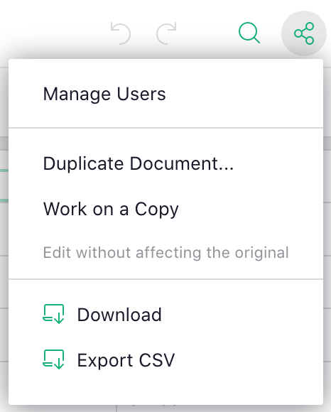

# Copier des Documents

Il est parfois utile de faire une copie, ou un clone, d'un document Grist. Quelques scénarios sont décrits ci-dessous. Dans tous les cas, vous commencerez par le menu "Partager" disponible dans la barre supérieure d'un document ouvert :

**
{: .screenshot-half }

## Essayer des Modifications

À mesure que votre document prend de l'importance, il devient plus risqué de modifier sa structure ou sa logique. C'est une bonne raison de tester ces modifications sur une copie du document, sans craindre d'affecter l'original.

Ouvrez le menu Partager et cliquez sur l'option "Travailler sur une copie".

**
{: .screenshot-half }

Vous obtiendrez une copie non enregistrée de votre document. Cette copie est spéciale car elle sait de quel document original elle provient (vous pouvez voir l'ID du document original inclus dans son URL). Vous pouvez expérimenter sur cette copie, en faisant des modifications grandes ou petites, une ou plusieurs.

Pour ceux qui sont familiers avec le développement logiciel, cette option est similaire à une [branche](https://en.wikipedia.org/wiki/Branching_%28version_control%29){:target="\_blank"} ou un [fork](https://docs.github.com/en/github/getting-started-with-github/fork-a-repo){:target="\_blank"} comme utilisé dans les systèmes de contrôle de version tels que [Git](https://git-scm.com/){:target="\_blank"}.

Lorsque vous travaillez sur une copie, le menu Partager propose de nouvelles options. Par exemple, vous pouvez visualiser les différences entre la copie du document et l'original, en utilisant l'élément de menu "Comparer à l'original" :

**
{: .screenshot-half }

Les nouvelles modifications seront surlignées en vert, et les anciennes en rouge.

Une fois satisfait de vos modifications, cliquez sur l'option "Remplacer l'original". Votre copie remplacera le document original. Grist vous avertira si le remplacement risque d'écraser des modifications récentes dans l'original.

Pour abandonner vos modifications, revenez simplement au document original en utilisant l'option "Retourner à l'original" (ou le bouton Retour de votre navigateur). Ne vous inquiétez pas de nettoyer votre copie. Elle ne compte pas dans les limites de documents et sera automatiquement nettoyée si elle n'a pas été utilisée pendant un certain temps.

Vous pouvez également enregistrer votre copie sous un nouveau nom en utilisant l'option "Enregistrer une copie".

### Accès aux Copies Non Enregistrées

Lorsque vous créez une copie expérimentale comme décrit ci-dessus, elle obtient un lien unique. La copie n'est listée nulle part, donc les autres ne la trouveront pas à moins que vous ne partagiez ce lien.

Toute personne ayant un lien vers votre copie et ayant accès au document original est autorisée à voir la copie, mais vous êtes le seul utilisateur autorisé à la modifier.

Cela signifie que vous pouvez partager un lien vers votre copie avec d'autres, qui peuvent examiner vos modifications.

Cela signifie également que vous pouvez essayer des modifications même si vous ne pouvez pas modifier l'original ! Vous pouvez ensuite partager un lien vers votre copie avec un collaborateur qui a un accès de modification, qui pourra examiner vos modifications et les appliquer au document original.

## Dupliquer des Documents

Vous pouvez enregistrer votre document sous un nouveau nom en utilisant l'option "Dupliquer le document" dans le menu Partager. En cliquant dessus, une boîte de dialogue s'ouvre :

**
{: .screenshot-half }

Tapez le nouveau nom. Si vous avez accès à un ou plusieurs comptes d'équipe, vous pouvez avoir le choix d'une équipe de destination et d'un dossier de destination où enregistrer la copie. Notez que sur un espace d'équipe, vous ne pourrez pas enregistrer le document en dehors de l'espace d'équipe à moins d'avoir un accès de niveau propriétaire au document.

### Copier comme Modèle

Si vous cochez la case "Comme modèle" lors de l'enregistrement d'une copie, vous obtiendrez un document qui a toute la structure, les formules et les mises en page de l'original, mais aucune des données. Cela facilite l'utilisation de la structure existante pour un nouvel ensemble de données.

### Copier à des Fins de Sauvegarde

Vous pouvez utiliser l'option "Dupliquer le document" pour enregistrer la version actuelle du document comme sauvegarde, en ajoutant peut-être la date d'aujourd'hui au nom de la copie. Cela dit, Grist effectue déjà des sauvegardes automatiques régulièrement, ce qui peut être suffisant pour la plupart des besoins de sauvegarde. Voir [Sauvegardes Automatiques](automatic-backups.md).

## Copier des Exemples Publics

Lorsque vous ouvrez un exemple public depuis la [page Exemples & Modèles](https://docs.getgrist.com/p/templates), il ouvrira l'exemple en [mode sandbox](glossary.md#fiddle-mode).

**
{: .screenshot-half }

Le mode sandbox est similaire à travailler sur une copie, comme décrit ci-dessus dans [Essayer des Modifications](#trying-out-changes). Vous pouvez apporter des modifications, mais elles restent privées. Vous pouvez enregistrer une copie de l'exemple sous un nouveau nom en utilisant le bouton ou l'option de menu "Enregistrer une copie".

Vous pouvez utiliser la case à cocher "Comme modèle" pour supprimer les données de l'exemple, en conservant uniquement sa structure. Cela facilite son utilisation pour vos propres données.
