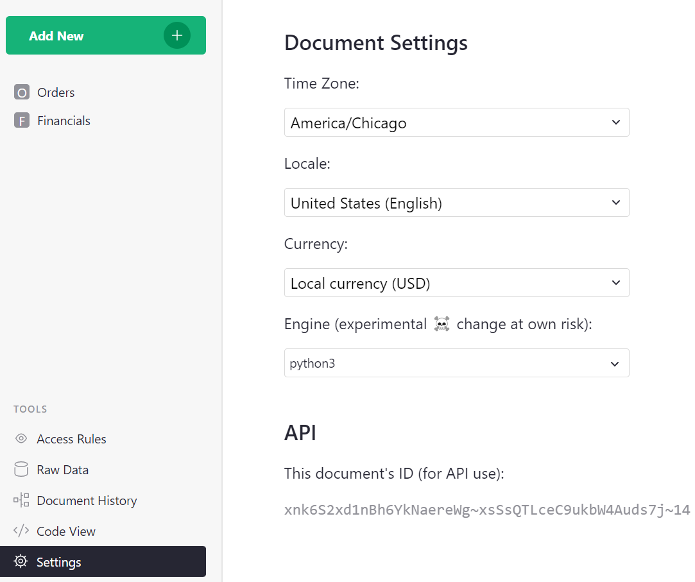

<iframe width="560" height="315" src="https://www.youtube.com/embed/eL0EU_Fv_TI?rel=0" frameborder="0" allow="accelerometer; autoplay; encrypted-media; gyroscope; picture-in-picture" allowFullScreen></iframe>

## Créer un document

Pour commencer avec Grist, vous devez d'abord créer un document.
Chaque document peut stocker différents types de données, alors pensez-y comme à une
collection de données *liées*.

Vous pouvez commencer de zéro ou importer des données existantes. Cliquez sur le bouton "Ajouter Nouveau" sur
l'écran d'accueil et choisissez soit "Créer un document vide" soit "Importer un document".

**
{: .screenshot-half }

Vous pouvez importer des feuilles de calcul au format Excel, ainsi que des fichiers de valeurs séparées par des virgules ou CSV. Si vous importez une feuille de calcul qui comporte plusieurs onglets, chaque onglet
deviendra une table séparée dans Grist.

## Exemples et modèles

La liste "Exemples &amp; Modèles" sur la page d'accueil de Grist comprend un certain nombre de
documents Grist qui démontrent les fonctionnalités et les cas d'utilisation de Grist. Ceux-ci sont toujours
accessibles via un lien en bas à gauche de la page d'accueil.

Pour chaque exemple, il existe un tutoriel correspondant dans le Centre d'aide Grist,
qui décrit comment l'utiliser ou comment créer un tel document
à partir de zéro.

Lorsque vous ouvrez un exemple, vous pouvez y apporter des modifications. Vous éditez une copie, et vos modifications sont
privées. Vous pouvez enregistrer vos modifications en cliquant sur le bouton "Enregistrer une copie" en haut de la
page.

Vous pouvez également utiliser l'un des exemples comme modèle pour un nouveau document, ce qui
inclura la structure, la mise en page et les formules de l'exemple, mais aucune des
données d'exemple. Il suffit d'utiliser le bouton "Enregistrer une copie" et de cocher la case "Comme modèle" dans la
boîte de dialogue qui s'ouvre.

## Importer plus de données

Une fois que vous avez créé un document, vous pouvez y importer plus de données en ouvrant le
document et en sélectionnant "Ajouter Nouveau" puis l'une des options d'importation.

*{: .screenshot4}*
{: .screenshot-half }

Vous pouvez en savoir plus sur l'importation de données à [Importer plus de données](imports.md).

## Paramètres du document

Lorsque le document est ouvert, vous pouvez accéder aux paramètres du document depuis le menu utilisateur ou depuis le menu Outils dans le panneau de navigation de gauche.

*{: .screenshot4}*
{: .screenshot-half }

Là, vous pouvez trouver l'ID du document pour une utilisation API, ainsi que définir le fuseau horaire par défaut, la langue et la devise pour le document.

**
{: .screenshot-half }
