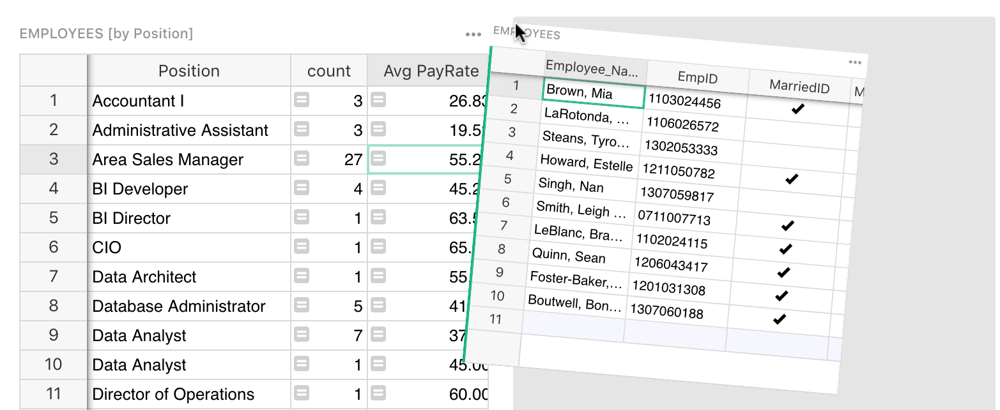
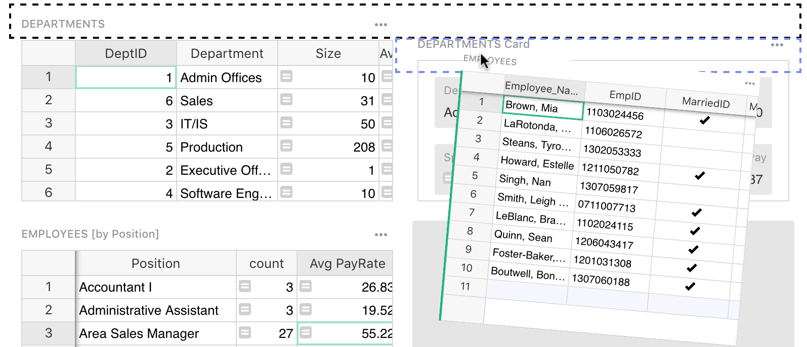
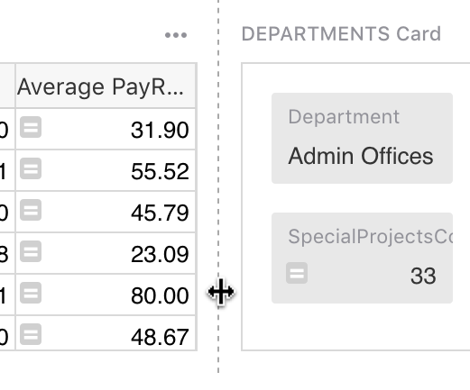
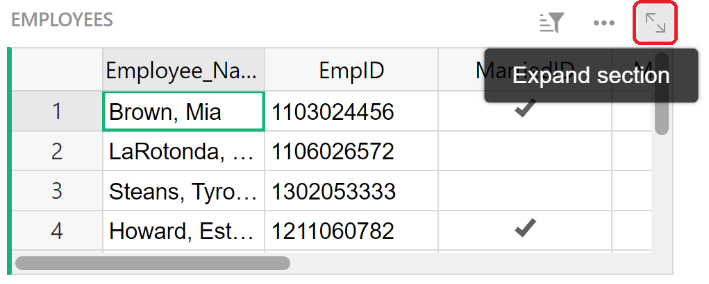
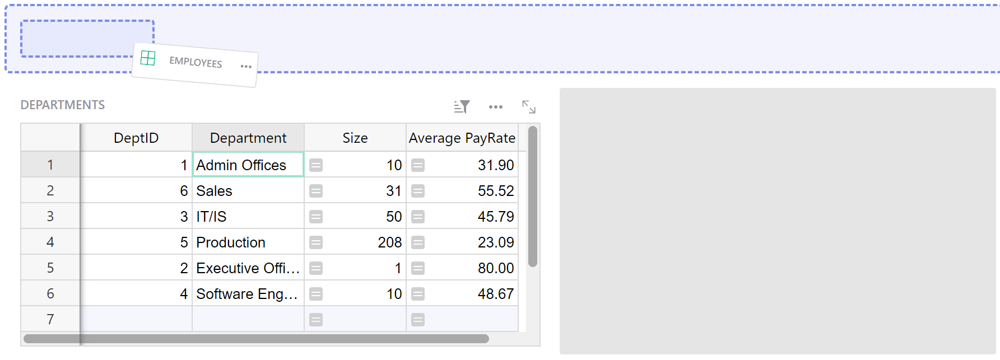
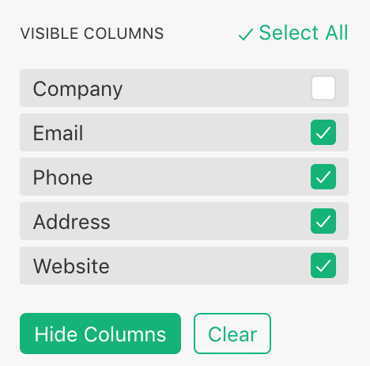
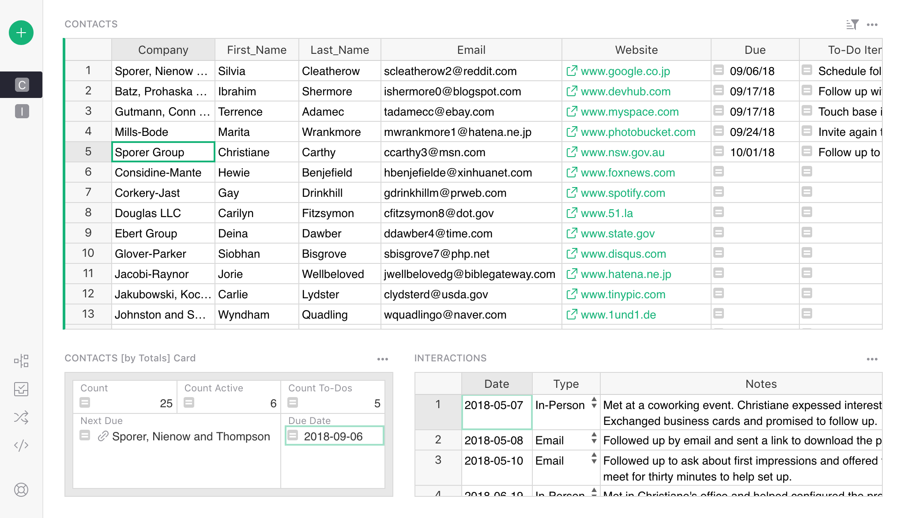
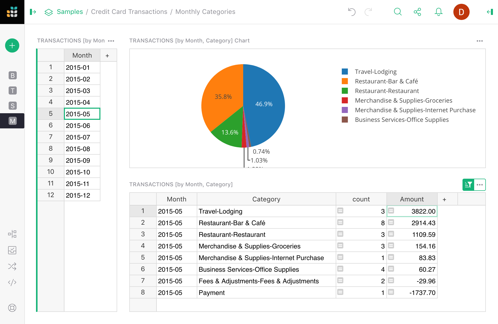

# Dispositions Personnalisées

Vous pouvez facilement ajouter plusieurs vues à une page, comme décrit dans [Vues de page](page-widgets.md), et les lier comme décrit dans [Lier les vues](linking-widgets.md). Il est également facile de personnaliser leur agencement.

Déplacez le curseur de la souris sur le titre de la vue. Une petite icône de glissement apparaîtra à gauche du titre. Lorsque vous appuyez sur cette icône, vous pouvez faire glisser l'ensemble de la vue vers un autre endroit de l'écran.

**
{: .screenshot-half }

Lorsque vous la déplacez près du bord de l'écran ou du bord d'une autre vue, vous verrez un contour en pointillés - parfois plus d'un - où la vue peut être déposée.

**
{: .screenshot-half }

Relâchez la souris pour repositionner cette vue.

Pour redimensionner les vues, déplacez le curseur de la souris entre deux vues jusqu'à ce qu'une ligne en pointillés apparaisse. Faites glisser cette ligne en pointillés pour redimensionner.

**
{: .screenshot-half }

Pour agrandir une vue, cliquez sur l'icône d'agrandissement en haut à droite de la vue. Cela ouvrira une vue en pleine page de la vue.

**
{: .screenshot-half }

Pour réduire une vue, cliquez et faites glisser une vue vers le plateau de vues en haut de la page.

**
{: .screenshot-half }

Lorsque vous cliquez sur une vue réduite, elle s'ouvre en vue pleine page. Pour la restaurer à la page principale, il suffit de faire glisser la vue réduite à l'emplacement souhaité.

## Recommandations de Disposition

Bien qu'il n'y ait pas de limite à la complexité d'une disposition que vous pouvez créer, vous devriez viser des dispositions simples qui seront faciles à utiliser pour vos utilisateurs (même lorsque vous êtes le seul utilisateur !).

Une règle de base est qu'une vue contrôlée par une autre vue "sélecteur" (voir [Lier les vues](linking-widgets.md)) devrait être à droite ou en dessous de celle-ci.

Voici quelques dispositions courantes.

## Disposition : Liste et Détail

La plus courante est d'avoir une liste d'éléments à gauche, avec une ou plusieurs vues à droite fournissant plus d'informations. Par exemple, l'exemple de CRM Léger inclut une liste de personnes à gauche, avec une fiche de personne et une table d'interactions liées à droite de la liste.

Dans cette utilisation, vous pourriez vouloir inclure dans la liste uniquement les informations minimales dont vous avez besoin, peut-être seulement le nom d'un contact. Si votre table a de nombreuses colonnes, un moyen rapide de n'en laisser que quelques-unes est via les options de vue dans le panneau de droite. Dans la vue de table, cliquez sur le menu à trois points en haut à droite et sélectionnez "Options de vue".

**
{: .screenshot-half }

Vous verrez une liste de "Colonnes visibles". Cliquez sur le lien "Sélectionner tout" en haut de cette liste :

**
{: .screenshot-half }

Maintenant, décochez les quelques champs que vous souhaitez conserver et cliquez sur "Masquer les colonnes" pour masquer le reste.

## Disposition : Tableur Plus

Parfois, un large tableur avec de nombreuses colonnes est pratique. Si vous souhaitez voir plus d'informations associées aux lignes de ce tableur, vous pouvez ajouter des vues en dessous. Celles-ci pourraient être des détails liés au tableur, ou des [tables de synthèse](summary-tables.md) qui montrent des totaux ou d'autres informations globales.

Par exemple, voici une disposition possible basée sur l'exemple de CRM Léger. Elle montre les contacts sous forme de large tableur, et en dessous inclut des sections avec un résumé global et des interactions pour le contact sélectionné.

## Disposition : Résumé et Détails

Parfois, il est utile de diviser un grand ensemble de données en sous-ensembles. Par exemple, vous pourriez avoir des transactions par carte de crédit et vouloir un moyen de les visualiser un mois à la fois. Pour ce faire, vous utiliserez une colonne "Mois", en créant une [avec une formule](dates.md) si nécessaire. Ensuite, créez une table de synthèse groupée par "Mois" (voir [Tables de synthèse](summary-tables.md)), et liez la table des transactions à celle-ci.

Nous pouvons alors sélectionner un mois et voir un tableur des seules transactions de ce mois.

## Disposition : Tableau de Bord de Graphiques

Si vous avez de nombreux graphiques, vous pouvez simplement les disposer en grille pour créer un tableau de bord de haut niveau.

Pour les graphiques dynamiques dans lesquels les données sont sélectionnées par une autre table, une disposition comme [Liste et Détail](#layout-list-and-detail) ci-dessus fonctionnerait bien. Un conseil est d'inclure à la fois une vue de Table et une vue de Graphique, configurées et liées de la même manière, et ne différant que par le type de vue :

Avoir une table à côté du graphique peut être une référence utile, ainsi que fournir plus de contexte à ce qui est visible dans le graphique.
