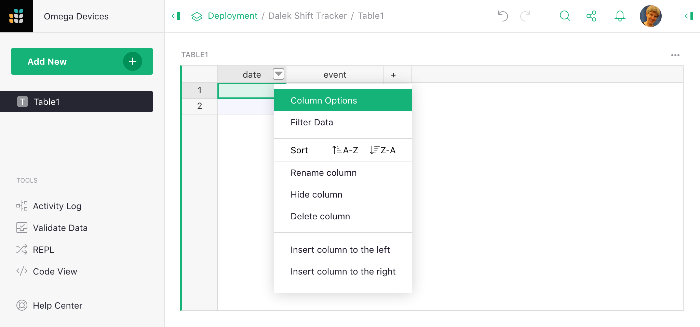
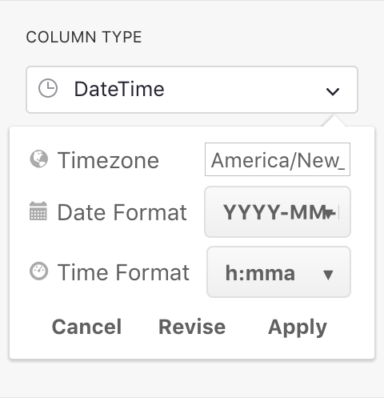
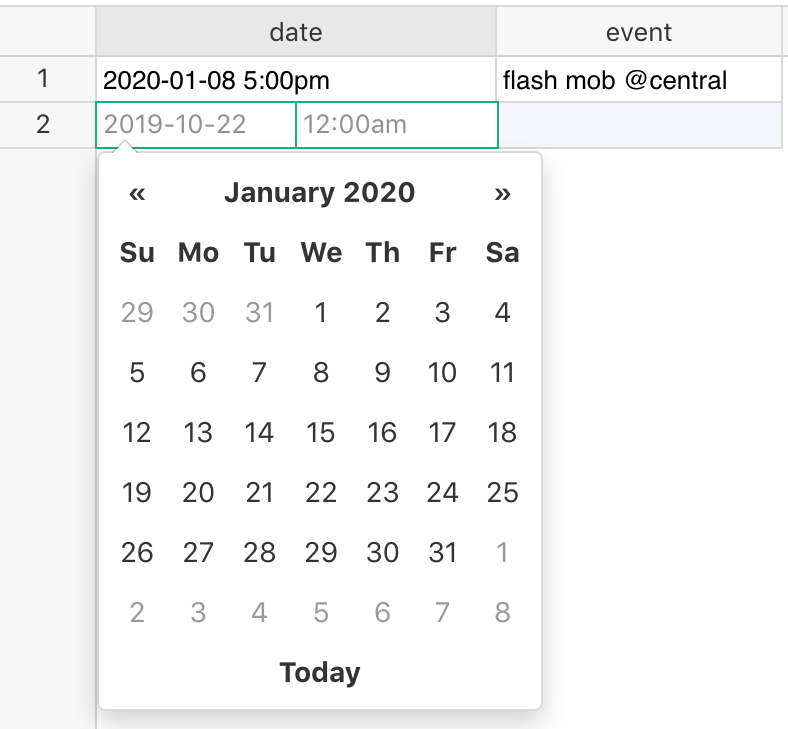

Vue d'ensemble
---------------

Grist exprime les dates et les heures de deux manières. La première est le type de colonne `Date`, qui représente une date de calendrier, sans heure de la journée, et non associée à un fuseau horaire particulier. La seconde est le type de colonne `DateTime`, qui représente une date de calendrier avec une heure de la journée pouvant être liée à un fuseau horaire.
Les types de colonnes `Date` et `DateTime` prennent en charge différentes options de formatage. Lorsqu'une colonne est définie comme `Date` ou `DateTime`, un widget de sélection de date vous permet de choisir la date sur un calendrier lors de l'édition d'une cellule.

Lorsque vous travaillez avec des dates dans des formules, les dates sont des [objets datetime](https://docs.python.org/3/library/datetime.html) Python. Cela vous permet de faire des choses puissantes, mais peut être inattendu si vous n'êtes pas familier avec eux.

## Création d'une colonne date/heure

Pour une introduction générale à la définition du type de colonnes, consultez [Colonnes et types de données](col-types.md).
Pour indiquer à Grist que vous avez l'intention de saisir uniquement des dates/heures dans une colonne, allez dans l'en-tête de la colonne, trouvez le menu déroulant et sélectionnez "Options de colonne".



Ensuite, dans le panneau latéral qui s'ouvre à droite, choisissez "Date" dans le menu déroulant "Type de colonne". Ou, si vous voulez des dates avec des heures, choisissez "DateTime".


Ensuite, vous pouvez choisir votre format de date/heure préféré. Pour le type "DateTime", vous pouvez également choisir le fuseau horaire. Lorsque vous convertissez une colonne d'un autre type, tel que "Texte", vous verrez un aperçu des résultats de la conversion et devrez cliquer sur "Appliquer" pour terminer la conversion. Vous pouvez revenir et modifier les paramètres à tout moment.

**
{: .screenshot-half }

Maintenant, lorsque vous éditez une cellule dans cette colonne, vous aurez de l'aide pour sélectionner les dates et les heures.

**
{: .screenshot-half }

## Insertion de la date actuelle

Vous pouvez insérer la date actuelle dans une cellule en utilisant
<code class="keys">*⌘* + **;** (point-virgule)</code> (Mac) ou <code class="keys">*Ctrl* + **;**</code> (Windows).

Vous pouvez insérer la date et l'heure actuelles en utilisant
<code class="keys">*⌘* + *Shift* + **;**</code> (Mac) ou <code class="keys">*Ctrl* + *Shift* + **;**</code> (Windows).

Lors de l'édition d'une cellule de date, le widget de saisie de date dispose d'un bouton "aujourd'hui" pour la date du jour.

## Analyse des dates à partir de chaînes

La fonction [DATEVALUE](functions.md#datevalue) convertit une chaîne qui représente une date en un objet `datetime`. Elle est simple à utiliser et détectera automatiquement différents formats de date :

**
{: .screenshot-half }

Vous pouvez également utiliser la bibliothèque `datetime` de Python, qui fournit deux fonctions utiles : [strptime() et strftime()](https://docs.python.org/3/library/datetime.html#strftime-strptime-behavior).

Par exemple, disons que vous avez une table de suites de films et leurs dates de sortie (en tant que chaînes). Vous souhaitez analyser la date réelle pour pouvoir trier correctement la table. Voici comment vous feriez cela :


1. La première ligne importe la bibliothèque datetime
2. La deuxième ligne divise la chaîne en deux parties et renvoie la deuxième partie (les tableaux Python sont basés sur zéro).
3. La troisième ligne utilise la fonction [strptime](https://docs.python.org/3/library/datetime.html#datetime.datetime.strptime) de Python pour analyser la date (par exemple, "19 mai 1999") en un objet datetime. Le premier paramètre de la fonction est la chaîne à analyser, le deuxième paramètre est le format de date dans lequel se trouve la chaîne. Consultez les [options de format](https://docs.python.org/3/library/datetime.html#strftime-strptime-behavior) pour voir si la chaîne de format d'exemple `%B %d, %Y` a du sens. (Remarque : Vous auriez également pu utiliser `DATEVALUE(d)` pour obtenir le même résultat.)

Le résultat a une véritable colonne de date et peut maintenant être trié correctement par ordre chronologique, avec "Un nouvel espoir" en haut. Pour des raisons historiques, le premier film Star Wars est considéré comme l'épisode 4.

**
{: .screenshot-half }

Et, parce que le type de colonne est sélectionné comme une date, vous pouvez utiliser le "Format de date" dans "Options de colonne" pour sélectionner le format dans lequel afficher la date.


Pour certaines situations, vous pouvez souhaiter utiliser la bibliothèque python [dateutil](https://dateutil.readthedocs.io/en/latest/parser.html#dateutil.parser.parse). Par exemple, si vous vivez dans une région où les dates commencent généralement par le jour puis le mois, vous pouvez utiliser cette formule :

```py
import dateutil
dateutil.parser.parse($date_text, dayfirst=True)
```

## Calculs de dates

Une fois que vous avez une colonne de date correcte, vous voudrez souvent effectuer des calculs de dates, comme calculer la différence entre deux dates. La manière la plus simple de le faire est d'utiliser la fonction [DATEDIF](functions.md#datedif) qui prend deux dates et l'unité d'information à retourner (Jours, Mois ou Années).

Vous pouvez également utiliser le signe moins pour soustraire deux dates, mais vous pourriez être surpris par le résultat :


Cela se produit parce que la soustraction de deux objets `datetime` comme nous l'avons fait dans l'exemple ci-dessus, donne un objet [datetime.timedelta](https://docs.python.org/3/library/datetime.html#datetime.timedelta) qui représente "Une durée exprimant la différence entre deux instances de date, heure ou datetime à une résolution de microseconde."

Dans Grist (et Python), vous devez être plus précis sur la façon dont vous souhaitez afficher la différence de date. Par exemple, pour obtenir le nombre de jours à partir de l'objet timedelta retourné, utilisez sa propriété `.days` :


Si vous voulez des semaines ou des années, divisez simplement par 7 ou par 365. (Divisez par 7.0 ou 365.0 pour inclure une partie fractionnaire dans le résultat.) Si vous voulez des heures, multipliez par 24.

Vous pouvez également utiliser des fonctions spécifiques pour obtenir ce que vous voulez. Par exemple, `DAYS` est une fonction courante dans les applications de tableur qui renvoie la différence entre deux dates :

```py
DAYS($Last_day, $First_day)
```

!!! note "Formules Excel/Sheets"
    Grist prend en charge de nombreuses autres fonctions courantes d'autres applications de tableur, y compris [`DATEADD`](functions.md#dateadd), [`DATEDIF`](functions.md#datedif), [`DATEVALUE`](functions.md#datevalue), [`MONTH`](functions.md#month), [`HOUR`](functions.md#hour), et [bien d'autres](functions.md#date).

## Obtenir une partie de la date

Vous avez vu comment analyser la date, l'afficher dans différents formats et effectuer des calculs de dates. Mais que faire si vous voulez obtenir plus d'informations sur une date spécifique, comme obtenir son jour de la semaine ?

Une option est d'utiliser la fonction [WEEKDAY](functions.md#weekday), qui se comporte comme dans Excel, renvoyant 1-7 pour dimanche-samedi.


Alternativement, nous pouvons utiliser la fonction [strftime](https://docs.python.org/3/library/datetime.html#strftime-strptime-behavior) :


Une autre option serait de reformater la date en utilisant le format de date dans les options de colonne (voir la [référence de formatage de date](https://momentjs.com/docs/#/displaying/format/)).

## Fuseaux horaires

Les valeurs dans les colonnes `DateTime` représentent des moments dans le temps. Le même moment apparaîtra différemment dans différents fuseaux horaires. Dans Grist, le fuseau horaire est défini sur chaque colonne `DateTime`. Par exemple, si le fuseau horaire est défini sur "America/New\_York", il affichera les valeurs dans le fuseau horaire de New York aux collaborateurs du monde entier.

Un document Grist a un paramètre de fuseau horaire global, qui sert de fuseau horaire par défaut lorsque vous créez une nouvelle colonne de type `DateTime`. Ce fuseau horaire global est défini sur votre fuseau horaire local lorsque vous créez un document pour la première fois. Vous pouvez le voir ou le modifier en cliquant sur votre photo de profil ou icône, et en sélectionnant "Paramètres du document".

Si vous insérez la date et l'heure actuelles en utilisant
<code class="keys">*⌘* + *Shift* + **;**</code> (Mac) ou <code class="keys">*Ctrl* + *Shift* + **;**</code> (Windows)
dans une colonne `DateTime`, elle sera insérée comme un véritable horodatage conscient du fuseau horaire, et affichée avec le fuseau horaire défini pour cette colonne.
Si vous faites de même dans une colonne `Texte`, la date/heure sera insérée comme le texte approprié pour le paramètre de fuseau horaire global du document. De même, insérer la date actuelle dans une colonne `Date` produira la date actuelle selon le fuseau horaire du document.

## Ressources supplémentaires

* [Cheatsheet Python pour strftime](http://strftime.org), à utiliser avec `strftime()` et `strptime()` dans les formules.
* [Cheatsheet de formatage de date](https://momentjs.com/docs/#/displaying/format/), pour spécifier le format date/heure dans les paramètres de colonne.
* [Bibliothèque dateutil](https://dateutil.readthedocs.io/en/latest/index.html), extensions au module standard `datetime` de Python.
