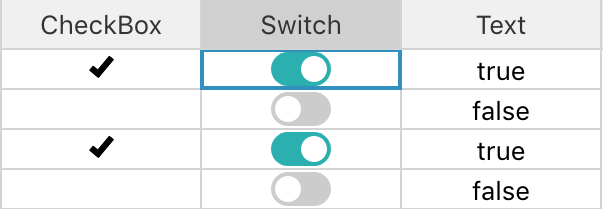
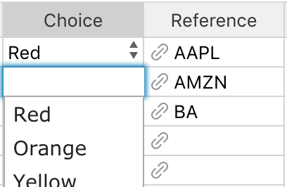

# Saisie de données

Une grille de type tableur est un excellent moyen de visualiser les données. Dans Grist, c'est la vue
offerte par le widget de page par défaut appelé "Table".

Comme dans un tableur, vous pouvez utiliser la souris ou les touches fléchées pour vous déplacer dans les
cellules d'une table. Pour commencer à saisir des données dans une cellule sélectionnée, commencez à taper,
appuyez sur <code class="keys">*Entrée*</code>, ou double-cliquez sur la cellule.

## Édition des cellules

Lors de l'édition d'une cellule, plusieurs touches sont spéciales :

 * <code class="keys">*Échap*</code> annule l'opération et restaure la valeur précédente dans la cellule.
 * <code class="keys">*Tab*</code>, <code class="keys">*Maj* + *Tab*</code>
   enregistre votre entrée et déplace votre curseur vers la cellule suivante ou précédente.
 * <code class="keys">*Entrée*</code> enregistre votre entrée et déplace votre curseur vers la ligne suivante.
 * <code class="keys">*Maj* + *Entrée*</code> ajoute une nouvelle ligne dans votre cellule.

## Copier et coller

Vous pouvez copier des données depuis Grist ou y coller des données. Si l'intervalle collé est
plus long que les enregistrements disponibles, de nouveaux enregistrements seront ajoutés.

Notez que Grist ne crée pas automatiquement de nouvelles colonnes. Si les données collées
ont plus de colonnes que celles affichées par la grille, les colonnes supplémentaires seront omises.

## Widgets de saisie de données

Dans Grist, les colonnes ont des types. En plus de taper des valeurs, de nombreux types de colonnes
offrent des widgets spécialisés pour saisir des données plus facilement.

Voici quelques-uns des plus utiles :

- **Basculer**. Une colonne "Basculer" affiche des valeurs Vrai/Faux et peut les afficher
  sous forme de "Case à cocher" ou de "Commutateur", que vous pouvez sélectionner dans les
  options de la colonne. Vous pouvez basculer une valeur dans une telle cellule en cliquant sur la
  case à cocher ou le commutateur, ou en appuyant sur <code class="keys">*Espace*</code>.

  **
  {: .screenshot-half }

- **Date** et **DateHeure**. Appuyer sur <code class="keys">*Entrée*</code> dans une telle
  cellule ouvrira un calendrier pour choisir une date.

  **
  {: .screenshot-half }

- **Choix** et **Référence**. Taper dans une cellule de l'un de ces types produira un
  menu déroulant de saisie semi-automatique.

  **
  {: .screenshot-half }

## Lien vers les cellules

Vous pouvez créer un lien partageable vers une cellule en appuyant sur <code class="keys">*⌘* *⇧* *A*</code> (Mac)
ou <code class="keys">*Ctrl* + *Maj* + *A*</code> (Windows) lorsque la cellule est sélectionnée.
Cette option est également disponible via le [menu de la ligne](widget-table.md#row-operations) sous "Copier le lien d'ancrage."
Le lien sera placé dans votre presse-papiers, prêt à être collé dans un email ou une application de messagerie instantanée.
Le lien ne s'ouvrira que pour les personnes ayant accès au document.