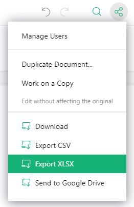

# Exportation

## Exporter une table

Si vous souhaitez exporter une table vers une autre feuille de calcul ou une base de données,
vous pouvez exporter cette table soit en fichier XLSX, soit en CSV, un format d'échange courant pour les données.
Pour ce faire, ouvrez votre document à la table ou à la vue souhaitée. Ensuite, cliquez sur le menu à trois points en haut à droite de la vue. 
Sélectionnez soit "Télécharger en CSV" soit "Télécharger en XLSX".

Votre navigateur téléchargera alors un fichier contenant une ligne d'en-tête
nommant vos colonnes, à l'exclusion de toute colonne masquée ou ligne filtrée, suivie de toutes les
lignes de données visibles dans la table.

## Exporter un document

Si vous souhaitez exporter toutes les tables au format Excel, cliquez sur l'icône de partage
()
en haut à droite de l'écran et sélectionnez "Exporter XLSX".

Votre navigateur téléchargera alors un fichier Excel, où chaque table est une feuille distincte
contenant toutes les lignes, sans aucun filtre appliqué. Pour utiliser cette option, vous devez avoir un accès complet
en lecture pour toutes les tables d'un document.

Une note à propos de "Exporter CSV" dans le menu de partage. Lorsque vous êtes sur une page avec plusieurs vues, "Exporter CSV" n'exportera que les données de la
vue actuellement sélectionnée. Pour exporter toutes vos données, utilisez "Exporter XLSX" ou l'option "Télécharger" qui est expliquée ci-dessous dans [sauvegarder un document entier](exports.md#backing-up-an-entire-document).

## Envoyer vers Google Drive

Si vous souhaitez exporter un document vers Google Drive en tant que fichier Google Sheet, cliquez sur l'icône de partage
()
en haut à droite de l'écran et sélectionnez "Envoyer vers Google Drive".

Grist vous demandera d'abord de vous connecter à votre compte Google (ou d'utiliser un compte auquel vous êtes déjà
connecté) puis d'autoriser la création d'un fichier dans votre Google Drive. Grist pourra
créer de nouveaux fichiers et les gérer, mais ne pourra pas accéder à d'autres fichiers dans votre drive.

Une fois que vous acceptez la demande d'autorisation, Grist exportera votre document en un 
[fichier Excel](exports.md#exporting-a-document) puis le sauvegardera dans votre Google Drive en tant que
fichier Google Sheet. Pour utiliser cette option, vous devez avoir un accès complet en lecture pour toutes les tables d'un document.

## Sauvegarder un document entier

Grist effectue automatiquement des sauvegardes régulières des documents, comme décrit dans [Sauvegardes Automatiques](automatic-backups.md). Vous pouvez également effectuer des sauvegardes manuelles en [enregistrant des copies](copying-docs.md#copying-for-backup-purposes) des documents dans votre compte Grist.

De plus, les documents Grist peuvent être téléchargés dans leur intégralité sous forme de fichier de base de données SQLite
avec une extension `.grist`. SQLite est un format de base de données populaire.
Le fichier téléchargé contiendra toutes vos données tabulaires, tous les fichiers joints dans ces tables, les métadonnées sur vos tables, pages et
vues, ainsi qu'un historique des modifications récentes du document. Il
ne contiendra pas d'informations sur les personnes avec qui le document est partagé.

Pour télécharger un document Grist, cliquez sur l'icône de partage
()
en haut à droite de l'écran, et sélectionnez "Télécharger".

## Restaurer à partir d'une sauvegarde

Un fichier `.grist` téléchargé peut être téléchargé à nouveau pour fournir une copie exacte de l'original. Pour télécharger le fichier, ouvrez l'espace d'équipe ou l'espace personnel où
vous souhaitez le placer, et sélectionnez éventuellement aussi un dossier.
Ensuite, cliquez sur "Ajouter Nouveau" en haut à gauche, et sélectionnez "Importer un document".

Vous pouvez également importer des fichiers CSV et Excel comme nouveaux documents Grist de cette manière.