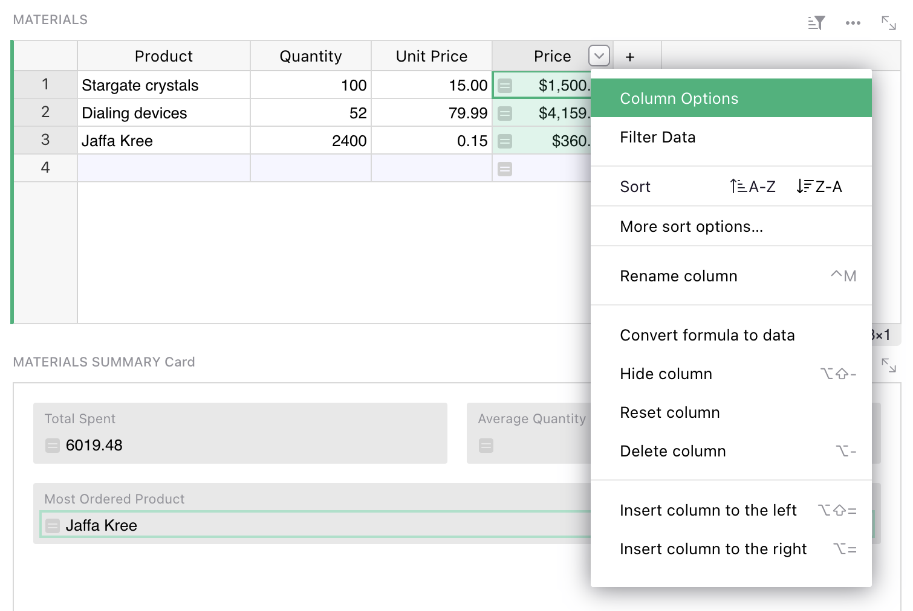
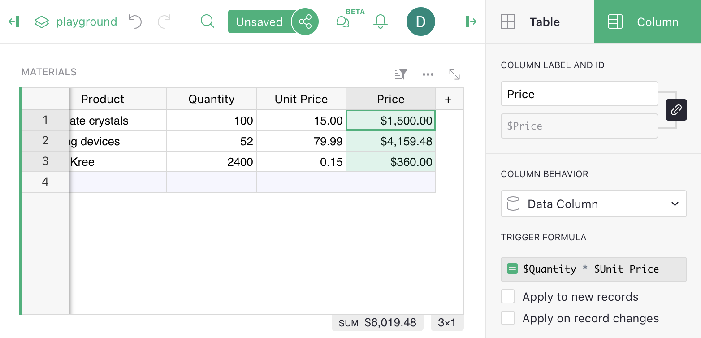
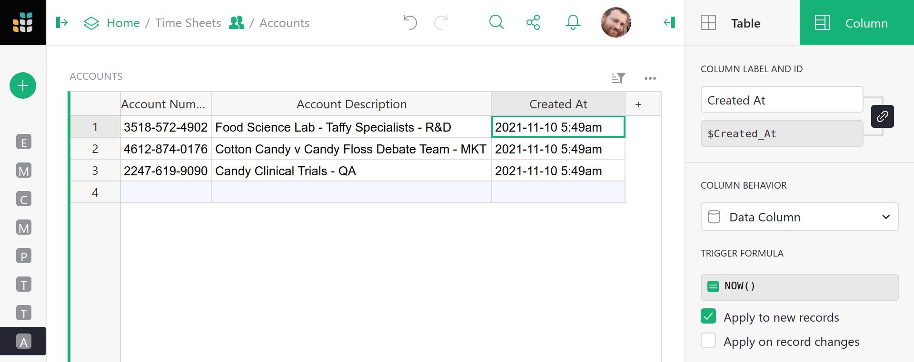
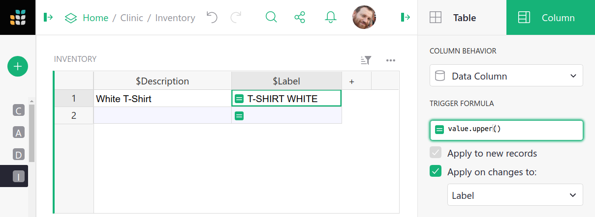
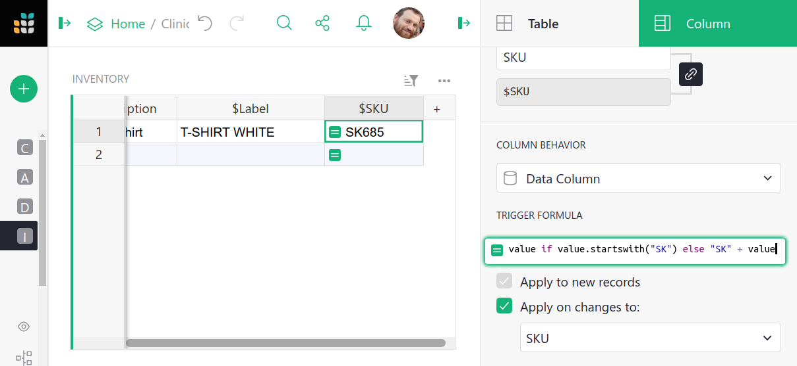
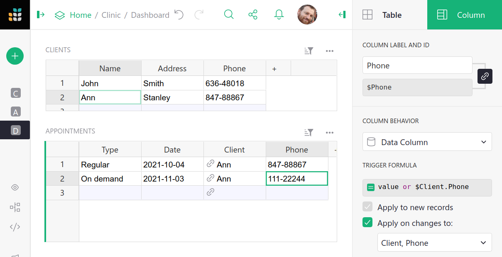

Formules
=========

Grist dispose d'un puissant moteur de données pour calculer les cellules de vos
tables en utilisant des formules. Il dispose même d'un [Assistant de Formule AI](ai-assistant.md) pour aider à rédiger des formules. Si vous avez déjà utilisé des tableurs ou
des expressions de base de données, vous serez dans un territoire familier - mais il y a
quelques subtilités que vous voudrez connaître, alors restez avec nous.

Commençons par un usage classique des tableurs. Supposons que vous ayez
une liste de produits que vous avez commandés, la quantité que vous avez commandée,
et le prix unitaire de chacun. Vous avez créé une colonne pour montrer
la quantité multipliée par le prix unitaire, mais vous voulez que l'ordinateur s'occupe
de cette partie pour vous.

<span class="screenshot-large">**</span>
{: .screenshot-half }

Il vous suffit de sélectionner une cellule dans la colonne que vous souhaitez remplir, et d'appuyer sur la touche <code class="keys">**=**</code> pour
indiquer à Grist que vous souhaitez entrer une formule, plutôt qu'une valeur.

<span class="screenshot-large">**</span>
{: .screenshot-half }

Avez-vous remarqué que, lorsque vous avez fait cela, les étiquettes des colonnes ont légèrement changé ? "Produit" est devenu "$Produit", et "Prix Unitaire"
est devenu "$Prix_Unitaire". C'est Grist qui vous indique comment
vous référer à ces colonnes dans votre formule. Il vous suffit de taper `$Quantité * $Prix_Unitaire`{: .formula }.
Vous trouverez une fonction d'auto-complétion prête à vous aider.
Ou si vous n'aimez pas taper, cliquez sur la colonne Quantité, tapez le
symbole de multiplication, puis cliquez sur la colonne Prix Unitaire.
Votre formule devrait ressembler à ceci :

<span class="screenshot-large">**</span>
{: .screenshot-half }

Pour contrôler l'ID de la colonne, comme "$Prix_Unitaire", qui est utilisé dans les formules, consultez
[Renommer les colonnes](col-types.md#renaming-columns).

Appuyez sur <code class="keys">*Entrée*</code>, et votre formule est appliquée à toutes les cellules de la colonne.

<span class="screenshot-large">**</span>
{: .screenshot-half }

Si vous avez déjà travaillé avec des tableurs, vous serez peut-être surpris
de constater que vous n'avez pas besoin de spécifier les numéros de ligne, comme `B1 * C1`.
Dans Grist, une seule formule s'applique à toute une colonne.
Vous n'avez pas à vous soucier de la remplir pour toutes les lignes,
et vous pouvez vous référer à des valeurs dans la même ligne sans tracas.

Vous pouvez formater les colonnes numériques pour qu'elles aient un meilleur aspect en [définissant le type de colonne](col-types.md#specifying-a-type) sur `Numérique`, et en sélectionnant des options de formatage appropriées :

<span class="screenshot-large">**</span>
{: .screenshot-half }

## Comportement des colonnes

Lorsque nous fournissons une formule pour une colonne, nous disons à Grist de mettre à jour sa valeur à chaque changement
dans un document. Nous ne pouvons plus saisir une valeur dans la cellule, car sa valeur est
déterminée uniquement par la formule.

Une colonne de formule est l'un des trois comportements possibles de colonne, que vous pouvez contrôler en utilisant
la section `COMPORTEMENT DE COLONNE` dans le panneau de création :

- `Colonne de données` maintient des données, que vous pouvez mettre à jour ou effacer manuellement, ou éventuellement
calculer en utilisant [formules d'initialisation](formulas.md#trigger-formulas).
- `Colonne de formule` reflète toujours le résultat du calcul de la formule, et est maintenue
à jour par Grist.
- `Colonne vide` est un état pour une nouvelle colonne. Saisir une valeur dans celle-ci la transformera en une
Colonne de Données, tandis que la saisie d'une formule la transformera en une Colonne de Formule.


En utilisant la section `COMPORTEMENT DE COLONNE`, vous pouvez changer manuellement le comportement de la colonne. Les options les plus
courantes sont disponibles sous forme de boutons d'action verts en bas, et d'autres options sont
disponibles dans le menu de comportement. Selon le comportement actuel de la colonne, celles-ci sont :

- L'action `Définir la formule` convertit une colonne vide en colonne de formule.
- L'action `Définir la formule d'initialisation` ou `Convertir en formule d'initialisation` définit un déclencheur sur une colonne
(plus d'informations sur les déclencheurs dans la prochaine [section Formules d'initialisation](formulas.md#trigger-formulas)).
- L'action `Transformer en colonne de données` convertit une colonne vide en colonne de données régulière.
- `Convertir la colonne en données` convertit une colonne de formule en colonne de données régulière (vous pouvez en lire
davantage sur cette fonctionnalité dans la 
[section Geler une colonne de formule](formulas.md#freeze-a-formula-column)).
- L'action `Effacer et transformer en formule` efface toutes les données d'une colonne et la convertit en une
colonne de formule. (Nous disons "effacer" pour rappeler que les données existantes dans la colonne seront
perdues. Elles seront remplacées par les résultats de calcul de la formule.)
- L'action `Effacer et réinitialiser` efface toutes les données et réinitialise complètement la colonne à son état initial `Colonne Vide`.


## Python

Les formules Grist sont écrites en Python, le langage le plus populaire pour la science des données.
L'intégralité de [la bibliothèque standard de Python](https://docs.python.org/3/library/) est à votre disposition.
Pour ceux qui ont un passé de tableur, nous avons également ajouté une suite de fonctions similaires à Excel,
avec des noms en majuscules. Voici la [liste complète des fonctions](functions.md).
Les documents Grist peuvent utiliser Python 2 ou Python 3, consultez notre [guide Python](python.md)
pour plus de détails.

## Formules qui opèrent sur plusieurs lignes

Si vous êtes un utilisateur de tableur, vous pourriez vouloir avoir
des lignes spéciales à la fin de votre table qui ont des formules
différentes des autres. Dans Grist, nous vous encourageons à envisager d'ajouter un
widget à votre page à la place. Pour des cas d'utilisation courants, les [Tableaux de Résumé](summary-tables.md) peuvent être exactement ce dont vous avez besoin. Ou si vous
voulez tout configurer vous-même, vous pouvez ajouter un widget de tableau supplémentaire comme
celui-ci (voir [Widgets de Page](page-widgets.md) pour plus de détails) :


C'est juste un autre tableau, nous donnant un endroit pour mettre des formules en dehors
de la structure de la table des Matériaux. Par exemple, si nous voulions
compter combien de produits il y a dans ce tableau, nous pourrions utiliser cette
formule :

```py
len(Materials.all)
```

Chaque tableau dans votre document est disponible par son nom dans les formules,
en tant que [UserTable](functions.md#usertable). Cette formule utilise
la méthode [all](functions.md#all) pour accéder aux lignes du tableau, mais
ne fait rien d'autre que de les compter.

Voici une formule pour calculer le prix moyen, en utilisant la fonction similaire à Excel
[MOYENNE](functions.md#average) :

```py
MOYENNE(Materials.all.Prix)
```

La méthode [all](functions.md#all) renvoie un [RecordSet](functions.md#recordset),
qui prend en charge l'itération sur des colonnes individuelles de cette manière. Équivalemment,
nous pourrions utiliser une [compréhension de liste Python](https://docs.python.org/3/tutorial/datastructures.html#list-comprehensions) :

```py
MOYENNE(matériau.Prix pour matériau dans Materials.all)
```

Si vous n'êtes pas familier avec Python, il vaut la peine de suivre
un tutoriel. Il existe des milliers en ligne, y compris ce
[tutoriel officiel](https://docs.python.org/3/tutorial/index.html).
Python vous sera utile pour toutes sortes de travaux de données, pas seulement pour Grist.

La compréhension de liste est utile dès que nous faisons quelque chose de nuancé. Par exemple,
voici une formule pour lister les noms des produits avec une quantité supérieure à 80 :

```py
[m.Produit pour m dans Materials.all si m.Quantité > 80]
```

C'est une compréhension de liste, mais maintenant avec une condition. Le résultat est une liste,
qui est rendue sous forme de texte dans une cellule.

Python peut aider de plusieurs autres manières dans votre recherche de lignes. Par exemple, voici une formule
pour trouver le nom du produit avec la plus grande quantité :

```py
max(Materials.all, key=lambda m: m.Quantité).Produit
```

Les formules sont sensibles à la casse, les fonctions similaires à Excel étant en majuscules (`MAX`), et
le Python régulier étant généralement en minuscules (`max`).

Pour des correspondances exactes, il existe un raccourci pour éviter l'itération appelé
[lookupRecords](functions.md#lookuprecords), ou
[lookupOne](functions.md#lookupone) pour des correspondances uniques.
Il suffit de passer les valeurs des colonnes que vous souhaitez faire correspondre.
Par exemple, voici une formule pour rechercher le nom du produit d'un matériau
avec une quantité de 52 :

```py
Materials.lookupOne(Quantité=52).Produit
```

Pour des tableaux très volumineux, il est sage d'utiliser des recherches autant que possible, plutôt que d'itérer à travers les lignes.

Revenons à notre document exemple, vous pouvez maintenant voir comment nous avons calculé les
colonnes `Total Dépensé`, `Quantité Moyenne`, et `Produit le Plus Commandé` :

Colonne | Formule
--- | ---
Total Dépensé | `SUM(Materials.all.Prix)`
Quantité Moyenne | `MOYENNE(Materials.all.Quantité)`
Produit le Plus Commandé | `max(Materials.all, key=lambda m: m.Quantité).Produit`

Séparer les calculs de cette manière du corps de vos données
peut prendre un certain temps pour s'y habituer, mais travailler de cette façon peut aider
à garder votre document plus organisé. Et cela apporte d'autres avantages.
Par exemple, nous pourrions changer le formatage du widget de résumé
via le panneau latéral :


## Varier la formule par ligne

Faire appliquer une formule à toutes les lignes est pratique et réduit les risques d'erreurs.

Si vous devez faire changer le comportement d'une colonne sur différentes lignes, c'est possible en utilisant une
condition dans la formule. Par exemple, voici un remplacement pour
la formule `Materials.Prix` qui ignore le prix et affiche zéro pour les produits dont le nom se termine
par "(Échantillon)" :

```
if $Produit.endswith("(Échantillon)"):
  return 0
else:
  return $Quantité * $Prix_Unitaire
```

## Visualiseur de code

Une fois que vous avez beaucoup de formules, ou si vous avez été invité à un document
et souhaitez avoir un aperçu de ses formules, il existe un visualiseur de code
disponible avec un résumé Python pur du document.


## Valeurs spéciales disponibles dans les formules

Pour ceux qui connaissent Python, voici les valeurs supplémentaires disponibles pour
vous dans Grist :

 * `rec` est la ligne actuelle. La syntaxe `$column` est une abréviation pour
   `rec.column`. La variable `rec` est de type [Record](functions.md#record).
 * `table` est le tableau actuel, et est de type [UserTable](functions.md#usertable).
 * Les tableaux dans votre document sont disponibles par leur nom, et sont également de
   type [UserTable](functions.md#usertable).
 * De nombreuses fonctions de tableur supplémentaires sont disponibles, consultez la liste complète
   [des fonctions](functions.md).

Si votre tableau ou colonne a un espace dans son nom, ou d'autres caractères
qui sont gênants en Python, ces caractères sont remplacés par un
soulignement. L'auto-complétion peut vous aider si vous n'êtes pas sûr. Vous
pouvez également contrôler les "ids" des colonnes et des tableaux dans le panneau latéral droit.

## Geler une colonne de formule

Si vous souhaitez enregistrer la sortie de votre formule en tant que valeurs simples, vous pouvez simplement changer
le comportement de la colonne de `Colonne de Formule` à `Colonne de Données`. Ouvrez d'abord les options de colonne dans
le panneau latéral :



Cliquez maintenant sur la `Colonne de Formule` et sélectionnez l'option `Convertir la colonne en données`.


Remarquez qu'il n'y a plus de signe ``=`` dans les cellules de la colonne, montrant qu'elle
n'est plus une formule. Les cellules ne changeront plus si d'autres cellules dont elles dépendaient
changent.



La formule d'origine est sauvegardée mais reste inactive. Elle peut redevenir utile
si vous souhaitez convertir la colonne de nouveau en colonne de formule, ou
l'utiliser comme une 
[Formule d'Initialisation](formulas.md#trigger-formulas).

Le panneau latéral a de nombreux autres paramètres pratiques, tels que le formatage des cellules
(nombre de chiffres après la virgule, couleur, etc.). Les options s'appliquent
tout autant aux colonnes de formule qu'aux colonnes régulières.

## Recherches

Les fonctions Grist [lookupOne](functions.md#lookupone) et
[lookupRecords](functions.md#lookuprecords) sont utiles pour énumérer
des sous-ensembles de vos données. Par exemple, supposons que nous ajoutions une colonne `Catégorie`
à notre tableau `Matériaux`, et souhaitions lister tous les produits appartenant
à une catégorie spécifique. Nous pouvons le faire en utilisant `TABLE.lookupRecords`, où `TABLE` est le tableau d'intérêt, et en lui fournissant les valeurs de colonne
à faire correspondre. Par exemple, `Materials.lookupRecords(Catégorie='Navire')`{: .formula}, comme ici :


Si vous suivez, consultez [Ajouter un champ](widget-card.md#adding-a-field)
pour des détails sur la façon d'ajouter un nouveau champ à une carte. Si vous vous souciez de l'ordre
des résultats, `lookupRecords` prend un paramètre optionnel `sort_by`. Par exemple,
nous pourrions utiliser cette formule pour trier par le nom du produit lui-même :

```py
Materials.lookupRecords(Catégorie='Navire', sort_by='Produit').Produit
```

Si vous souhaitez trier par plusieurs colonnes, rappelez-vous que vous pouvez créer une colonne de formule cachée qui combine les données de la manière dont vous le souhaitez, puis trier par celle-ci.

L'ordre des enregistrements renvoyés par `lookupRecords` peut ne pas correspondre à l'ordre des lignes
que vous voyez dans un tableau. Pour obtenir cet ordre, utilisez `sort_by='manualSort'`. Il s'agit d'une
colonne interne qui est mise à jour avec l'ordre de tri établi manuellement
des lignes.

Si vous vous retrouvez à faire beaucoup de recherches, envisagez
si les [Tableaux de Résumé](summary-tables.md) et
[Formules de Résumé](summary-tables.md#summary-formulas) pourraient être
ce que vous recherchez.

## Récursivité

Les recherches sont pratiques pour les formules récursives. Supposons que nous ayons un tableau comptant combien
d'événements nous avons par jour, et que nous souhaitions ajouter une somme cumulative de ces comptes d'événements.
Une façon de le faire est avec une formule comme celle-ci :

```py
hier = Events.lookupOne(date=$date - datetime.timedelta(days=1))
$events + (hier.cumulative or 0)
```


Pour plus de clarté, nous avons divisé cette formule en deux lignes. La première ligne
crée une variable pointant vers la ligne du jour précédent. La seconde
ligne calcule la valeur que nous voulons dans la cellule. Note Python : la valeur
de la dernière ligne est automatiquement renvoyée (vous pourriez la préfixer par
`return` si vous le souhaitez).

Remarquez le `hier.cumulative or 0`. Pour la première ligne du
tableau, il n'y aura pas de hier. Dans ce cas, `lookupOne` renvoie
un enregistrement vide spécial, pour lequel `hier.cumulative` sera
`None`.

Si vous souhaitez simplifier cette formule, ou si vous vous retrouvez à utiliser la
même recherche dans plusieurs formules, il serait judicieux de faire de
`hier` une [colonne de référence](col-refs.md). Ajoutez simplement
une colonne de référence, et donnez-lui une formule qui correspond à la façon
dont nous avons défini `hier` ici.

Pour entrer réellement cette formule dans une cellule, vous utiliseriez
<code class="keys">*Shift* + *Entrée*</code> pour diviser les lignes.

## Formules d'initialisation

Les colonnes de formule sont excellentes pour les valeurs calculées -- celles déterminées par
d'autres données dans le document. Il peut également être utile de stocker des données indépendantes
dans une colonne, mais d'utiliser tout de même une formule pour les calculer dans certaines
situations. C'est exactement ce que les Formules d'Initialisation offrent. C'est une
fonctionnalité très puissante qui vous permet de créer une
[colonne Horodatage](timestamps.md) ou [d'Autorité](authorship.md),
de recalculer vos données en fonction d'un
[ensemble de conditions](examples/2021-07-auto-stamps.md) que vous décidez,
de nettoyer les données lorsqu'une nouvelle valeur est saisie, ou de fournir une valeur par défaut
sensible pour une colonne.

Pour créer une colonne de Formule d'Initialisation, vous devez d'abord ouvrir le panneau de création et
cliquer sur l'action `Définir la formule d'initialisation`. Si vous souhaitez convertir une formule existante, utilisez
l'action `Convertir en formule d'initialisation` disponible dans la section `COMPORTEMENT DE COLONNE`.


Pour contrôler quand la formule est évaluée, utilisez les deux options de case à cocher
ci-dessous :



- `Appliquer aux nouveaux enregistrements` déclenche la formule uniquement lorsqu'un nouvel enregistrement est
créé (une valeur de cellule par défaut).
- `Appliquer lors des changements d'enregistrement` déclenche la formule lorsqu'un enregistrement est mis à jour.

L'application aux nouveaux enregistrements est explicite, la formule sera évaluée
une seule fois lorsque vous ajoutez un nouvel enregistrement. C'est une solution parfaite pour fournir
des valeurs par défaut aux cellules vides. La seconde option vous permet de peaufiner
les conditions et de spécifier quelles colonnes, lorsqu'elles sont mises à jour, déclencheront l'évaluation :


Vous avez probablement remarqué la première option `Champ actuel`. À première vue, vous
vous demandez probablement : "Pourquoi voudrais-je déclencher la colonne sur son propre
changement ?". Cette option vous permet de réagir à une valeur qui est en cours de saisie
dans la colonne, juste avant qu'elle ne soit enregistrée !

Dans l'éditeur de formules, vous avez accès à deux variables qui ne sont pas
disponibles pour les formules régulières :

- `value` qui est la valeur qu'un utilisateur souhaite entrer,
- `user` qui représente un objet utilisateur qui effectue le changement (vous verrez également cela dans la section [Règles d'accès](access-rules.md)).

Cela vous permet de rendre votre application encore plus intelligente, de suivre quand un enregistrement
[a été mis à jour](timestamps.md), ou de voir qui a effectué le dernier [changement à une ligne](authorship.md).
Exemples simples :

1. Assurez-vous que la valeur d'une colonne est toujours écrite en lettres majuscules :
 
Avec la formule d'initialisation de `value.upper()`{: .formula}, la valeur saisie dans
cette colonne sera automatiquement convertie en majuscules.  

2. Formatez une valeur que l'utilisateur entre pour assainir les données avant de les enregistrer :

Avec une formule comme `value if value.startswith("SK") else "SK" + value`{: .formula},
la valeur saisie dans cette colonne sera toujours précédée de "SK".

3. Écrasez une valeur par défaut d'une table référencée :

Vous pouvez utiliser une formule comme `value or $Client.Téléphone`{: .formula}, pour fournir une valeur par défaut
d'une table référencée, mais permettre tout de même à l'utilisateur d'en saisir une nouvelle.

Dans chacun de ces exemples, lorsque l'utilisateur essaie de modifier une cellule, Grist (avant
de mettre à jour l'enregistrement) évaluera la formule et stockera son résultat dans la colonne
au lieu de la valeur fournie par l'utilisateur. 

Pour un exemple détaillé et concret, consultez notre [guide](examples/2021-07-auto-stamps.md)
sur la façon de créer des horodatages et des utilisateurs.

Pour plus d'informations sur les formules et les formules d'initialisation, consultez notre webinaire [Formules d'Initialisation vs. Formules](https://youtu.be/0qVDPZd2w9I).