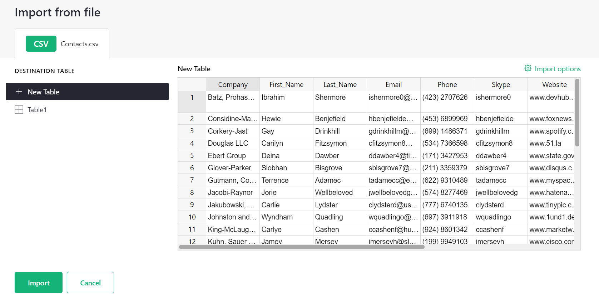
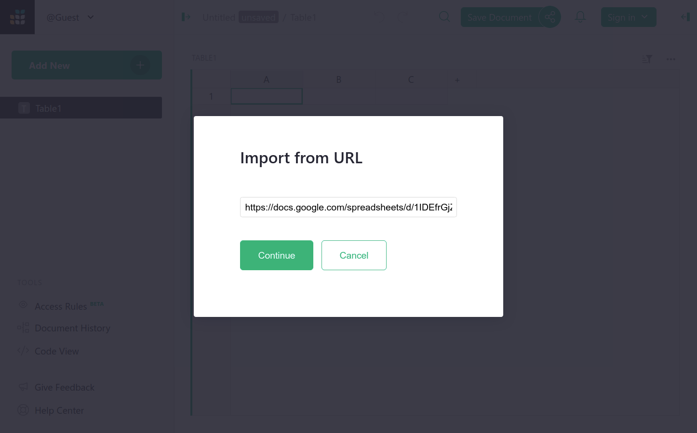
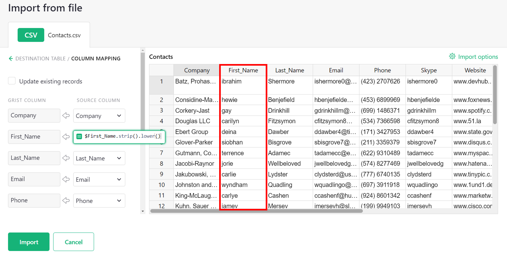
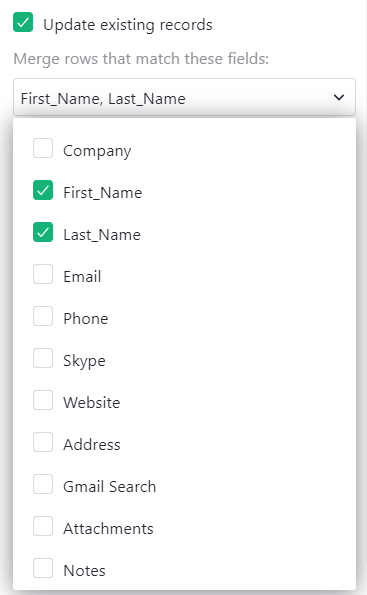

# Importation de données supplémentaires

Vous pouvez importer un fichier pour [créer un nouveau document Grist](creating-doc.md), ou pour
ajouter des données à un document existant. Grist prend en charge les importations de fichiers Excel, CSV, JSON,
de fichiers séparés par des tabulations et de [Google Drive](imports.md#import-from-google-drive).

Pour commencer un nouveau document Grist, cliquez sur le bouton "Add New" sur l'écran d'accueil
et choisissez "Importer un document", comme décrit dans [Démarrer un nouveau document Grist](creating-doc.md).

Pour ajouter un élément à un document existant, ouvrez ce document, cliquez sur le bouton "Ajouter un nouvel élément", puis sur "Importer à partir d'un fichier".
Nouveau", puis "Importer depuis un fichier".  Par défaut, chaque tableau importé
par défaut, chaque tableau importé est ajouté en tant que nouveau tableau Grist.
de prévisualisation d'une importation, vous avez la possibilité de changer la destination en une table Grist existante.
une table Grist existante.

Vous pouvez également importer les mêmes formats à partir d'une URL, en utilisant l'option "Importer à partir d'une URL".

## La boîte de dialogue d'importation

Lorsque vous importez des données dans un document existant, Grist ouvre une boîte de dialogue d'importation pour vous montrer ce qui sera importé.
pour vous montrer ce qui sera importé. Cette boîte de dialogue propose les options d'importation disponibles,
vous permet de choisir entre la création d'un nouveau tableau ou l'ajout à un tableau existant, et
affiche un aperçu des données.

Le lien "Options d'importation" en haut à droite est parfois utile lors de l'importation de fichiers délimités.
fichiers délimités. Grist devine les paramètres pour analyser les données (comme le délimiteur de champ
), mais s'il se trompe, vous pouvez ajuster les paramètres.

## Deviner la structure des données

Dans tous les cas, lorsque vous importez un fichier, Grist fait des suppositions sur la structure du fichier.

Pour les fichiers Excel, Grist traite chaque feuille comme un tableau séparé. Pour les formats CSV et
et autres formats délimités, un fichier devient un tableau. Pour les fichiers Excel et
fichiers délimités, Grist essaie de détecter si les en-têtes sont inclus et
dans quelle ligne ils se trouvent. Si Grist détecte qu'il n'y a pas d'en-têtes, il nommera les colonnes "A", "B" et "C".
colonnes comme "A", "B", "C", etc.

Grist essaie automatiquement d'analyser les nombres, les dates et les champs booléens afin de détecter le type le plus approprié pour chaque colonne.
le type le plus approprié pour chaque colonne. Il s'efforce d'être sans perte : par exemple, s'il
une colonne comme numérique, toute valeur textuelle (telle que "N/A") restera dans la
dans le tableau importé, mais elles seront mises en évidence en raison de la non-concordance des types.

Vous pouvez toujours renommer les tables et les colonnes après une importation, ainsi que convertir les types.

## Importer depuis Google Drive

L'importation à partir d'un Google Drive est aussi simple que l'importation à partir d'un fichier Excel ou d'un fichier
CSV. Vous pouvez soit fournir l'URL d'un fichier stocké dans le lecteur Google, soit utiliser le sélecteur de fichiers Google pour choisir un fichier sur votre propre lecteur.
utiliser le sélecteur de fichiers Google pour choisir un fichier sur votre propre disque.

Pour utiliser un sélecteur, cliquez sur le bouton "Ajouter nouveau" et choisissez "Importer depuis Google
Drive".

Pour importer, connectez-vous à votre compte Google en cliquant sur le bouton "Connexion" et en suivant la procédure de connexion.
en suivant la procédure de connexion. Grist vous demandera l'autorisation de lire le fichier que vous allez importer de Google Drive.
que vous allez importer depuis Google Drive. Nous ne lirons pas d'autres fichiers sur votre
uniquement le fichier que vous avez choisi d'importer.

Une fois le fichier choisi, le reste du processus est identique à l'importation à partir d'un fichier Excel.
à partir d'un fichier Excel. Dans la [boîte de dialogue d'importation](imports.md#the-import-dialog)
vous pouvez configurer les données à importer et le tableau de destination auquel les ajouter.

Si vous disposez de l'URL d'un fichier ou d'une feuille de calcul stockée sur votre Google Drive ou d'un fichier qui est
accessible au public, vous pouvez l'importer directement à l'aide de l'option "Importer à partir d'une URL" du menu "Ajouter un nouveau".
dans le menu "Ajouter nouveau".

Si le fichier n'est pas partagé publiquement, Grist vous demandera l'autorisation de lire les fichiers de votre Google Drive.
de lire les fichiers de votre Google Drive. Si vous ne souhaitez pas autoriser Grist à lire vos fichiers,
Grist ouvrira le sélecteur de fichiers Google, dans lequel vous pourrez sélectionner le fichier que vous souhaitez importer.

## Importer dans une table existante

Par défaut, Grist importe les nouvelles données dans de nouvelles tables, mais la boîte de dialogue Importation vous permet de modifier la destination et d'importer les données dans une table existante.
de modifier la destination et d'importer des données dans une table existante.

Lors de l'importation dans une table existante, Grist tentera de faire correspondre les colonnes de votre fichier importé aux colonnes de la table de destination.
de votre fichier importé aux colonnes de la table de destination. Pour spécifier manuellement
Pour spécifier manuellement la correspondance des colonnes, cliquez sur le menu déroulant "Colonne source" pour ouvrir un menu avec une liste de colonnes inutilisées de votre fichier importé.
colonnes inutilisées de votre fichier importé. Cliquez sur le nom d'une colonne pour la faire correspondre
à une colonne de destination, ou sélectionnez "Ignorer" pour ne pas importer les données de cette colonne.

Vous pouvez également spécifier une formule pour chaque colonne importée en cliquant sur "Appliquer une formule" dans le menu déroulant "Colonne source".
dans le menu déroulant "Colonne source". Les formules peuvent faire référence à une ou plusieurs colonnes importées, et le résultat de l'évaluation de la formule sera affiché dans l'aperçu après la fermeture de l'éditeur.
sera affiché dans l'aperçu après la fermeture de l'éditeur.

L'importation dans une table existante convient mieux à l'importation de plusieurs ensembles de données
contenant une structure similaire. Par exemple, vous pouvez importer un relevé bancaire dans une nouvelle table, puis importer d'autres relevés d'autres mois dans la même table.
nouveau tableau, puis importer d'autres relevés d'autres mois dans le même tableau.

Pour les développeurs, l'[API Grist](rest-api.md) offre un moyen plus puissant d'ajouter des données à un document Grist.
à un document Grist.

## Mise à jour des enregistrements existants

Supposons que la table que nous importons contienne déjà une partie des données de notre fichier.
dans notre fichier. Nous aimerions que Grist mette à jour ces enregistrements existants plutôt que de les dupliquer.
les dupliquer.

Nous pouvons demander à Grist de mettre à jour ces enregistrements en cochant l'option "Mettre à jour les enregistrements existants"
et en spécifiant les champs à utiliser pour comparer les données entrantes aux enregistrements existants.
les enregistrements existants.

{: .screenshot-half }

Une ligne importée et un enregistrement existant qui ont les mêmes valeurs pour tous les champs de fusion sélectionnés sont considérés comme le même enregistrement.
champs de fusion sélectionnés sont considérés comme le même enregistrement. Dans ce cas, l'importation
mettra à jour les champs de l'enregistrement avec les données importées. Les valeurs vides
Les valeurs vides des données importées seront ignorées, laissant les champs correspondants de l'enregistrement d'origine inchangés.
l'enregistrement d'origine.

! !! tip ""
    **Note:** S'il y a plusieurs lignes importées qui ont les mêmes valeurs pour les champs de fusion sélectionnés, la dernière ligne sera utilisée pour la correspondance et la mise à jour.
              champs de fusion sélectionnés, la dernière ligne sera utilisée pour la correspondance et la mise à jour.
              Si plusieurs enregistrements existants ont les mêmes valeurs pour les champs de fusion sélectionnés, seule la première ligne sera utilisée pour la correspondance et la mise à jour.
              champs de fusion sélectionnés, seul le premier enregistrement sera mis à jour si une ligne importée correspondante est trouvée.
              ligne importée correspondante est trouvée.

Chaque fois que les champs de fusion sont modifiés, Grist génère un aperçu des mises à jour qui seront apportées à la table de destination et les affiche dans la table de prévisualisation.
seront apportées à la table de destination et les affichera dans la table de prévisualisation.

Les changements sont mis en évidence comme suit :

 - Les nouveaux enregistrements ont tous leurs champs surlignés en vert.
 - Les enregistrements mis à jour sont surlignés en rouge et en vert pour tous les champs modifiés : en rouge (avec un
   rouge (barré) pour les valeurs existantes de la destination, et vert pour les nouvelles
   les nouvelles valeurs du fichier importé.
 - Les enregistrements inchangés ne sont pas mis en évidence. Les valeurs des rubriques qui existent dans la table de destination,
   mais qui sont vides dans le fichier importé, sont distinguées par une couleur de police gris clair.
