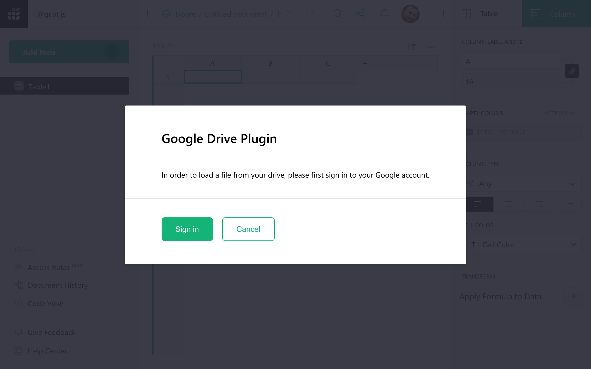
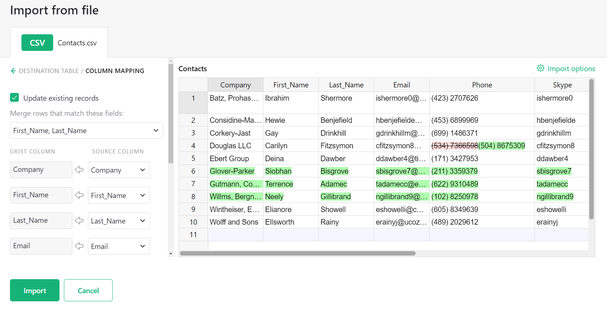

# Importer plus de données

Vous pouvez importer un fichier pour [créer un nouveau document Grist](creating-doc.md) ou pour ajouter des données à un document existant. Grist prend en charge les importations de fichiers Excel, CSV, JSON, tabulés et depuis [Google Drive](imports.md#import-from-google-drive).

Pour créer un nouveau document Grist, cliquez sur le bouton "Ajouter Nouveau" sur l'écran d'accueil et choisissez "Importer un document", comme décrit dans [créer un nouveau document Grist](creating-doc.md).

Pour ajouter à un document existant, ouvrez ce document, cliquez sur le bouton "Ajouter Nouveau" puis sur "Importer depuis un fichier". Par défaut, chaque table importée est ajoutée comme une nouvelle table Grist, mais en examinant la boîte de dialogue de prévisualisation pour une importation, vous avez la possibilité de changer la destination vers une table Grist existante.

Vous pouvez également importer n'importe lequel des mêmes formats depuis une URL, en utilisant l'option "Importer depuis une URL".

## La boîte de dialogue d'importation

Lorsque vous importez des données dans un document existant, Grist ouvre une boîte de dialogue d'importation pour vous montrer ce qui sera importé. Cette boîte de dialogue offre des options d'importation disponibles, vous permet de choisir de créer une nouvelle table ou d'ajouter à une table existante, et affiche un aperçu des données.

Le lien "Options d'importation" en haut à droite est parfois utile lors de l'importation de fichiers délimités. Grist devine les paramètres pour analyser les données (comme le délimiteur de champ), mais si cela devine incorrectement, vous pouvez ajuster les paramètres.

## Deviner la structure des données

Dans tous les cas, lorsque vous importez un fichier, Grist fait des suppositions sur la structure du fichier.

Pour les fichiers Excel, Grist traite chaque feuille comme une table séparée. Pour les fichiers CSV et autres formats délimités, un fichier devient une table. Pour les fichiers Excel et délimités, Grist essaie de détecter si les en-têtes sont inclus et à quelle ligne ils se trouvent. Si Grist détecte qu'il n'y a pas d'en-têtes, il nommera les colonnes comme "A", "B", "C", etc.

Grist essaie automatiquement de parser les nombres, les dates et les champs booléens pour détecter le type le plus approprié pour chaque colonne. Il essaie d'être sans perte : par exemple, s'il marque une colonne comme numérique, toutes les valeurs textuelles qu'elle contient (comme "N/A") resteront dans la table importée, mais seront mises en évidence en raison de l'incompatibilité de type.

Vous pouvez toujours renommer les tables et les colonnes après une importation, ainsi que convertir les types.

## Importer depuis Google Drive

Importer depuis Google Drive est aussi simple que d'importer depuis un fichier Excel ou un fichier CSV. Vous pouvez soit fournir une URL d'un fichier stocké dans Google Drive, soit utiliser un sélecteur de fichiers Google pour choisir un fichier de votre propre drive.

Pour utiliser un sélecteur, cliquez sur le bouton "Ajouter Nouveau" et choisissez "Importer depuis Google Drive".

Pour importer, connectez-vous à votre compte Google en cliquant sur le bouton "Se connecter" et en suivant le processus de connexion. Grist vous demandera l'autorisation de lire le fichier que vous importerez depuis Google Drive. Nous ne lirons aucun autre fichier sur votre drive — juste le fichier unique que vous choisissez d'importer.

Une fois le fichier choisi, le reste du processus est le même que pour importer depuis un fichier Excel. Dans la [boîte de dialogue d'importation](imports.md#the-import-dialog), vous pouvez configurer quelles données importer et dans quelle table de destination les ajouter.

Si vous avez une URL vers un fichier ou une feuille de calcul stockée sur votre Google Drive ou un fichier accessible publiquement, vous pouvez l'importer directement en utilisant l'option "Importer depuis une URL" du menu "Ajouter Nouveau".

Si le fichier n'est pas partagé publiquement, Grist vous demandera l'autorisation de lire les fichiers de votre Google Drive. Si vous ne souhaitez pas autoriser Grist à lire vos fichiers, il ouvrira le sélecteur de fichiers Google où vous pourrez sélectionner le fichier que vous souhaitez importer.

## Importer dans une table existante

Par défaut, Grist importe de nouvelles données en tant que nouvelles tables, mais la boîte de dialogue d'importation vous permet de changer la destination et d'importer des données dans une table existante.

Lors de l'importation dans une table existante, Grist tentera de faire correspondre les colonnes de votre fichier importé aux colonnes de la table de destination. Pour spécifier manuellement la correspondance des colonnes, cliquez sur le menu déroulant 'Colonne source' pour ouvrir un menu avec une liste de colonnes inutilisées de votre fichier importé. Cliquez sur un nom de colonne pour le faire correspondre à une colonne de destination, ou sélectionnez 'Ignorer' pour ignorer l'importation des données de cette colonne.

Vous pouvez également spécifier une formule pour chaque colonne importée en cliquant sur 'Appliquer une formule' dans le menu déroulant 'Colonne source'. Les formules peuvent référencer une ou plusieurs colonnes importées, et le résultat de l'évaluation de la formule sera affiché dans l'aperçu après la fermeture de l'éditeur.

L'importation dans une table existante est mieux adaptée pour importer plusieurs ensembles de données contenant une structure similaire. Par exemple, vous pourriez importer un relevé bancaire en tant que nouvelle table, puis importer d'autres relevés d'autres mois dans la même table.

Pour les développeurs, l'[API Grist](rest-api.md) offre un moyen plus puissant d'ajouter des données à un document Grist.

## Mise à jour des enregistrements existants

Supposons que la table dans laquelle nous importons contient déjà certaines des données de notre fichier. Nous aimerions que Grist mette à jour ces enregistrements existants plutôt que de les dupliquer.

Nous pouvons dire à Grist de mettre à jour ces enregistrements en cochant l'option "Mettre à jour les enregistrements existants" et en spécifiant quels champs utiliser pour faire correspondre les données entrantes avec les enregistrements existants.

{: .screenshot-half }

Une ligne importée et un enregistrement existant qui ont les mêmes valeurs pour tous les champs de fusion sélectionnés sont considérés comme le même enregistrement. Dans ce cas, l'importation mettra à jour les champs de l'enregistrement avec les données importées. Les valeurs vides des données importées seront ignorées, laissant les champs correspondants dans l'enregistrement original inchangés.

!!! tip ""
    **Remarque :** Si plusieurs lignes importées ont les mêmes valeurs pour les champs de fusion sélectionnés, la dernière ligne sera utilisée pour la correspondance et la mise à jour. Si plusieurs enregistrements existants ont les mêmes valeurs pour les champs de fusion sélectionnés, seul le premier enregistrement sera mis à jour si une ligne importée correspondante est trouvée.

Chaque fois que les champs de fusion sont modifiés, Grist générera un aperçu des mises à jour qui seront apportées à la table de destination et les affichera dans la table d'aperçu.

Les modifications sont mises en évidence comme suit :

 - Les nouveaux enregistrements ont tous leurs champs mis en évidence en vert.
 - Les enregistrements mis à jour ont une mise en évidence rouge et verte pour tous les champs modifiés : rouge (avec une barre oblique) pour les valeurs existantes de la destination, et vert pour les nouvelles valeurs du fichier importé.
 - Les enregistrements inchangés n'ont pas de mise en évidence. Les valeurs des champs qui existent dans la table de destination, mais sont vides dans le fichier importé, sont distinguées par une couleur de police gris clair.
