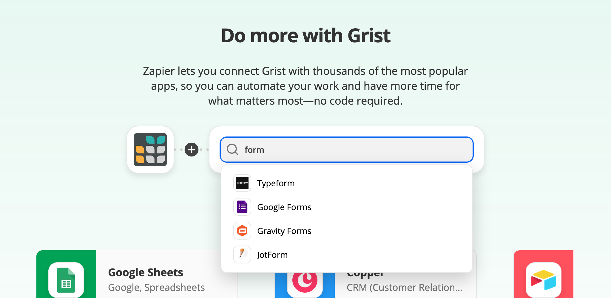
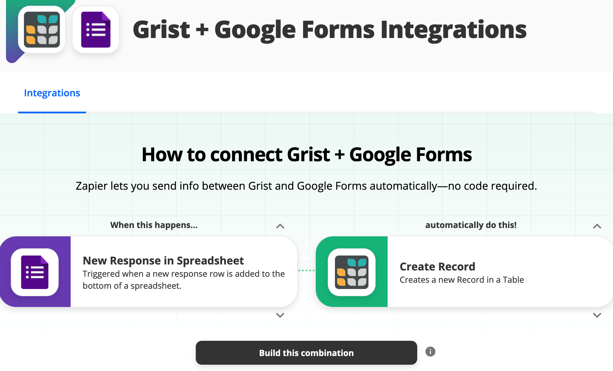
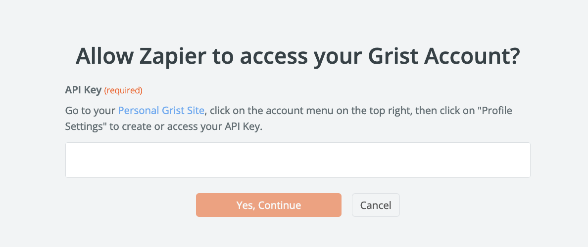
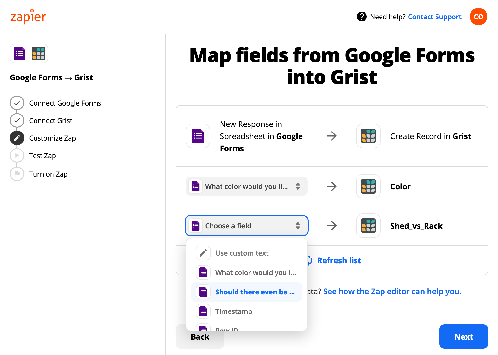
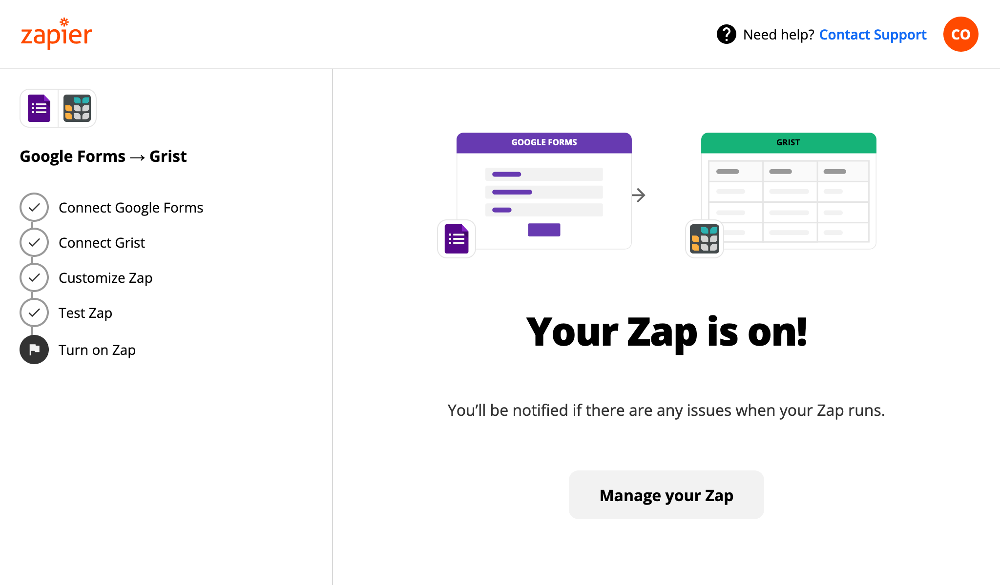
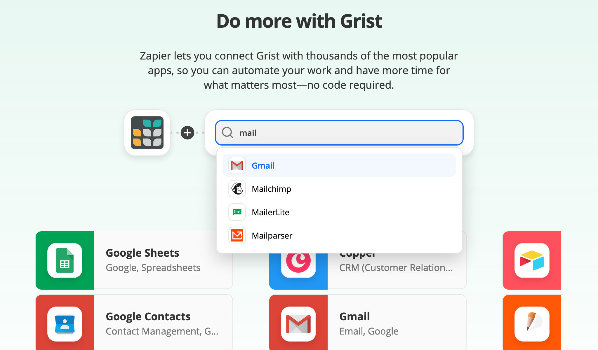
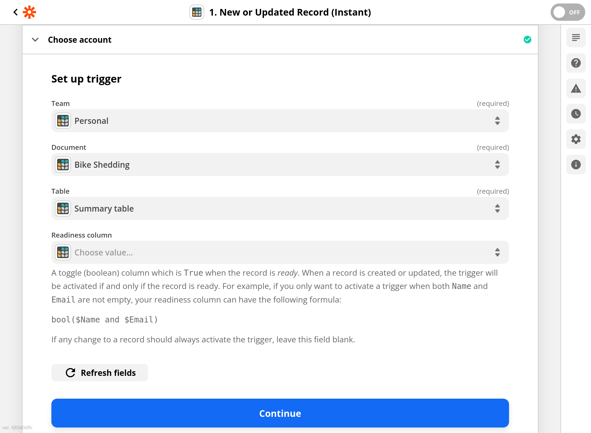
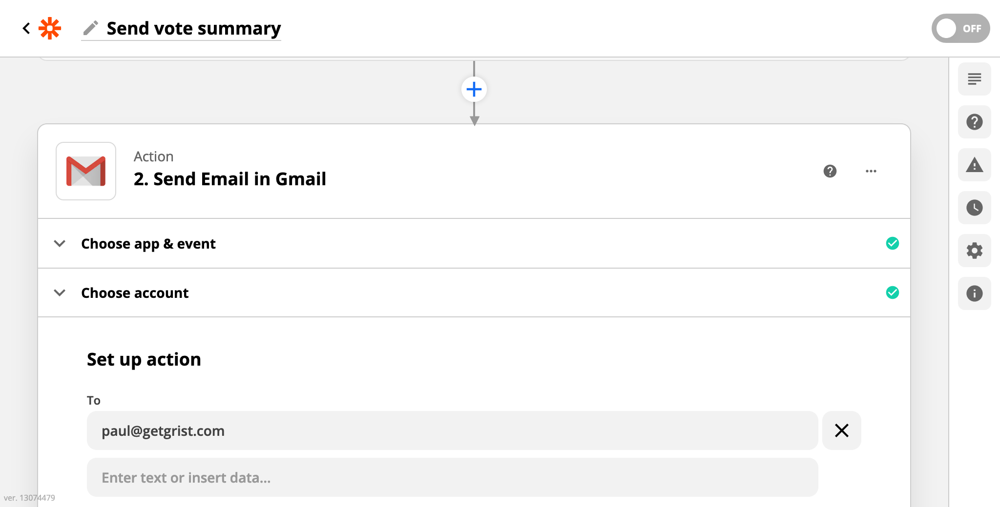
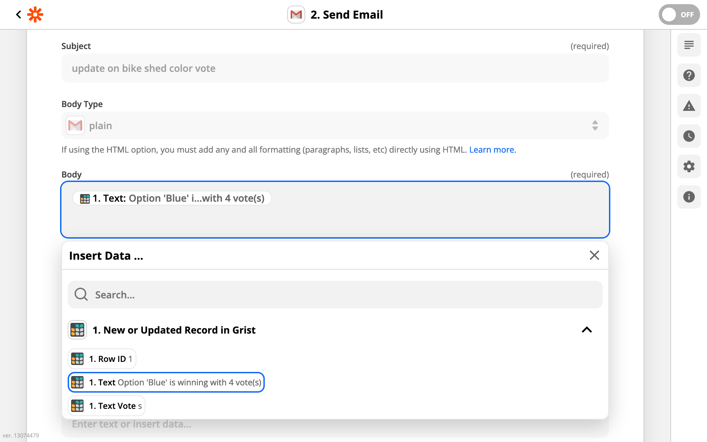
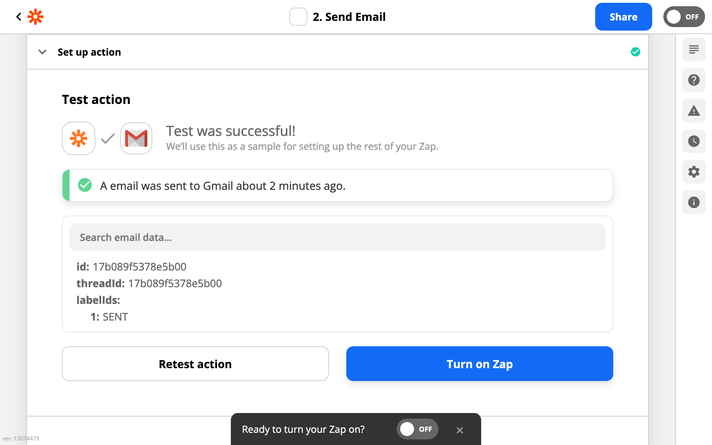

# Services d'Intégration

Grist peut être connecté à des milliers d'autres services via des intégrateurs avec le support de Grist. Ceux-ci incluent :

- [Zapier](https://zapier.com/apps/grist/integrations)
- [Integrately](https://integrately.com/integrations/grist)
- [Pabbly Connect](https://www.pabbly.com/connect/integrations/grist/)
- [KonnectzIT](https://plan.konnectzit.com/feedback/grist-integration)
- [n8n](https://n8n.io/integrations/n8n-nodes-base.grist)
- [Make](https://www.make.com/en/integrations/grist?utm_source=grist-app&utm_medium=partner&utm_campaign=grist-app-partner-program)

## Configuration des Intégrateurs

Chaque intégrateur fournit sa propre méthode pour configurer la connexion entre Grist et d'autres services.

[Pabbly Connect](https://www.pabbly.com/connect/integrations/grist/) a créé quelques vidéos expliquant comment configurer une intégration avec Grist en utilisant Pabbly Connect.
[Pabbly Connect Youtube - Playlist Grist](https://www.youtube.com/channel/UCVA5GKy8qpDxQR5xSt_zcJg/search?query=grist)

Ci-dessous est inclus un guide d'exemple sur la façon dont une intégration avec Grist peut être configurée en utilisant
[Zapier](https://zapier.com/apps/grist/integrations).

Grist peut déclencher un flux de travail chaque fois qu'il y a un nouvel enregistrement ou une mise à jour dans une table, entraînant une action dans un autre service. Inversement, les flux de travail déclenchés par d'autres services peuvent consulter, ajouter ou mettre à jour des enregistrements dans les tables Grist.

## Exemple : Stockage des soumissions de formulaires

Supposons que nous ayons un formulaire pour collecter des votes sur la couleur d'un nouveau hangar à vélos proposé :


Le formulaire est configuré en utilisant Google Forms (pour cet exemple), et nous voulons que les réponses soient stockées dans un document Grist :


Une façon de réaliser cela est avec [Zapier](https://zapier.com/apps/grist/integrations).
Connectons-nous donc sur le site de Zapier, puis visitons la 
[page d'intégration Grist](https://zapier.com/apps/grist/integrations) :


Nous aimerions associer Grist avec Google Forms. Zapier prend en charge plusieurs fournisseurs de formulaires, et le processus global d'intégration est similaire pour tous.
Il suffit de taper le fournisseur que vous souhaitez. Pour ce tutoriel, nous choisissons Google Forms.



Une fois que nous avons choisi le fournisseur à intégrer, nous devons préciser exactement ce que nous voulons qu'il fasse, parmi les "déclencheurs" et "actions" disponibles.
Dans ce cas, nous choisissons que lorsqu'il y a un déclencheur `Nouvelle Réponse dans la Feuille de Calcul` pour Google Forms, nous effectuerons l'action `Créer un Enregistrement` dans Grist.
Nous cliquons sur le bouton de construction pour commencer à remplir les détails :



Étant donné que l'événement déclencheur pour l'intégration se produira dans Google Forms, nous
sommes d'abord invités à donner à Zapier certains droits d'accès à vos formulaires. Une fois cela
fait, nous sommes invités à confirmer quelle feuille de calcul utiliser :


Ensuite, nous spécifions quelle feuille de travail au sein de la feuille de calcul utiliser (facile s'il n'y en a qu'une).
Pour le bénéfice de Zapier à une étape ultérieure, il est important qu'il y ait au moins une réponse d'exemple déjà dans la feuille de calcul.


C'est la partie Google terminée. Maintenant pour la partie Grist. Nous sommes invités à
donner une clé API pour Grist, donc nous [configurons une clé API](rest-api.md) si ce n'est pas déjà fait.
Pour donner des droits d'accès précis, nous pourrions configurer un compte utilisateur juste pour l'intégration,
et lui donner accès uniquement à ce dont il a besoin, et fournir sa clé API.



Nous confirmons maintenant l'équipe à utiliser - documents personnels ou un espace d'équipe auquel nous avons accès :


Ensuite, nous choisissons le document Grist pour envoyer les réponses du formulaire :


Et ensuite, nous choisissons la table à utiliser dans ce document. Elle doit avoir des colonnes
pour stocker les parties du formulaire que nous voulons conserver. Il est important de créer
cette table si elle n'existe pas déjà ; elle ne sera pas créée automatiquement.
Il n'est pas important de faire correspondre les noms de colonnes avec les questions.


Zapier permet une cartographie flexible des champs entre les services. Dans notre cas,
une correspondance un-à-un fonctionne bien :



Ok ! Maintenant, nous pouvons cliquer sur notre bouton pour que Zap teste notre intégration.


Tout va bien, nous pouvons activer le "Zap" et le laisser fonctionner.




Il est maintenant temps de faire quelques soumissions, et d'aller prendre une tasse de quelque chose. Les "Zaps" gratuits peuvent s'exécuter périodiquement pour vérifier les nouvelles soumissions, donc ne vous attendez pas à des résultats immédiats dans tous les cas. Mais finalement, vous devriez voir les votes affluer !


## Exemple : Envoi d'alertes par email

Nous avons vu un exemple de service externe envoyant des données à Grist. Maintenant, regardons un exemple de Grist envoyant des données à un service externe. En continuant notre exemple de formulaire, où un document Grist accumule des votes pour une couleur préférée : supposons maintenant qu'à chaque fois qu'un nouveau vote arrive, nous voulons envoyer un email résumant quelle option est en tête. Nous écrivons une formule pour préparer le texte dans une cellule `Texte` :


Revenons à nouveau à la [page d'intégration Grist](https://zapier.com/apps/grist/integrations)
sur Zapier. Il y a plusieurs intégrations de messagerie. Pour cet exemple, nous choisissons Gmail :



Une fois que nous avons choisi le service à connecter, nous choisissons maintenant exactement ce que nous voulons
qu'il fasse. Dans ce cas, nous choisissons que lorsqu'il y a un `Nouvel Enregistrement ou Enregistrement Mis à Jour (Instantané)`
dans Grist, nous `Envoyons un Email` dans Gmail. Notez le `Instantané` ici. Les déclencheurs
dans Zapier peuvent être soit du type régulier où Zapier vérifie périodiquement les changements
(c'est relativement lent), soit un type spécial "instantané" qui nécessite un support spécial du
service déclencheur mais est beaucoup plus rapide. Grist prend en charge les deux types de déclencheurs,
et nous recommandons fortement "instantané" si vous préférez des résultats en secondes plutôt qu'en minutes,
et surtout si vous êtes du genre à vous inquiéter si quelqu'un ne répond pas immédiatement à vos
messages instantanés.


Une fois que nous avons choisi un compte Grist à utiliser comme avant, nous pouvons choisir une table dans
un document à surveiller.



Pour les déclencheurs instantanés, nous pouvons éventuellement spécifier une [colonne de "disponibilité"](integrators.md#readiness-column). Si nous
laissons cela vide, chaque fois qu'un enregistrement est créé ou modifié dans la table sélectionnée,
Grist en informera Zapier. Si nous la configurons, elle devrait généralement être une
[colonne de bascule](col-types.md#toggle-columns), et Grist informera Zapier uniquement
pour les enregistrements lorsque cette colonne est activée. Cela est pratique pour les enregistrements qui ont de nombreuses
colonnes remplies manuellement, lorsque nous ne voulons pas déclencher avant qu'ils ne soient
complets. Pour cet exemple, il est bien de laisser la colonne de disponibilité vide.
(Pour les déclencheurs non instantanés réguliers, nous devrions choisir une colonne spécifique à surveiller. Idéalement, ce serait une colonne `Mis à Jour À`, voir [Colonnes de Timestamp](timestamps.md)).

Du côté de Gmail, nous pouvons envoyer des emails à des adresses prédéfinies, ou cela pourrait être configuré
dynamiquement (nous verrons un exemple de comment dans un instant) :



Nous choisissons de définir le corps de l'email pour contenir du contenu "Personnalisé", dans ce cas
la cellule `Texte` que nous avons calculée plus tôt.



Et nous avons terminé ! Zapier proposera de faire un test rapide pour vérifier que les emails sont envoyés
correctement :



Ensuite, vous pouvez faire quelques votes et regarder le système fonctionner. Pour les déclencheurs instantanés,
les résultats devraient apparaître assez rapidement. Sinon, Zapier dispose d'une fonctionnalité "exécuter zap"
pour forcer une mise à jour immédiate de l'intégration :


Et les emails devraient commencer à apparaître dans les boîtes de réception souhaitées. Que le meilleur
nuance presque indiscernable gagne !


## Colonne de Disponibilité

Grist dispose d'un mécanisme pour alerter d'autres services lorsque des données changent
dans un document. Cela sert de base aux déclencheurs instantanés de Zapier.

Étant donné que Grist est une feuille de calcul, il est courant que les enregistrements (lignes) soient
créés vides, et que les cellules soient ensuite remplies une par une. Cela crée
une nuance importante pour les notifications. Habituellement, il ne sera pas souhaitable d'envoyer une notification avant que l'enregistrement ne soit en quelque sorte "prêt", mais quand
exactement est-ce ?

Grist laisse l'utilisateur décider par lui-même, en créant une [colonne de bascule
(booléenne)](col-types.md#toggle-columns) qui est activée lorsque l'enregistrement est prêt. La
colonne peut être définie manuellement ou via une formule. Cela s'appelle une
colonne de disponibilité.

Par exemple, si vous ne voulez activer un déclencheur que lorsque les colonnes
appelées `Nom` et `Email` ne sont pas vides, votre colonne de disponibilité peut
avoir la formule suivante :

```python
bool($Name and $Email)
```

Vous feriez en sorte que la colonne prenne effet en la fournissant dans l'option
`Colonne de Disponibilité` décrite dans l'
[exemple d'alerte par email](integrators.md#example-sending-email-alerts).

### Déclenchement (ou évitement du déclenchement) sur des enregistrements préexistants

L'ordre des étapes est important lors de la configuration d'une intégration qui utilise une
colonne de disponibilité. Si vous avez des données existantes, réfléchissez à si vous
voulez que l'intégration affecte toutes les données existantes ou seulement les mises à jour et
nouvelles données.

Par exemple, si vous envoyez des données de Grist à Google Sheets en utilisant
une intégration Zapier, vous voudrez probablement envoyer vos données existantes.
Dans ce cas, configurez et activez d'abord votre Zap avec une colonne de disponibilité vide,
puis activez toutes les cellules de disponibilité.

Si vous voulez envoyer une notification uniquement lorsque quelque chose est ajouté à Grist,
et non pour les enregistrements préexistants, assurez-vous que toutes vos cellules de disponibilité sont
activées avant d'activer l'intégration, sinon une fois qu'elles sont activées, des notifications seront envoyées pour toutes. Cela peut être beaucoup !
