# Comment analyser et visualiser les données {: data-toc-label='' }

Grist offre plusieurs moyens puissants d'analyser et de visualiser les données. Dans ce tutoriel, vous apprendrez à :

- Créer des tableaux récapitulatifs
- Créer et configurer des graphiques
- Lier des graphiques de manière dynamique

Pour expliquer ces fonctionnalités, nous utiliserons l'exemple de document "Recherche d'investissement" [^doc_desc] qui inclut les entreprises et les investissements dans celles-ci jusqu'en 2013.
investissements dans celles-ci jusqu'en 2013. Jetons un coup d'œil à l'exemple de document
l'exemple de document, puis nous verrons comment le construire afin que vous puissiez appliquer ces outils à vos propres données.
à vos propres données.

[^doc_desc]: Télécharger [crunchbase_companies_ny.csv](./unlocalized-assets/investment-research/crunchbase-companies-ny.csv)
et [crunchbase_investments_ny.csv](./unlocalized-assets/investment-research/crunchbase-investments-ny.csv). L'échantillon de données ne comprend que les données relatives aux "entreprises" et aux "investissements", et ne comprend que les entreprises de New York afin de réduire la taille de l'échantillon.
L'échantillon de données ne comprend que les données relatives aux "entreprises" et aux "investissements", et n'inclut que les entreprises new-yorkaises afin de rester plus petit et plus rapide. L'ensemble de données provient
de [Kaggle](https://www.kaggle.com/mauriciocap/crunchbase2013).

## Exploration de l'exemple

Ouvrez le document "[Investment Research](https://templates.getgrist.com/doc/investment-research){: target="\_blank"}", que vous trouverez dans la section Exemples et modèles de votre page d'accueil Grist.
La première chose que vous verrez est "Overview". Cette page contient deux graphiques à côté de deux tableaux.

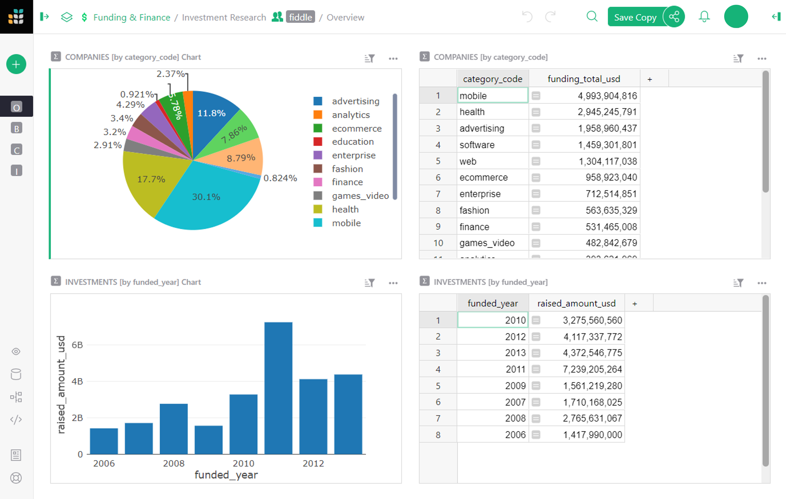

- En haut à gauche, un diagramme circulaire montre la répartition des investissements par catégorie. Le tableau à côté
  contient les mêmes données sous forme de tableau.
- Sous le diagramme circulaire se trouve un graphique à barres montrant le total des investissements réalisés par année. Il est également
  Il est également accompagné des mêmes données sous forme de tableau dans le tableau voisin.

Tous ces graphiques et tableaux sont des exemples de "tableaux récapitulatifs", que nous décrivons ci-dessous.

La page suivante, "Ventilations", contient également deux tableaux et deux graphiques, mais ceux-ci sont liés dynamiquement et offrent un aperçu beaucoup plus détaillé des données.
dynamiques et offrent un aperçu beaucoup plus détaillé des données.

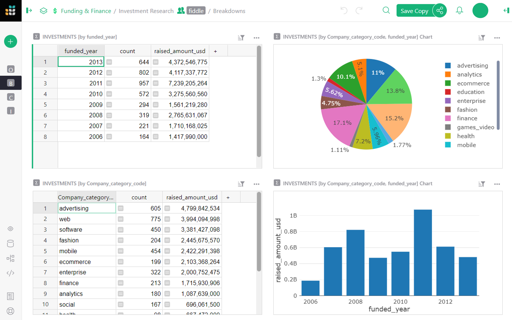

- En haut à gauche se trouve un tableau indiquant le financement total par année (le même tableau que celui de la page précédente).
page précédente). Ce tableau sert de moteur au graphique qui se trouve à côté. Lorsque vous cliquez sur une année
dans le tableau, le diagramme circulaire se met à jour pour montrer la répartition des investissements pour l'année en question.

- De même, le tableau du bas présente les investissements par catégorie. Lorsque vous cliquez sur une catégorie, le
se met à jour pour montrer l'historique des financements dans cette catégorie au fil des ans.

Notez à quel point cette méthode est puissante et à quel point elle vous permet de mieux comprendre les choses. Par exemple, vous pouvez voir que la catégorie
Par exemple, vous pouvez voir que la catégorie Publicité a reçu beaucoup d'investissements à New York depuis 2007, mais qu'elle a été dépassée par le commerce électronique en 2013.
investissements à New York depuis 2007, mais elle a été dépassée par le commerce électronique en 2013,
tandis que la catégorie Mode a connu un pic important en 2011.

La page suivante, "Détails de l'entreprise", présente les données granulaires de cet ensemble de données.

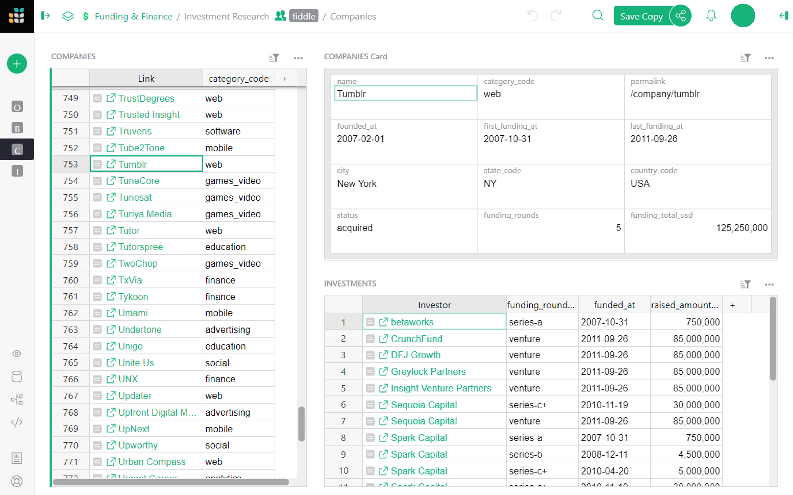

Ici, nous voyons une liste d'entreprises et les catégories auxquelles elles appartiennent. Chaque entreprise présentée dispose d'un lien
pointant vers sa fiche sur le site Crunchbase. En sélectionnant une entreprise, une carte s'affiche avec ses détails, ainsi qu'une liste de tous les investissements qu'elle a reçus.
ainsi qu'une liste de tous les investissements qu'elle a reçus.

C'est ici que nous commençons à voir la puissance de Grist. L'ensemble de données original est un tableur plat d'entreprises et un tableur encore plus grand d'investissements.
d'entreprises et une feuille de calcul encore plus grande d'investissements. En affichant les données sous forme de graphiques, elles prennent vie, ce qui les rend puissantes et utiles.
les données prennent vie, ce qui les rend puissantes et utiles.

## Comment puis-je faire ceci ? {: data-toc-label='' }

Avec Grist, il vous suffit de quelques étapes pour présenter vos propres données sous forme de graphiques. Commençons par
la première étape.

## Obtenir les données

Importons les données brutes. Nous importerons deux fichiers CSV, chacun devenant son propre tableau. Pour
suivre, enregistrez les fichiers à partir de
[crunchbase_companies_ny.csv](./unlocalized-assets/investment-research/crunchbase-companies-ny.csv)
et
[crunchbase_investments_ny.csv](./unlocalized-assets/investment-research/crunchbase-investments-ny.csv)
sur
votre ordinateur. Ensuite, créez un document Grist en important le premier fichier à partir de la page d'accueil.

Ensuite, importez le deuxième tableau en utilisant le bouton "Ajouter nouveau" et l'option "Importer à partir d'un fichier".

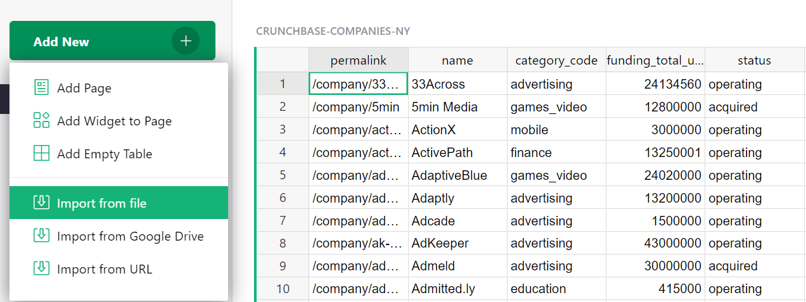

Dans la boîte de dialogue d'importation, terminez en cliquant sur "Importer" en bas à gauche.

Les tables que vous avez importées seront nommées "crunchbase_companies_ny" et
"crunchbase_investments_ny". Cliquez sur le nom en haut du tableau pour ouvrir la boîte de dialogue et renommez chacun des tableaux en "Sociétés" et "Investissements".
renommez chacun des tableaux en "Sociétés" et "Investissements".

## Rendez-le relationnel

La puissance de Grist réside dans la structuration des données.

Jetez un coup d'œil au tableau "Investissements". Triez par la première colonne et vous remarquerez combien il y a de répétitions : chaque ligne contient les informations complètes sur la société, ce qui duplique les données.
répétition : chaque ligne contient les informations complètes sur l'entreprise, ce qui fait double emploi avec les données du tableau "Entreprises" et se répète plusieurs fois lorsque plusieurs investissements s'appliquent à l'entreprise.
dans le tableau "Entreprises", et sont répétées plusieurs fois lorsque plusieurs investissements s'appliquent à la même entreprise.
La première colonne contient les informations complètes sur l'entreprise.[^denormalized]

[^denormalized]: Ce type de duplication est couramment observé dans les feuilles de calcul. Les données sous cette forme sont appelées
  "dénormalisées".

En réalité, chaque investissement s'applique à une seule entreprise. Chaque ligne d'investissement ne doit contenir qu'une référence à une entreprise et les données spécifiques à cet investissement.
contenir une référence à une entreprise et les données spécifiques à cet investissement.

Pour ce faire, il faut trouver une colonne qui identifie une entreprise de manière unique. Dans cet ensemble de données, la première
colonne, "company_permalink", fait le mieux l'affaire [^unique_id]. Cliquez sur la flèche dans l'en-tête de la colonne et cliquez sur
"Options de la colonne". Cliquez sur la flèche à côté de "Texte" sous "Type de colonne" dans la boîte de dialogue à droite de l'écran et sélectionnez "Texte" dans la boîte de dialogue à droite de l'écran.
dans la boîte de dialogue à droite de l'écran et sélectionnez "Référence" dans la liste.

[^unique_id] : Si vous n'avez pas de colonne d'identification unique, vous pouvez en construire une à l'aide d'une formule.

* 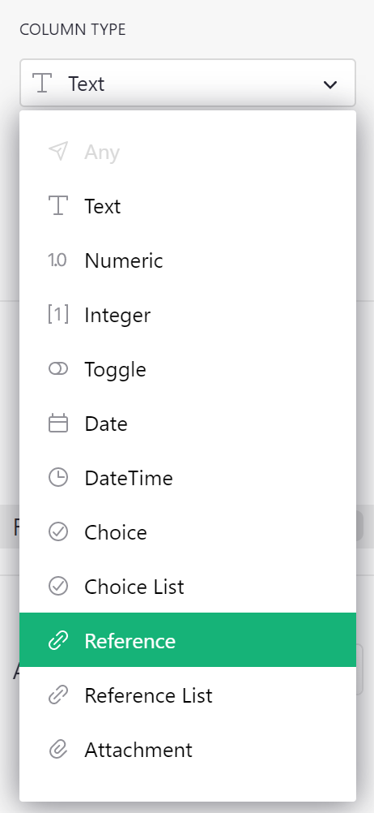*
{: .screenshot-half }

Grist suggérera automatiquement d'en faire une "Référence" dans le tableau "Entreprises" et d'afficher le "permalien" de l'entreprise référencée.
le "permalien" de l'entreprise référencée. Cliquez sur "Appliquer" pour enregistrer cette conversion.

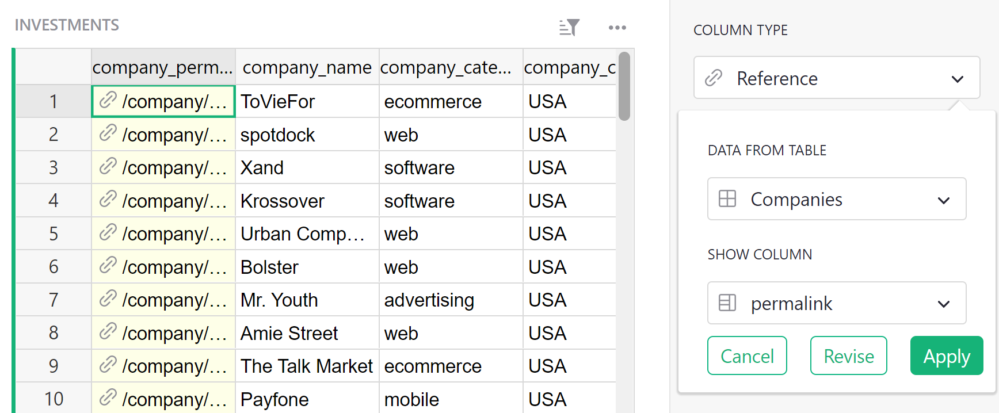

Renommons également cette colonne "Entreprise".

Dans Grist, les données dupliquées ne sont pas nécessaires et nous recommandons de les supprimer. L'utilisation du raccourci `Option-Moins` (Mac)
ou `Alt-Minus` (Windows) est un moyen rapide de supprimer des colonnes. Après avoir supprimé les colonnes de
"company_name" à "company_city", voici ce qu'il reste :

* *

Les données que vous avez supprimées ne sont pas perdues puisqu'elles ont été dupliquées.
Elles sont toujours disponibles dans la table "Companies" et peuvent être utilisées dans la formule d'un enregistrement d'investissement sous la forme, par exemple, de
`$Company.company_xxx`.

En fait, il existe un moyen pratique de créer ce type de formule. Créons-en une dont nous aurons besoin
plus tard. Cliquez sur l'en-tête de la colonne "Société". Dans l'onglet Colonne du panneau de droite, vous verrez une section "Ajouter des colonnes référencées".
section "Ajouter des colonnes référencées". Cliquez sur "Ajouter une colonne" pour ajouter la colonne "code_catégorie".

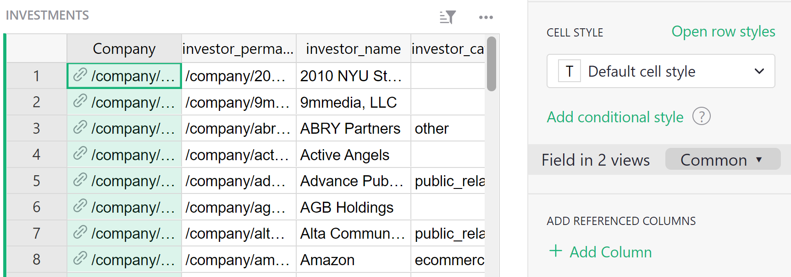

Une nouvelle colonne sera ajoutée à la table avec la formule `$Company.category_code`. Pour chaque
investissement, elle indique le "code_catégorie" de l'entreprise liée à son enregistrement d'investissement.

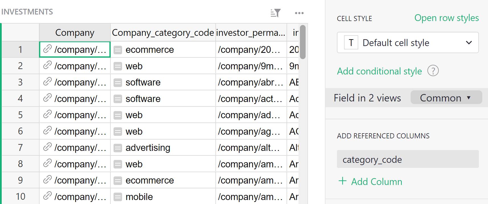

## Résumer

La fonction la plus puissante que vous attendiez est celle qui permet de résumer les données. Les [tableaux récapitulatifs](summary-tables.md) résument chaque colonne numérique d'un tableau de données. Nous voulons trouver la somme pour la colonne `funding_total_usd` dans le tableau Companies. Vérifiez que le type de colonne est défini sur 'Numeric' et formaté avec `$`.

Pour l'utiliser,
ajoutons un tableau montrant les entreprises regroupées par "code_catégorie".

Dans le menu "Ajouter nouveau" en haut à gauche, sélectionnez "Ajouter une page". Dans la boîte de dialogue, sélectionnez "Tableau" et "Sociétés", puis utilisez l'icône de sommation ()
pour sélectionner les colonnes "Grouper par", c'est-à-dire les colonnes par lesquelles résumer.
résumer.

Si vous ne sélectionnez aucune colonne, vous obtiendrez une seule ligne de totaux. Si vous récapitulez par
"code_catégorie", vous obtiendrez une ligne pour chaque valeur distincte de "code_catégorie". Faisons cela et
puis cliquons sur "Ajouter une page".

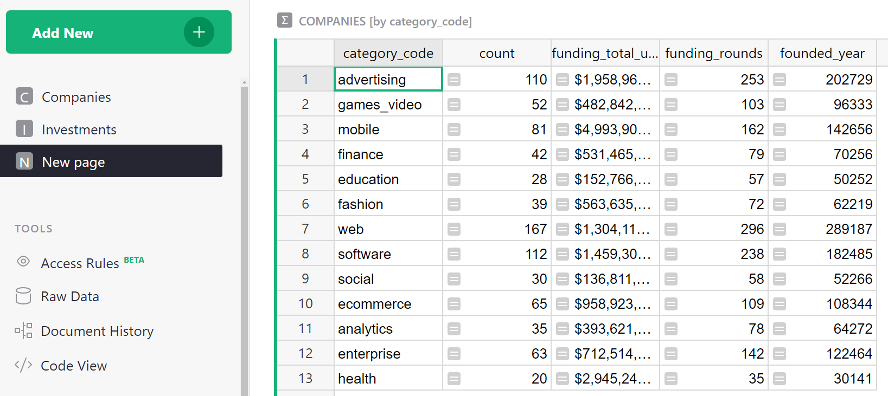

Ce système est similaire aux tableaux croisés dynamiques d'Excel. Chaque ligne représente le groupe d'enregistrements du tableau source ("Entreprises") qui ont une valeur particulière de "code_catégorie".
("Entreprises") qui ont une valeur particulière de "code_catégorie". Le titre du tableau ("COMPAGNIES") le rappelle
dans le titre du tableau ("ENTREPRISES [par code_catégorie]").

Ces tableaux récapitulatifs peuvent (et doivent !) utiliser des formules. Les colonnes que vous choisissez lors de la création du tableau
sont les identifiants des groupes. Toutes les autres colonnes sont des colonnes de formule, c'est-à-dire qu'elles sont calculées.
Dans les formules, le groupe d'enregistrements source résumé par une ligne est disponible sous la forme de la valeur "$group".

Par exemple, vous verrez qu'une colonne appelée "count" a été créée automatiquement. Si vous appuyez sur
"Entrée", vous verrez la formule -- `len($group)` -- qui est juste le nombre d'enregistrements dans ce groupe d'enregistrements, c'est-à-dire le nombre d'entreprises dans cette catégorie.
ce groupe d'enregistrements, c'est-à-dire le nombre d'entreprises dans cette catégorie.

Pour les colonnes numériques de la table source, les tableaux récapitulatifs obtiennent automatiquement une colonne numérique du même nom contenant la somme, avec une formule comme `SUM($group.funding_total_usd)`.
portant le même nom et contenant une somme, avec une formule telle que `SUM($group.funding_total_usd)`.

!!! note "Une note pour les fans de Python"
    `$group` est un objet Python spécial. C'est une collection itérable d'enregistrements. L'utilisation d'un attribut
    comme `$group.A` est un raccourci pour la liste des valeurs de la colonne `A` de tous les enregistrements du groupe, c'est-à-dire que c'est à peu près équivalent à `[r.A for r in $group]`.

Parfois, l'addition des valeurs n'a pas de sens. Par exemple, la somme de "founded_year" n'a pas de sens.
Il est préférable de supprimer cette colonne et toutes celles dont nous n'avons pas besoin, ce qui nous laisse la colonne "funding_total_usd".
avec la colonne "funding_total_usd".

Comme cette colonne contient de grands nombres, c'est le moment de regarder la section "Format des nombres".
la section "Format des nombres" de sa configuration, et de cliquer sur `,` (ou peut-être `$`) pour formater les nombres afin qu'ils soient plus lisibles.
pour formater les nombres de façon à ce qu'ils soient plus lisibles.

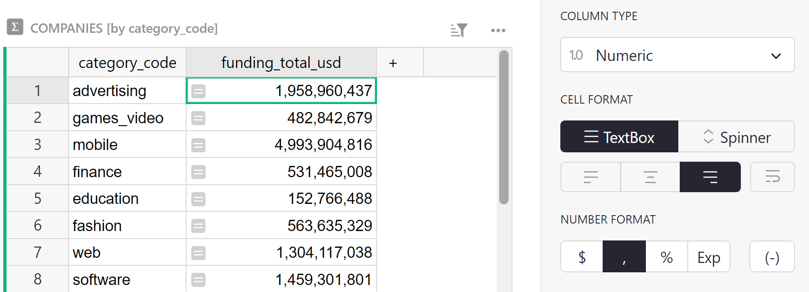

Ajoutons un deuxième tableau récapitulatif. Sélectionnez à nouveau "Ajouter nouveau" pour "Ajouter un widget à la page". Pour obtenir un résumé
par année, sélectionnez le tableau "Investissements" sous "Sélectionner les données", et utilisez à nouveau le symbole de la somme (∑) pour sélectionner la colonne par laquelle le résumé doit être effectué.
pour sélectionner la colonne par laquelle le résumé doit être effectué : "année_financée", puis cliquez sur "Ajouter à la page".

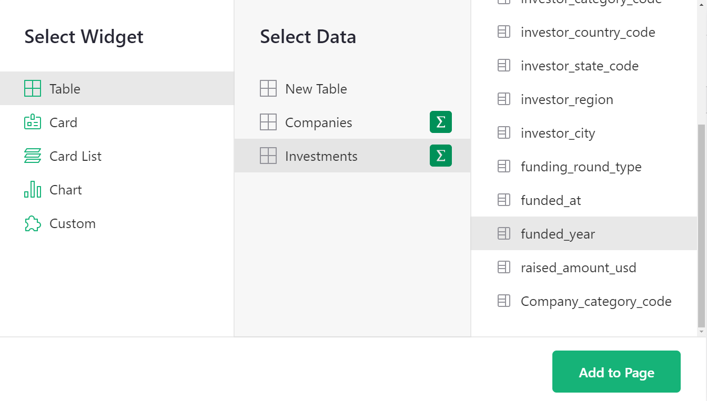

Cela produit un deuxième tableau récapitulatif qui présente un enregistrement pour chaque année, chacun représentant un groupe de lignes "Investissements" pour l'année en question.
groupe de lignes "Investissements" pour cette année. La colonne la plus utile est "raised_amount_usd", qui additionne tous les investissements réalisés cette année-là.
tous les investissements réalisés cette année-là. Supprimons les colonnes inutiles.

Vous remarquerez des valeurs roses dans "raised_amount_usd". C'est parce que Grist estime que le type de colonne est un entier.
Les sommes roses sont des cas où les nombres dépassent la capacité de Javascript à gérer de grands nombres entiers.
les grands nombres entiers. Pour corriger cela, le type de la colonne doit être changé en "Numeric" (qui échange la précision contre la capacité de représenter des nombres entiers).
Pour corriger ce problème, le type de la colonne doit être changé en "Numérique" (ce qui permet d'échanger la précision contre la capacité de représenter des nombres très grands et très petits). Changez le
à "Numeric" dans "Column options".

C'est à nouveau le moment de choisir un format de chiffres plus convivial pour la colonne et de l'élargir pour y faire figurer les chiffres les plus longs.
pour les nombres plus longs.

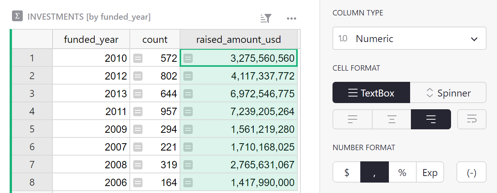

## Graphique, diagramme, tracé

Vous pouvez créer un graphique à partir de n'importe quelles données. Sur cette page, nous voulons ajouter une version graphique de chaque tableau de synthèse.
tableau récapitulatif. Sélectionnez à nouveau le bouton "Ajouter nouveau", choisissez "Ajouter un widget à la page", sélectionnez "Graphique" comme widget,
et le même tableau (Entreprises) et la même colonne de résumé (code_catégorie) que précédemment. Cliquez ensuite sur "Ajouter à la page".

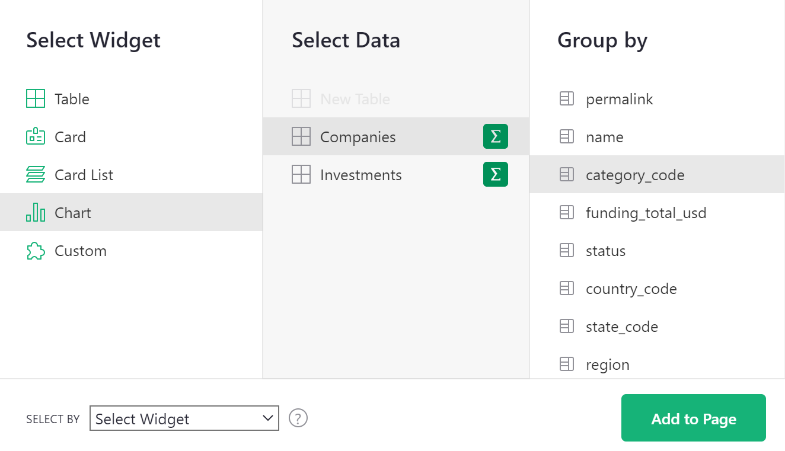

Dans le cas d'un graphique, vous le suivrez toujours en le personnalisant.

Ouvrez le panneau de droite et sélectionnez l'onglet "Graphique" / le sous-onglet "Widget".

Pour ce premier graphique, sous "Type de graphique", sélectionnez "Graphique en camembert". Pour construire ce graphique, il faut d'abord sélectionner une étiquette, puis une série à résumer dans le graphique circulaire.  Puisque nous voulons que le graphique affiche "category_code" comme étiquette, sélectionnez cette série dans le menu déroulant "Étiquette". Nous voulons utiliser "funding_total_usd" comme valeurs, qui doit donc figurer en haut de la liste "series" dans le panneau de configuration. En déplaçant votre souris
sur les éléments de cette liste, utilisez les doubles barres verticales qui s'affichent pour glisser-déposer une série en haut de la liste. Vous pouvez également masquer les autres séries de la liste en cliquant sur l'icône de la corbeille.

Ajoutez maintenant un graphique montrant une tendance par année. Ajoutez un autre "Widget to page", sélectionnez "Chart" sous "Widget", sélectionnez "Investments" sous "Select Data", cliquez sur "Summing".
"Widget", sélectionnez "Investments" sous "Select Data", cliquez sur summation
() pour regrouper par "année_financée",
et cliquez sur "Ajouter à la page".

Pour personnaliser ce graphique, utilisez le type de graphique "Diagramme à barres". Dans le menu déroulant "Axe X", sélectionnez la colonne à utiliser pour les valeurs de l'axe X (horizontal).
de l'axe X (horizontal). Sous "Série", sélectionnez une deuxième colonne (et éventuellement une colonne supplémentaire) pour les valeurs de l'axe Y (vertical).

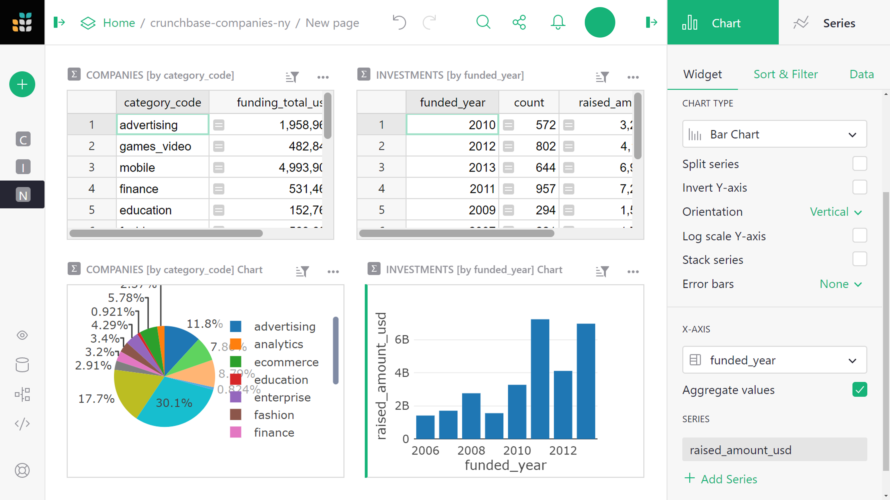

Vous pouvez réorganiser les sections de l'écran selon la configuration que vous souhaitez pour un tableau de bord.
pour un tableau de bord. Déplacez votre souris en haut à gauche de chaque section jusqu'à ce que vous voyiez une icône de "poignée".
jusqu'à ce que vous voyiez une icône de "poignée de déplacement". Utilisez cette icône pour déplacer chaque section à l'endroit souhaité par rapport aux autres sections.
l'emplacement souhaité par rapport aux autres sections. Une fois que vous avez terminé, renommez la page en survolant le nom de la page et en cliquant sur les trois points.
puis en cliquant sur l'icône à trois points pour ouvrir le menu. Sélectionnez "Renommer" et renommez la page en "Vue d'ensemble".

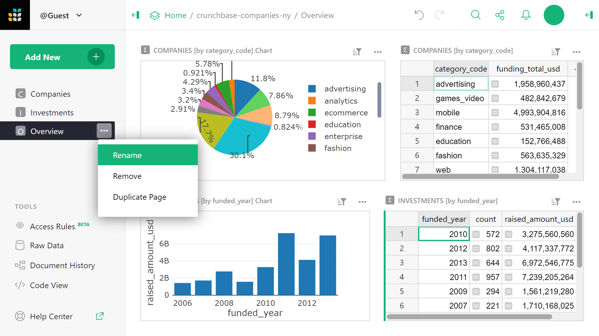

## Graphiques dynamiques

Si vous avez lu nos autres tutoriels sur l'établissement de liens entre les données, cela vous semblera naturel. Les graphiques sont simplement une
manière différente de présenter des données, et ils peuvent être liés de la même manière que les tableaux.

Pour notre exemple, nous allons ajouter une nouvelle page avec un tableau récapitulatif : sélectionnez le widget "Tableau", données "Investissements",
grouper par "année_financée", cliquer sur "Ajouter une page".

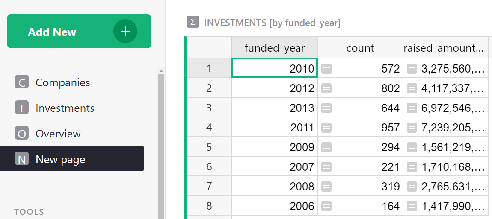

Renommons cette nouvelle page "Ventilations".

Ensuite, ajoutez un widget à cette page, en sélectionnant le widget "Chart", data "Investments". Pour "Grouper par", nous
choisissons *deux* colonnes : "Company_category_code" et "funded_year". C'est la raison pour laquelle nous avons ajouté la colonne "Company_category_code" plus tôt. Nous ne pouvons regrouper les enregistrements d'investissement par code de catégorie que si nous disposons de ce code pour chaque investissement.

La liste déroulante "Sélectionner par" située en bas à gauche de la boîte de dialogue répertorie les vues déjà présentes à l'écran qui peuvent contrôler la sélection des données dans le graphique que nous ajoutons.
qui peuvent contrôler la sélection des données dans le graphique que nous ajoutons. Dans "Select By", choisissez "INVESTMENTS
[by funded_year]" et cliquez sur "Ajouter à la page".

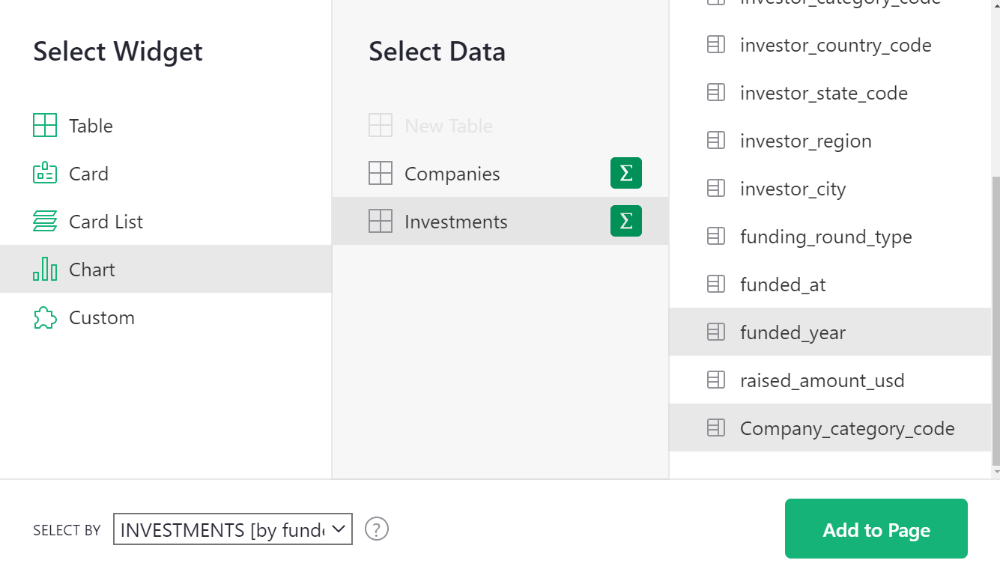

!!! tip ""
    **Note:** Si vous avez besoin d'apporter des modifications à une vue que vous avez déjà ajoutée, comme changer son type,
    "Grouper par" ou "Sélectionner par", vous pouvez toujours le faire à partir du sous-onglet "Données" dans les paramètres du widget, en utilisant le bouton "Modifier la sélection des données".
    en utilisant le bouton "Modifier la sélection des données".

Nous voulons pouvoir sélectionner une année, puis afficher un diagramme à secteurs pour cette année qui présente le
total pour chaque code de catégorie. L'option "Sélectionner par" que nous avons choisie garantit que seules les données de l'année sélectionnée sont utilisées.
l'année sélectionnée. Il ne reste plus qu'à changer le type de graphique en "Diagramme circulaire", et à définir "Label" sur "Code_catégorie_entreprise" et "Series" sur "Montant_soulevé_usd".

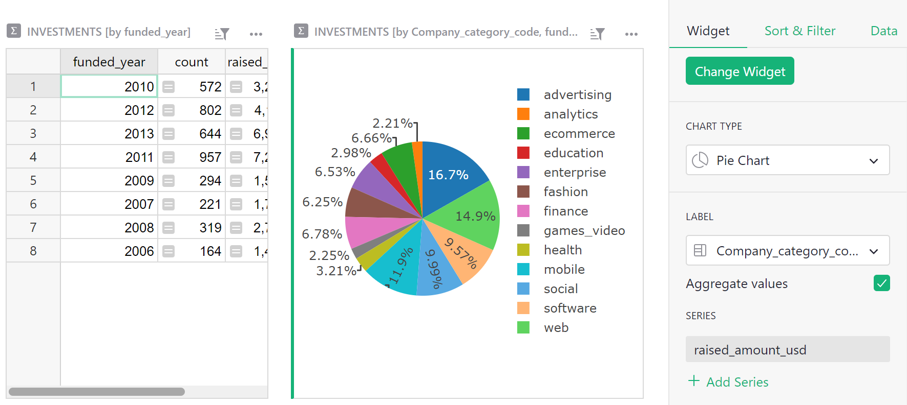

Note : Les graphiques nécessitent plus d'espace sur l'écran, aussi nos petites captures d'écran seront-elles plus agréables à regarder si nous fermons les panneaux latéraux en cliquant sur les icônes d'ouverture (>).
en cliquant sur les icônes d'ouverture (,
).

Trions également le tableau par "année de financement".

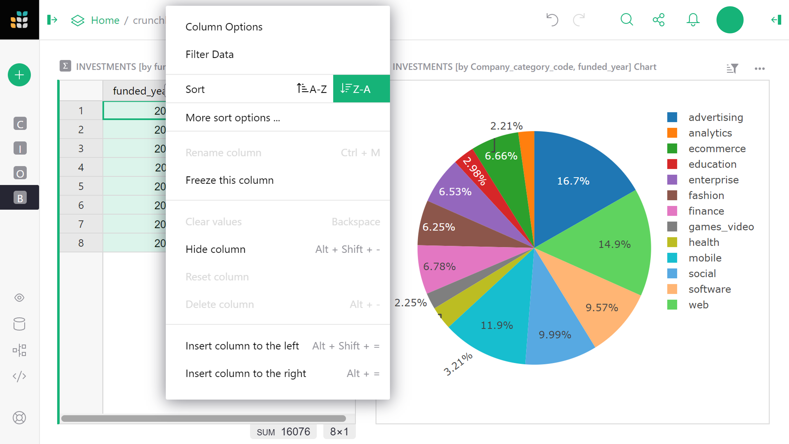

En ce qui concerne le tri, le bouton en surbrillance au-dessus du tableau vous rappelle que les paramètres de tri ne sont pas sauvegardés automatiquement.
sauvegardés automatiquement. Cliquez sur le bouton vert et sélectionnez "Enregistrer" pour le faire.

Quel est le résultat ? Nous pouvons cliquer sur les années (ou utiliser les touches fléchées) et voir la répartition par catégorie changer.
changement de catégorie.

!!! tip ""
    **Note:** Si le fait de cliquer sur les années n'affecte pas le graphique, celui-ci ne doit pas être lié.
    n'est pas lié. Vous pouvez le vérifier et le corriger en utilisant le menu "trois points" en haut à droite du graphique,
    en cliquant sur "Sélection des données" et en vous assurant que le menu déroulant "Sélectionner par" affiche "INVESTISSEMENTS [par
    année_financée]".

Pour compléter l'exemple, nous ajouterons deux sections supplémentaires à cette page "Ventilations".
de la page "Ventilations". L'une d'elles sera un tableau énumérant les catégories d'entreprises, auquel sera lié
un graphique montrant le montant des investissements dans cette catégorie au fil des ans.

Pour ajouter le tableau des catégories, utilisez "Ajouter un widget à la page", et sélectionnez le widget "Tableau", données "Investissements",
regroupées par "Code_catégorie_entreprise".

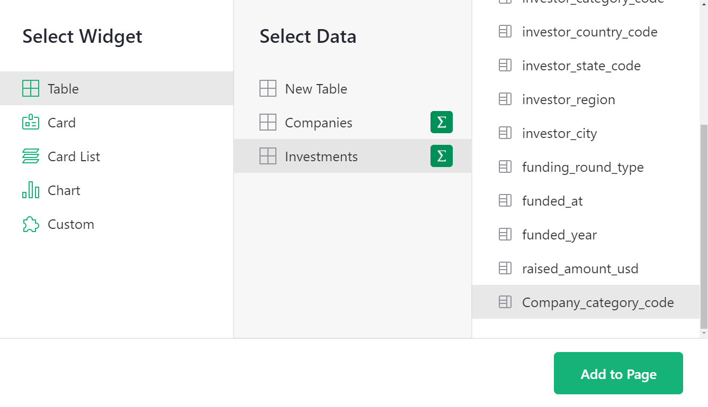

La colonne "funded_year" dans le tableau résultant n'a pas de sens et doit être supprimée.

Pour la dernière étape, nous ajoutons un autre graphique. Nous devons nous rappeler de regrouper les données par "Company_category_code", "funded_year" et "Select By".
"année_financée", et de définir une vue "Sélectionner par" appropriée. Puisqu'il y a deux
sur cette page, vous avez le choix de celui qui alimentera les données de ce graphique. Dans ce
Dans ce cas, choisissez la vue que nous venons d'ajouter : "INVESTMENTS [by Company_category_code]".

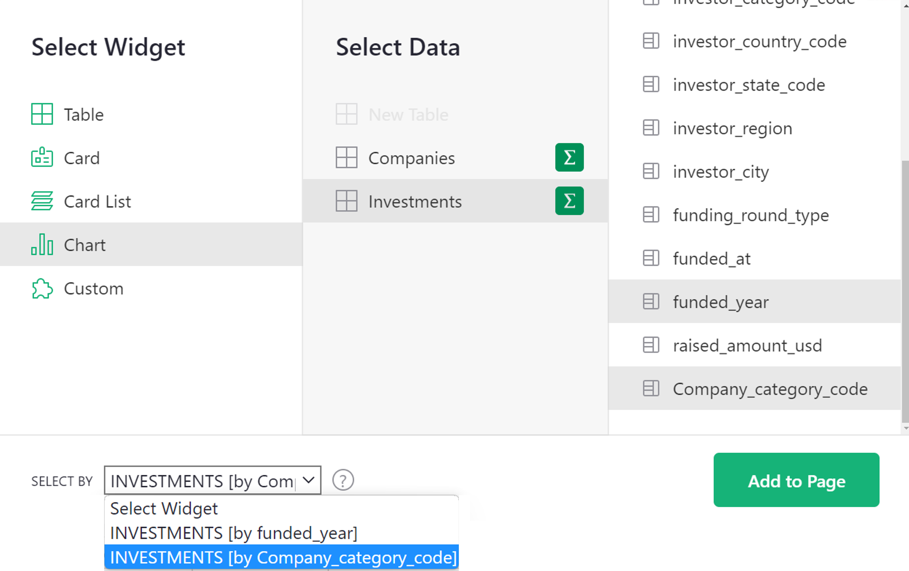

Comme dans la section précédente, nous configurons le graphique en sélectionnant "Type de graphique" comme "Graphique à barres", et
dans la liste déroulante "X-Axis", en sélectionnant "funded_year" et sous "Series", en sélectionnant "raised_amount_usd" et en masquant le reste.
"raised_amount_usd" et en masquant le reste.

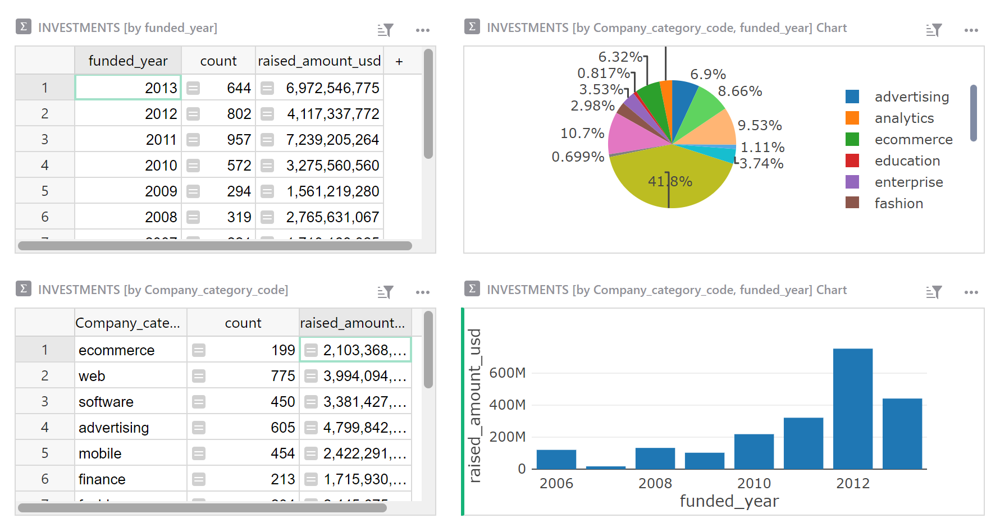

Nous pouvons maintenant cliquer sur les catégories et voir l'historique des investissements dans chacune d'entre elles.

## Prochaines étapes

Si vous ne savez pas comment nous avons créé la page "Détails de l'entreprise" présente dans l'exemple,
visitez l'un de ces tutoriels antérieurs pour apprendre comment : Comment créer un CRM léger" ou "Gérer votre entreprise avec Grist".
votre entreprise dans Grist".

Voilà, c'est fait ! Maintenant, allez analyser des données !

