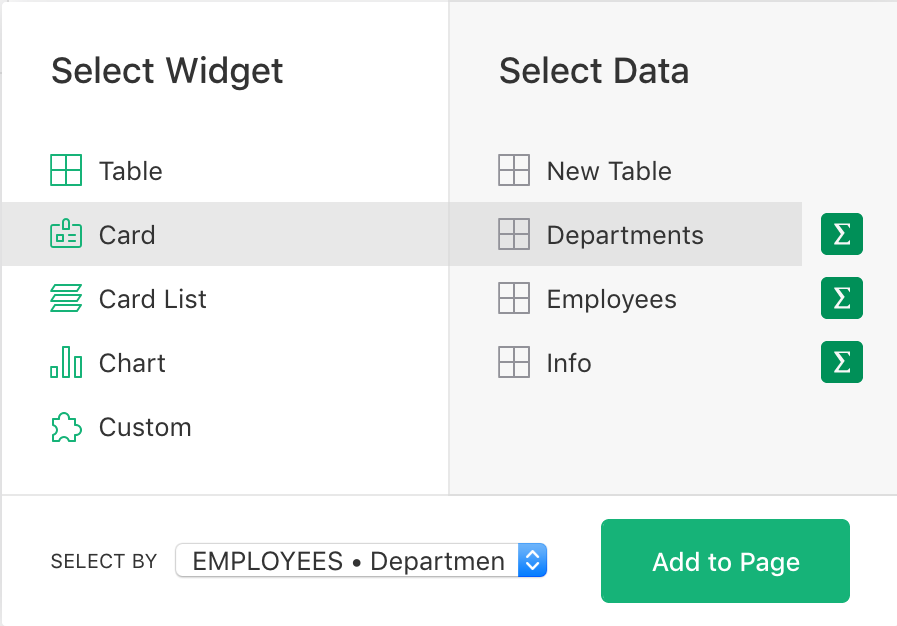
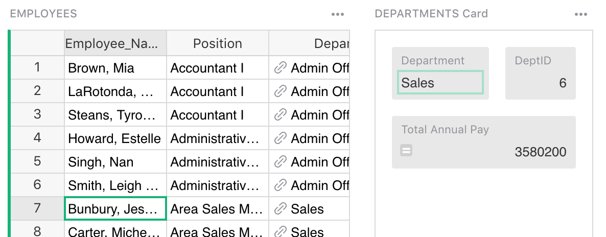
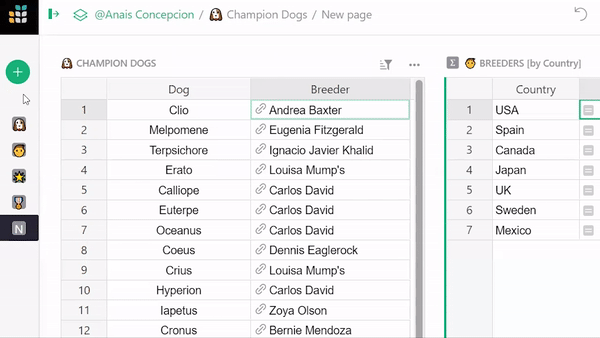
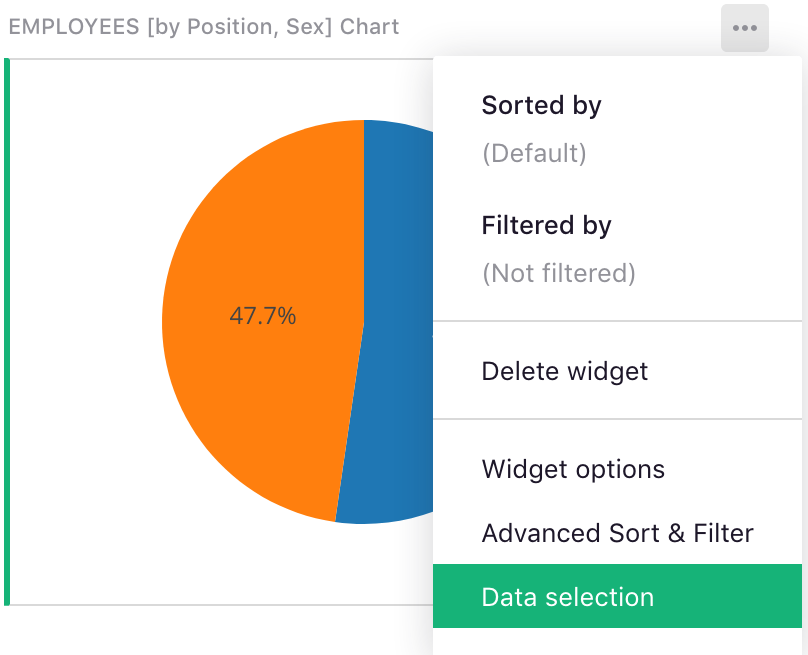

<iframe width="560" height="315" src="https://www.youtube.com/embed/F5m_je0QKvs?rel=0" frameborder="0" allow="accelerometer; autoplay; encrypted-media; gyroscope; picture-in-picture" allowfullscreen></iframe>

## Lier des vues sur la page

Une grande raison de placer plus d'une vue sur une page est que les vues peuvent être liées. Lorsqu'elles sont liées, la sélection d'un enregistrement dans une vue entraînera la mise à jour d'une autre vue pour afficher uniquement les données liées à l'enregistrement sélectionné.

Par exemple, disons que vous avez une table de `Départements` dans une entreprise, et une table d'`Employés`, chaque employé étant lié à un département. Vous pouvez avoir une vue Table listant les départements et servant de sélecteur pour une deuxième vue Table listant les employés :

  <!-- Indicateurs -->
  <ol class="carousel-indicators">
    <li data-target="#carousel-ex1" data-slide-to="0" class="active"></li>
    <li data-target="#carousel-ex1" data-slide-to="1"></li>
    <li data-target="#carousel-ex1" data-slide-to="2"></li>
  </ol>

  <!-- Conteneur pour les diapositives -->
  

    

      
    

    

      
    

    

      
    

  

  <!-- Contrôles -->
  <a class="left carousel-control" href="#carousel-ex1" role="button" data-slide="prev">
    
    Précédent
  </a>
  <a class="right carousel-control" href="#carousel-ex1" role="button" data-slide="next">
    
    Suivant
  </a>

&nbsp;

Pour créer cela, commencez par créer une page avec une vue Table pour les données de `Départements`, comme décrit dans [Vues sur la page](page-widgets.md#widget-picker). Ensuite, dans le menu "Ajouter nouveau", sélectionnez l'option "Ajouter une vue à la page" pour ajouter une autre vue Table pour les données d'`Employés`. Dans le sélecteur de vues, utilisez le menu déroulant "Sélectionner par" et choisissez la vue "DÉPARTEMENTS" ajoutée à la première étape.

**
{: .screenshot-half }

C'est tout ce qu'il faut : maintenant, sélectionner un département dans la première table fera en sorte que la deuxième table affiche uniquement les employés de ce département. Notez que cela repose sur le fait que la table `Employés` ait une colonne de type `Référence` avec la table cible `Départements`. Voir [Colonnes de référence](col-refs.md).

## Types de liaison {: data-toc-label='' }

Lier des vues ne fonctionne que lorsqu'il existe une relation entre les enregistrements dans les données sous-jacentes. Plusieurs types de relations sont pris en charge.

## Liaison sur le même enregistrement

Le plus directement, vous pouvez lier deux vues qui affichent des données de la même table sous-jacente, généralement en liant une vue Table à une vue Fiche. Cela vous permet de sélectionner un enregistrement dans la vue Table et de voir plus de détails sur cet enregistrement dans la vue Fiche liée.

Par exemple, vous pouvez ajouter une Fiche des données d'`Employés` et la lier à une vue Table existante "EMPLOYÉS":

**
{: .screenshot-half }

Lorsque vous sélectionnez un enregistrement dans la table, la nouvelle vue "Fiche EMPLOYÉS" affiche une fiche pour l'enregistrement sélectionné.

Pour un autre exemple de ce type de liaison, voir le document "CRM léger" dans "Exemples &amp; Modèles" et la section [Personnaliser la mise en page](lightweight-crm.md#customizing-layout) dans le tutoriel associé.

## Liaison par filtre

Comme dans l'exemple Employé-Département, lorsqu'une table a une référence à une autre (c'est-à-dire une colonne de type "Référence"), la deuxième table peut servir de sélecteur pour la première. Essentiellement, sélectionner un enregistrement peut automatiquement filtrer une autre vue pour n'afficher que les enregistrements qui se réfèrent à l'enregistrement sélectionné.

Dans l'exemple montré précédemment, la table `Employés` a une colonne "Référence" pointant vers la table `Départements`, donc une liste de départements peut servir de sélecteur pour les employés. Lorsqu'un département est sélectionné, seuls les employés de ce département seront affichés.

Le document "CRM léger" dans "Exemples &amp; Modèles" fournit un autre exemple, où la sélection d'un contact affiche uniquement les conversations avec ce contact. C'est également décrit dans le [tutoriel](lightweight-crm.md#linking-tables-visually).

Lorsque la cible de la liaison est une vue Graphique, vous obtenez des graphiques dynamiques qui reflètent les données associées à l'enregistrement sélectionné. Par exemple, vous pourriez lier un graphique en secteurs à un département pour afficher la somme des salaires pour chaque poste dans le département sélectionné.

  <!-- Indicateurs -->
  <ol class="carousel-indicators">
    <li data-target="#carousel-ex2" data-slide-to="0" class="active"></li>
    <li data-target="#carousel-ex2" data-slide-to="1"></li>
    <li data-target="#carousel-ex2" data-slide-to="2"></li>
  </ol>

  <!-- Conteneur pour les diapositives -->
  

    

      
    

    

      
    

    

      
    

  

  <!-- Contrôles -->
  <a class="left carousel-control" href="#carousel-ex2" role="button" data-slide="prev">
    
    Précédent
  </a>
  <a class="right carousel-control" href="#carousel-ex2" role="button" data-slide="next">
    
    Suivant
  </a>

&nbsp;

## Liaison indirecte

Chaque fois qu'une table `A` a une référence à `B`, `A` peut être utilisée à la place de `B` comme source de liaison. Au lieu de considérer l'enregistrement actuellement sélectionné dans `A`, la liaison considérera l'enregistrement référencé dans `B` comme la sélection.

Par exemple, une vue Table affichant des `Employés` peut servir de sélecteur pour une vue Fiche affichant des données de `Départements`, en utilisant le fait qu'un enregistrement d'employé contient une référence "Département". Dans le sélecteur de vues, si vous sélectionnez des données de `Départements`, vous verrez une option "Sélectionner par" "EMPLOYÉS • Département":

**
{: .screenshot-half }

Lorsque vous sélectionnez un employé, vous verrez les détails du département de cet employé.

**
{: .screenshot-half }

## Colonnes de référence multiples

Lorsqu'une table cible de la liaison a plusieurs colonnes de référence, vous devrez peut-être choisir laquelle utiliser pour la liaison.

Par exemple, un enregistrement de `Vol` pourrait avoir les champs 'Aéroport de départ' et 'Aéroport d'arrivée', chacun étant une Référence à la table `Aéroports`. Lorsque vous sélectionnez un aéroport dans une table, vous pouvez avoir le choix d'afficher tous les vols partant de cet aéroport ou tous les vols y arrivant. La vue "Sélectionner par" affichera les deux options à choisir :

**
{: .screenshot-half }

## Lier des tableaux récapitulatifs

Lorsque des vues affichent des données résumées, comme décrit dans [Tableaux récapitulatifs](summary-tables.md), elles peuvent également être liées aux données sous-jacentes, aux données qui référencent les données sous-jacentes, et à d'autres tableaux récapitulatifs.

Par exemple, vous pouvez résumer la table `Employés` par poste, et inclure le nombre d'employés pour chaque poste, le salaire moyen ou d'autres données récapitulatives. Vous pouvez également lier la table `Employés` à celle-ci, de sorte que la sélection d'un poste affiche tous les employés dans ce poste.

**
{: .screenshot-half }

De plus, vous pouvez lier un autre tableau récapitulatif. Par exemple, vous pouvez résumer les employés par poste *et* par genre, et lier cela au résumé par poste. En sélectionnant un poste, vous pouvez alors voir un résumé par genre pour ce poste. Cela est également pratique avec les graphiques.

**
{: .screenshot-half }

Dans cet exemple, vous voyez un graphique en secteurs avec le salaire moyen pour les hommes contre les femmes pour le poste sélectionné. En cliquant sur différents postes, le graphique en secteurs se met à jour pour refléter celui sélectionné.

Plus d'exemples de ce type de liaison peuvent être trouvés dans le tutoriel [Analyser et visualiser](investment-research.md#dynamic-charts).

Enfin, les tables qui référencent les données sous-jacentes d'un tableau récapitulatif peuvent maintenant être liées au tableau récapitulatif lui-même. Dans l'image ci-dessous, la table des Chiens Champions a une [colonne de référence](col-types.md#reference-columns) vers la table des Éleveurs. La table des Éleveurs est résumée dans la vue en haut à droite par la colonne "Pays". Parce que le Chien Champion référence l'Éleveur, vous pouvez ajouter une vue des Chiens Champions qui sélectionne par un tableau récapitulatif des données des Éleveurs.

**

## Changer les paramètres de liaison

Après qu'une vue soit ajoutée, vous pouvez voir et changer ses paramètres de liaison depuis le panneau de droite. Une façon d'y accéder est de cliquer sur l'icône à trois points en haut à droite de la vue, et de cliquer sur l'option de menu "Sélection des données":

**
{: .screenshot-half }

Cela ouvre le panneau latéral, qui montre quelles données sont affichées, et quelle vue, le cas échéant, sert de sélecteur.

**
{: .screenshot-half }

Vous pouvez changer le paramètre "Sélectionner par" ici, ou cliquer sur le bouton vert "Modifier la sélection des données", et le changer dans la boîte de dialogue du sélecteur de vues.
