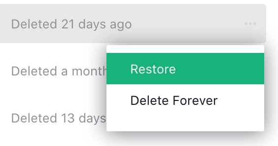

# Bulletin de Juillet 2020

<table class="header" cellpadding="0" cellspacing="0" border="0"><tr>
  <td class="header-text">
    <table class="header-top"><tr>
      <td class="header-image">
        
      </td>
      <td class="header-top-text">
        
Grist for the Mill

        
Juillet 2020
          &#8226; <a href="https://www.getgrist.com/">getgrist.com</a>

      </td>
    </tr></table>
    

      Bienvenue dans notre bulletin mensuel de mises à jour et de conseils pour les utilisateurs de Grist.
    

  </td>
</tr></table>

## Conseils Rapides

- **Revoir la Logique du Document.** Le lien "Vue Code" dans le panneau de gauche affiche un module Python
  qui décrit le modèle de données complet de votre document : toutes les tables, toutes les colonnes avec leurs types,
  et toutes les formules. C'est un excellent aperçu de la logique qui alimente les calculs d'un document.

- **Liens pour Composer des Emails.** Si vous avez une colonne comme "Email", essayez d'ajouter
  une colonne de formule avec la formule `"mailto:" + $Email`{: .formula }, définissez son type sur `Texte`, et
  le FORMAT DE CELLULE sur `HyperLink`. Vous pouvez maintenant cliquer sur un lien pour composer un email à cette adresse. Voir
  [Nouveaux Exemples](#nouveaux-exemples) ci-dessous pour bien plus de choses que vous pouvez faire avec cela.

## Quoi de Neuf

**Plus d'[options de format de nombre](../col-types.md#numeric-columns).**
Formatage en un clic pour les montants en dollars, les pourcentages, afficher
les nombres négatifs entre parenthèses, et plus encore :

**
{: .screenshot-half }

**Rétention des sauvegardes plus longue.** Grist effectue des [sauvegardes automatiques](../automatic-backups.md) régulières de
vos documents pendant que vous travaillez dessus. Il les conserve maintenant plus longtemps, même sur le plan gratuit.

**Récupérer ou purger des documents supprimés.** Les documents supprimés sont déplacés dans la Corbeille. Il est maintenant facile de
les récupérer. Les documents dans la Corbeille sont supprimés définitivement après 30 jours, ou vous pouvez les supprimer
définitivement vous-même pour les purger de nos systèmes plus tôt.

**
{: .screenshot-half }

**Utilisez votre propre domaine.** Si vous utilisez Grist pour partager des données avec vos propres clients et que vous souhaitez qu'elles
soient servies depuis votre propre domaine, cette option est maintenant disponible en tant qu'ajout au [Plan Équipe](https://www.getgrist.com/pricing).

**Intégration Zapier.** L'[intégration de Grist sur Zapier](https://zapier.com/apps/grist/integrations)
est maintenant disponible en version bêta. Allez-y et connectez Grist à d'autres applications.

**
{: .screenshot-half }

## Nouveaux Exemples

Voici un exemple de ce que vous pouvez faire avec Grist :

- [Préparer des Emails en utilisant des Formules](../examples/2020-07-email-compose.md) : Transformez des cellules en liens
  qui ouvrent un programme de messagerie pour composer un nouveau message, et préremplir ses destinataires, son sujet, et
  plus encore. Vous pouvez essentiellement créer des modèles d'email en utilisant les formules Grist.

## Apprendre Grist

- Commencez rapidement avec les concepts de base de Grist en regardant cette playlist
  de quelques très courtes vidéos d'introduction :
  [Série Vidéo Grist](https://www.youtube.com/playlist?list=PL3Q9Tu1JOy_4Mq8JlcjZXEMyJY69kda44).

- Chacun de nos [Exemples & Modèles](https://docs.getgrist.com/p/templates) en vedette
  a un tutoriel associé qui montre étape par étape comment le construire
  à partir de zéro. Lisez-en un pour comprendre plus en profondeur comment
  diverses fonctionnalités interagissent.

- Visitez notre [Centre d'Aide](../index.md) pour
  trouver tout ce qui précède, ainsi que la documentation complète du produit.

- Des questions ou des suggestions ? Cliquez sur le
   Donner un Feedback
  lien près du bas à gauche dans l'application Grist, ou envoyez simplement un email à
  <support@getgrist.com>.
