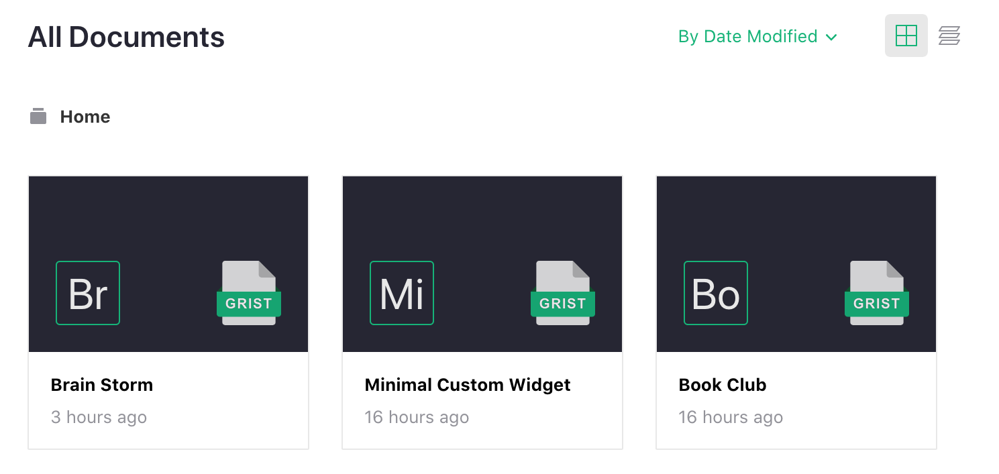

# Bulletin d'août 2020

<table class="header" cellpadding="0" cellspacing="0" border="0"><tr>
  <td class="header-text">
    <table class="header-top"><tr>
      <td class="header-image">
        
      </td>
      <td class="header-top-text">
        
Grist for the Mill

        
Août 2020
          &#8226; <a href="https://www.getgrist.com/">getgrist.com</a>

      </td>
    </tr></table>
    

      Bienvenue dans notre bulletin mensuel de mises à jour et astuces pour les utilisateurs de Grist.
    

  </td>
</tr></table>

## Conseils Rapides

- **Décalages de Date.** Il est facile de se tromper en calculant des dates. [DATEADD](../functions.md#dateadd) est un moyen simple et fiable d'ajouter des années, des mois, des semaines et des jours à une date. Par exemple, pour calculer trois mois à partir d'une date spécifique, faites `DATEADD($date, months=3)`. Pour une semaine et un jour avant cela, faites `DATEADD($date, months=3, weeks=-1, day=-1)`. Simple!

- **Noms de Colonnes.** Parfois, il y a une tension entre choisir un nom de colonne comme une étiquette descriptive pour expliquer de quoi il s'agit, et choisir quelque chose de court et accrocheur qui soit confortable dans les formules. Vous pouvez avoir les deux! Il suffit d'ouvrir les options de colonne et de décocher "[Utiliser le nom comme ID?](../col-types.md#renaming-columns)". Ensuite, vous pouvez définir le nom utilisé comme étiquette et le nom utilisé dans les formules séparément. Et comme toujours avec Grist, si vous changez d'avis plus tard, vous pouvez changer ou relier les noms et toutes vos formules se mettront à jour automatiquement.

  **
    {: .screenshot-half }

## Quoi de Neuf

**Trier vos documents par date de modification.** Vous pouvez maintenant choisir d'ordonner vos documents de sorte que les plus récemment modifiés apparaissent en premier, en utilisant la nouvelle option `Par Nom` / `Par Date de Modification` en haut à droite des listes de documents.

**
{: .screenshot-half }

**Lister les documents sous forme d'icônes.** Vous pouvez maintenant également contrôler si les documents s'affichent sous forme de grille d'icônes ou de liste de noms, en utilisant les nouvelles icônes de grille et de pile en haut à droite des listes de documents.

**
{: .screenshot-half }

**Widgets personnalisés réactifs.** Nous avons simplifié la création de [Widgets Personnalisés](../widget-custom.md) pour les développeurs web, offrant de nouvelles vues réactives de vos données qui se mettent à jour automatiquement. Un développeur n'a qu'à appeler `grist.onRecord(s)` pour s'abonner à un enregistrement ou un ensemble d'enregistrements liés au widget; après cela, la présentation est une question de préparation des ressources HTML/CSS/JS (aucune connaissance spécifique de Grist n'est nécessaire). L'utilisateur du widget contrôle la sélection des données en utilisant le [Lien de Widgets](../linking-widgets.md) régulier. Nous invitons les développeurs web à essayer de créer de nouveaux widgets ou visualisations, et nous serions ravis d'entendre parler des résultats (envoyez-nous un mail à <support@getgrist.com>).

## Nouveaux Exemples

Voici un exemple de ce que vous pouvez faire avec Grist :

- [Préparation des Factures](../examples/2020-08-invoices.md) : Prévisualisez des factures imprimables côte à côte avec vos données clients et commandes. Entrez rapidement des éléments facturables en utilisant des formules, et voyez la facture se mettre à jour immédiatement comme toute autre partie d'une feuille de calcul. C'est aussi un exemple du type de nouvelle visualisation qui peut être construite avec des [Widgets Personnalisés](../widget-custom.md).

## Apprendre Grist

- Commencez rapidement avec les concepts de base de Grist en regardant cette playlist de quelques très courtes vidéos d'introduction : [Série de Vidéos Grist](https://www.youtube.com/playlist?list=PL3Q9Tu1JOy_4Mq8JlcjZXEMyJY69kda44).

- Chacun de nos [Exemples & Modèles](https://docs.getgrist.com/p/templates) en vedette a un tutoriel associé qui montre étape par étape comment le construire à partir de zéro. Lisez-en un pour mieux comprendre comment diverses fonctionnalités interagissent.

- Visitez notre [Centre d'Aide](../index.md) pour trouver tout ce qui précède, ainsi que la documentation complète du produit.

- Des questions ou des suggestions? Cliquez sur le lien
   Donner votre avis
  près du bas à gauche dans l'application Grist, ou envoyez simplement un email à <support@getgrist.com>.
