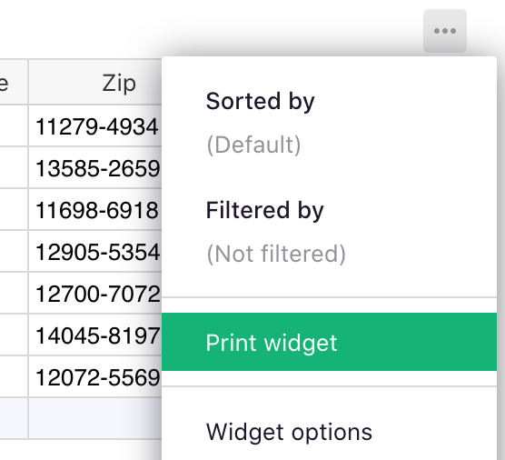

# Bulletin d'Octobre 2020

<table class="header" cellpadding="0" cellspacing="0" border="0"><tr>
  <td class="header-text">
    <table class="header-top"><tr>
      <td class="header-image">
        
      </td>
      <td class="header-top-text">
        
Grist for the Mill

        
Octobre 2020
          &#8226; <a href="https://www.getgrist.com/">getgrist.com</a>

      </td>
    </tr></table>
    

      Bienvenue dans notre bulletin mensuel de mises à jour et de conseils pour les utilisateurs de Grist.
    

  </td>
</tr></table>

## Conseils Rapides

- **Remplir un Intervalle.** Pour remplir un intervalle de cellules avec la même valeur, entrez la valeur
  dans la cellule du haut, puis sélectionnez l'intervalle en dessous en commençant par cette cellule (ce que vous pouvez faire en faisant glisser
  la souris, ou en <code class="keys">*Shift*</code>-cliquant sur la cellule du bas), puis appuyez sur
  <code class="keys">*Ctrl* + *D*</code> (Windows) ou <code class="keys">*⌘* *D*</code> (Mac).

    **
      {: .screenshot-half }

    Souvenez-vous de "D" pour remplir **D**essous.

    Les raccourcis habituels Copier-Coller fonctionnent aussi -- <code class="keys">*Ctrl* + *C*</code>
    <code class="keys">*Ctrl* + *V*</code> (Windows) ou <code class="keys">*⌘* *C*</code>
    <code class="keys">*⌘* *V*</code> (Mac). Coller une valeur dans un intervalle plus grand remplira l'intervalle
    avec plusieurs copies de la valeur.

- **Expressions Conditionnelles.** Si vous avez une formule comme `$Birthday.year`{: .formula}, vous
  constaterez que lorsque la colonne `Birthday` est vide, la formule affiche une erreur. Il est facile de l'éviter
  en utilisant les expressions conditionnelles de Python :

    `$Birthday.year if $Birthday else None`{: .formula}

    La même idée peut aider dans d'autres situations, par exemple pour éviter une ZeroDivisionError :

    `$Total / $Count if $Count else 0`{: .formula}

## Quoi de Neuf

**Impression.** Vous pouvez maintenant facilement imprimer n'importe quelle vue sur votre écran, qu'il s'agisse d'une table de données, d'une fiche,
ou d'une vue personnalisée. Cliquez sur l'icône à trois points en haut de la vue, et sélectionnez "Imprimer la Vue" :

  **
    {: .screenshot-half }

L'impression fonctionne également pour des vues à usage spécial telles que [Factures](../examples/2020-08-invoices.md) ou
[Étiquettes d'Envoi](../examples/2020-10-print-labels.md) (voir ci-dessous).

## Bêta Open Source

Nous sommes ravis d'annoncer que nous rendons Grist open-source ! La
version open-source doit être considérée comme en Bêta pour le moment, mais les développeurs enthousiastes sont les bienvenus pour
la découvrir : <https://github.com/gristlabs/grist-core>.

Le service sécurisé géré que vous connaissez et aimez reste inchangé, et sera d'autant plus fort grâce
à l'engagement avec la communauté open-source. Placer notre code dans le domaine public apporte également une
confiance accrue dans la qualité du code et dans la disponibilité à long terme de Grist. En savoir plus sur
[Pourquoi Open Source](https://github.com/gristlabs/grist-core#why-open-source).

## Nouveaux Exemples

[Imprimer des Étiquettes d'Envoi](../examples/2020-10-print-labels.md). Cette vue personnalisée prend en charge les tailles d'étiquettes populaires et facilite la création d'étiquettes imprimables et leur disponibilité en un clic. C'est un autre exemple de l'extensibilité de Grist.

## Apprendre Grist

- Commencez rapidement avec les concepts de base de Grist en regardant cette playlist
  de quelques très courtes vidéos d'introduction :
  [Série de Vidéos Grist](https://www.youtube.com/playlist?list=PL3Q9Tu1JOy_4Mq8JlcjZXEMyJY69kda44).

- Chacun de nos [Exemples & Modèles](https://docs.getgrist.com/p/templates) en vedette
  a un tutoriel associé qui montre étape par étape comment le construire
  à partir de zéro. Lisez-en un pour mieux comprendre comment
  diverses fonctionnalités interagissent.

- Visitez notre [Centre d'Aide](../index.md) pour
  trouver tout ce qui précède, ainsi que la documentation complète du produit.

- Des questions ou des suggestions ? Cliquez sur le
   Donner votre Avis
  lien en bas à gauche dans l'application Grist, ou envoyez simplement un email à
  <support@getgrist.com>.