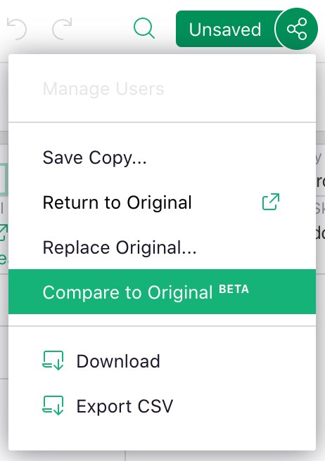
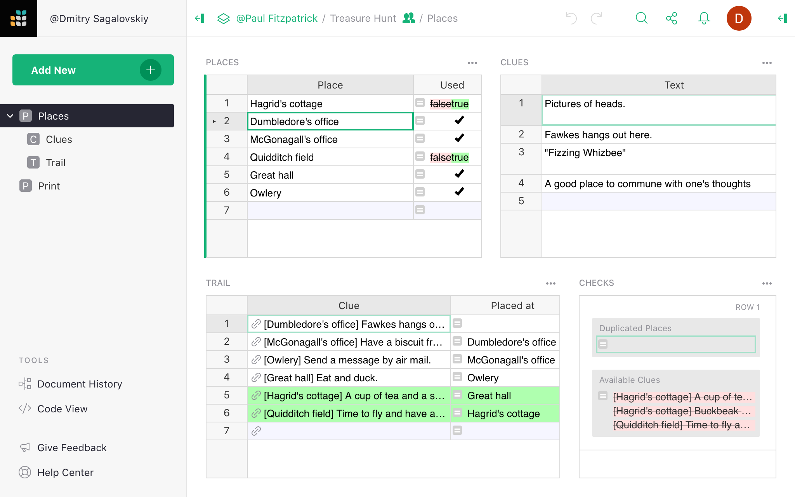

# Bulletin de Novembre 2020

<table class="header" cellpadding="0" cellspacing="0" border="0"><tr>
  <td class="header-text">
    <table class="header-top"><tr>
      <td class="header-image">
        
      </td>
      <td class="header-top-text">
        
Grist for the Mill

        
Novembre 2020
          &#8226; <a href="https://www.getgrist.com/">getgrist.com</a>

      </td>
    </tr></table>
    

      Bienvenue dans notre bulletin mensuel de mises à jour et de conseils pour les utilisateurs de Grist.
    

  </td>
</tr></table>

## Annonce Open Source

Nous sommes heureux d'annoncer la version bêta de la [version open source de Grist](https://www.getgrist.com/blog)! En tant que feuille de calcul moderne et puissante, Grist s'intègre bien dans l'écosystème open source et est aussi conviviale pour les développeurs hackers que pour les utilisateurs hackers.

[Rejoignez la discussion sur HackerNews](https://news.ycombinator.com/item?id=25257521).

[Lisez l'annonce](https://www.getgrist.com/blog).

Cela intéressera les utilisateurs techniquement avertis qui souhaitent étendre Grist, ou ceux ayant des exigences inhabituelles. Pendant ce temps, le service que vous connaissez et aimez reste l'option la mieux supportée et la plus rentable, et bénéficiera de la confiance accrue dans le code source de Grist.

## Conseils Rapides

- **Ajouter un Enregistrement.** Certains des raccourcis les plus simples sont les plus utiles. Pour ajouter un enregistrement, appuyez sur <code class="keys">*Ctrl* + *=*</code> (Windows) ou <code class="keys">*⌘* *=*</code> (Mac). Appuyez sur <code class="keys">*Shift*</code> en même temps pour insérer l'enregistrement au-dessus du curseur plutôt qu'en dessous.

- 
  **Créer un Identifiant Unique.** Disons que vous souhaitez référencer des enregistrements dans une table, mais que vous n'avez pas de colonne qui identifie chaque enregistrement de manière unique. Peut-être avez-vous des personnes avec `First_Name` et `Last_Name`, ou des sessions avec `Program_Name` et `Date`. Pour utiliser ces tables comme cible d'une colonne de Référence, vous aurez besoin d'un identifiant unique.

    Vous pouvez en créer un en utilisant une formule qui assemble les champs identifiant un enregistrement de manière unique.
    Par exemple, créez une colonne `Full_Name` avec la formule

      `$Last_Name + ", " + $First_Name`{: .formula}

    ou une colonne `Session_Name` avec la formule

      `"[%s] %s" % ($Date, $Program_Name)`{: .formula}

    Cette dernière est une syntaxe Python pour formater des chaînes : chaque occurrence de `%s` dans la chaîne entre guillemets est remplacée par une valeur de la liste entre parenthèses.

## Quoi de Neuf

**Amélioration des Pièces Jointes.** La prévisualisation des pièces jointes a été grandement améliorée et prend en charge l'affichage des fichiers PDF, vidéo et audio. Double-cliquez simplement sur une cellule avec des pièces jointes pour prévisualiser son contenu :

**Voir les Différences.** Vous pouvez maintenant voir les différences entre une copie d'un document que vous faites en utilisant "Travailler sur une copie" et l'original, ainsi que ce qui a changé depuis une sauvegarde dans l'historique du document. Trouvez l'élément de menu "Comparer" dans le menu Partager :

  **
    {: .screenshot-half }

Cette fonctionnalité est expérimentale pour le moment, mais est déjà assez utile :

Cela prend en charge le flux de travail de [tester des modifications](../copying-docs.md#trying-out-changes), qui devrait être familier aux utilisateurs de systèmes de contrôle de version tels que Git. L'un de ses avantages est de permettre aux utilisateurs en lecture seule de proposer des modifications, même s'ils ne peuvent pas modifier le document directement.

## Nouveaux Exemples

[Chasse au Trésor](../examples/2020-11-treasure-hunt.md) : Encore mieux que d'utiliser Grist pour le travail, c'est d'utiliser Grist pour le plaisir ! Découvrez ce modèle qui vous aide à planifier une chasse au trésor sans perdre le fil. Conspirez avec des parents ou des amis en ligne pour créer une piste d'indices, puis regardez et riez pendant que le reste de votre foyer se débat pour la suivre.

## Apprendre Grist

- Commencez rapidement avec les concepts de base de Grist en regardant cette playlist de quelques très courtes vidéos d'introduction :
  [Série Vidéo Grist](https://www.youtube.com/playlist?list=PL3Q9Tu1JOy_4Mq8JlcjZXEMyJY69kda44).

- Chacun de nos [Exemples & Modèles](https://docs.getgrist.com/p/templates) en vedette a un tutoriel associé qui montre étape par étape comment le construire à partir de zéro. Lisez-en un pour acquérir une compréhension plus approfondie de la manière dont diverses fonctionnalités interagissent.

- Visitez notre [Centre d'Aide](../index.md) pour trouver tout ce qui précède, ainsi que la documentation complète du produit.

- Des questions ou des suggestions ? Cliquez sur le lien
   Donner un Avis
  près du bas à gauche dans l'application Grist, ou envoyez simplement un email à
  <support@getgrist.com>.