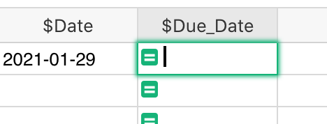
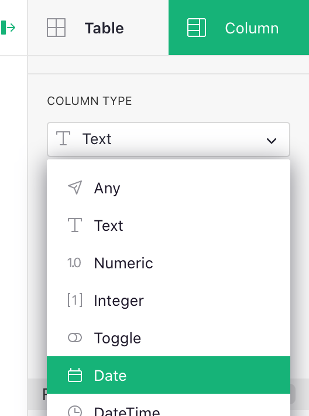

# Bulletin de Janvier 2021

<table class="header" cellpadding="0" cellspacing="0" border="0"><tr>
  <td class="header-text">
    <table class="header-top"><tr>
      <td class="header-image" rowspan="2">
        
      </td>
      <td class="header-top-text">
        
Grist pour le Moulin

        
Janvier 2021
          &#8226; <a href="https://www.getgrist.com/">getgrist.com</a>

      </td>
    </tr><tr>
      <td>
        

          Bienvenue dans notre bulletin mensuel de mises à jour et de conseils pour les utilisateurs de Grist.
        

      </td>
    </tr></table>
  </td>
</tr></table>

## Conseils Rapides

- **Entrer des Formules.** Pour entrer une formule dans Grist, appuyez simplement sur le signe égal (<code class="keys">*=*</code>) sur le clavier. Pour modifier une formule existante, appuyez sur <code class="keys">*Entrée*</code>.

    **
      {: .screenshot-half }

    Contrairement à une feuille de calcul typique, une formule Grist s'applique à toute la colonne, et vous pouvez modifier cette formule unique via n'importe laquelle des cellules de la colonne. [En savoir plus sur les formules](../formulas.md).

- **Utiliser le Sélecteur de Date.** Si vous convertissez une colonne en type Date, vous pourrez entrer des dates en utilisant l'interface de sélection de date. Pour convertir une colonne, ouvrez le panneau "Colonne" à droite, et sélectionnez "Date" sous Type de Colonne :

    **
      {: .screenshot-half }

    Il existe également des options pour formater les dates ! [Voir ici pour plus d'informations](../col-types.md#date-columns).

## Nouvel Exemple

Dans notre article [Gestion des Tâches](../examples/2021-01-tasks.md), nous partageons un document similaire à celui que nous utilisons en interne chez Grist Labs pour gérer notre travail.

Ce document simple fonctionne mieux pour nous que n'importe quel logiciel personnalisé, grâce à la combinaison de la liaison de données, des menus déroulants pour attribuer des tâches, du copier-coller facile lorsque nécessaire, et de la collaboration en direct. Et il fonctionne tout aussi bien dans un environnement de travail entièrement à distance, lorsque toutes nos réunions se font par vidéo.

## Trouver un Consultant, Devenir un Consultant

**Obtenez de l'aide pour la construction.** De nombreuses entreprises ont des données complexes. N'hésitez pas à nous contacter pour obtenir de l'aide pour la construction de votre base de données. Une bonne façon est de nous envoyer un email à <support@getgrist.com> avec une description de ce que vous souhaitez pour votre base de données (peut-être même esquisser quelques écrans sur papier et envoyer des photos). Ensuite, [planifiez un appel](https://calendly.com/gristlabs/).

Souvent, cela suffit pour démarrer et continuer par vous-même. Pour des projets plus importants, ou des intégrations personnalisées, nous pouvons recommander un consultant avec qui travailler.

**Aidez les autres !** Êtes-vous un freelance ? Aimez-vous construire dans Grist et organiser des données ? Nous serions ravis de vous soutenir et de vous ajouter à notre liste de consultants Grist indépendants. Veuillez remplir ce formulaire d'intérêt : [s'inscrire pour devenir consultant Grist](../register-as-consultant.md).

## Apprendre Grist

- Commencez rapidement avec les concepts de base de Grist en regardant cette playlist de quelques très courtes vidéos d'introduction : [Série de Vidéos Grist](https://www.youtube.com/playlist?list=PL3Q9Tu1JOy_4Mq8JlcjZXEMyJY69kda44).

- Chacun de nos [Exemples & Modèles](https://docs.getgrist.com/p/templates) en vedette a un tutoriel associé qui montre étape par étape comment le construire à partir de zéro. Lisez-en un pour mieux comprendre comment diverses fonctionnalités interagissent.

- Visitez notre [Centre d'Aide](../index.md) pour trouver tout ce qui précède, ainsi que la documentation complète du produit.

- Des questions ou des suggestions ? Cliquez sur le lien
   Donner un Avis
  en bas à gauche de l'application Grist, ou envoyez simplement un email à <support@getgrist.com>.