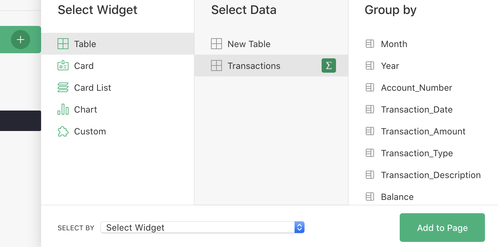

# Bulletin de Février 2021

<table class="header" cellpadding="0" cellspacing="0" border="0"><tr>
  <td class="header-text">
    <table class="header-top"><tr>
      <td class="header-image">
        
      </td>
      <td class="header-top-text">
        
Grist for the Mill

        
Février 2021
          &#8226; <a href="https://www.getgrist.com/">getgrist.com</a>

      </td>
    </tr></table>
    

      Bienvenue à notre bulletin mensuel de mises à jour et astuces pour les utilisateurs de Grist.
    

  </td>
</tr></table>

## Conseils Rapides

- 
  **Totaux.** Pour calculer les totaux d'une colonne, les utilisateurs de tableurs ajoutent souvent une formule à la dernière ligne de leur table. Dans Grist, chaque ligne est un enregistrement de base de données, y compris la dernière ligne. Mais les totaux sont certainement disponibles !

    Au lieu d'ajouter une ligne pour les totaux, ajoutez une table de résumé d'une ligne. Cliquez sur le bouton "Ajouter Nouveau", et sélectionnez "Ajouter Vue à la Page". Dans la boîte de dialogue qui s'ouvre, cliquez sur l'icône de sommation
    () à côté de la table pour laquelle vous souhaitez obtenir des totaux :

    **
    {: .screenshot-half }

    Cliquez sur "Ajouter à la Page", et vous verrez un résumé d'une ligne de votre table. Utilisez la poignée de déplacement juste à gauche du titre pour le déplacer sous votre table (là où vous attendez normalement les totaux).

    **
    {: .screenshot-half }

    Grist crée automatiquement des sommes de toutes les colonnes numériques. Vous pouvez supprimer celles dont vous n'avez pas besoin, en ajouter de nouvelles, ou modifier celles pour lesquelles vous avez besoin de quelque chose d'autre qu'une somme (peut-être `AVERAGE`, `MAX`, ou un calcul Python entièrement personnalisé).

    **
      {: .screenshot-half }

    Lisez [Tables de résumé](../summary-tables.md) pour en savoir plus sur les tables de résumé et leurs nombreuses utilisations.

- 
  **Partage en Temps Réel.** Même avec le plan gratuit, vous pouvez partager un document et collaborer dessus. Tout changement que vous ou un autre éditeur effectuez apparaîtra immédiatement sur l'écran de l'autre personne.

    Pour partager un document, cliquez sur l'icône de partage
    (), et sélectionnez "Gérer les Utilisateurs".

    Dans la boîte de dialogue qui s'ouvre, tapez l'adresse e-mail de la personne à inviter. Changez son rôle de Lecteur à Éditeur si vous souhaitez lui donner la permission de modifier. Ensuite, cliquez sur Confirmer. Votre collaborateur a maintenant accès à votre document, et Grist lui enverra un e-mail avec un lien vers celui-ci.

    

    En savoir plus sur [Partage](../sharing.md).

## Quoi de Neuf

Le support mobile de Grist a beaucoup progressé récemment, et nous sommes heureux de dire que vous pouvez maintenant utiliser Grist de manière assez confortable dans les navigateurs mobiles tels que Chrome, Safari et Firefox.

Sur les petits écrans, vous pouvez trouver la liste des pages à partir du bouton dans la barre inférieure :

  

Pour les pages avec plusieurs vues, seule la vue active est développée. Les autres vues sont réduites jusqu'à ce que vous les touchiez pour les développer :

  

Pour modifier une cellule, il suffit de la toucher deux fois.

Le support mobile est encore en cours de développement. Pour revenir à la version de bureau sur un appareil mobile, ouvrez le menu de votre compte et sélectionnez l'option "Basculer en Mode Mobile" :

  **
  {: .screenshot-half }

Veuillez signaler tout problème et partager vos suggestions d'améliorations !

## Apprendre Grist

- Commencez rapidement avec les concepts de base de Grist en regardant cette playlist de quelques très courtes vidéos d'introduction :
  [Série de Vidéos Grist](https://www.youtube.com/playlist?list=PL3Q9Tu1JOy_4Mq8JlcjZXEMyJY69kda44).

- Chacun de nos [Exemples & Modèles](https://docs.getgrist.com/p/templates) en vedette a un tutoriel associé qui montre étape par étape comment le construire à partir de zéro. Lisez-en un pour approfondir votre compréhension de la manière dont diverses fonctionnalités interagissent.

- Visitez notre [Centre d'Aide](../index.md) pour trouver tout ce qui précède, ainsi que la documentation complète du produit.

- Des questions ou des suggestions ? Cliquez sur le lien
   Donner un Avis
  près du bas à gauche dans l'application Grist, ou envoyez simplement un e-mail à
  <support@getgrist.com>.