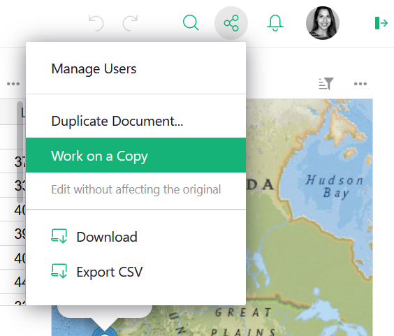
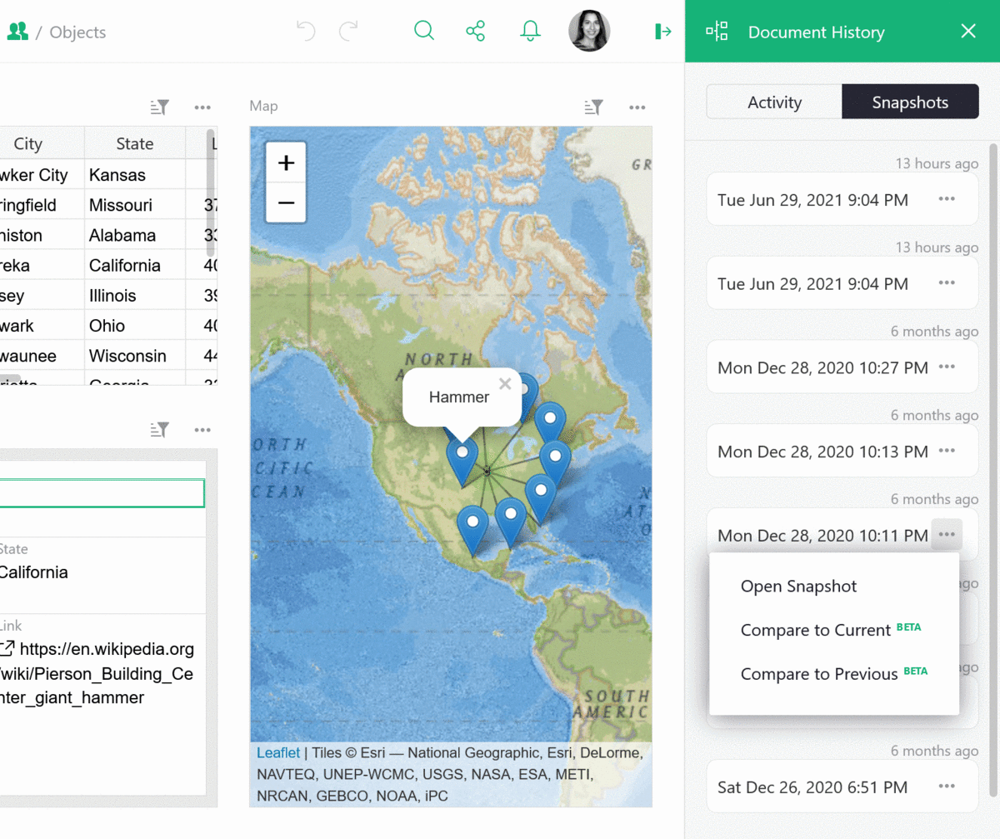

# Bulletin de Juin 2021

<table class="header" cellpadding="0" cellspacing="0" border="0"><tr>
  <td class="header-text">
    <table class="header-top"><tr>
      <td class="header-image">
        
      </td>
      <td class="header-top-text">
        
Grist for the Mill

        
Juin 2021
          &#8226; <a href="https://www.getgrist.com/">getgrist.com</a>

      </td>
    </tr></table>
    

      Bienvenue dans notre bulletin mensuel de mises à jour et de conseils pour les utilisateurs de Grist.
    

  </td>
</tr></table>

## Quoi de Neuf

### Geler des Colonnes

Vous pouvez désormais geler des colonnes dans Grist ! Maîtrisez ces feuilles de calcul larges et visualisez vos données à votre manière.

**
{: .screenshot-half }

### Éditeur en Lecture Seule

Les membres de l'équipe avec un accès en lecture seule peuvent désormais ouvrir un éditeur de cellule pour lire plus facilement de longs textes, accéder aux pièces jointes ou jeter un coup d'œil aux formules. Ils seront toujours empêchés de modifier la cellule, comme indiqué par l'icône de verrou gris.

*Éditeur de cellule en lecture seule verrouillé pour les modifications v. éditeur de cellule non restreint*
{: .wide-img-caption}

## Conseils Rapides

- 
  **Dupliquer le Document v Travailler sur une Copie.** Lors de la modification de la structure d'un document, il est bon de `Travailler sur une copie`. Cela ne sauvegarde pas automatiquement un duplicata de votre document. Cela crée une copie de travail non sauvegardée où vous pouvez effectuer des modifications, puis choisir de remplacer le document actuel, copier vos nouvelles modifications dans un nouveau document ou abandonner vos modifications.

    `Dupliquer le Document` crée un nouveau document dupliqué, et vous pouvez choisir de copier ou non les données ou de conserver uniquement la structure du document.

**
{: .screenshot-half}

- 
  **Exporter des Sauvegardes.** Grist prend périodiquement des instantanés de vos documents. Vous pouvez sauvegarder n'importe quelle version de votre document (instantanés actuels ou historiques) pour sauvegarder vos données. Pour sauvegarder des instantanés historiques, cliquez sur `Historique du Document` puis `Instantanés`. Sélectionnez le menu de n'importe quel instantané puis cliquez sur `Ouvrir l'Instantané`. Cliquez sur l'icône de partage pour ouvrir un menu à partir duquel vous pouvez télécharger l'intégralité du document en tant que [fichier Grist](../exports.md#backing-up-an-entire-document).

**
{: .screenshot-half }

- 
  **Combiner des champs de texte avec des formules.** Il peut arriver que vous ayez du texte dans plusieurs colonnes que vous souhaitez afficher dans une seule colonne. Par exemple, une table peut avoir des colonnes de prénom et de nom de famille. Vous pouvez facilement créer une colonne de nom complet avec la formule
  `"{}, {}".format($Last_Name, $First_Name)`{: .formula}. La partie entre guillemets est une chaîne de format : chaque ensemble d'accolades (`{}`) dans celle-ci est remplacé par la valeur suivante des parenthèses après `format`. Dans ce cas, le nom complet serait affiché comme `Benson, Carla`.

## Approfondir

### Analyser les Données avec des Tables Résumées et des Formules

Les tables résumées et les formules sont des outils essentiels pour obtenir des informations exploitables à partir de vos données. Elles permettent de regrouper les enregistrements en catégories spécifiques, puis de calculer des sommes en utilisant ces groupes d'enregistrements. Grist facilite la création de tables résumées et le travail avec le champ `$group` dans les formules résumées.

[Nous avons créé un tutoriel vidéo](../examples/2021-06-timesheets.md) qui vous aide à maîtriser deux concepts clés : les tables résumées et les formules résumées. Le tutoriel vous guide dans la création de deux pages résumées dans un modèle avancé de suivi des feuilles de temps.

[APPRENDRE : Tables Résumées](../examples/2021-06-timesheets.md)
{: .grist-button}

## Nouveau Modèle

### Suivi Avancé des Feuilles de Temps

Le suivi des feuilles de temps facilite le suivi des feuilles de temps des contractuels sur plusieurs mois et départements. Il dispose d'un tableau de bord où les contractuels peuvent soumettre leurs heures directement dans Grist et voir uniquement leurs données historiques de feuilles de temps. Le service de paie de l'entreprise peut voir les feuilles de temps de tout le monde, dans tous les comptes, sur tous les mois, et avoir accès à des pages résumées fournissant des données utiles sur les dépenses. Ils peuvent également définir des permissions pour autoriser ou interdire les modifications des feuilles de temps certains mois.

Le tutoriel des tables résumées commence par une version inachevée du modèle et vous guide dans la création de deux nouvelles pages. Si vous souhaitez utiliser le modèle complet, allez à la solution du tutoriel. Notez qu'il y a des permissions avancées en place pour le modèle complet qui vous empêcheront de voir certaines pages et la plupart des données. Faites une copie pour devenir le propriétaire du document et voir toutes les données et pages.

[Voir le Modèle](https://public.getgrist.com/uR353rDVZhmX/Time-Sheets-Template-Solution)
{: .grist-button}

*Faites une copie pour devenir le propriétaire du document et voir toutes les données et pages.*
{: .wide-img-caption}

**Besoin d'aide ?** Visitez notre [Centre d'Aide](../index.md), [regardez des tutoriels vidéo](https://www.youtube.com/channel/UCx0ioQrrC-bIrkmZ7ZULr0g/playlists), ou contactez-nous à <support@getgrist.com>.
