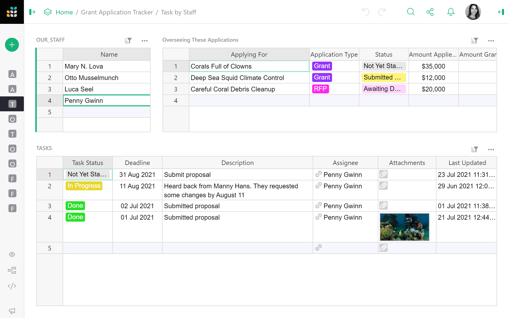

# Bulletin de Juillet 2021

<table class="header" cellpadding="0" cellspacing="0" border="0"><tr>
  <td class="header-text">
    <table class="header-top"><tr>
      <td class="header-image">
        
      </td>
      <td class="header-top-text">
        
Grist pour le Moulin

        
Juillet 2021
          &#8226; <a href="https://www.getgrist.com/">getgrist.com</a>

      </td>
    </tr></table>
    

      Bienvenue dans notre bulletin mensuel de mises à jour et de conseils pour les utilisateurs de Grist.
    

  </td>
</tr></table>

## Quoi de Neuf

### Couleurs !

Faites ressortir votre document Grist avec des couleurs ! Les options dans les colonnes Choix et Liste de choix peuvent désormais être codées par couleur. En plus de rendre vos documents plus attrayants et amusants, les choix de couleurs facilitent la lecture et la compréhension rapide des informations. [En savoir plus.](../col-types.md#choice-columns)

### Intégration avec Google Sheets

Vous pouvez désormais importer ou exporter facilement vos données vers et depuis Grist et Google Drive. [En savoir plus.](../imports.md#import-from-google-drive)

### Horodatages Automatiques et Stamps Utilisateur

Vous voulez savoir quand un enregistrement a été mis à jour et par qui ? Il est maintenant possible de créer des colonnes qui estampillent le nom d'un utilisateur ou l'heure à un enregistrement lorsqu'il est mis à jour ou créé. En savoir plus sur les [horodatages](../timestamps.md) et les [stamps d'auteur](../authorship.md).

[Nous avons également créé un tutoriel vidéo étape par étape](../examples/2021-07-auto-stamps.md) qui vous guide pour créer des colonnes d'horodatage et de stamp utilisateur.

## Nouvelles Ressources

### Présentation du Forum Communautaire Grist

Nous avons lancé un Forum Communautaire Grist où vous pouvez rapidement rechercher des solutions, partager des idées de projets, fournir des commentaires, suggérer des fonctionnalités et rester informé des dernières fonctionnalités et annonces de Grist.

[Visiter le Forum](https://community.getgrist.com/){:target="\_blank"}
{: .grist-button}

### Visitez notre Feuille de Route Produit

Vous voulez savoir sur quoi nous travaillons ? Notre feuille de route produit est désormais publique ! Si vous avez un compte Github, nous vous encourageons à laisser des commentaires sur les éléments de la feuille de route. Nous aimons avoir de vos nouvelles.

[Visiter la Feuille de Route](https://github.com/gristlabs/grist-core/projects/1){:target="\_blank"}
{: .grist-button}

## Conseils Rapides

- **Meilleures pratiques pour les colonnes de référence.** Lors de la création d'une colonne de référence, il est recommandé de choisir une colonne d'affichage qui est un identifiant unique pour l'enregistrement. Par exemple, pour les enregistrements de personnes, cela pourrait être le nom complet ou l'email.

    Pour afficher d'autres données, telles que le département ou l'anniversaire, utilisez la formule `$[Reference Column Id].[Referenced Record’s Field]`, (par exemple `$Person.Department`). Vous pouvez consulter le fonctionnement de cette formule dans notre [guide des colonnes de référence](../examples/2021-05-reference-columns.md).

- **Étiqueter les hyperliens avec du texte.** Dans les colonnes d'hyperliens, vous pouvez étiqueter un lien avec du texte en ajoutant une étiquette avant l'url : `[étiquette du lien] url`. Les crochets ne sont pas nécessaires.

    

- **Utiliser la recherche pour trouver une fiche.** Si vous avez une vue fiche sur une page et que vous souhaitez rapidement trouver la bonne fiche, vous pouvez utiliser la barre de recherche sur la page pour rapidement afficher la fiche pertinente.

    

## Approfondir

### Créer Facilement des Horodatages Automatiques et Stamps Utilisateur

Il est parfois utile de savoir quand un enregistrement a été mis à jour ou créé pour la dernière fois, et par qui. Grist rend simple la création de colonnes qui estampillent l'heure ou le nom d'un utilisateur à un enregistrement lorsqu'il est mis à jour ou créé.

[Nous avons créé un tutoriel vidéo](../examples/2021-07-auto-stamps.md) qui vous guide pour créer des colonnes d'horodatage et de stamp utilisateur en 3 étapes faciles.

[APPRENDRE : Horodatages/Stamps Utilisateur](../examples/2021-07-auto-stamps.md)
{: .grist-button}

## Nouveau Modèle

### Suivi des Demandes de Subventions et des Financements

Ce modèle aide les ONG à suivre les demandes de subventions qui ont été soumises aux fondations pour obtenir des financements. Le modèle inclut également une vue d'ensemble des financements qui montre les financements en cours et les financements attribués, répartis par programme de l'ONG.

[Ouvrir le Suivi des Subventions](https://templates.getgrist.com/sC5CAW41bVZU/Grant-Application-Tracker){:target="\_blank"}
{: .grist-button}

**Vous avez des questions, des commentaires ou besoin d'aide ?** Recherchez dans notre [Centre d'Aide](../index.md), [regardez des tutoriels vidéo](https://www.youtube.com/channel/UCx0ioQrrC-bIrkmZ7ZULr0g/playlists), ou contactez-nous à <support@getgrist.com>.