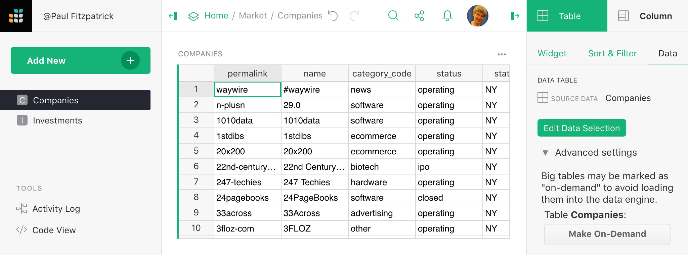

# Tables à la Demande

!!! warning "Les tables à la demande sont une fonctionnalité expérimentale"
    La conception des tables à la demande peut changer. Par exemple,
    des options de configuration peuvent être ajoutées, ou certains aspects du comportement des tables à la demande peuvent être entièrement modifiés.

Une caractéristique déterminante des tableurs est la capacité de mettre à jour instantanément les cellules lorsque les données dont elles dépendent changent. Mais parfois, une table n'est qu'un stockage de données, sans besoin de calculs sophistiqués. Dans ce cas, vous pouvez choisir de marquer la table comme "À la Demande" dans Grist. Grist peut alors servir les données de cette table plus rapidement et effectuer certaines optimisations qui peuvent être utiles lorsque la table devient grande et que les tables régulières deviennent lentes.

Lorsqu'une table est marquée "À la Demande" :

  - Les données de la table ne seront généralement pas disponibles pour une utilisation dans les formules.
  - La table reste disponible pour la visualisation et l'édition, mais avec des mises en garde.

Voici ce que vous devez savoir sur la visualisation des données :

  - La visualisation est limitée à 10000 lignes à la fois.
  - Des sous-ensembles des lignes de la table peuvent être sélectionnés en
    [liant des vues](linking-widgets.md), comme pour les tables régulières.
  - Vous pouvez vous attendre à de bonnes performances des vues liées lorsque le
    sous-ensemble des lignes de la table est inférieur à 10000 lignes, même si la
    table complète est beaucoup plus grande.

Voici ce que vous devez savoir sur l'édition des données :

  - Vous pouvez éditer les données normalement dans une table À la Demande.
  - Les mises à jour automatiques de tout ce qui dépend de ces données ne se produiront tout simplement pas.
  - Après les modifications, vous devez recharger la page web pour voir tout mis à jour.

Voici quelques raisons pour lesquelles vous pourriez rendre une table À la Demande :

  - Vous souhaitez créer des résumés et des graphiques de tranches d'un grand ensemble de données en utilisant des [vues liées](linking-widgets.md).
  - Vous stockez beaucoup de données dans la table, et tout ce que vous avez besoin de faire avec est de lire des parties de celles-ci via l'API.

## Créer une Table à la Demande

Pour convertir une table en table "À la Demande", ouvrez le panneau de droite,
choisissez le panneau "Table" et la section "Données". Cliquez sur

"Paramètres Avancés" et vous devriez voir un bouton "Rendre À la Demande".

Si vous changez d'avis et ne voulez plus que la table soit "À la Demande",
vous pouvez trouver un bouton pour annuler ce paramètre au même endroit :

Changer une table pour devenir "À la Demande" ou pour cesser d'être "À la Demande" forcera le document à se recharger pour tous les utilisateurs le visualisant à ce moment-là.

## Formules, Références et Tables à la Demande

En général, les formules et les tables à la demande ne vont pas ensemble. Cela dit,
si vous êtes prudent, vous pouvez utiliser les formules très simples suivantes :

 * `$colonne` - où la `colonne` mentionnée n'est pas elle-même une formule.
   Cela copie les données d'une autre colonne textuellement.
 * `$référence.colonne` - où `référence` est une [colonne de référence](col-refs.md),
   et `colonne` n'est pas elle-même une formule.

Ce support de formule est suffisant pour débloquer la fonctionnalité de [vues liées](linking-widgets.md) de Grist, c'est pourquoi elle est présente. En général, si vous essayez d'utiliser des formules et des tables À la Demande, vous vous préparez à être déçu. Rappelez-vous, comme toute modification d'une table À la Demande, lorsque vous ajoutez ou modifiez une colonne de formule, vous devrez généralement recharger pour voir les valeurs des cellules mises à jour.

Certaines conversions de type, comme la conversion d'une colonne en référence,
ne sont pas efficaces pour les tables À la Demande. Il est donc important d'effectuer
ces conversions avant de rendre une table À la Demande.

Depuis les formules dans les tables régulières, vous ne pouvez pas accéder au contenu des tables à la demande.