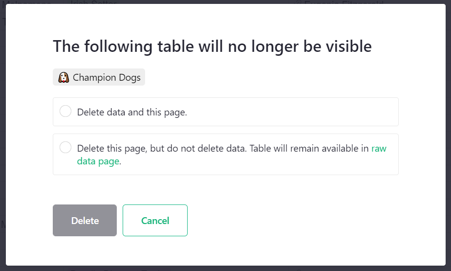
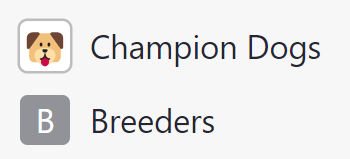
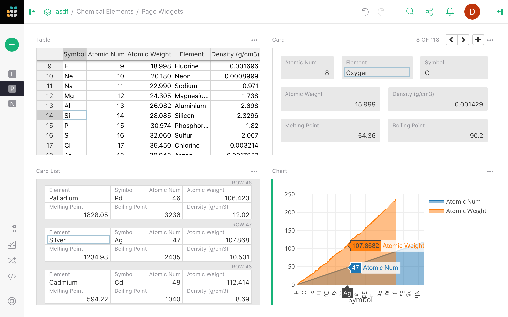
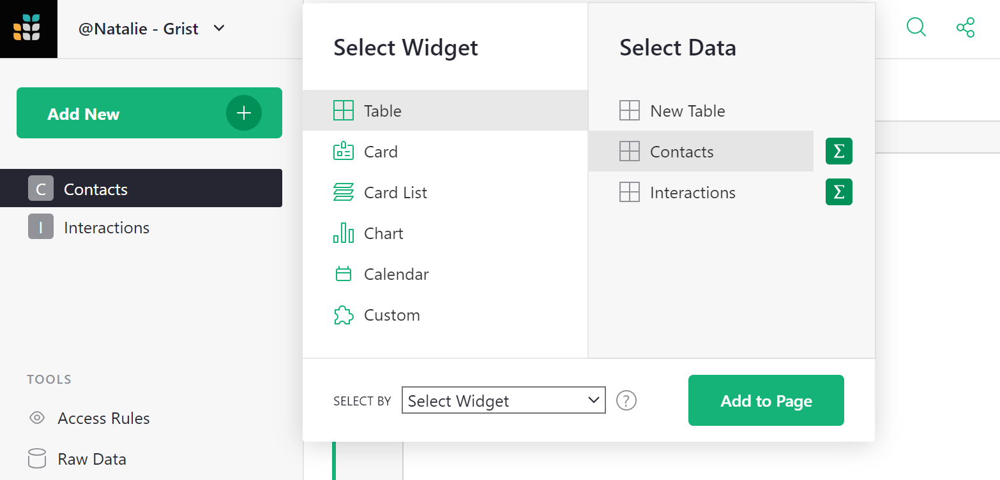
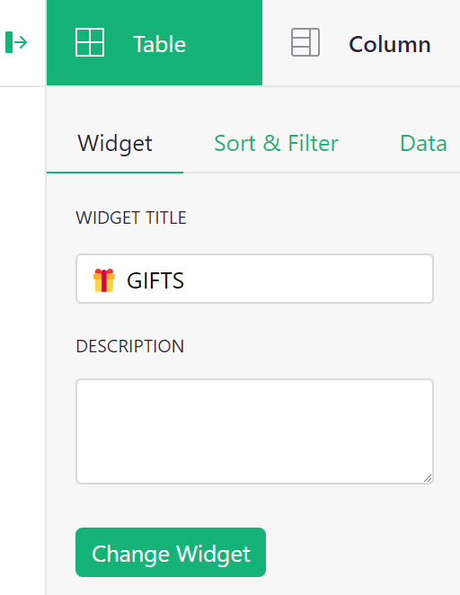
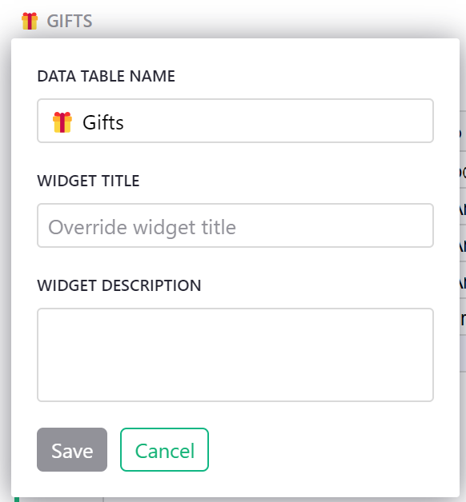
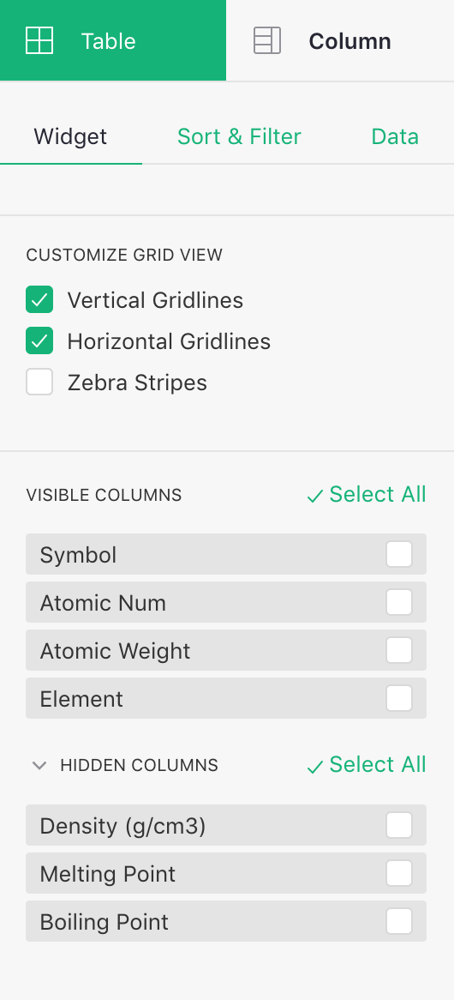
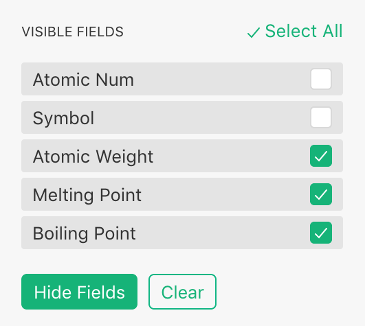

<iframe width="560" height="315" src="https://www.youtube.com/embed/vTfOUEFR73Y?rel=0" frameborder="0" allow="accelerometer; autoplay; encrypted-media; gyroscope; picture-in-picture" allowfullscreen></iframe>

## Pages & widgets {: data-toc-label='' }

Contrairement aux tableurs traditionnels, dans Grist, vous pouvez créer plusieurs vues des mêmes données et afficher plusieurs ensembles de données sur une seule page. Cela vous permet de créer des tableaux de bord utiles et des applications personnalisées adaptées à vos besoins.

## Pages

Dans Grist, vous organisez votre document en "pages". Celles-ci sont listées dans le panneau de gauche, avec des groupes repliables. Vous pouvez réorganiser et regrouper les pages dans le panneau de gauche en les faisant glisser pour les adapter à vos besoins.

**
{: .screenshot-half }

Vous pouvez renommer, supprimer ou dupliquer des pages en utilisant le menu à trois points à côté du nom de la page dans la liste.

**
{: .screenshot-half }

* **Renommer** la page ne modifie pas les noms des tables de données ou les titres des widgets. Voir [changer le widget](page-widgets.md#changing-widget-or-its-data) ci-dessous pour apprendre comment modifier les noms des tables et des widgets.
* **Dupliquer** une page duplique les *vues* des données et ne duplique pas les données elles-mêmes.
* **Supprimer** une page ne supprime pas les données. Lors de la suppression de la dernière vue des données, il vous sera demandé si vous souhaitez supprimer uniquement la vue, mais pas les données elles-mêmes ; ou si vous souhaitez supprimer à la fois la page et la ou les tables de données sous-jacentes. En savoir plus sur les données de votre document dans la [page des données sources](raw-data.md).

**

Notez que les pages peuvent également être renommées en cliquant sur le nom de la page en haut de l'écran.

**
{: .screenshot-half }

En utilisant l'icône d'ouverture () près du haut du panneau de gauche, vous pouvez réduire le panneau pour n'afficher que les initiales de chaque page, laissant plus d'espace à l'écran pour visualiser vos données.

Pour ajouter une nouvelle page, utilisez le bouton "Ajouter Nouveau" et cliquez sur "Ajouter Page". À ce moment-là, vous pourrez choisir le widget de page à inclure dans la nouvelle page.

!!! note "Utilisation des émojis dans les noms de pages et de widgets"
    Vous pouvez ajouter n'importe quel émoji à un nom de Page ou de Widget. Le raccourci clavier pour ouvrir le clavier des émojis est `Logo Windows` + `.` (point) sur PC ou `Commande` + `Contrôle` + `Espace` sur Mac. Vous pouvez également copier/coller une source en ligne comme [Emojipedia](https://emojipedia.org/).

    Lorsqu'un nom de Page commence par un émoji, il remplacera l'icône de la page.

    **
    {: .screenshot-half }

## Widgets de page

Une page contient des sections, telles que des tableaux ou des graphiques, que nous appelons "widgets de page". Chaque widget de page affiche des données provenant d'une table. Une page peut contenir plus d'un widget de page, et vous pouvez les organiser et les lier pour créer des mises en page utiles.

Voici les types de widgets de page pris en charge. Les caractéristiques saillantes de chacun sont décrites sur des pages séparées.

- [Tableau](widget-table.md) : similaire à la grille de tableur et un bon moyen de voir de nombreux enregistrements à la fois.
- [Fiche](widget-card.md) : affiche un seul enregistrement dans une mise en page de type formulaire que vous pouvez personnaliser.
- [Liste de fiches](widget-card.md) : utilise les mêmes options de mise en page qu'une fiche, affiche une liste déroulante d'enregistrements.
- [Graphique](widget-chart.md) : trace des données sur un graphique avec prise en charge de plusieurs types de graphiques différents.
- [Calendrier](widget-calendar.md) : affiche les données d'événements dans une vue calendrier.
- [Personnalisé](widget-custom.md) : insère une page web personnalisée, lui accordant éventuellement l'accès aux données du document.

Il existe une page spéciale appelée [données sources](raw-data.md) qui répertorie toutes les tables de données de votre document et résume les statistiques d'utilisation de votre document. Accédez à la page des données sources en cliquant sur le lien Données Sources en bas à gauche du menu des pages.

## Sélecteur de widgets

Le menu ouvert par le bouton "Ajouter Nouveau" propose les options "Ajouter Page" et "Ajouter Widget à la Page". Dans les deux cas, vous verrez le "sélecteur de widget de page" où vous pourrez choisir le widget souhaité :

**

Vous pouvez sélectionner le type de widget et la table de données à afficher (ou "Nouvelle Table" pour créer une nouvelle table). L'icône "résumé" () vous permet de [résumer les données](summary-tables.md).

Lors de l'ajout d'un widget à une page _existante_, vous verrez également une option "Sélectionner Par", qui permet de lier ce widget à un autre déjà présent sur la page. Ce processus est décrit plus en détail dans [Lier les widgets](linking-widgets.md).

Une fois que vous avez ajouté des widgets, ils peuvent être déplacés et redimensionnés, comme décrit dans [Mises en page personnalisées](custom-layouts.md).

## Changer le widget ou ses données

Si vous souhaitez changer un widget ou les données qu'il affiche après son ajout, vous pouvez le faire. Cliquez sur le bouton à trois points en haut à droite de votre widget et sélectionnez "Options du widget". Cela ouvre le panneau de droite. Cliquez sur "Changer le widget".

**
{: .screenshot-half }

Vous pouvez ensuite utiliser le sélecteur de widget pour changer le widget ou les données qu'il affiche. Vous pouvez également modifier le titre du widget ou ajouter une description.

## Renommer les widgets

Vous pouvez renommer les widgets de plusieurs façons. Nous avons vu dans la section ci-dessus que vous pouvez modifier le titre d'un widget ou ajouter une description à partir de l'onglet Widget du panneau Créateur.

Une autre façon est de cliquer sur le titre du widget au-dessus d'un widget. À partir de là, vous pouvez modifier le titre du widget, le nom de la table de données sous-jacente ou ajouter une description. Par défaut, le titre du widget est le nom de la table de données. Pour remplacer cela, entrez un nouveau titre sous 'Titre du widget'. En savoir plus sur les tables de données dans la [page des données sources](raw-data.md).

**
{: .screenshot-half }

## Configurer les listes de champs

Bien que différents types de widgets de page aient des apparences très différentes, ils représentent tous une liste d'enregistrements. N'importe lequel des types de widgets peut être utilisé pour afficher les mêmes données sous-jacentes.

Dans un **Tableau**, chaque enregistrement est représenté par une ligne, et les colonnes représentent le même type de valeur pour chaque enregistrement.

Notez que la [page des données sources](raw-data.md) répertorie toutes les tables de données.

Dans une **Liste de fiches**, chaque ligne des données sous-jacentes est affichée comme une fiche. Chaque colonne des données correspond à un *champ* dans cette fiche. En parlant d'un widget Fiche, nous utiliserons le terme *"champ"*, qui est conceptuellement le même qu'une *"colonne"* dans un widget Tableau.

Une **Fiche** est comme une Liste de fiches, mais affiche une seule ligne de données à la fois.

Dans un **Graphique**, chaque ligne de la table de données sous-jacente devient un élément graphique, tel qu'un point sur un graphique en ligne, une barre dans un graphique à barres ou une tranche d'un graphique circulaire. Dans ce contexte, les colonnes de notre table de données sont mieux connues sous le nom de *"séries"* de données.

Cliquez sur l'icône d'ouverture () pour ouvrir le panneau de droite. En fonction du widget actuellement sélectionné, vous pourriez voir un onglet pour configurer une Colonne, un Champ ou une Série. Ces termes ne sont pas différents en substance, mais des termes différents ont plus de sens pour différents widgets.

**
{: .screenshot-half }

**
{: .screenshot-half }

**
{: .screenshot-half }

**
{: .screenshot-half }

En cliquant sur l'onglet widget (surligné en vert dans les images ci-dessus), vous verrez des sous-onglets pour "Widget", "Trier & Filtrer" et "Données". Nous nous concentrerons sur le premier : "Widget". Vous verrez des options spécifiques au type de widget sélectionné, et en dessous de cela deux listes : "Colonnes visibles" et "Colonnes cachées".

**
{: .screenshot-half }

Les "Colonnes cachées" sont les colonnes disponibles dans les données, mais non affichées dans ce widget. Dans une Fiche, ces listes apparaîtraient comme "Champs visibles" / "Champs cachés". Dans un graphique, elles apparaissent comme "Séries visibles" / "Séries cachées".

Ces listes vous permettent d'inclure, d'exclure ou de réorganiser les champs dans un widget. Lorsque vous déplacez votre souris sur les éléments de la liste, utilisez les icônes "œil" qui apparaissent pour les afficher ou les masquer. Alternativement, vous pouvez sélectionner plusieurs éléments en utilisant les cases à cocher et les masquer ou les afficher ensemble.

**
{: .screenshot-half }

**
{: .screenshot-half }

Cette liste ordonnée de champs peut être utilisée pour personnaliser n'importe lequel des types de widgets de page. Elle a une importance particulière dans le [widget Graphique](widget-chart.md), où différents types de graphiques et options vous obligent à placer les séries dans un certain ordre dans la liste "Séries visibles" pour garantir que vos données sont tracées correctement.
