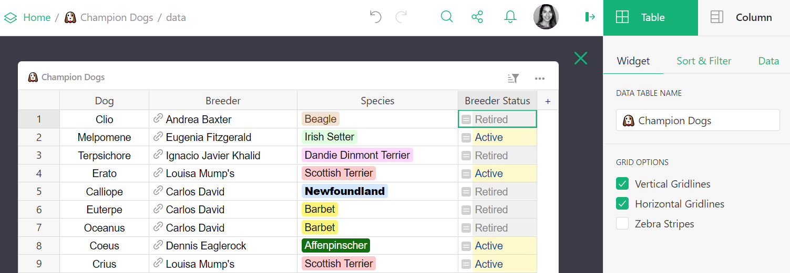

# Données sources

La page des données sources est une page spéciale qui répertorie toutes les [tables de données](glossary.md#data-table) de votre document et résume les statistiques d'utilisation de votre document.

Depuis votre document, accédez à la page des données sources en cliquant sur le lien 'Données Sources' en bas à gauche du menu des pages.

**
{: .screenshot-half } 

Contrairement aux autres [pages](page-widgets.md), la mise en page de la page des données sources ne peut pas être personnalisée. À partir de la liste des tables de données, vous pouvez trouver le nom et l'identifiant de la table de données, et supprimer des données. Notez que supprimer une table de données depuis cette page *supprimera* les données et les retirera de toutes les pages. Cela diffère des autres pages où il est possible de supprimer une vue des données sans supprimer les données elles-mêmes.

Cliquez sur une table de données pour l'ouvrir. Notez que dans le panneau de création, le [type de vue](page-widgets.md#page-widgets) ne peut pas être modifié. Renommer la vue renomme également la table de données. Étant donné que les données sources sont destinées à montrer toutes les données, les colonnes ne peuvent pas être masquées non plus. Cependant, les colonnes peuvent être réorganisées, supprimées, créées et modifiées. Pour les créateurs, cette vue peut faciliter la modification de la structure des données, l'ajout de [formules](formulas.md), de [mise en forme conditionnelle](conditional-formatting.md), etc.

## Dupliquer des Données

Les tables peuvent être dupliquées depuis la page 'Données Sources'. Cliquez sur l'icône à trois points à droite de la table que vous souhaitez dupliquer, puis sélectionnez 'Dupliquer la Table' dans le menu.

Par défaut, une table dupliquée ne contiendra que la structure de la table, pas les données. Si vous souhaitez copier toutes les données en plus de la structure de la table, assurez-vous de cocher la case avant de cliquer sur 'Enregistrer'. Si la table d'origine a des permissions avancées, ces règles **ne seront pas** dupliquées. Seules les règles par défaut du document s'appliqueront à la table copiée.

**
{: .screenshot-half } 

La table dupliquée est une nouvelle table qui n'est pas liée à l'originale. Cela signifie que si vous mettez à jour les données dans la copie, la table originale ne sera pas mise à jour, et vice versa.

Notez qu'au lieu de dupliquer des tables, il est généralement préférable de segmenter les données en ajoutant une nouvelle colonne. Prenons l'exemple des dépenses. Plutôt que d'avoir des tables séparées pour les dépenses de chaque mois, il est préférable d'inclure toutes les données dans une seule table et de créer une nouvelle colonne appelée **Mois** pour segmenter les lignes par mois. En général, si vous avez plusieurs tables avec des colonnes presque identiques, cela indique que les données pourraient toutes être dans la même table. Cela peut faciliter l'analyse des données.

## Utilisation

Les statistiques d'utilisation sont résumées sous la liste des tables de données. Notez que l'utilisation s'applique à l'ensemble du document, et non aux tables individuelles. En savoir plus sur les [limites](limits.md) du document.

