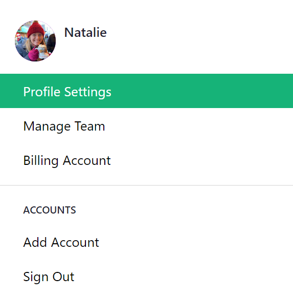

# Utilisation de l'API Grist

Grist dispose d'une API pour manipuler des documents, des espaces de travail et des espaces d'équipe.

- [Référence de l'API](api.md) montre la documentation de tous les points de terminaison disponibles.
- [Console API interactive](https://docs.getgrist.com/apiconsole) vous permet de faire des appels API en utilisant votre connexion Grist.

## Authentification

Pour accéder à l'API Grist, vous aurez besoin d'une clé API. Une clé API est détenue par un seul utilisateur et possède les mêmes permissions que cet utilisateur. Pour activer l'accès à l'API pour vous-même, visitez vos [Paramètres de Profil](https://docs.getgrist.com/account). Vous pouvez toujours trouver cette page en cliquant sur votre photo de profil ou initiale en haut à droite de l'écran pour ouvrir le menu du compte. Ensuite, sélectionnez l'option "Paramètres de Profil":

**
{: .screenshot-half}

Cela affiche une boîte de dialogue avec toutes vos options de paramètres de profil. Faites défiler vers le bas jusqu'à la section "API".


Cliquez sur le bouton "Créer" pour créer une clé API.


Vous pouvez maintenant copier cette clé pour l'utiliser lors de vos appels API. Pour être clair, copiez la clé dans vos paramètres de profil, pas la clé dans la capture d'écran ci-dessus, qui n'est pas une vraie. Vous pouvez révoquer votre clé API en cliquant sur "Supprimer" dans les Paramètres de Profil à tout moment. Vous aurez alors la possibilité d'en créer une nouvelle si vous le souhaitez.

Pour tester votre clé API, essayez ceci depuis la ligne de commande (en substituant votre clé API):
```sh
curl -H "Authorization: Bearer <API-KEY-GOES-HERE>" https://docs.getgrist.com/api/orgs
```

Cela devrait renvoyer une liste d'organisations, ce que l'API appelle des [espaces d'équipe](team-sharing.md) et votre espace personnel. Votre espace personnel est accessible à `docs.getgrist.com`. Les espaces d'équipe sont accessibles à `<TEAM>.getgrist.com`.

## Utilisation

Pour accéder aux documents sur votre espace personnel via l'API, continuez simplement à utiliser le domaine `docs.getgrist.com`. Pour accéder aux documents et aux espaces de travail sur un espace d'équipe, utilisez `<TEAM>.getgrist.com`.

Par exemple, pour lister tous les espaces de travail et documents auxquels vous avez accès sur un site, faites :

```sh
curl -H "Authorization: Bearer <API-KEY-GOES-HERE>" \
  https://<docs|TEAM>.getgrist.com/api/orgs/current/workspaces
```

Lorsque vous apportez des modifications via l'API et que vous passez des données via le corps de la requête, assurez-vous de définir l'en-tête `Content-Type` à `application/json`. Par exemple, pour changer le nom d'un document, vous pourriez faire :

```sh
curl -XPATCH \
  -H "Authorization: Bearer <API-KEY-GOES-HERE>" \
  -H "Content-Type: application/json" \
  -d '{"name": "Plans de Leçon"}' \
  https://<docs|TEAM>.getgrist.com/api/docs/<DOC-ID-GOES-HERE>
```

Pour plus de détails sur les points de terminaison disponibles, consultez notre [documentation API](api.md) ou la [console API interactive](https://docs.getgrist.com/apiconsole).

Des bibliothèques clientes sont également disponibles :

 * [Bibliothèque cliente JavaScript/TypeScript](https://www.npmjs.com/package/grist-api)
 * [Bibliothèque cliente Python](https://pypi.org/project/grist-api/)