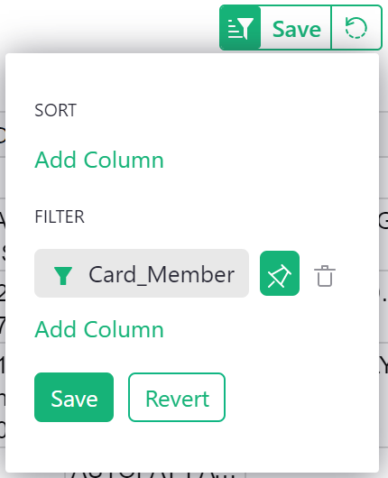
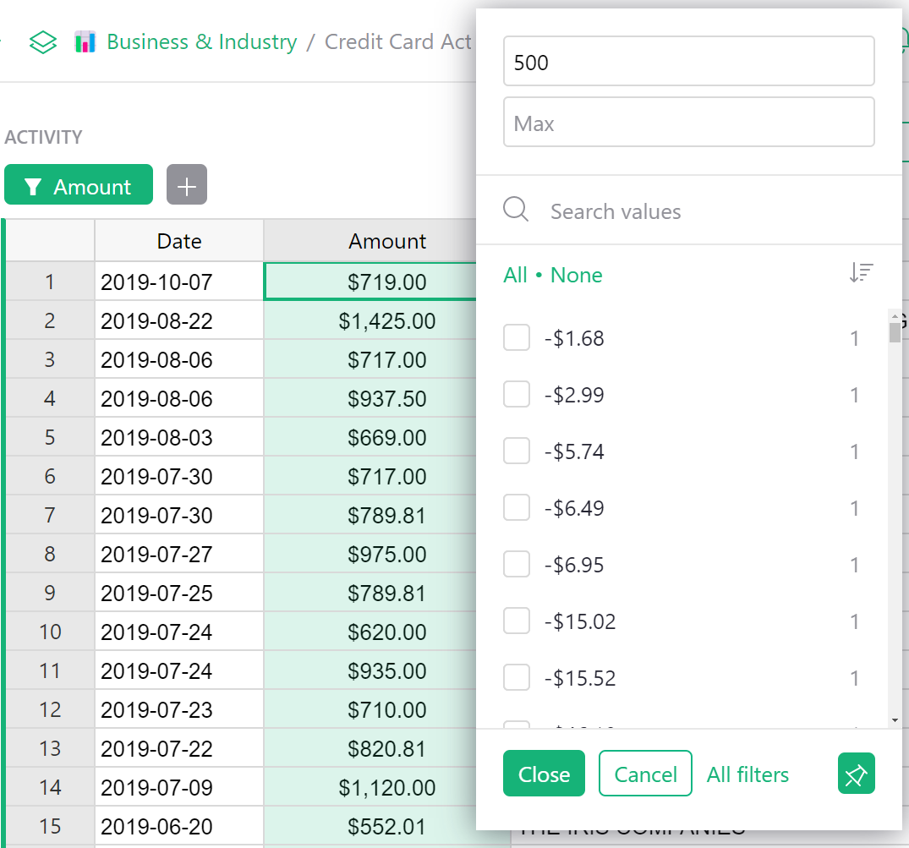
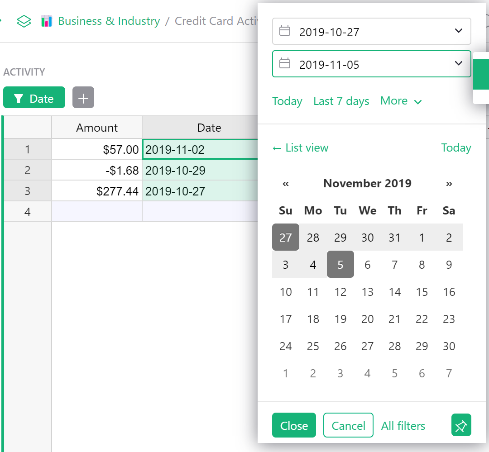
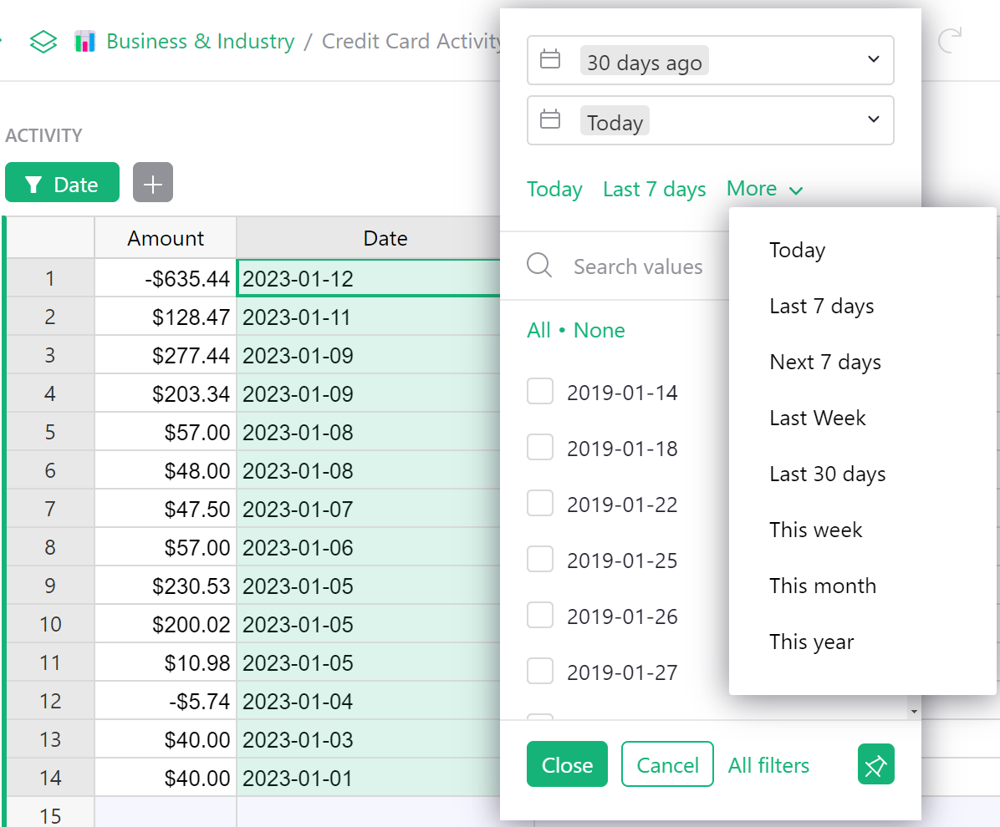
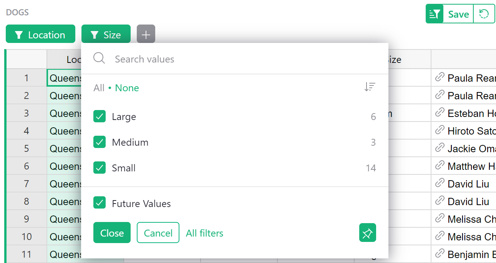

# Recherche, Tri et Filtrage

Grist offre plusieurs façons de rechercher dans vos données, ou d'organiser les données pour les avoir à portée de main.

## Recherche

En haut de l'écran du document, vous verrez une icône de loupe
()
qui ouvre une recherche de type tableur.

**
{: .screenshot-half }

Vous pouvez également commencer à rechercher en utilisant le raccourci clavier
<code class="keys">*⌘* *F*</code> (Mac) ou <code class="keys">*Ctrl* + *F*</code> (Windows).

Lorsque vous tapez dans la zone de texte de recherche, Grist déplacera le curseur vers la cellule suivante contenant votre texte de recherche. S'il n'y a plus de correspondances dans la vue ou la page actuelle, le curseur se déplacera vers la vue suivante ou passera à la page suivante.

## Tri

Il est facile de trouver un mot dans un dictionnaire, mais ce ne serait pas le cas si les mots n'étaient pas triés ! Grist offre des options de tri flexibles et pratiques, qui sont assez différentes d'un tableur traditionnel.

Pour trier une table dans Grist par une colonne, ouvrez le menu à partir de l'en-tête de la colonne et sélectionnez "Trier":

**
{: .screenshot-half }

Dans le même élément de menu, vous pouvez choisir de trier par ordre croissant ou décroissant.

**Différence par rapport à Excel** :
Il est important de noter que le tri ne change aucun calcul de formule, il ne change que l'ordre dans lequel vous voyez les enregistrements. Cela est différent des tableurs comme Excel.

Une autre différence est que le paramètre de tri est "actif" : si vous ajoutez un enregistrement ou modifiez une cellule utilisée pour le tri, l'enregistrement se déplacera à sa position correcte dans l'ordre de tri. Voir [Enregistrer les positions des lignes](#saving-row-positions) ci-dessous pour une option plus similaire au comportement d'Excel.

### Colonnes Multiples
Lorsque vous triez une table, vous pouvez cliquer sur une autre colonne pour l'ajouter au tri :

**
{: .screenshot-half }

La deuxième colonne détermine l'ordre des enregistrements dont les valeurs dans la première colonne sont les mêmes. Vous pouvez ajouter plus de colonnes au tri. Par exemple, vous pourriez :

- Trier les employés d'abord par Département, puis par Nom de famille, puis par Prénom.
- Trier les transactions d'abord par Date, puis par Montant.
- Trier les tâches d'abord par la colonne 'Est Complété', puis par Priorité.

### Enregistrer les Paramètres de Tri

Comme le tri n'affecte que votre vue des données, vous pouvez trier les données dans un document Grist même si vous n'avez pas accès en écriture à celui-ci. Si vous *pouvez* écrire dans un document, vous pouvez également enregistrer les paramètres de tri.

Lorsque vous modifiez le tri sur une table, l'icône en haut de celle-ci devient verte. Cliquez dessus pour voir le paramètre actuellement actif, ainsi que les options pour les manipuler (par exemple, supprimer une colonne du tri), enregistrer le paramètre ou annuler vos modifications :

**
{: .screenshot-half }

Lorsque vous enregistrez les paramètres de tri, ils s'appliqueront à la vue chaque fois que cette page sera ouverte, que ce soit par vous ou d'autres collaborateurs.

**Vues Multiples** :
Tout comme vous pouvez créer plusieurs pages affichant les données de la même table, vous pouvez avoir différents paramètres de tri sur chaque vue des données. Par exemple, vous pourriez avoir une vue affichant les transactions de carte de crédit triées par date, et une autre les affichant triées par montant.

### Tri à partir du Panneau Latéral
Vous pouvez trier des vues autres que la Table, telles que la Liste de Fiches ou le Graphique, en utilisant l'onglet "Trier & Filtrer" dans le panneau latéral :

**
{: .screenshot-half }

Vous pouvez ajouter une ou plusieurs colonnes, enregistrer ou annuler les paramètres et utiliser des options de tri avancées.

### Options de tri avancées
L'onglet "Trier & Filtrer" expose des options de tri supplémentaires qui peuvent être utiles pour divers types de colonnes :

- `Utiliser la position des choix` -- disponible sur les colonnes [Choix](col-types.md#choice-columns), trie les enregistrements en utilisant l'ordre configuré des éléments de choix, plutôt que leurs noms.
- `Valeurs vides en dernier` -- dans l'ordre alphabétique, les valeurs vides sont affichées en premier par défaut, utilisez cette option pour les mettre à la fin.
- `Tri naturel` -- pour la colonne Texte, traitera les nombres à plusieurs chiffres dans les chaînes comme s'ils étaient un seul caractère, permettant un ordre plus convivial. Par exemple, en utilisant le `tri naturel`, _Produit10_ sera positionné après _Produit2_.

**
{: .screenshot-half }

### Enregistrer les Positions des Lignes

Lorsque vous utilisez le panneau latéral, vous remarquerez un bouton supplémentaire : "Mettre à jour les données". Si vous cliquez dessus, la position actuelle des enregistrements les uns par rapport aux autres est enregistrée, et le tri actif par vos colonnes sélectionnées est désactivé.

En d'autres termes, les lignes ne sauteront plus en place selon les valeurs de certaines colonnes, mais resteront à leur place. Vous pourrez également réorganiser les lignes manuellement en les faisant glisser.

## Filtrage

Vous pouvez choisir de voir seulement un sous-ensemble de données dans une table en filtrant pour certaines valeurs dans une colonne. Ouvrez le menu de la colonne à partir de l'en-tête de la colonne et cliquez sur "Filtrer les données". Vous verrez une boîte de dialogue listant les valeurs dans la colonne :

**
{: .screenshot-half }

Décochez les valeurs que vous ne voulez pas voir, ou cliquez sur "Aucune" puis cochez seulement les valeurs que vous voulez voir. La barre de recherche en haut de la boîte de dialogue vous permet de trouver des valeurs d'intérêt si la liste est longue.

Cliquez sur "Appliquer" pour appliquer votre paramètre.

Vous pouvez filtrer par plus d'une colonne. Seules les lignes correspondant à tous les filtres apparaîtront.

Comme pour le tri, vous pouvez enregistrer les filtres dans la vue. Cliquez sur l'icône "Trier & Filtrer" en surbrillance en haut de la table :

**
{: .screenshot-half }

Vous verrez les colonnes pour lesquelles il y a des filtres actifs, et des options pour enregistrer le filtre ou revenir aux paramètres enregistrés.

Comme pour le tri, vous pouvez créer différentes vues ou pages affichant la même table avec des paramètres de filtre différents. Par exemple, vous pourriez avoir une page affichant les participants à un événement avec le statut "Confirmé" et une autre affichant ceux avec le statut "En attente".

## Filtrage par Intervalle

Certains types de colonnes permettent de filtrer dans un intervalle de valeurs.

Lors du filtrage d'une colonne de type numérique ou entier, vous avez la possibilité de filtrer dans un intervalle de nombres. Par exemple, si vous ne voulez voir que les achats de grande valeur dans une [table des transactions par carte de crédit](https://templates.getgrist.com/2i9WoHs2oRzK/Credit-Card-Activity-Template-AmEx/p/1), vous pouvez ajouter un filtre pour la colonne montant et entrer une valeur minimale de 500 $. La table sera filtrée pour afficher toutes les transactions avec un montant de 500 $ ou plus.

**
{: .screenshot-half }

Lors du filtrage d'une colonne de type date ou datetime, vous avez la possibilité de filtrer dans un intervalle de dates spécifié. L'intervalle peut être entré dans les champs "Début" et "Fin", ou sélectionné sur un calendrier.

Peut-être êtes-vous parti en vacances et souhaitez voir toutes les transactions pendant cette période. Nous pourrions ajouter un filtre à la colonne Date pour voir toutes les transactions dans l'intervalle de dates du voyage.

**
{: .screenshot-half }

Vous pouvez également filtrer les colonnes de type date et datetime par un intervalle relatif, qui est un intervalle relatif à la date d'aujourd'hui. Par exemple, vous pourriez vouloir filtrer les tâches à réaliser dans les 14 prochains jours. Ce filtre se mettra à jour chaque jour de sorte qu'il filtre toujours sur 14 jours dans le futur, par rapport à la date d'aujourd'hui.

Lors du filtrage d'une colonne de type date ou datetime, plusieurs intervalles relatifs sont suggérés comme raccourci, comme le montre l'image ci-dessous.

**
{: .screenshot-half }

Si vous utilisez le calendrier pour sélectionner un intervalle de dates, vous pouvez également convertir chaque date absolue en une date relative en sélectionnant dans la liste des dates relatives disponibles.

**
{: .screenshot-half }

### Épingler les Filtres

Les filtres peuvent être épinglés en haut d'une table pour un filtrage rapide. Par défaut, les filtres seront épinglés lorsqu'ils sont appliqués pour la première fois à une table. Pour désépingler un filtre, cliquez sur le bouton de filtre puis cliquez sur l'icône d'épingle. Si vous désépingler un bouton de filtre, tous les filtres enregistrés seront toujours appliqués mais le bouton ne sera plus visible.

**
{: .screenshot-half }

Il peut être utile d'enregistrer les boutons sans aucun filtrage pour créer une barre d'outils de filtrage rapide.

Si vous enregistrez les paramètres avec des filtres appliqués, cela les enregistre pour les sessions futures et les autres membres de l'équipe verront la même chose.

**
{: .screenshot-half }

### Filtres Complexes

Pour filtrer des conditions plus complexes, créez une nouvelle colonne de formule et filtrez cette colonne pour les valeurs "true".

Par exemple, pour filtrer "Personnes avec un salaire supérieur à 100 000 $ ou un poste de 'Membre du Conseil'", vous pouvez utiliser une formule comme celle-ci :

  `$Salary > 100000 or $Position == 'Board Member'`{: .formula }

Cela produira une colonne de valeurs vraies et fausses, que vous pouvez filtrer pour la valeur `true`.
