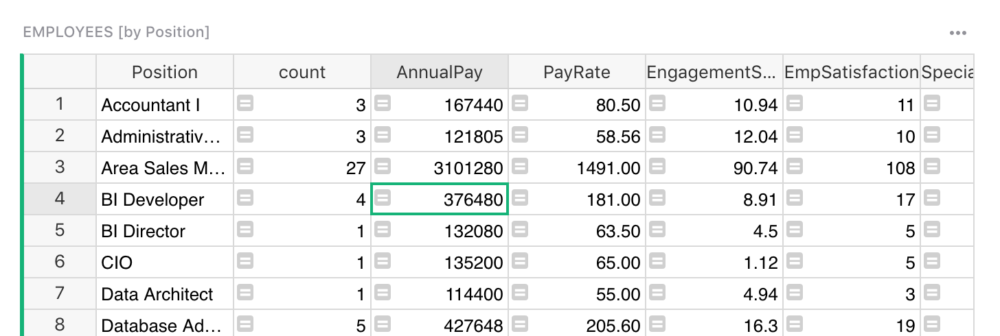
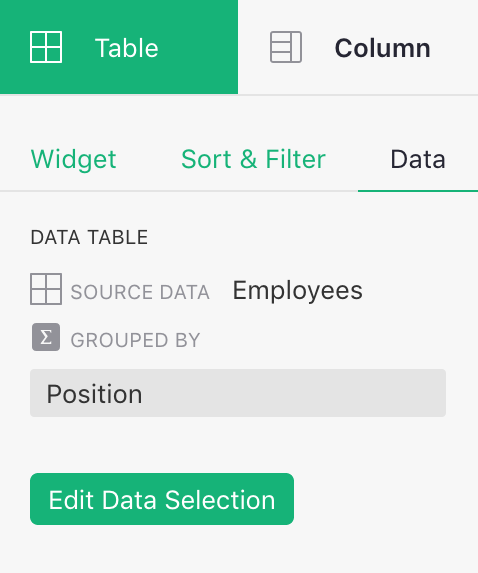
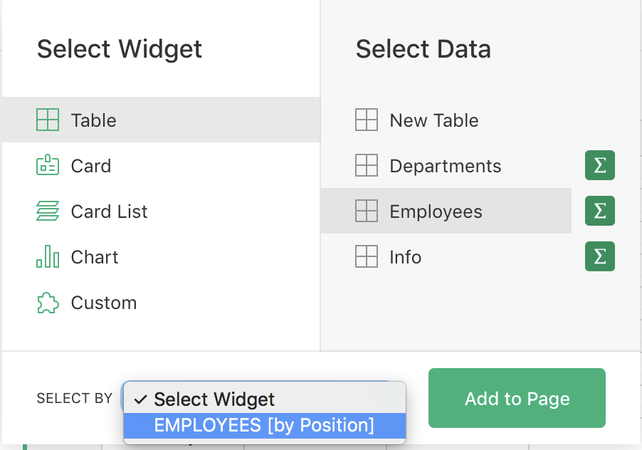

# Tables de synthèse

Les tables de synthèse sont l'outil principal de l'analyse de données dans Grist. Elles sont similaires aux "tableaux croisés dynamiques" dans les feuilles de calcul, et aux clauses `GROUP BY` dans les bases de données. Elles vous permettent d'obtenir des totaux pour l'ensemble de la table ou des sous-totaux.

Les tables de synthèse ont de nombreuses utilisations :

  - Grouper les projets par statut ou par priorité.
  - Résumer les transactions bancaires par année, par trimestre ou par catégorie.
  - Grouper les employés par poste, par genre ou par département.
  - Résumer par n'importe quelle combinaison, telle que poste *et* genre *et* département.
  - Grouper tous les enregistrements pour calculer des totaux et des statistiques pour l'ensemble de la table.

## Ajouter des synthèses

Cliquez sur le bouton "Ajouter" et sélectionnez "Ajouter une page" ou "Ajouter une vue à la page". Dans le sélecteur de vues, cliquez sur l'icône de sommation () à côté de la table que vous souhaitez résumer.

**
{: .screenshot-half }

Lors de la création d'une table de synthèse, vous choisissez un champ ou une combinaison de champs par lesquels les données doivent être groupées. Ceux-ci sont appelés les champs "Grouper par". La table de synthèse contiendra une ligne pour chaque valeur de regroupement. Par exemple, si "Poste" est sélectionné comme champ de regroupement, la table de synthèse contiendra une ligne pour chaque poste.

Les formules puissantes de Grist permettent ensuite des calculs arbitraires sur les sous-ensembles correspondants des données sous-jacentes.

Gardez à l'esprit que les champs de regroupement déterminent *quels* groupes doivent exister dans la table de synthèse. Ne sélectionnez pas les valeurs que vous souhaitez calculer (par exemple, pour le salaire moyen) comme champs de regroupement ; celles-ci seront créées à l'aide de formules à l'étape suivante.

!!! tip ""
    **Astuce :** Vous pouvez considérer les lignes d'une table de synthèse comme des compartiments dans lesquels vos enregistrements seront placés. Les champs de regroupement déterminent les étiquettes de ces compartiments. Par exemple, un résumé des projets groupés par statut (par exemple, "Actif", "Terminé", "Non commencé") aura trois compartiments, un pour chaque statut. Chaque projet va dans l'un de ces trois compartiments. Vous pouvez ensuite facilement calculer des informations pour chaque dossier, comme un décompte des projets ou le total de leurs coûts.

## Formules de synthèse

Lorsque vous ajoutez une table de synthèse, chacun des champs de regroupement sélectionnés devient une colonne dans la nouvelle table. *Tout* le reste dans la table de synthèse est calculé à l'aide de colonnes de formule. Certaines de ces colonnes sont créées automatiquement, par commodité.

Plus précisément, une colonne `count` sera ajoutée pour montrer le nombre d'enregistrements dans le groupe représenté par la ligne de synthèse actuelle. Et pour toute colonne numérique dans les données d'origine, la table de synthèse contiendra une colonne du même nom avec le total. Par exemple, le résumé des Employés groupés par Poste ressemblerait à ceci :

**
{: .screenshot-half }

!!! tip ""
    **Astuce :** Une vue de synthèse aura un en-tête comme "EMPLOYÉS [par Poste]", pour indiquer qu'elle montre les données de synthèse pour la table `Employés`, groupées par "Poste". Vous pouvez cliquer sur le titre pour le renommer.

Si vous sélectionnez une cellule dans une colonne comme `count` ou `AnnualPay` et appuyez sur <code class="keys">*Entrée*</code>, vous verrez les formules qui les calculent :

  - `count` est `len($group)`
  - `AnnualPay` est `SUM($group.AnnualPay)`

Le mystérieux `$group` est simplement une autre colonne, masquée par défaut (mais vous pouvez la rendre visible). Elle contient pour chaque cellule le groupe d'enregistrements représenté par cette ligne de synthèse.

!!! tip ""
    **Note pour les fans de Python.**
    `$group` est un objet Python spécial. C'est une collection itérable d'enregistrements. L'utilisation d'un attribut comme `$group.A` est un raccourci pour la liste des valeurs dans la colonne `A` de tous les enregistrements du groupe, similaire à `[r.A for r in $group]`.

    Si vous rendez cette colonne visible, elle apparaîtra comme une liste Python d'ID de lignes numériques qui identifient les enregistrements dans le groupe.

Parfois, les colonnes créées automatiquement n'ont pas de sens. Par exemple, la somme de `PayRate` n'est pas très significative. Supprimez simplement ces colonnes, soit en utilisant le menu de la colonne, soit en utilisant le raccourci clavier <code class="keys">*Alt* + *Moins*</code>.

Vous êtes libre de changer les formules pour les colonnes créées automatiquement, ou d'ajouter de nouvelles colonnes de formule. Notez que les tables de synthèse ne permettent pas d'ajouter des colonnes *non*-formule.

Par exemple, vous pourriez vouloir changer la formule pour `PayRate` de `SUM($group.PayRate)` à `AVERAGE($group.PayRate)`, ce qui serait une valeur plus intéressante.

**
{: .screenshot-half }

Voici quelques recettes utiles de formules dans les tables de synthèse :

  - **Moyenne** :  
    `AVERAGE($group.PayRate)` ou `SUM($group.PayRate) / $count`
  - **Écart type** :  
    `STDEV($group.PayRate)`
  - **Maximum ou minimum** :  
    `MAX($group.PayRate)`, `MIN($group.PayRate)`
  - **Somme sur un sous-ensemble d'enregistrements** :  
    `SUM(r.AnnualPay for r in $group if r.EmploymentStatus == "Active")`
  - **Moyenne pondérée** :  
    `AVERAGE_WEIGHTED(zip($group.Life_Expectancy, $group.Population))`

En fait, vous pouvez utiliser toute la puissance de Python pour calculer ce que vous souhaitez. Comme pour toute table, votre formule peut se référer à n'importe laquelle des colonnes de la table de synthèse, pas seulement à `$group`.

## Changer les colonnes de synthèse

Les colonnes de regroupement dans une table de synthèse sont créées lorsque vous ajoutez la vue. Il n'est pas possible de modifier les valeurs dans celles-ci, ni de modifier leurs paramètres, tels que le type. Les paramètres et les valeurs des colonnes de regroupement reflètent ceux de la table sous-jacente. Lorsque de nouvelles valeurs apparaissent dans la table sous-jacente pour les colonnes de regroupement, les tables de synthèse obtiendront également de nouvelles lignes automatiquement.

Ce que vous pouvez changer, c'est les colonnes par lesquelles la table est groupée. Cliquez sur les trois points en haut à droite de la table de synthèse, et cliquez sur "Sélection des données" :

**
{: .screenshot-half }

Les paramètres dans le panneau latéral vous indiquent quelles données sont affichées et comment elles sont groupées :

**
{: .screenshot-half }

Vous pouvez cliquer sur le bouton "Modifier la sélection des données" pour ouvrir le même sélecteur de vues que vous avez utilisé pour ajouter la table de synthèse. Vous pouvez maintenant désélectionner certains champs "Grouper par" et en sélectionner d'autres, puis cliquer sur "Enregistrer" pour mettre à jour la table de synthèse.

## Lier des tables de synthèse

Vous pouvez lier des tables de synthèse à d'autres vues. Si vous avez une table de synthèse sur une page, elle peut être utilisée comme sélecteur pour une table de données sous-jacentes, ou pour une synthèse plus détaillée.

Par exemple, si vous avez un résumé des `Employés` par "Poste", il sera disponible comme option "SÉLECTIONNER PAR" lors de l'ajout d'une table non résumée des `Employés` :

**
{: .screenshot-half }

Le résultat est que vous pouvez sélectionner un poste dans la table de synthèse, et voir tous les employés dans ce poste.

**
{: .screenshot-half }

Vous pourriez de même lier un résumé des `Employés` groupés par "Poste" et "Genre" à la première vue :

**
{: .screenshot-half }

Vous pouvez alors sélectionner un poste dans la vue "Employés [par Poste]", et voir une répartition par genre parmi les employés dans ce poste.

**
{: .screenshot-half }

Notez que ce type de liaison nécessite que la nouvelle vue inclue à la fois "Poste" *et* "Genre" dans ses colonnes de regroupement.

Pour en savoir plus sur la liaison, voir [Lier des vues](linking-widgets.md).

## Graphiques des données résumées

Les tables de synthèse sont une excellente source de données pour les graphiques, y compris les graphiques dynamiques. Dans l'exemple ci-dessus, nous pourrions ajouter une autre vue montrant les `Employés` groupés par "Poste" et "Genre", mais cette fois dans une vue graphique.

**
{: .screenshot-half }

Sélectionnez "Diagramme à barres" pour le type de graphique, et sélectionnez "Genre" et "AnnualPay" comme séries visibles. Vous pouvez maintenant cliquer sur un poste, et voir visuellement la différence de salaire moyen par genre pour ce poste.

**
{: .screenshot-half }

Le tutoriel [Analyser et visualiser](investment-research.md#dynamic-charts) montre d'autres exemples de graphiques basés sur des tables de synthèse.

## Détacher des tables de synthèse

Les tables de synthèse sont calculées à partir des données sous-jacentes. Parfois, cependant, il est utile de *"détacher"* une table de synthèse et de la transformer en une table de données indépendante.

Par exemple, nous avons vu comment résumer une table des `Employés`, en la groupant par la colonne "Poste". Disons que vous voulez associer des données à chaque poste, telles qu'une description de poste ou un code d'assurance pour les accidents du travail. Ces données appartiennent à leur propre table, avec une ligne pour chaque poste, et quelques colonnes.

Les tables de synthèse fournissent un moyen facile de créer une telle table. Ajoutez une page avec un résumé des `Employés` groupés par "Poste".

**
{: .screenshot-half }

Maintenant, dans l'onglet "Données" du panneau de droite, cliquez sur le bouton "Détacher".

**
{: .screenshot-half }

Votre table de synthèse vient d'être transformée en une toute nouvelle table avec les mêmes lignes et un nom généré automatiquement, comme "Table1". Vous pouvez la renommer en "Postes", et ajouter les colonnes dont vous avez besoin :

**
{: .screenshot-half }

Les colonnes calculées restent. En fait, tout ce que vous pourriez calculer sur chaque poste dans la table de synthèse "Employés [par Poste]", vous pouvez toujours le calculer dans la nouvelle table "Postes".

Une différence est que de nouvelles valeurs ne seront pas ajoutées automatiquement à la table détachée. En d'autres termes, si un poste jamais vu auparavant (peut-être "Responsable des troubles") apparaît dans les données sous-jacentes, une table de synthèse se mettrait à jour automatiquement pour l'inclure, mais une table détachée ne le fera pas.
