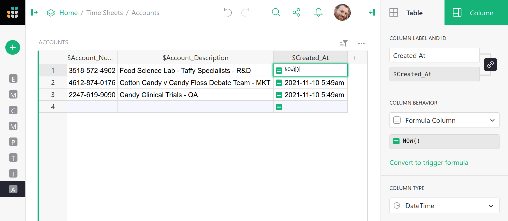
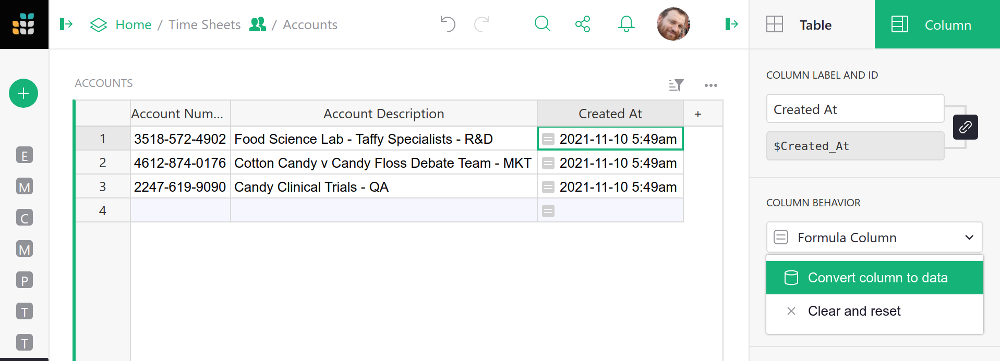

Colonnes de timestamp
===================

Il est parfois utile d'avoir des colonnes qui stockent le moment où des enregistrements individuels ont été créés et mis à jour. Cela est utile plus tard, par exemple pour trier les enregistrements par ancienneté ou fraîcheur. Grist vous permet de créer facilement de telles colonnes.

## Une colonne "Créé le"

Supposons que nous voulions une colonne qui stocke le moment où un enregistrement a été créé.
Comme première étape, ajoutez une colonne appelée (par exemple) `Créé le` et entrez `NOW()`{: .formula} comme formule.
Définissez le type de colonne sur `DateTime` (voir [Créer une colonne date/heure](dates.md#making-a-datetime-column))
et choisissez comment vous souhaitez que l'heure et la date soient affichées.

Ce que nous souhaitons, c'est que la valeur `Créé le` reste inchangée une fois définie, et soit calculée uniquement lors de la création d'un enregistrement. Pour que les valeurs restent inchangées une fois définies, nous devons changer le comportement de la colonne de `Colonne de formule` à `Colonne de données`.
Cliquez sur le menu déroulant `Comportement de la colonne`, et choisissez `Convertir la colonne en données` :

Maintenant, pour calculer les valeurs lors de la création d'un enregistrement, sélectionnez `Appliquer aux nouveaux enregistrements`.
Et voilà ! Tous les nouveaux enregistrements auront `Créé le` défini avec `NOW()`{: .formula} au moment de leur création.

## Une colonne "Mis à jour le"

Si nous voulons une colonne qui stocke le moment où un enregistrement est mis à jour (par opposition à créé),
la procédure est similaire à celle pour [une colonne "Créé le"](timestamps.md#a-created-at-column),
mais au lieu de `Appliquer aux nouveaux enregistrements`,
sélectionnez `Appliquer aux modifications des enregistrements`. Ensuite, sélectionnez `N'importe quel champ` (en supposant que vous voulez que tout changement dans un enregistrement soit considéré comme une mise à jour) et appuyez sur `OK`. Vous pouvez alternativement choisir quelles colonnes "compter" comme mises à jour et lesquelles ignorer.

!!! note ""
    **Il est toujours possible pour un utilisateur de modifier manuellement les cellules dans les colonnes `Créé le` et `Mis à jour le`. Si vous ne voulez pas que cela soit autorisé, utilisez les [permissions avancées](access-rules.md) pour l'interdire.**

Voici un exemple des nouvelles colonnes en action. Un nouvel enregistrement a été ajouté, pour
`Méthodes de livraison non orthodoxes`, et une heure de création et de mise à jour ont été définies automatiquement. Ensuite, la description de `Barbe à papa vs Barbe à papa` a été mise à jour,
et l'heure de mise à jour pour cet enregistrement a été définie automatiquement.
Il serait également simple d'ajouter des colonnes [Créé par](authorship.md#a-created-by-column)
et [Mis à jour par](authorship.md#a-created-by-column).

Créer les colonnes `Créé le` et `Mis à jour le` comme nous l'avons fait ici les a remplies pour toutes les lignes préexistantes avec la date et l'heure actuelles. Si vous préférez qu'elles soient laissées vides, faites simplement l'étape `Convertir en colonne de données` avant de définir une formule, puis définissez la formule dans la zone `Formule optionnelle`.