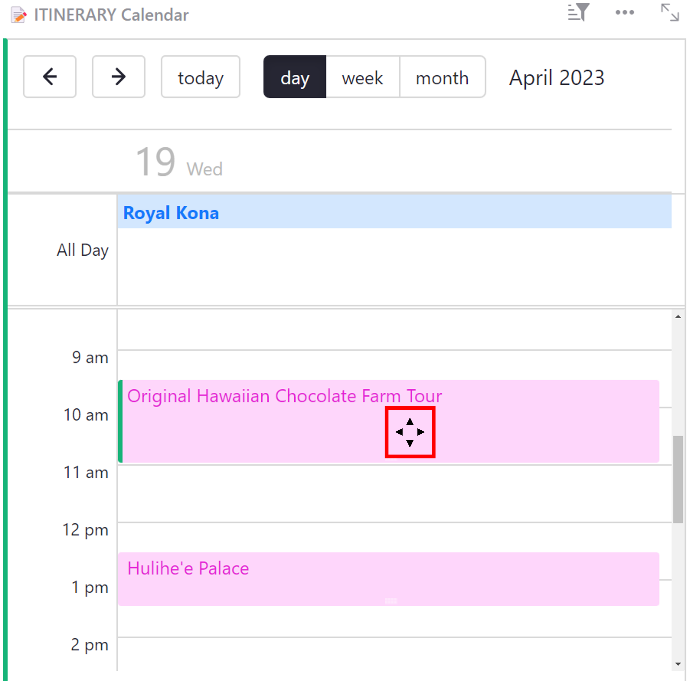

# Vue : Calendrier

La vue calendrier permet de visualiser les données dans une vue calendrier. Dans Grist, les données d'événements sont stockées dans une table de données. Ensuite, la vue calendrier peut être configurée pour afficher ces données.

**

## Configuration de vos données

Dans votre table de données, vous aurez besoin de deux colonnes de données, avec la possibilité d'ajouter trois colonnes de données supplémentaires :

1. **Titre** : colonne [Texte](col-types.md#text-columns), contenant le titre de votre événement.
2. **Date de début** : colonne [Date](col-types.md#date-columns) ou [DateHeure](col-types.md#datetime-columns), contenant la date, ou la date et l'heure, à laquelle l'événement commence.
3. *(Optionnel)* **Date de fin** : colonne [Date](col-types.md#date-columns) ou [DateHeure](col-types.md#datetime-columns), contenant la date, ou la date et l'heure, à laquelle l'événement se termine.
4. *(Optionnel)* **Toute la journée ?** : colonne [Basculer](col-types.md#toggle-columns), indiquant si un événement dure toute la journée.
5. *(Optionnel)* **Type** : colonne [Choix](col-types.md#choice-columns) ou [Liste de choix](col-types.md#choice-list-columns), contenant la catégorie et le style de l'événement.

**

## Configuration du calendrier

Ajoutez une vue calendrier depuis le menu ‘Ajouter Nouveau’. Sélectionnez la table contenant vos données d'événements.

**
{: .screenshot-half }

Configurez la vue en sélectionnant les colonnes de votre table de données qui contiennent la Date de début, la Date de fin (optionnel), Toute la journée ? (optionnel), le Titre et le Type (optionnel).

**
{: .screenshot-half }

## Ajouter un nouvel événement

Vous pouvez ajouter un nouvel événement en double-cliquant sur l'heure de début de l'événement dans la vue calendrier. Dans la fenêtre contextuelle, vous pouvez ajouter un titre pour l'événement et modifier l'heure de début et de fin. Vous avez également la possibilité de marquer l'événement comme 'toute la journée'.

**

Vous pouvez également modifier l'heure de début et de fin d'un événement en cliquant et en faisant glisser l'événement directement sur le calendrier.

Pour modifier l'heure de début d'un événement, cliquez et faites glisser depuis le milieu de l'événement. Lorsque vous modifiez l'heure de début, la durée de l'événement restera la même.

**
{: .screenshot-half }

Pour modifier l'heure de fin d'un événement, cliquez et faites glisser depuis le bas de l'événement. Vous remarquerez que l'icône est légèrement différente de celle qui apparaît lors de la modification de l'heure de début.

**
{: .screenshot-half }

Toutes les modifications des heures de début et de fin seront apportées à la table de données sous-jacente afin que vos données soient toujours cohérentes !

## Lier les détails de l'événement

Il peut être utile de voir plus de détails sur l'événement dans une vue table ou fiche.

Cet exemple vous guidera à travers une vue fiche.

Pour créer une vue liée, ajoutez un nouveau type de vue tel qu'une table ou une fiche, et sélectionnez la même table de données. Sous ‘Sélectionner par’, sélectionnez la vue calendrier. Ensuite, ajoutez à la page.

**
{: .screenshot-half }

Maintenant, lorsque vous cliquez sur un événement dans la vue calendrier, la vue liée se mettra à jour pour afficher les détails de l'événement sélectionné.

**

!!! note "Réduire les vues"
    Faites glisser la vue liée dans le grenier en haut de la page pour la réduire. La vue restera liée mais prendra moins de place sur la page ! Cliquez simplement sur la boîte pour l'agrandir et voir les détails de l'enregistrement lié.

    En savoir plus sur les [Mises en page personnalisées](custom-layouts.md).

## Supprimer un événement
Pour supprimer un événement, double-cliquez sur l'événement dans le calendrier puis sélectionnez 'supprimer' dans la

popup.

**
