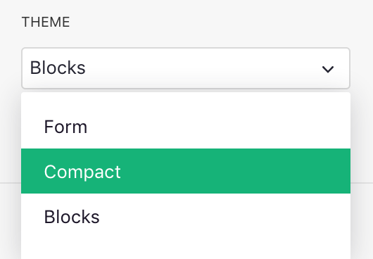

# Vue : Fiche & Liste de Fiches {: data-toc-label='Vue : Fiche' }

Les vues **Fiche** et **Liste de Fiches** permettent de visualiser les données sous forme de formulaire ou d'enregistrement, similaire à la présentation des données dans une application personnalisée. Dans Grist, vous pouvez choisir les champs à afficher et comment les disposer.

Une **Liste de Fiches** affiche une liste défilante de fiches. Une **Fiche** en affiche une à la fois. Une seule **Fiche** est particulièrement utile lorsqu'elle est liée à une autre vue Table (voir [Lier des vues](linking-widgets.md)). Elle peut alors afficher les détails de l'enregistrement sélectionné. La vue Fiche unique peut également être utilisée seule. Dans ce cas, vous verrez des boutons de navigation en haut pour passer à l'enregistrement suivant ou précédent, ou pour en ajouter un nouveau.

  **
  {: .screenshot-half }

## Sélection du thème

Le panneau d'options de la vue permet de choisir le thème, ou le style, de la fiche :

  **
  {: .screenshot-half }

## Modifier la disposition de la fiche
Pour configurer la disposition d'une fiche, cliquez sur le bouton vert "Modifier la disposition de la fiche" sous le sélecteur de thème, ou cliquez sur les trois points en haut à droite de la vue et sélectionnez "Modifier la disposition de la fiche" dans le menu.

  **
  {: .screenshot-half }

  **
  {: .screenshot-half }

Lorsque l'éditeur de disposition est actif, vous verrez un seul enregistrement avec des champs déplaçables et un ensemble de boutons en haut de la vue.

  **
  {: .screenshot-half }

#### Redimensionner un champ
Pour redimensionner un champ, déplacez la souris vers une bordure verticale séparant deux champs et faites glisser la bordure à la taille souhaitée. Seule la largeur des champs peut être modifiée, tandis que la hauteur change dynamiquement pour s'adapter au contenu du champ.

  **
  {: .screenshot-half }

#### Déplacer un champ
Pour déplacer un champ, maintenez le bouton de la souris enfoncé sur un champ et faites-le glisser. Lorsque vous déplacez la souris près des bords d'autres champs, vous remarquerez des boîtes avec des bordures en pointillés indiquant les points de dépôt possibles par rapport aux autres champs. Relâchez la souris sur l'une de ces boîtes pour placer votre champ à l'emplacement souhaité.

  **
  {: .screenshot-half }

#### Supprimer un champ
Pour supprimer un champ, déplacez la souris dessus. Une icône "x" apparaîtra. Cliquez sur cette icône pour supprimer le champ. Cela est similaire à masquer une colonne, car supprimer un champ d'une vue ne supprime pas les données sous-jacentes.

  **
  {: .screenshot-half }

Vous pouvez également supprimer un champ en le masquant dans la liste "Champs visibles" du panneau latéral, comme décrit dans [Configurer la liste des champs](page-widgets.md#configuring-field-lists). Cela est disponible même lorsque l'éditeur de disposition n'est pas actif.

#### Ajouter un champ
Pour ajouter un champ, cliquez sur le bouton "Ajouter un champ" en haut de l'éditeur de disposition. Dans le menu déroulant, sélectionnez "Créer un nouveau champ" pour créer une nouvelle colonne de données, ou l'un des champs existants dans la table qui ne sont pas actuellement affichés dans la fiche.

  **
  {: .screenshot-half }

Lorsque vous cliquez sur le champ, il sera ajouté en bas de la disposition. Vous pouvez ensuite le déplacer ou le redimensionner comme décrit ci-dessus.

Tous les nouveaux champs que vous créez ne seront ajoutés aux données que lorsque vous enregistrerez la disposition. Vous pouvez les renommer dans l'onglet "Champ" du panneau latéral.

Vous pouvez également ajouter un champ existant en le rendant visible à l'aide de la liste "Champs masqués" dans le panneau latéral, comme décrit dans [Configurer la liste des champs](page-widgets.md#configuring-field-lists). Cela est disponible même lorsque l'éditeur de disposition n'est pas actif.

#### Enregistrer la disposition

Une fois que vous avez terminé de modifier la disposition, n'oubliez pas de cliquer sur "Enregistrer la disposition" en haut de la vue, ou sur "Annuler" pour annuler vos modifications.

Une fois enregistrée, la vue Fiche ou Liste de Fiches se mettra à jour pour afficher toutes les fiches dans la disposition mise à jour.