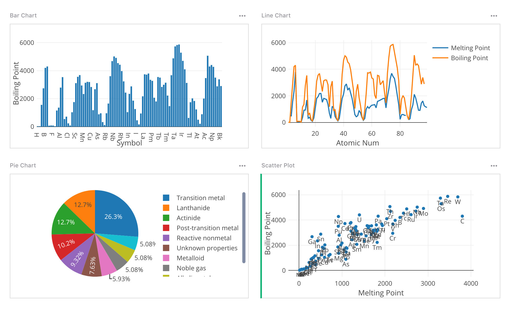
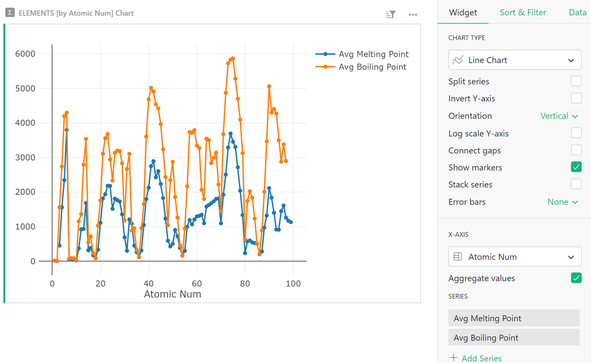
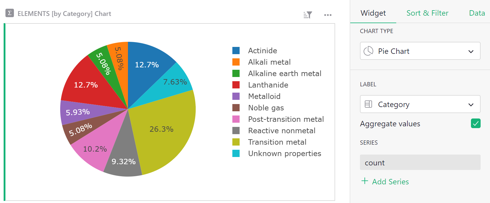
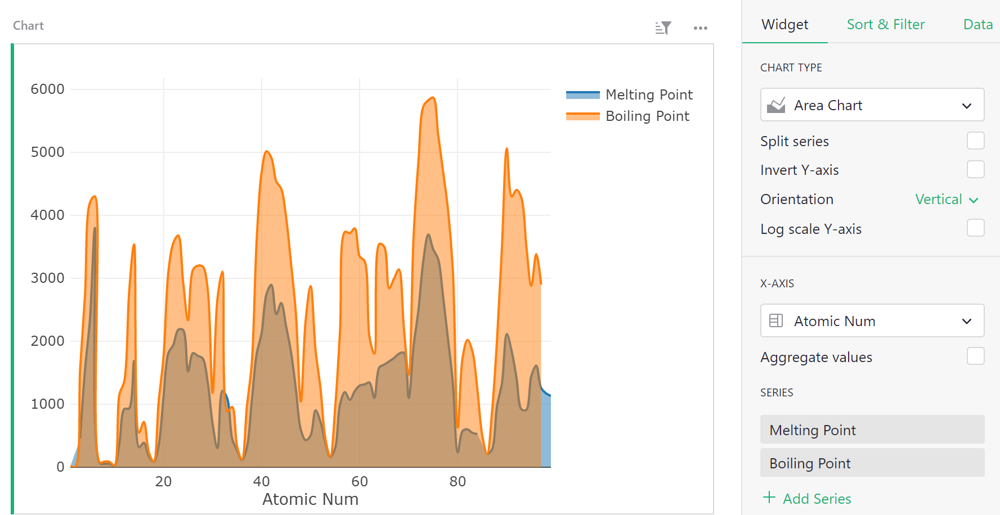
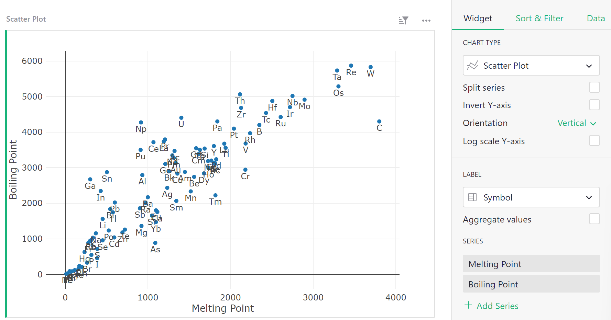
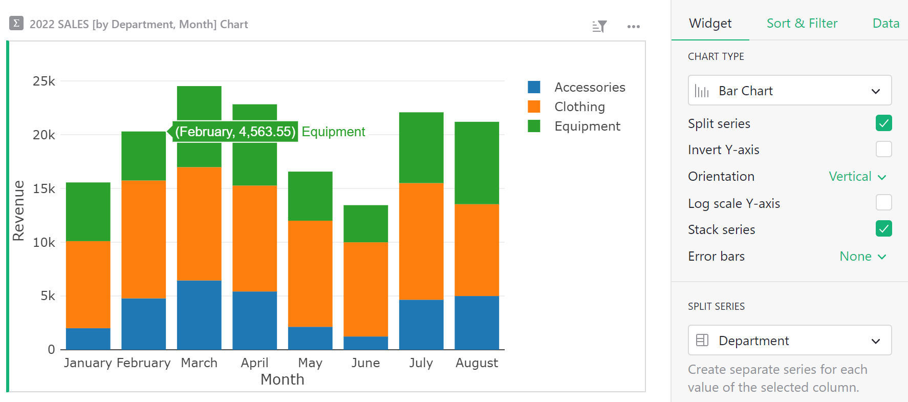

# Vue : Graphique

Grist prend en charge plusieurs types de graphiques pour vous aider à visualiser vos données facilement. Les graphiques peuvent être utilisés pour tracer un tableau de données régulier, une vue liée (comme décrit dans [Lier des vues](linking-widgets.md)), ou un tableau récapitulatif (comme décrit dans [Tableaux récapitulatifs](summary-tables.md)).

Les types de graphiques les plus courants sont illustrés ici :

## Types de graphiques

Chaque type de graphique trace une ou plusieurs séries de données. Sélectionnez les séries à tracer en cliquant sur le texte vert 'Ajouter une série' dans le [panneau de création](glossary.md#creator-panel). Dans la zone au-dessus de la section "Séries" du panneau de création, vous pouvez configurer l'axe des x pour la plupart des graphiques, ou les étiquettes pour les graphiques en secteurs et en anneaux.

#### Graphique en barres

Nécessite un axe des x et au moins une série à tracer le long de l'axe des y. Des séries supplémentaires créent des barres supplémentaires à chaque point sur l'axe des x. Pour empiler les séries sur la même barre, cochez la case "Empiler les séries".

**

#### Graphique en lignes

Nécessite un axe des x et au moins une série à tracer le long de l'axe des y. Des séries supplémentaires spécifient les valeurs Y pour des lignes supplémentaires.

**

#### Graphique en secteurs

Nécessite des étiquettes de tranches et une série pour les tailles des tranches.

**

#### Graphique en aires

Similaire à un graphique en lignes, nécessite un axe des x et au moins une série à tracer le long de l'axe des y. Des séries supplémentaires spécifient les valeurs Y pour des lignes supplémentaires.

**

#### Nuage de points

Nécessite une étiquette et deux séries ou plus. L'étiquette s'applique aux points. Les séries appliquent les valeurs X et Y pour chaque point, respectivement. Des séries supplémentaires spécifient les valeurs Y pour des ensembles de points supplémentaires.

**

#### Graphique de Kaplan-Meier

Le [Graphique de Kaplan-Meier](https://fr.wikipedia.org/wiki/Estimateur_de_Kaplan-Meier) est utile pour certaines études, et nécessite une étiquette et une série. L'étiquette s'applique aux lignes tracées. La série donne un temps de survie ou un temps jusqu'à la défaillance de ce point. Le graphique montre les temps de survie sur l'axe des X, et le nombre de points qui survivent à ce moment sur l'axe des Y.

**

## Options de graphique

Un certain nombre d'options de graphique sont disponibles, certaines d'entre elles spécifiques à certains types de graphiques.

**Diviser les séries** : Lorsqu'elle est cochée, une série supplémentaire doit être sélectionnée dans le menu déroulant 'Diviser les séries'. La série doit contenir une étiquette de groupe pour chaque point de données. Tous les points avec la même valeur de groupe sont tracés comme une ligne séparée.

Par exemple :

**

**Inverser l'axe Y** : Lorsqu'elle est cochée, l'axe Y est inversé, avec les valeurs plus petites en haut et les valeurs plus grandes en bas.

**Connecter les lacunes** [pour les graphiques en lignes uniquement] : Lorsqu'elle est cochée, les lacunes causées par des valeurs manquantes sont comblées en connectant les points voisins. L'option "Afficher les marqueurs" décrite ci-après peut être utilisée pour garder un indice visuel des points présents.

**Afficher les marqueurs** [pour les graphiques en lignes uniquement] : Lorsqu'elle est cochée, chaque point sur la ligne est marqué en plus par un petit cercle. Voir l'exemple pour Diviser les séries ci-dessus.

**Empiler les séries** [pour les graphiques en lignes et en barres] : Lorsqu'elle est cochée, les séries divisées seront empilées, plutôt que montrées séparément, donnant un total pour vos séries sélectionnées. Dans cet exemple, nous pouvons voir le revenu total pour chaque mois dans les trois départements. Notez que 'Diviser les séries' doit être cochée pour sélectionner plusieurs séries à empiler.

**

**Barres d'erreur** [pour les graphiques en lignes et en barres] : Lorsqu'elle est réglée sur "Symétrique", chaque série Y doit être suivie d'une série pour la longueur des barres d'erreur à afficher. Lorsqu'elle est réglée sur "Au-dessus+En-dessous", chaque série Y doit être suivie de *deux* séries, une pour les barres d'erreur supérieures, et une pour les inférieures.

**

Dans l'exemple ici, "Diviser les séries" est cochée. Donc la série sélectionnée dans le menu déroulant Diviser les séries ("Ligne cellulaire"), spécifie comment grouper les données en lignes. La série sélectionnée dans le menu déroulant Axe des X ("Log[Drug], uM"), spécifie nos valeurs le long de l'axe des x. Notre première série dans la liste des séries ("% Cellules viables"), spécifie nos valeurs de l'axe des y, et la série qui suit ("SD"), spécifie les barres d'erreur pour ces valeurs Y.
