# Page widget : Personnalisé

Le widget **Personnalisé** permet à un utilisateur d'insérer presque tout dans son document. Pour créer un widget personnalisé, il est actuellement nécessaire de connaître le développement web et d'avoir accès à un serveur web public (par exemple, GitHub Pages).

Une bonne utilisation des widgets personnalisés est de visualiser des enregistrements ou des tables de nouvelles manières. Utiliser Grist comme modèle de données et HTML/CSS/JS modernes comme vue est très puissant.

## Exemple minimal

Pour démontrer à un développeur web comment fonctionnent les widgets personnalisés, il existe un exemple minimal fonctionnel à l'adresse suivante :

> <https://public.getgrist.com/911KcgKA95oQ/Minimal-Custom-Widget/m/fork>

L'exemple montre une table avec des données aléatoires (noms d'animaux de compagnie) et deux widgets personnalisés, l'un affichant la ligne sélectionnée dans la table au format JSON, et l'autre affichant toutes les lignes de la table au format JSON. Si vous modifiez les données dans la table ou déplacez le curseur, les widgets personnalisés se mettent à jour en conséquence.


Le code source des widgets se trouve à l'adresse suivante :

> <https://github.com/gristlabs/grist-widget/tree/master/inspect>

Il est réduit à l'essentiel. Voici le code source complet du widget `onRecord` qui affiche une ligne de données :

```html
<!DOCTYPE html>
<html lang="fr">
  <head>
    <meta charset="utf-8">
    <title>onRecord</title>
    <script src="https://docs.getgrist.com/grist-plugin-api.js"></script>
  </head>
  <body>
    <pre id="readout">En attente de données...</pre>
    <script>
      grist.ready();
      grist.onRecord(function(record) {
        document.getElementById('readout').innerHTML = JSON.stringify(record, null, 2);
      });
    </script>
  </body>
</html>
```

Les parties "Grist" de ceci sont :

 * Inclure `https://docs.getgrist.com/grist-plugin-api.js` pour obtenir l'API Grist.
 * Appeler `grist.ready` pour informer Grist que le widget est prêt à fonctionner.
 * Appeler `grist.onRecord` pour s'abonner à la ligne actuelle de la table.

Après cela, tout le reste est du HTML/CSS/JS régulier. Une fois que vous avez des données qui arrivent, vous pouvez les rendre comme bon vous semble, en utilisant React, Vue.js ou votre framework préféré. Par exemple, vous pourriez rendre des enregistrements sous forme de [facture imprimable](examples/2020-08-invoices.md), ou utiliser un format de graphique obscur que Grist ne prend pas actuellement en charge.

## Ajouter un widget personnalisé

Pour ajouter un widget personnalisé qui lit à partir d'une table, cliquez sur `Ajouter Nouveau`, puis `Ajouter Widget à la Page`. Ensuite :

  * Pour `Sélectionner Widget`, choisissez `Personnalisé` pour obtenir un Widget Personnalisé.
  * Pour `Sélectionner Données`, choisissez la table à partir de laquelle vous souhaitez que le widget lise les données.
  * Optionnellement, choisissez `Sélectionner Par` pour contrôler davantage les données sélectionnées (lisez [Lier les Widgets de Page](linking-widgets.md) pour les possibilités).


Le widget personnalisé est initialement vide. Pour le configurer, cliquez sur le bouton à trois points en haut à droite du widget personnalisé et sélectionnez "Options du widget".


Dans la section de paramètres `PERSONNALISÉ` où il est indiqué `Entrer l'URL Personnalisée`, mettez le lien vers votre widget personnalisé. Voici un widget de test pour simplement afficher les données de la table au format JSON :

> <https://gristlabs.github.io/grist-widget/inspect/onRecords.html>

Et voici un pour afficher uniquement la ligne sélectionnée (assurez-vous que "Sélectionner Par" est défini pour le widget personnalisé) :

> <https://gristlabs.github.io/grist-widget/inspect/onRecord.html>

## Niveau d'accès

Lorsque vous mettez un lien vers une page web personnalisée, elle sera immédiatement rendue à l'intérieur de la section. Vous avez maintenant la possibilité d'accorder à cette page web l'accès aux données de votre document. Les niveaux d'accès suivants sont disponibles :

   - *Aucun accès au document* : la page web est affichée dans le widget, mais elle n'a aucun accès au document Grist contenant le widget.
   - *Lire la table sélectionnée* : la page web est affichée dans le widget et a un accès en lecture à la table que le widget est configuré pour sélectionner des données.
   - *Accès complet au document* : la page web est affichée dans le widget et a un accès complet pour lire et modifier le document Grist contenant le widget.

La page web doit être détenue et contrôlée par vous ou par quelqu'un en qui vous avez confiance. Avec les permissions `Lire la table sélectionnée`, un widget pourrait envoyer les données qu'il accède à un tiers. Avec les permissions `Accès complet au document`, un widget pourrait envoyer toutes les données du document à un tiers et modifier votre document de n'importe quelle manière.

Si vous écrivez votre propre widget personnalisé, vous pouvez spécifier quel niveau d'accès il nécessite dans le message **prêt** initial. Les valeurs possibles sont : `none`, `read table` et `full`.

```html
<script>
  grist.ready({
    requiredAccess: 'read table'
  });
</script>
```

Cela indique à Grist de demander le niveau d'accès souhaité à l'utilisateur. Votre widget sera rechargé avec le niveau d'accès approprié si l'utilisateur approuve la demande.

<span class="screenshot-large">**</span>
{: .screenshot-half }

Si vous souhaitez être informé du niveau d'accès, vous pouvez vous abonner à l'événement `onOptions` qui est envoyé au widget après qu'il ait informé Grist qu'il est prêt :

```javascript
grist.onOptions(function(options, interaction) {
  console.log(interaction.access_level);
});
```

Pour l'instant, il suffit d'ignorer le paramètre `options` (il sera décrit dans la section [Options du Widget](widget-custom.md#widget-options)). Le niveau d'accès actuel fait partie du deuxième paramètre, qui décrit comment Grist interagira avec votre widget.

## Exemple de facture

L'exemple minimal ci-dessus a montré des enregistrements au format JSON brut, mais le widget peut être aussi sophistiqué que vous le souhaitez. Voici un exemple montrant un enregistrement sous forme de facture imprimable :


Vous pouvez lire les détails sur la façon d'utiliser ce widget dans notre [Exemple de préparation de facture](examples/2020-08-invoices.md). Le widget de facture est hébergé à l'adresse suivante :

> <https://gristlabs.github.io/grist-widget/invoices/>

Et le code source HTML/CSS/JS peut être consulté à l'adresse suivante :

> <https://github.com/gristlabs/grist-widget/tree/master/invoices>

Il utilise Vue.js et `grist.onRecord`.

## Création d'un widget personnalisé

Comme vous l'avez vu, écrire un widget simple qui utilise des données d'une table est très facile. Tout d'abord, vous devez informer Grist que vous êtes prêt et ensuite vous abonner à l'un des événements disponibles : `onRecord`, `onRecords` ou `onOptions`.

```javascript
grist.ready();
grist.onRecord(function (record) {
  // Le curseur a bougé.
});
grist.onRecords(function (record) {
  // Les données dans la table ont changé.
});
grist.onOptions(function (options, interaction) {
  // La configuration a changé.
});
```

Disons que vous souhaitez construire un widget personnalisé qui affichera une image à partir d'une URL et éventuellement une ligne de texte en dessous comme titre de l'image. Vous devrez lire deux valeurs à partir de deux colonnes : `Lien` et `Titre`.

Vous pourriez accéder à ces colonnes directement en utilisant les noms de colonnes littéraux dans votre script. Voici un exemple complet de code source de widget qui fera le travail :

```html
<script src="https://docs.getgrist.com/grist-plugin-api.js"></script>

<div id="title"></div>
<script>
  grist.ready({requiredAccess: 'read table'});
  grist.onRecord(function (record) {
    document.getElementById('image').src = record.Lien;
    document.getElementById('title').innerText = record.Titre;
  });
</script>
```

Lorsque vous commencez, c'est une bonne approche, mais elle a deux inconvénients majeurs. Chaque fois que vous renommez une colonne, vous devrez également modifier le code source de votre widget. De plus, utiliser ce widget sur une autre table ou le partager avec vos amis peut être difficile car les noms de colonnes peuvent être différents. Pour aider avec cela, Grist propose l'API de mappage de colonnes.

## Mappage de colonnes

Au lieu d'utiliser directement les noms de colonnes, vous pouvez demander à l'utilisateur de choisir quelle colonne utiliser comme `Lien` et `Titre`. La liste des colonnes attendues peut être envoyée à Grist dans l'appel prêt :

```js
grist.ready({columns: ['Lien', 'Titre']});
```

En utilisant ces informations, dans le panneau de création, Grist masquera la section régulière "Colonnes visibles" et affichera des sélecteurs de colonnes spécialisés.

<span class="screenshot-large">**</span>
{: .screenshot-half }

Votre widget recevra cette configuration de mappage dans le deuxième paramètre de l'événement `onRecord` ou `onRecords`. Vous pouvez utiliser cette configuration pour faire vous-même les mappages ou utiliser la fonction d'assistance `mapColumnNames` pour le faire pour vous.

```html
<script src="https://docs.getgrist.com/grist-plugin-api.js"></script>

<div id="title"></div>
<script>
grist.ready({columns: ['Lien', 'Titre'], requiredAccess: 'read table'});
grist.onRecord(function (record, mappings) {
  const mapped = grist.mapColumnNames(record);
  // D'abord, vérifiez si toutes les colonnes ont été mappées.
  if (mapped) {
    document.getElementById('image').src = mapped.Lien;
    document.getElementById('title').innerText = mapped.Titre;
    console.log(`Utilisation des colonnes ${mappings.Lien} et ${mappings.Titre}`);
  } else {
    // L'assistant a retourné une valeur nulle. Cela signifie que toutes les
    // colonnes requises n'ont pas été mappées.
    console.error("Veuillez mapper toutes les colonnes");
  }
});
</script>
```

Maintenant, si vous renommez l'une des colonnes, le widget fonctionnera toujours. Vous pouvez également utiliser ce widget dans n'importe quelle autre table ou le partager avec un ami, car il ne dépend pas de votre structure de table et peut être facilement configuré.

Dans la configuration utilisée ci-dessus, nous avons dit à Grist que toutes les colonnes sont requises, et l'utilisateur peut choisir n'importe quelle colonne même si la colonne ne contient pas de valeur texte. Pour être plus précis, nous pouvons inclure plus d'options dans la demande. Par exemple :

```javascript
grist.ready({columns: [
  {
    name: "Lien", // Quel champ nous allons lire.
    title: "Lien de l'image", // Nom de champ convivial.
    optional: false, // Est-ce un champ optionnel.
    type: "Texte", // Quel type de colonne nous attendons.
    description: "Un peu de texte", // Description d'un champ.
    allowMultiple: false // Permet l'attribution de plusieurs colonnes.
  }
]});
```

Le paramètre `optional` est important pour le bon fonctionnement de l'assistant `mapColumnNames`. Cet assistant ne renverra un enregistrement mappé que lorsque toutes les colonnes requises (non optionnelles) sont choisies.

Par défaut, Grist permettra à l'utilisateur de choisir n'importe quel type de colonne. Pour autoriser uniquement une colonne d'un type spécifique, vous devez définir une propriété `type`. Voici tous les types valides :

`Int` (*Colonne entière*), `Numeric` (*Colonne numérique*), `Texte`, `Date`, `DateTime`, `Bool` (*Colonne à bascule*), `Choice`, `ChoiceList`, `Ref` (*Colonne de référence*), `RefList` (*Liste de références*), `Attachments`.

La valeur par défaut de `type` est `Any`, donc Grist permettra à l'utilisateur de choisir n'importe quel type de colonne. Vous pouvez également spécifier une liste de types, par exemple `Date,DateTime`. Dans ce cas, Grist permettra à l'utilisateur de choisir n'importe quelle colonne qui correspond à l'un des types de la liste.

Utilisez les champs `title` et `description` pour aider vos utilisateurs à comprendre quel est le but de la colonne. La `description` sera affichée juste en dessous du nom de la colonne, et le `title` sera utilisé comme étiquette de colonne. Les deux sont optionnels et vous pouvez y mettre n'importe quel texte que vous souhaitez.

Si vous devez mapper plusieurs colonnes (par exemple dans un widget de graphique personnalisé), vous pouvez utiliser l'option `allowMultiple`. Cela permettra à vos utilisateurs de choisir un ensemble de colonnes qui seront renvoyées sous forme de liste de noms de colonnes de table mappés. L'assistant `mapColumnNames` renverra alors un tableau de valeurs de colonnes mappées dans un seul champ.

Supposons que l'utilisateur supprime une colonne ou change son type de sorte qu'elle ne corresponde plus au type demandé par le widget. Dans ce cas, Grist supprimera automatiquement cette colonne du mappage.

## Options du widget

Si votre widget a besoin de stocker certaines options, Grist propose une API simple de stockage clé-valeur pour que vous puissiez l'utiliser. Voici quelques extraits de code JavaScript qui montrent comment interagir avec cette API :

```js
// Stocker une valeur texte simple.
await grist.setOption('couleur', '#FF0000');

// Stocker des objets complexes au format JSON.
await grist.setOption('paramètres', {lignes: 10, sauterPremier: true});

// Lire une option précédemment enregistrée
const couleur = await grist.getOption('couleur');

// Effacer toutes les options.
await grist.clearOptions();

// Obtenir et remplacer toutes les options.
await grist.getOptions();
await grist.setOptions({...});
```

Vous pouvez expérimenter cela vous-même. Voici un widget de test qui démontre comment utiliser cette API :

> <https://gristlabs.github.io/grist-widget/inspect/onOptions.html>

Lorsque votre widget enregistre ou modifie certaines options, l'icône en haut de la section devient verte. Vous pouvez soit appliquer ces options au widget, soit revenir à cette modification.

<span class="screenshot-large">**</span>
{: .screenshot-half }

Cela permet aux spectateurs (utilisateurs avec un accès en lecture seule) ou aux collaborateurs de configurer votre widget sans écraser les paramètres originaux. Ce comportement devrait vous sembler familier, car cela fonctionne comme [le tri et le filtrage](search-sort-filter.md#saving-sort-settings) sur les vues de table ou de carte.

En enregistrant les options actuelles, vous les appliquerez au widget et les rendrez disponibles pour les autres. En utilisant ce menu, vous pouvez également effacer toutes les options pour ramener le widget à son état initial. Pour ce faire, appuyez sur la petite icône de poubelle, puis sur `Enregistrer`.

Grist déclenchera également un événement chaque fois que les options sont modifiées (ou effacées). Voici comment vous pouvez vous abonner à cet événement.

```javascript
grist.onOptions(function(options, interaction) {
  if (options) {
    console.log('Couleur actuelle', options.couleur);
  } else {
    // Aucune option de widget n'a été enregistrée, retour aux options par défaut.
  }
});
```

Si vous construisez votre propre widget, vous ne devriez généralement pas lire les options directement (en utilisant `grist.widgetApi.getOption()`). Un meilleur modèle consiste à les appliquer toutes lorsqu'elles sont modifiées. Utiliser le gestionnaire `onOptions` rendra votre widget plus facile à modifier et à comprendre par la suite.

Il reste un scénario à couvrir. Supposons que votre widget ait un type d'écran de configuration personnalisé. Dans ce cas, vous aurez probablement besoin d'un bouton ou d'un autre élément d'interface utilisateur que l'utilisateur peut utiliser pour l'afficher. Cet élément d'interface utilisateur supplémentaire sera probablement rarement utilisé par vous ou vos collaborateurs, donc il n'est pas logique de l'afficher tout le temps. Pour aider avec cela, Grist propose une option d'interaction supplémentaire que vous pouvez envoyer dans le message prêt :

```javascript
grist.ready({
  onEditOptions: function() {
    // Votre logique personnalisée pour ouvrir l'écran de configuration personnalisé.
  }
});
```

Cela indiquera à Grist d'afficher un bouton supplémentaire `Ouvrir la configuration` dans le panneau de création et le menu de section. Lorsqu'il est cliqué, il déclenchera votre gestionnaire, que vous pouvez utiliser pour afficher votre propre écran de configuration personnalisé.

<span class="screenshot-large">*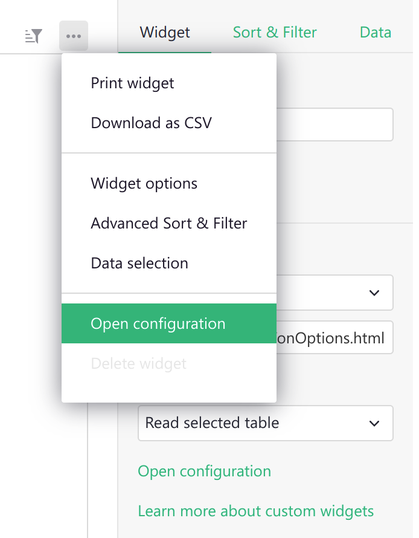*</span>
{: .screenshot-half }

## Liaison de widget personnalisé

Les widgets personnalisés peuvent également être utilisés comme source de liaison (voir [Lier les widgets](linking-widgets.md)). Tout ce que vous avez à faire est d'informer Grist que votre widget prend en charge la liaison en passant une option supplémentaire à l'appel `ready` (voir [API Widget](./code/modules/grist_plugin_api.md#ready)) :

```javascript
grist.ready({
  allowSelectBy: true
});
```

Cela activera l'option `Sélectionner Par` dans le panneau de configuration du widget. Vous pouvez maintenant utiliser votre widget pour contrôler la position du curseur dans les widgets liés. Pour ce faire, vous devez appeler la fonction `setCursorPos` :

```javascript
// Informer Grist que le curseur doit être déplacé vers la ligne avec l'ID 20.
grist.setCursorPos({rowId: 20});

// ou informer que votre widget crée une nouvelle ligne.
grist.setCursorPos({rowId: 'new'});
```

## Widgets personnalisés préfabriqués

Tous les widgets personnalisés préfabriqués sont disponibles dans le panneau de configuration du Widget Personnalisé sur le côté droit de l'écran sous le menu déroulant Personnalisé.

<span class="screenshot-large">*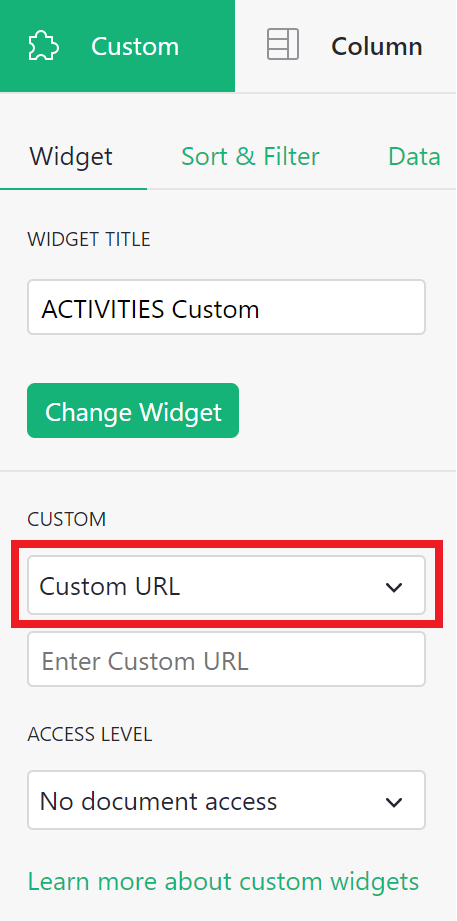*</span>
{: .screenshot-half }

### Graphiques avancés

Le widget de Graphiques avancés vous donne plus de puissance et de flexibilité que les graphiques intégrés de Grist, offrant une grande variété de types de graphiques ainsi qu'un contrôle accru sur le style et la mise en page. C'est une version de [Chart Studio](https://chart-studio.plotly.com/) de Plotly, consultez leurs [tutoriels](https://plotly.com/chart-studio-help/tutorials/) pour obtenir une aide plus détaillée.

Vous devrez définir le niveau d'accès sur "Accès complet au document". Ne vous inquiétez pas, le widget ne lit que les données de la table sélectionnée, ne les envoie à aucun serveur et ne modifie pas ou ne fait pas d'autres changements dans votre document.

Voici ce que vous devriez voir :


Cliquez sur le grand bouton bleu “+ Trace” pour commencer. Cela ajoutera un panneau comme suit :

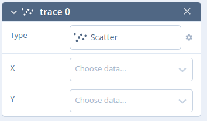

Cliquez sur “Scatter” pour choisir un type de graphique différent tel que Bar ou Line. Ensuite, cliquez sur les menus déroulants “Choisir des données” pour sélectionner les colonnes que vous souhaitez tracer.

Vous pouvez ajouter plusieurs traces pour superposer différents graphiques. Essayez différents panneaux dans la barre latérale pour personnaliser davantage le graphique. Par exemple, allez dans Style > Axes > Titres pour ajouter une étiquette à chaque axe. Consultez les [tutoriels de studio de graphiques](https://plotly.com/chart-studio-help/tutorials/) pour en savoir plus.

Au fur et à mesure que vous personnalisez le widget, n'oubliez pas de cliquer régulièrement sur le bouton ‘Enregistrer’ au-dessus du widget pour conserver votre configuration.

### Copier dans le presse-papiers

Copier dans le presse-papiers copie une valeur de la colonne spécifiée de l'enregistrement sélectionné. Lors de la configuration du widget, vous devrez sélectionner la colonne dont vous souhaitez copier les données.

**

Notez que vous pouvez également copier des données d'une cellule sélectionnée en utilisant le raccourci clavier <code class="keys">*Ctrl* + *C*</code> sur Windows ou <code class="keys">*⌘* + *C*</code> sur Mac. Pour coller, utilisez <code class="keys">*Ctrl* + *V*</code> ou <code class="keys">*⌘* + *V*</code>.

Vous pouvez trouver un exemple du bouton copier dans le presse-papiers dans notre modèle [Webinaire 7 (Widgets Personnalisés)](https://public.getgrist.com/uGS3WH3mhoVy/7-Webinar-7-Custom-Widgets-End-Result/p/4){:target="\_blank"}. Vous pouvez également regarder une vidéo explicative de notre [Webinaire sur les Widgets Personnalisés](https://www.youtube.com/watch?v=zNLHX_ezY50&t=2063s){:target="\_blank"}.

### Intégrateur Dropbox

Visualisez et accédez aux fichiers enregistrés sur Dropbox.

<span class="screenshot-large">**</span>
{: .screenshot-half }

Pour commencer, ajoutez une nouvelle colonne à votre table pour stocker vos liens Dropbox.

Ensuite, ajoutez un nouveau widget personnalisé à la page. Choisissez la table de données qui contient les liens Dropbox et 'Sélectionner Par' cette même table.

<span class="screenshot-large">**</span>
{: .screenshot-half }

Pour configurer, sélectionnez 'Intégrateur Dropbox' dans le menu déroulant Personnalisé et autorisez l'accès pour lire la table sélectionnée. Sous 'Lien Dropbox', sélectionnez la colonne qui contient vos liens Dropbox.

<span class="screenshot-large">*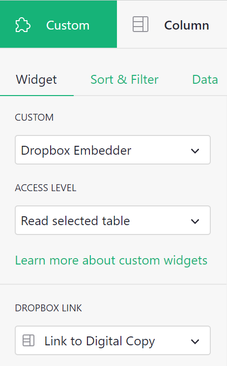*</span>
{: .screenshot-half }

Vous pouvez créer des liens vers des dossiers ou des fichiers spécifiques dans Dropbox. Cliquez sur 'Partager' puis définissez les permissions pour le lien. Vous pouvez choisir de permettre à quiconque ayant le lien de visualiser ou d'éditer. Créez ensuite, puis copiez le lien. Collez ce lien dans votre colonne de Lien Dropbox dans Grist. Notez que les utilisateurs ne peuvent pas modifier directement dans le widget personnalisé même si des permissions d'édition sont accordées. Pour modifier, sélectionnez l'objet dans l'intégrateur Dropbox et il s'ouvrira dans un nouvel onglet où il pourra être modifié directement dans Dropbox.

<span class="screenshot-large">**</span>

Vous pouvez consulter un exemple de l'intégrateur Dropbox dans notre modèle [Préparation aux ouragans](https://templates.getgrist.com/uXMbETLdfriM/Hurricane-Preparedness){:target="\_blank"}.

*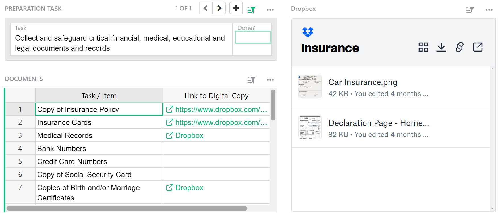*

### Lecteur vidéo Grist

Intégrez des vidéos provenant de sources en ligne telles que YouTube, Vimeo, Facebook Video, Google Drive et plus encore.

**

Pour commencer, ajoutez une nouvelle colonne à votre table pour stocker vos URL vidéo.

Ensuite, ajoutez un nouveau widget personnalisé à la page. Choisissez la table de données qui contient les URL vidéo et 'Sélectionner Par' cette même table.

<span class="screenshot-large">*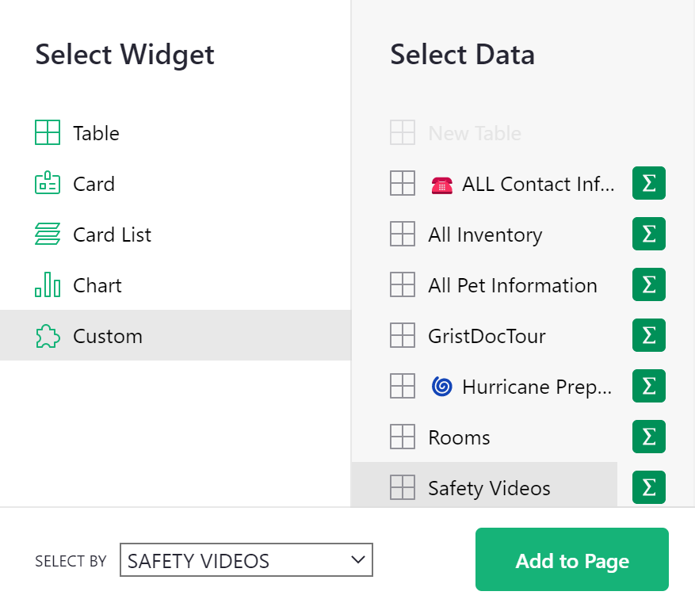*</span>
{: .screenshot-half }

Pour configurer, sélectionnez 'Lecteur vidéo Grist' dans le menu déroulant Personnalisé et autorisez l'accès pour lire la table sélectionnée. Sous 'URL', sélectionnez la colonne qui contient vos URL vidéo.

<span class="screenshot-large">**</span>
{: .screenshot-half }

Pour la plupart des vidéos en ligne, y compris les vidéos YouTube et les vidéos stockées sur Google Drive, vous pouvez simplement cliquer sur l'option 'Partager' et copier l'URL.

*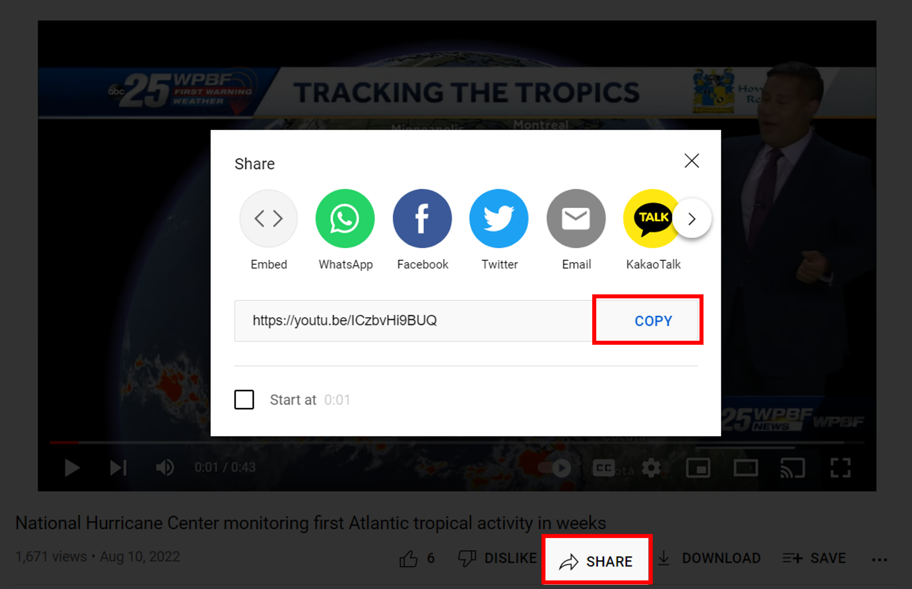*

Pour certaines autres vidéos, vous pourriez voir cette erreur :

*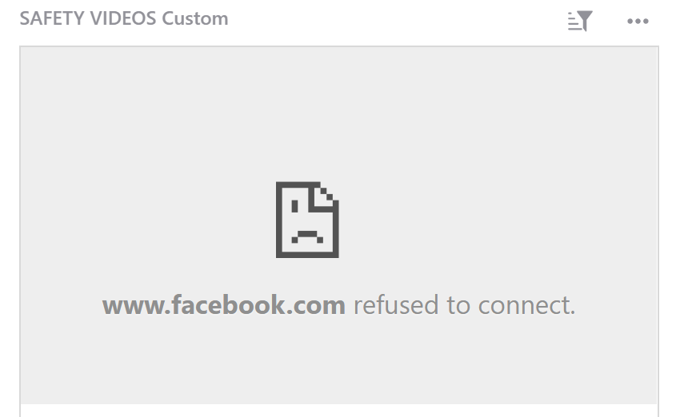*

Si cela se produit, vous devrez prendre l'URL à partir du code d'intégration.

Après avoir cliqué sur l'option de partage sur la vidéo, cliquez sur l'option 'Intégrer'.

**</span>

Ensuite, cliquez pour copier le code.

**

Le code qu'il vous donne ressemblera à ceci :

**

Copiez l'URL qui se trouve entre les guillemets suivant `src`. La portion mise en surbrillance dans la capture d'écran ci-dessous est ce que vous copieriez pour cette vidéo Facebook particulière.

**

Collez cette URL dans votre colonne URL dans Grist et la vidéo apparaîtra maintenant dans le widget lecteur vidéo Grist.

**

### Visualiseur HTML

Le visualiseur HTML affiche du HTML écrit dans une cellule.

Pour des widgets d'édition de texte, consultez nos widgets personnalisés [Markdown](#markdown) et [Bloc-notes](#notepad).

**

Pour commencer, ajoutez une nouvelle colonne à votre table. C'est là que vous ajouterez votre HTML.

Ensuite, ajoutez un nouveau widget personnalisé à la page. Choisissez la table de données qui contient le HTML et 'Sélectionner Par' cette même table.

<span class="screenshot-large">*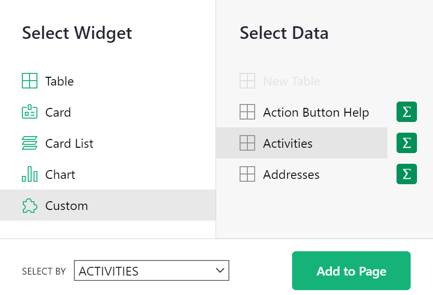*</span>
{: .screenshot-half }

Pour configurer, sélectionnez 'Visualiseur HTML' dans le menu déroulant Personnalisé et autorisez l'accès pour lire la table sélectionnée. Sous 'HTML', sélectionnez la colonne de texte qui contient votre HTML.

<span class="screenshot-large">**</span>
{: .screenshot-half }

Votre HTML sera visible dans le widget personnalisé.

**

Pour obtenir de l'aide sur le formatage HTML, consultez ce guide de W3 Schools : [Formatage de texte HTML](https://www.w3schools.com/html/html_formatting.asp){:target="\_blank"}.

Vous pouvez trouver un exemple du visualiseur HTML dans notre modèle [Webinaire 7 (Widgets Personnalisés)](https://public.getgrist.com/uGS3WH3mhoVy/7-Webinar-7-Custom-Widgets-End-Result/p/1){:target="\_blank"}. Vous pouvez également regarder une vidéo explicative de notre [Webinaire sur les Widgets Personnalisés](https://www.youtube.com/watch?v=zNLHX_ezY50&t=1538s){:target="\_blank"}.

### Visualiseur d'images

Visualisez des images à partir d'URL.

*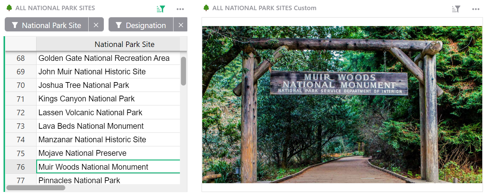*

Pour commencer, ajoutez une nouvelle colonne à votre table. C'est là que vous ajouterez l'URL de votre image.

Ensuite, ajoutez un nouveau widget personnalisé à la page. Choisissez la table de données qui contient l'URL de l'image et 'Sélectionner Par' cette même table.

<span class="screenshot-large">*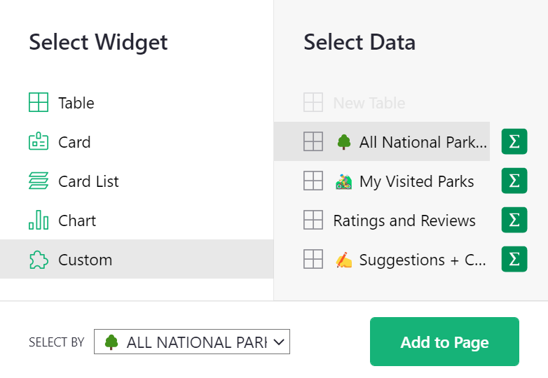*</span>
{: .screenshot-half }

Pour configurer, sélectionnez 'Visualiseur d'images' dans le menu déroulant Personnalisé et autorisez l'accès pour lire la table sélectionnée. Sous 'URL de l'image', sélectionnez la colonne qui contient les URL de vos images.

<span class="screenshot-large">*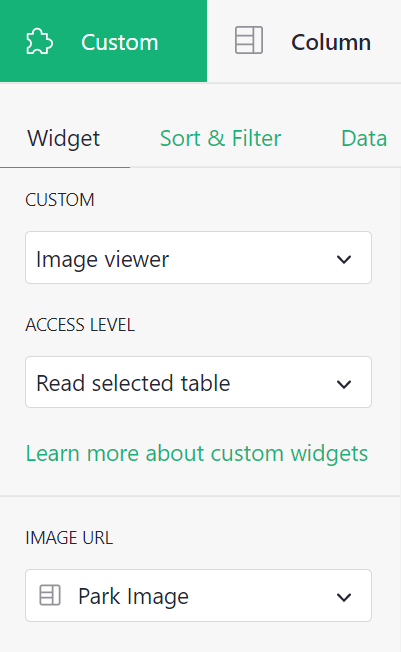*</span>
{: .screenshot-half }

Pour copier l'URL d'une image, faites un clic droit sur la photo puis 'Copier l'adresse de l'image'. Cela copie l'URL dans votre presse-papiers. Collez cette URL dans votre colonne spécifiée dans Grist.

**

De plus, vous pouvez ajouter plusieurs images pour un enregistrement spécifique en ajoutant plusieurs URL d'images, séparées par un espace ou une nouvelle ligne, dans une seule cellule.

Veuillez noter qu'une virgule ne fonctionnera pas pour séparer les liens.

**

Lorsque plusieurs URL d'images sont présentes, le widget personnalisé de visualiseur d'images fonctionnera comme un carrousel. Cliquez sur les flèches pour voir d'autres images.

<span class="screenshot-large">**</span>
{: .screenshot-half }

Pour un exemple du widget Visualiseur d'images, consultez notre [Base de données des parcs nationaux américains](https://templates.getgrist.com/4TRbjZXSPtR5/US-National-Park-Database/p/4){:target="\_blank"}, et ajoutez une critique de parc pendant que vous y êtes !

Vous pouvez également consulter notre modèle [Générateur de mèmes](https://templates.getgrist.com/gtzQwTXkgzFG/Meme-Generator){:target="\_blank"} pour un autre excellent exemple.

Pour une vidéo explicative, n'oubliez pas de regarder notre [Webinaire sur les Widgets Personnalisés](https://www.youtube.com/watch?v=zNLHX_ezY50&t=559s){:target="\_blank"} !

### Notebook JupyterLite

Ce widget vous permet d'exécuter du code Python personnalisé dans [JupyterLite](https://jupyterlite.readthedocs.io/), une version de [JupyterLab](https://jupyterlab.readthedocs.io/en/stable/index.html) fonctionnant entièrement dans le navigateur. Vous pouvez utiliser la pleine [API de plugin de widget personnalisée](./code/modules/grist_plugin_api.md) et accéder ou modifier n'importe quelles données dans le document (sous réserve des Règles d'Accès), débloquant ainsi des possibilités presque illimitées pour les utilisateurs avancés.

Vous serez présenté avec un notebook où vous pouvez entrer et exécuter du code Python, par exemple :

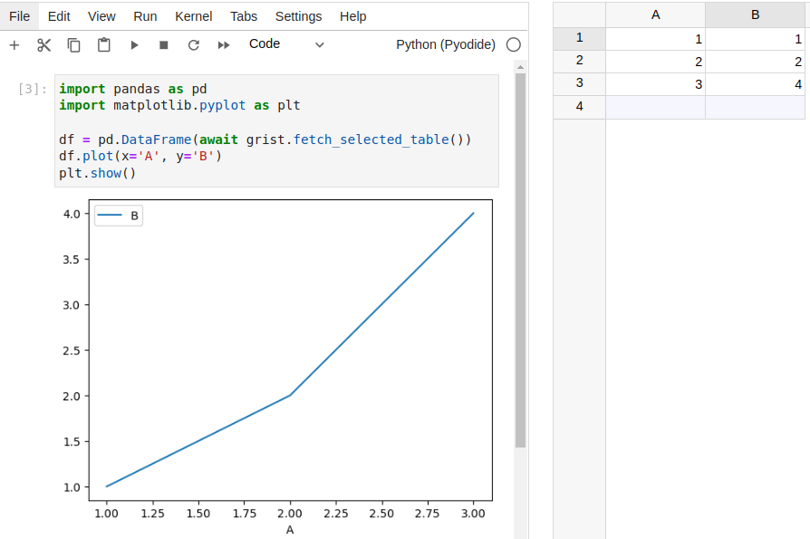

Après avoir tapé du code dans une cellule, cliquez sur le bouton de lecture ou appuyez sur Shift+Entrée pour exécuter cette cellule.

Contrairement aux formules, le code n'est pas enregistré automatiquement. Vous devez appuyer sur le bouton ‘Enregistrer’ habituel au-dessus du widget (en dehors du notebook) pour persister le code dans votre document Grist. D'autre part, les modifications des paramètres dans le notebook (par exemple, les raccourcis clavier) sont enregistrées dans le stockage local de votre navigateur, donc elles ne sont pas partagées avec d'autres utilisateurs du document.

Un objet spécial appelé `grist` est automatiquement disponible pour être utilisé dans le code Python, qui reflète de nombreuses méthodes courantes de la [API de plugin JS](./code/modules/grist_plugin_api.md). Notez que beaucoup de ces méthodes sont asynchrones, donc vous devriez utiliser `await` avant de les appeler.

- `async fetch_selected_table()`: renvoie les données de la table soutenant le widget de notebook.
- `async fetch_selected_record(row_id=None)`: renvoie un enregistrement de la table soutenant le widget de notebook. Si `row_id` est spécifié, renvoie l'enregistrement à cette ligne. Sinon, renvoie l'enregistrement à la position actuelle du curseur dans un widget lié au widget de notebook.
- `async fetch_table(table_id)`: renvoie les données de la table spécifiée. Notez que cela diffère de `fetch_selected_table` (même pour la même table) de plusieurs manières :
    - Le widget doit avoir un accès complet au document.
    - Toutes les colonnes sont incluses, tandis que `fetch_selected_table` exclut les colonnes qui sont masquées dans la configuration du widget.
    - Toutes les lignes sont incluses, tandis que `fetch_selected_table` prend en compte les filtres du widget et 'SÉLECTIONNER PAR'.
    - Les données ne sont pas triées selon la configuration du widget.
    - Les données sont récupérées depuis le serveur, donc la méthode peut être plus lente.
    - Les valeurs pour les colonnes de référence sont les IDs de ligne de la table référencée, tandis que `fetch_selected_table` renvoie les valeurs affichées en fonction de la configuration 'AFFICHER LA COLONNE'.
- `on_record(callback)`: enregistre une fonction de rappel à exécuter lorsque le curseur se déplace dans un widget lié au widget de notebook, c'est-à-dire le widget choisi dans le menu déroulant "SÉLECTIONNER PAR" dans la section Données de la configuration du widget. La fonction de rappel recevra l'enregistrement à la position actuelle du curseur. Vous pouvez également l'utiliser comme un décorateur, c'est-à-dire `@grist.on_record`.
- `on_records(callback)`: similaire à `on_record`, mais s'exécute lorsque les données sources du widget changent. La fonction de rappel recevra les mêmes données que celles renvoyées par `fetch_selected_table`.
- `get_table(table_id)`: renvoie une classe `TableOperations` similaire à l'interface de la [API de plugin JS](./code/interfaces/TableOperations.TableOperations.md) pour effectuer des opérations de type CRUD sur une table. Consultez la documentation de l'API de plugin pour plus de détails sur les paramètres. La classe a les méthodes suivantes :
    - `async create(records, parse_strings=true)`
    - `async update(records, parse_strings=true)`
    - `async upsert(records, parse_strings=true, add=true, update=true, on_many="first", allow_empty_require=false)`
    - `async destroy(row_ids)`

Vous pouvez également utiliser `grist.raw` pour un accès direct à l'API de plugin, par exemple `await grist.raw.docApi.fetchTable(table_id)`. Cela peut renvoyer des valeurs de cellule brutes que vous pouvez décoder avec `grist.decode_cell_value(value)`.

Vous pouvez utiliser de nombreuses (mais pas toutes) bibliothèques tierces dans votre notebook, comme `pandas`. Beaucoup seront installées automatiquement lors de leur importation. D'autres nécessiteront d'exécuter `%pip install <nom du package>` dans une cellule, par exemple `%pip install pandas`. Notez qu'il s'agit de `%pip` et non de `!pip` comme dans un notebook Jupyter classique.

### Carte

Le widget de carte personnalisé vous permet d'afficher des emplacements en utilisant des coordonnées de latitude et de longitude. Si vos données sont une adresse, plutôt qu'au format lat-long, Grist peut convertir l'adresse en coordonnées lat-long.

**

Si vous utilisez des coordonnées lat-long existantes, vous aurez besoin de trois colonnes : Nom, Longitude et Latitude.

<span class="screenshot-large">**</span>
{: .screenshot-half }

Si vous utilisez une adresse, vous aurez besoin de six colonnes : Nom, Adresse, Géocodage, Longitude, Latitude et Adresse géocodée.

**</span>

Géocodage est une [colonne de type bascule](col-types.md#toggle-columns) qui doit être définie sur vrai pour tout enregistrement que vous souhaitez convertir d'adresse en coordonnées lat-long à afficher sur la carte.

Si vous souhaitez convertir tous les enregistrements, vous pouvez faire de Géocodage une colonne de formule avec la formule = `True`. Cela marquera tous les enregistrements comme vrais.

<span class="screenshot-large">**</span>
{: .screenshot-half }

Ensuite, ajoutez un nouveau widget personnalisé à la page. Choisissez la table de données qui contient les adresses ou les coordonnées lat-long et 'Sélectionner Par' cette même table.

<span class="screenshot-large">**</span>
{: .screenshot-half }

Pour configurer, sélectionnez 'Carte' dans le menu déroulant Personnalisé.

Si vous avez déjà **des coordonnées lat-long**, vous pouvez définir votre niveau d'accès sur *Lire la table sélectionnée*.

Si vous utilisez une **adresse** et qu'elle doit être convertie en coordonnées lat-long, vous devrez définir votre niveau d'accès sur *Accès complet au document* car le widget a besoin de la permission d'écrire dans votre document pour ajouter des coordonnées lat-long.

<span class="screenshot-large">*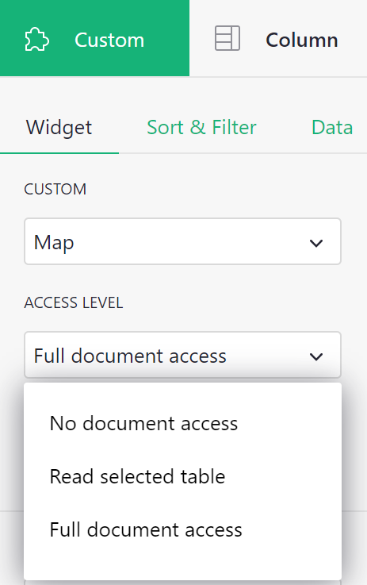*</span>
{: .screenshot-half }

Mappez toutes les colonnes requises. Notez que Nom, Longitude et Latitude sont étiquetés comme requis. Géocodage, Adresse et Adresse géocodée sont listés comme optionnels. Si vous utilisez des adresses et que vous avez besoin que Grist les convertisse en coordonnées lat-long, vous devez mapper les six colonnes.

<span class="screenshot-large">**</span>
{: .screenshot-half }

Après avoir mappé les colonnes nécessaires et sélectionné le niveau d'accès approprié, le widget de carte se remplira.

**

Vous pouvez configurer la carte pour afficher uniquement l'emplacement sélectionné en cliquant sur l'option 'Ouvrir la configuration' dans le [panneau de création](glossary.md#creator-panel). Ensuite, décochez 'Tous les emplacements'. Cliquez sur la coche verte en haut du widget pour enregistrer les paramètres de configuration mis à jour.

**

Consultez notre modèle [Cartographie des emplacements](https://templates.getgrist.com/pyMHqncEspfZ/Mapping-Locations){:target="\_blank"} ou notre [Liste de crowdsourcing](https://templates.getgrist.com/dKztiPYamcCp/Crowdsourced-List/p/1){:target="\_blank"} pour deux excellents exemples !

Pour une vidéo explicative, consultez notre [Webinaire sur les Widgets Personnalisés](https://www.youtube.com/watch?v=zNLHX_ezY50&t=713s){:target="\_blank"}.

### Markdown

Le widget Markdown personnalisé vous permet de formater du texte en utilisant Markdown tout en affichant le texte formaté dans un widget éditable.

Pour d'autres widgets d'édition de texte, consultez nos widgets personnalisés [HTML](#html-viewer) et [Bloc-notes](#notepad).

**

Pour commencer, ajoutez une nouvelle colonne à votre table. C'est là que vous ajouterez votre texte qui sera formaté à l'aide de Markdown.

Ensuite, ajoutez un nouveau widget personnalisé à la page. Choisissez la table de données qui contient le texte formaté avec Markdown et 'Sélectionner Par' cette même table.

<span class="screenshot-large">*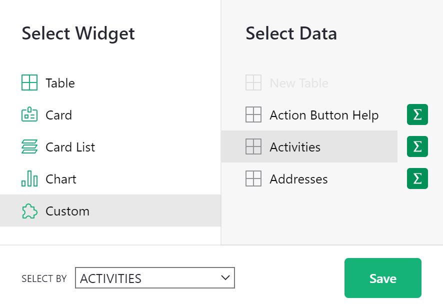*</span>
{: .screenshot-half }

Pour configurer, sélectionnez 'Markdown' dans le menu déroulant Personnalisé et autorisez **l'accès complet au document**. Comme le widget est également un éditeur, il a besoin de la permission d'écrire dans le document.

Sous 'Contenu', sélectionnez la colonne de texte qui contient le formatage Markdown.

<span class="screenshot-large">*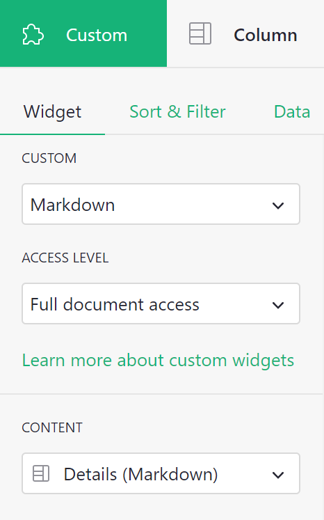*</span>
{: .screenshot-half }

Tout formatage Markdown dans la colonne de texte spécifiée s'appliquera et sera visible et éditable dans le widget personnalisé.

**

Pour éditer le texte directement dans le widget, cliquez sur l'icône d'édition. Le texte reviendra à afficher la syntaxe Markdown qui peut être éditée directement dans le widget. En mode édition, l'icône d'édition sera remplacée par l'icône de sauvegarde. Assurez-vous de cliquer sur l'icône de sauvegarde pour enregistrer les modifications et revenir à l'affichage du texte formaté.

<span class="screenshot-large">*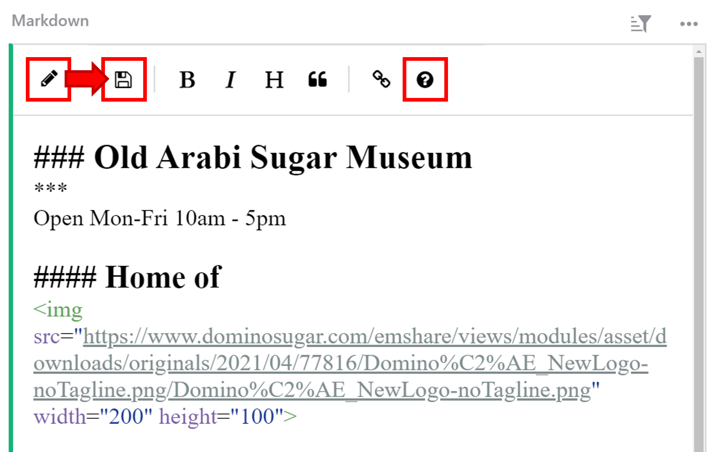*</span>
{: .screenshot-half }

Pour obtenir de l'aide sur le formatage Markdown, consultez le [Guide Markdown](https://www.markdownguide.org/basic-syntax/){:target="\_blank"} pour la syntaxe de base. Ce guide est également accessible dans le widget Markdown en cliquant sur l'icône d'information en haut du widget. Le guide s'ouvrira dans un nouvel onglet de votre navigateur pour une référence facile.

Vous pouvez trouver un exemple de l'éditeur Markdown dans notre modèle [Webinaire 7 (Widgets Personnalisés)](https://public.getgrist.com/uGS3WH3mhoVy/7-Webinar-7-Custom-Widgets-End-Result){:target="\_blank"} et consulter cette vidéo explicative de notre [Webinaire sur les Widgets Personnalisés](https://www.youtube.com/watch?v=zNLHX_ezY50&t=1339s){:target="\_blank"}.

### Bloc-notes

Le widget Bloc-notes personnalisé vous permet de formater du texte à l'aide d'un éditeur de texte enrichi.

Pour d'autres widgets d'édition de texte, consultez nos widgets personnalisés [HTML](#html-viewer) et [Markdown](#markdown).

**

Pour commencer, ajoutez une nouvelle colonne à votre table. Cette colonne contiendra les détails de notre texte formaté.

Ensuite, ajoutez un nouveau widget personnalisé à la page. Choisissez la table de données qui contient la colonne que nous venons d'ajouter et 'Sélectionner Par' cette même table.

<span class="screenshot-large">*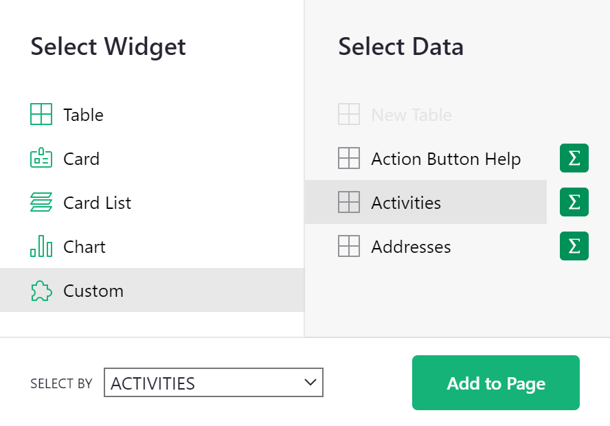*</span>
{: .screenshot-half }

Pour configurer, sélectionnez 'Bloc-notes' dans le menu déroulant Personnalisé et autorisez **l'accès complet au document**. Comme le widget est également un éditeur, il a besoin de la permission d'écrire dans le document.

Sous 'Contenu', sélectionnez la colonne créée pour stocker notre texte formaté.

<span class="screenshot-large">*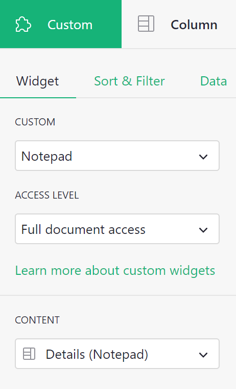*</span>
{: .screenshot-half }

Si la colonne de texte que vous avez choisie sous Contenu a du texte existant, ce texte apparaîtra dans le widget Bloc-notes, prêt à être formaté.

*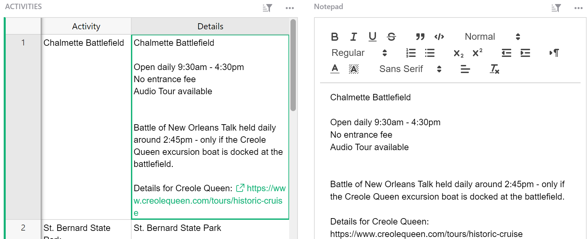*

Utilisez n'importe laquelle des options montrées ici pour formater votre texte.

**

Comme vous pouvez le voir dans la capture d'écran ci-dessous, le code pour le texte formaté n'est pas utile à voir dans votre table. Vous éditerez le texte directement dans le widget Bloc-notes afin de pouvoir [masquer](widget-table.md#column-operations) cette colonne de votre table de données.

**

Consultez notre [Base de données des parcs nationaux américains](https://templates.getgrist.com/4TRbjZXSPtR5/US-National-Park-Database/p/13){:target="\_blank"} ou notre [🛒 Liste de courses + Planificateur de repas](https://templates.getgrist.com/cMQA7uuBbtMW/-Grocery-List-Meal-Planner/p/3){:target="\_blank"} pour deux excellents exemples de Bloc-notes !

Vous pouvez également consulter cette vidéo explicative de notre [Webinaire sur les Widgets Personnalisés](https://www.youtube.com/watch?v=zNLHX_ezY50&t=1194s){:target="\_blank"}.

### Impression d'étiquettes

Le widget d'impression d'étiquettes personnalisé vous permet de personnaliser et d'imprimer des étiquettes directement depuis Grist.

**</span>

Pour commencer, ajoutez une nouvelle colonne à votre table. Cette colonne contiendra le texte pour l'étiquette. En option, vous pouvez ajouter une seconde colonne pour spécifier un nombre d'étiquettes, vous permettant d'imprimer plus d'une même étiquette sans avoir à créer des enregistrements en double.

Ensuite, ajoutez un nouveau widget personnalisé à la page. Choisissez la table de données qui contient les détails de l'étiquette.

<span class="screenshot-large">*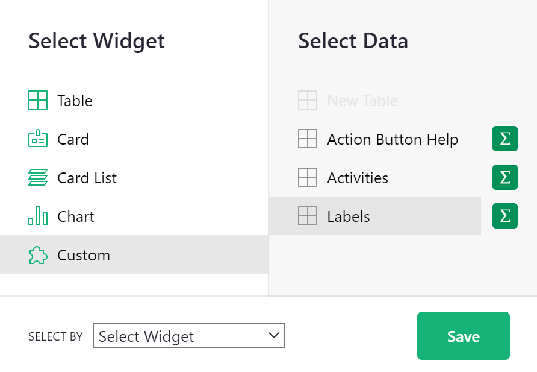*</span>
{: .screenshot-half }

Pour configurer, sélectionnez 'Impression d'étiquettes' dans le menu déroulant Personnalisé et autorisez l'accès pour lire la table sélectionnée. Sous 'Étiquette', sélectionnez la colonne qui contient le texte à inclure sur les étiquettes. Si vous souhaitez imprimer plus d'une étiquette, sélectionnez la colonne qui contient le nombre d'étiquettes pour chaque enregistrement que vous souhaitez imprimer.

<span class="screenshot-large">**</span>
{: .screenshot-half }

Vous pouvez sélectionner parmi les tailles de feuilles standard dans le menu déroulant en haut à gauche du widget. Assurez-vous d'enregistrer les modifications en cliquant sur la coche verte en haut à droite du widget.

*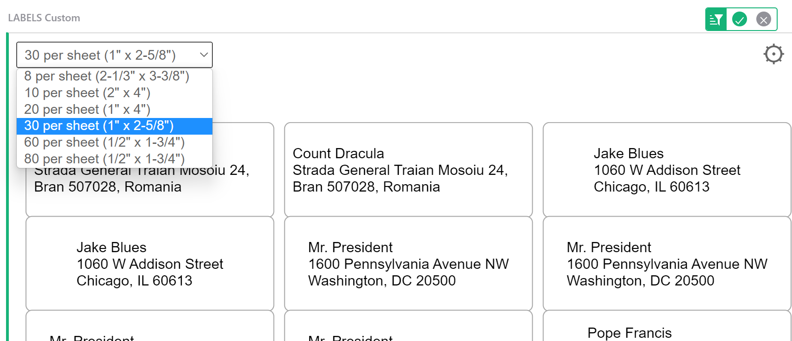*</span>

Pour laisser des étiquettes vides au début de la feuille, cliquez sur l'icône des paramètres puis spécifiez combien d'étiquettes doivent rester vides. Cela est particulièrement utile si une partie de votre feuille d'étiquettes a déjà été utilisée. Vous pouvez ignorer les étiquettes utilisées et commencer à imprimer sur votre première étiquette inutilisée.

**</span>

Consultez notre modèle [Impression d'étiquettes postales](https://templates.getgrist.com/9nNr9uQwoXWA/Print-Mailing-Labels){:target="\_blank"} et notre modèle [Chasse au trésor](https://templates.getgrist.com/ihsZTnKTF7Lr/Treasure-Hunt/p/6){:target="\_blank"} pour deux excellents exemples !

Vous pouvez également consulter cette vidéo explicative de notre [Webinaire sur les Widgets Personnalisés](https://www.youtube.com/watch?v=zNLHX_ezY50&t=1749s){:target="\_blank"}.