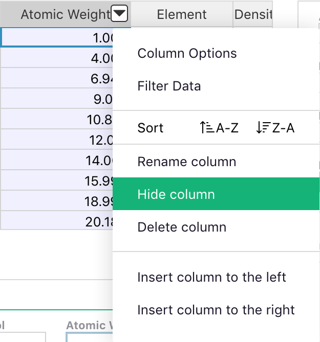
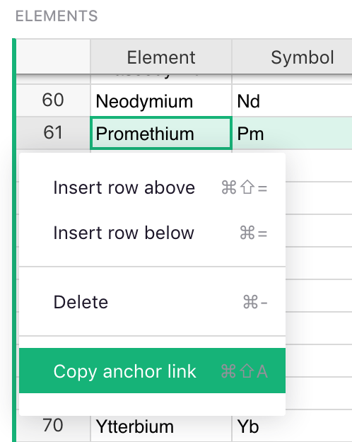
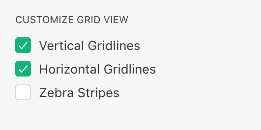

# Vue Table: Tableau

La **Table** vue est une grille polyvalente semblable à une feuille de calcul.

  

Voici quelques fonctionnalités utiles à connaître.

### Opérations sur les colonnes

- **Redimensionner les colonnes** : Cliquez sur la ligne entre les en-têtes de colonne et faites-la glisser pour redimensionner les colonnes.

- **Réorganiser les colonnes** : Avec une colonne sélectionnée, faites glisser son en-tête pour la déplacer à un autre endroit par rapport aux autres colonnes. (Vous pouvez également le faire en réorganisant les champs dans le panneau d'options de la vue.)

- **Renommer les colonnes** : Avec une colonne sélectionnée, cliquez sur son en-tête pour la renommer. Appuyez sur <code class="keys">*Entrée*</code> pour enregistrer le nouveau nom.

- **Ajouter des colonnes** : Cliquez sur l'icône "+" à droite de tous les en-têtes de colonne pour ajouter une nouvelle colonne ou afficher l'une des colonnes masquées. Le menu de la colonne permet également d'insérer une nouvelle colonne à côté d'une colonne existante, tout comme les raccourcis clavier <code class="keys">*Alt* + **+**</code> (insérer avant) et <code class="keys">*Alt* + **=**</code> (insérer après).

    **
    {: .screenshot-half }

    Après avoir ajouté une colonne, le nom de la colonne (défini par défaut sur "A", "B", "C", etc.) est immédiatement sélectionné et mis en surbrillance pour vous permettre de le renommer rapidement. Tapez simplement le nouveau nom et appuyez sur <code class="keys">*Entrée*</code>, ou appuyez sur <code class="keys">*Échap*</code> pour conserver le nom par défaut.

- **Masquer les colonnes** : Déplacez la souris sur l'en-tête de la colonne et cliquez sur le triangle pour ouvrir le menu de la colonne. Cliquez sur "Masquer la colonne" pour masquer la colonne. La colonne reste dans les données sous-jacentes et peut être affichée à nouveau en utilisant l'icône "+" à droite des en-têtes de colonne, ou la liste des champs dans le panneau d'options de la vue.

  **
  {: .screenshot-half }

- **Supprimer les colonnes** : Supprimez la colonne de données réelle en utilisant l'option du menu de la colonne ou le raccourci clavier <code class="keys">*Alt* + *Moins*</code>. Le tableau est la seule vue qui permet de supprimer une colonne.

**Remarque :** *supprimer* et *masquer* sont différents. Masquer une colonne la retire uniquement de la vue actuelle, mais la laisse dans les données et disponible pour les formules. Supprimer une colonne la retire de partout. (Bien sûr, la fonction d'annulation fonctionne toujours pour l'une ou l'autre opération !)

### Opérations sur les lignes

- **Ajouter des lignes** : Tapez dans la dernière ligne d'un tableau, qui est mise en surbrillance pour indiquer qu'elle est un espace réservé pour l'ajout de nouveaux enregistrements. Faites un clic droit sur un numéro de ligne pour insérer une ligne vide à côté d'une ligne existante, ou utilisez les raccourcis clavier <code class="keys">*⌘* *⇧* *=*</code> (Mac) ou <code class="keys">*Ctrl* + *Shift* + **=**</code> (Windows) pour insérer avant, et <code class="keys">*⌘* **=**</code> (Mac) ou <code class="keys">*Ctrl* + **=**</code> (Windows) pour insérer après.

  **
  {: .screenshot-half }

- **Supprimer des lignes** : Faites un clic droit sur un numéro de ligne et sélectionnez l'option "Supprimer" pour supprimer une ligne, ou utilisez le raccourci <code class="keys">*⌘* + *Moins*</code> (Mac) ou <code class="keys">*Ctrl* + *Moins*</code> (Windows). Si vous sélectionnez une intervalle de cellules d'abord, l'une ou l'autre de ces actions de suppression supprimera toutes les lignes incluses dans l'intervalle.

- **Lien vers des lignes** : Faites un clic droit sur un numéro de ligne et sélectionnez "Copier le lien d'ancrage" pour copier un lien vers la cellule sélectionnée de cette ligne. Le lien sera placé dans votre presse-papiers, prêt à être collé dans un e-mail ou une application de messagerie instantanée. Le lien ne s'ouvrira que pour les personnes ayant accès au document.

  **
  {: .screenshot-half }

### Navigation et sélection

- **Naviguer en utilisant les raccourcis** : Utilisez les raccourcis clavier pour naviguer dans la grille :

    <code class="keys">*Tab*</code>, <code class="keys">*Shift* + *Tab*</code>
    Déplacez-vous vers la colonne suivante ou précédente, en enregistrant les modifications si vous éditez une cellule.

    <code class="keys">*⌘* + *Haut*</code> (Mac) ou <code class="keys">*Ctrl* + *Haut*</code> (Windows)  Déplacez-vous vers la première ligne.

    <code class="keys">*⌘* + *Bas*</code> (Mac) ou <code class="keys">*Ctrl* + *Bas*</code> (Windows)  Déplacez-vous vers la dernière ligne.

    <code class="keys">*Accueil*</code> ou <code class="keys">*Fn* + **←**</code> (Mac)  Déplacez-vous au début d'une ligne.

    <code class="keys">*Fin*</code> ou <code class="keys">*Fn* + **→**</code> (Mac)  Déplacez-vous à la fin d'une ligne.

    <code class="keys">*PageDown*</code> ou <code class="keys">*Fn* + **↓**</code> (Mac)  Déplacez-vous d'une page de lignes vers le bas.

    <code class="keys">*PageUp*</code> ou <code class="keys">*Fn* + **↑**</code> (Mac)  Déplacez-vous d'une page de lignes vers le haut.

    <code class="keys">*Alt* + *Bas*</code>, <code class="keys">*Alt* + *Haut*</code>  Déplacez-vous de cinq lignes vers le bas ou vers le haut.

- **Sélectionner des intervalles** : Cliquez et faites glisser la souris sur la grille pour sélectionner un intervalle de cellules à copier (copier et coller en utilisant les raccourcis clavier habituels pour votre ordinateur). Une autre façon de sélectionner un intervalle est de cliquer sur une cellule, puis de maintenir <code class="keys">*Shift*</code> tout en cliquant sur une autre cellule, ou tout en naviguant avec les touches fléchées.

- **Remplir les données vers le bas** : Sélectionnez un intervalle de cellules et appuyez sur <code class="keys">*⌘* + *D*</code> (Mac) ou <code class="keys">*Ctrl* + *D*</code> (Windows) pour remplir tout l'intervalle sélectionné avec les valeurs des cellules de la première ligne de l'intervalle.

### Personnalisation

- **Personnaliser l'apparence du tableau** : Dans le panneau d'options de la vue, vous pouvez désactiver les lignes de grille horizontales ou verticales, ou activer le zébrage.

  **
  {: .screenshot-half }

  Par exemple, cela vous permet de changer l'apparence de votre grille en une liste comme celle-ci :
  
