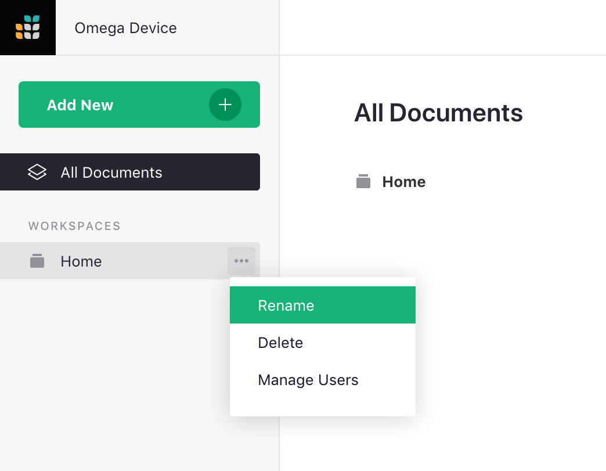
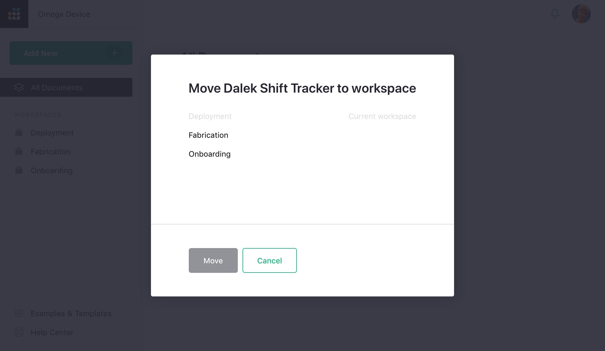
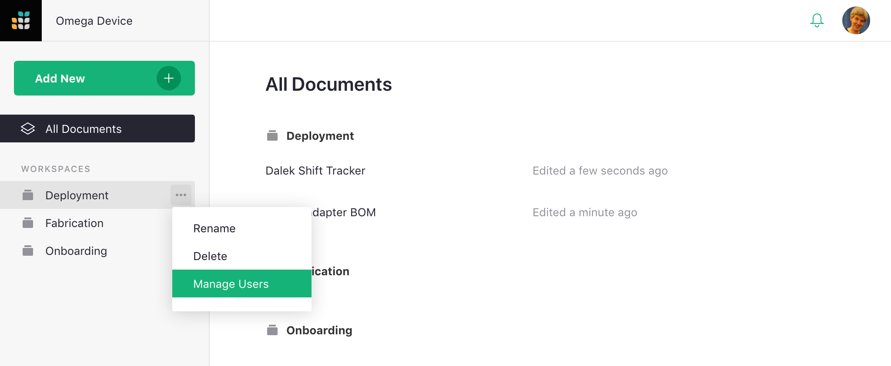
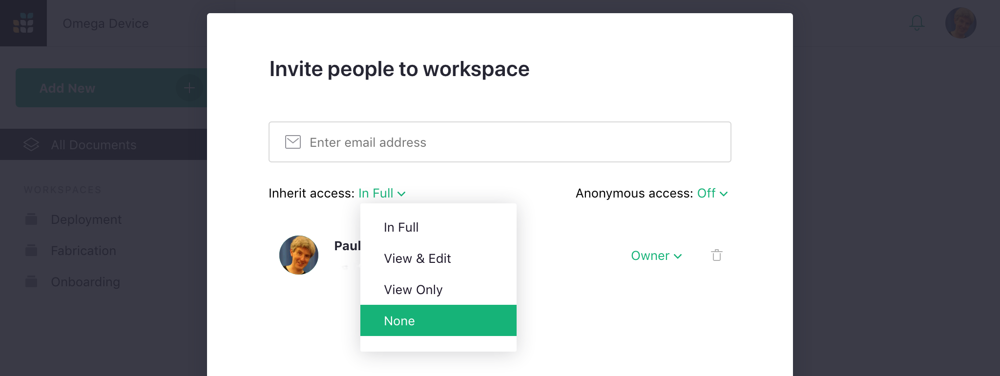

Espaces de travail
-------------------------------

Les documents peuvent être regroupés dans des dossiers appelés "espaces de travail" qui peuvent être partagés en tant qu'unité unique avec d'autres utilisateurs. Cela est pratique, par exemple, pour les documents liés à un seul projet.

Lorsqu'un site est créé pour la première fois, il possède un seul dossier appelé "Home".

Vous pouvez renommer cet dossier si vous le souhaitez, en survolant le nom de l'dossier dans la barre de gauche, en cliquant sur l'icône à trois points, puis en sélectionnant "Renommer".

**
{: .screenshot-half }

Encore mieux, vous pouvez créer de nouveaux espaces de travail, afin de regrouper vos documents et de les partager en tant qu'unité.

**
{: .screenshot-half }

Pour ajouter un document à un dossier spécifique, cliquez sur cet dossier dans la barre de gauche, puis sélectionnez "Ajouter nouveau", puis "Créer un document vide" (ou "Importer un document").

**
{: .screenshot-half }

Pour déplacer un document d'un dossier à un autre, survolez le document, cliquez sur l'icône à trois points à droite du nom du document, puis sélectionnez "Déplacer".

Vous aurez alors la possibilité de choisir l'dossier souhaité.

## Gérer l'accès

Sur les [espaces d'équipe](teams.md), les propriétaires d'espaces de travail peuvent contrôler qui a accès à un dossier en utilisant "Gérer les utilisateurs." Les contrôles sont similaires à ceux pour [partager des documents](sharing.md). Les espaces de travail dans les [espaces personnels](teams.md#understanding-personal-sites) ne peuvent pas être partagés.

Les visualisateurs d'un espace d'équipe seront également des visualisateurs de tous ses espaces de travail. Il en va de même pour les éditeurs et les propriétaires. Pour exclure un dossier de l'héritage des visualisateurs, éditeurs et propriétaires de l'espace d'équipe, définissez "Hériter l'accès" sur "Aucun". Vous pouvez également le définir sur "Visualisation uniquement" pour limiter l'héritage aux droits de visualisation, ou "Visualisation & Édition" pour limiter l'héritage aux droits de visualisation et d'édition (en excluant le droit de contrôler les options de partage).

Il est possible d'être éditeur/propriétaire d'un dossier et de ne pas pouvoir ouvrir tous les documents de cet dossier. Cela peut se produire si un propriétaire de document limite l'héritage à "Aucun". Vous verrez toujours le document listé, de sorte que si vous décidez de supprimer l'dossier, vous saurez ce que vous supprimez. Les visualisateurs d'un dossier ne verront que les documents auxquels ils ont accès listés.
